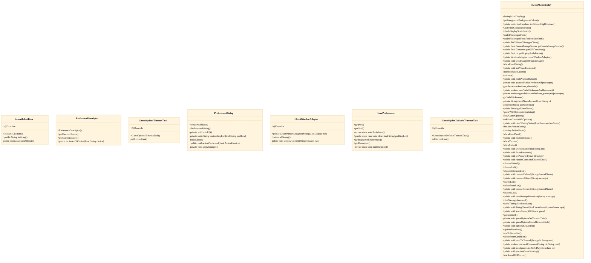

# Client Preferences & Settings

## Overview
This subsystem is the desktop client's persistent user-preference layer. UserPreferences statically wraps a per-package java.util.prefs.Preferences node, exposing typed getPref/putPref accessors plus a lazily-built LinkedHashMap registry of PreferenceDescriptor metadata. SwingMainDisplay's 'Preferences...' button opens PreferencesDialog, which calls getRegisteredPreferences() and builds one editor control per descriptor, grouping them under section headers and localizing labels through SOCStringManager. On open, each control is initialized from the current persisted value; on OK, applyChanges() reads each control and writes back only values that differ, persisting asynchronously via EventQueue.invokeLater. Most changes (font size, UI scale, rendering quality) take effect only for new windows or after restart — applied once at startup by SwingMainDisplay — while the hex graphics set takes effect immediately by reloading open games' board graphics. Cancel discards everything. This keeps display/UI configuration entirely separate from the soc.message network layer.

## Components
- **PreferencesDialog**: Modal editor that enumerates every registered PreferenceDescriptor and renders one control per preference (JCheckBox for BOOLEAN, JSpinner for INT, JComboBox for CHOICE), loading current values on open and applying/persisting only changed values on OK.
- **UserPreferences**: Wraps java.util.prefs.Preferences with typed getPref/putPref accessors and an additive LinkedHashMap registry of PreferenceDescriptors built lazily by buildRegistry(); owns persistence, async flush, and clearing.
- **PreferenceDescriptor**: Describes one preference: key, Type enum (BOOLEAN/INT/CHOICE), default value, allowed choices, choiceStoredAsInt flag, and i18n label key; declares the newer KEY_* constants (render antialiasing/interpolation, color-blind mode, UI font size, hex graphics set).
- **SwingMainDisplay**: Hosts the 'Preferences...' button that launches the dialog, supplies the display-scale factor and SOCPlayerClient for immediate-effect changes, and applies the font-size preference once at startup via scaleUIManagerFontsForFontSizePref().

## Connections
- **UserPreferences** (outbound) — via PreferencesDialog imports soc.client.UserPreferences; calls getRegisteredPreferences(), getPref(), putPref() (evidence: src/main/java/soc/client/PreferencesDialog.java import + buildEditor/applyChanges)
- **SOCStringManager** (outbound) — via SOCStringManager.getClientManager() for localized labels and section headers (strings.get) (evidence: src/main/java/soc/client/PreferencesDialog.java field 'strings' and buildEditor label lookups)
- **MainDisplay / SwingMainDisplay** (bidirectional) — via SwingMainDisplay 'pref' button opens the dialog; dialog calls md.getDisplayScaleFactor() and md.getClient().reloadBoardGraphics() (evidence: src/main/java/soc/client/SwingMainDisplay.java field 'pref' (JButton opening PreferencesDialog); src/main/java/soc/client/PreferencesDialog.java mainDisplay usage)
- **java.util.prefs.Preferences** (outbound) — via UserPreferences.userNodeForPackage(SOCPlayerInterface.class) backing store; getBoolean/getInt/get + put*/flush/remove (evidence: src/main/java/soc/client/UserPreferences.java static block + getPref/putPref/clear)

## Design Decisions
- **Additive descriptor mini-registry layered over the existing static getPref/putPref API rather than replacing it.**: The PreferenceDescriptor registry exists so UI can enumerate preferences and build the correct control without hardcoding each key, type, and default; its javadoc explicitly states it 'does not change the existing static UserPreferences.getPref/putPref API, which remains the way to read and write preference values.' This preserves backward compatibility with all existing call sites.
- **Registry uses LinkedHashMap so insertion order in buildRegistry() determines dialog display order.**: Registration order is grouped to match the section headers (general, display, accessibility), giving a stable, intentional layout without a separate ordering mechanism. getRegisteredPreferences() returns descriptors in registration order.
- **CHOICE preferences can be stored as a String value or as an integer index (choiceStoredAsInt) into choices[].**: Legacy keys like KEY_HEX_GRAPHICS_SET predate this registry and were already persisted as an integer index (0=pastel, 1=classic); the dual storage lets the registry absorb them without migrating existing persisted values.
- **Apply-on-OK / discard-on-Cancel, writing back only values that differ from the stored value.**: applyChanges() compares each editor's value to UserPreferences.getPref before calling putPref, minimizing writes and async flushes; Cancel simply dispose()s without touching storage.
- **Split immediate-effect vs. deferred-effect preferences.**: The dialog's javadoc notes board rendering quality, UI font size, and UI scale 'take effect only for newly created windows or after a restart,' so the dialog persists them but does not re-render; only the hex graphics set is refreshed live via mainDisplay.getClient().reloadBoardGraphics(), mirroring NewGameOptionsFrame's behavior.
- **KEY_* preference constants are declared on PreferenceDescriptor, not SOCPlayerClient.**: Per the KEY_HEX_GRAPHICS_SET javadoc, declaring the keys here lets the registry reference them 'without depending on SOCPlayerClient class-load order,' avoiding static-initialization ordering hazards.
- **Persistence namespace is keyed to the soc.client package, not a class name.**: UserPreferences javadoc: 'Because the user preference storage namespace is based on the soc.client package and not a class name, preferences are shared among all Sammys-Settlers client versions,' so upgrades retain settings.

## Constraints
- **[HARD]** PreferencesDialog MUST be constructed with a non-null MainDisplay. — src/main/java/soc/client/PreferencesDialog.java::PreferencesDialog (throws IllegalArgumentException when md == null)
- **[HARD]** Startup font-size scaling MUST run at most once. — src/main/java/soc/client/SwingMainDisplay.java field didScaleUIManagerFontsForPref guards scaleUIManagerFontsForFontSizePref()
- **[SOFT]** INT preference editor values MUST be clamped to the [-999, 999] spinner range while preserving negative 'disabled' sentinels. — src/main/java/soc/client/PreferencesDialog.java::buildEditor (clamps cur to -999..999 before SpinnerNumberModel)
- **[UNVERIFIED]** Preference writes MUST NOT exceed Preferences.MAX_KEY_LENGTH / MAX_VALUE_LENGTH or putPref throws IllegalArgumentException. — src/main/java/soc/client/UserPreferences.java::putPref (documented throws IllegalArgumentException) (cross-document reconciliation: not verified against `src/main/java/soc/client/UserPreferences.java`; recorded as design intent, not current code fact.)
- **[UNVERIFIED]** getRegisteredPreferences() SHOULD never return null or empty so the dialog always has rows to render. — src/main/java/soc/client/UserPreferences.java::getRegisteredPreferences javadoc ('never null or empty') (cross-document reconciliation: not verified against `src/main/java/soc/client/UserPreferences.java`; recorded as design intent, not current code fact.)

## Non-Functional Requirements
- **reliability** — All preference reads tolerate a missing backing store: getPref returns the supplied default when userPrefs is null or a RuntimeException is thrown, so the client runs without persistent storage. — src/main/java/soc/client/UserPreferences.java::getPref (null check + catch RuntimeException returning dflt)
- **performance** — Persistence is non-blocking: putPref schedules Preferences.flush() via EventQueue.invokeLater rather than flushing on the calling thread. — src/main/java/soc/client/UserPreferences.java::flushSoon
- **error-handling** — OK-button apply is wrapped so a failure in applyChanges() logs to System.err and still disposes the dialog instead of leaving it open. — src/main/java/soc/client/PreferencesDialog.java::actionPerformed (catch Throwable around applyChanges)
- **observability** — Storage failures and preference clears emit diagnostics to System.err rather than failing silently. — src/main/java/soc/client/UserPreferences.java::clear and flushSoon (System.err messages)
- **reliability** — A static initializer suppresses the spurious Windows java.util.prefs root-node warning while loading userPrefs, restoring the prior log level afterward. — src/main/java/soc/client/UserPreferences.java static block (Logger java.util.prefs level workaround)

## Examples
*Only changed values are persisted, avoiding redundant writes and flushes.*
*Source: `src/main/java/soc/client/PreferencesDialog.java::applyChanges`*
```
if (newVal != UserPreferences.getPref(pd.key, dflt))
    UserPreferences.putPref(pd.key, newVal);
```

*Shows the one immediate-effect preference path versus the deferred (restart/new-window) ones.*
*Source: `src/main/java/soc/client/PreferencesDialog.java::applyChanges`*
```
if (PreferenceDescriptor.KEY_HEX_GRAPHICS_SET.equals(pd.key))
    mainDisplay.getClient().reloadBoardGraphics();
```

*Insertion-ordered map makes registration order the dialog's display order.*
*Source: `src/main/java/soc/client/UserPreferences.java::buildRegistry`*
```
final Map<String, PreferenceDescriptor> reg = new LinkedHashMap<String, PreferenceDescriptor>();
```

## Diagrams
### Class



### Dependency

```mermaid
%%{init: {'theme': 'base', 'themeVariables': {'primaryTextColor': '#111827', 'secondaryTextColor': '#111827', 'tertiaryTextColor': '#111827', 'lineColor': '#6b7280', 'fontFamily': 'Inter, ui-sans-serif, system-ui, sans-serif'}}}%%
graph TD
    classDef default fill:#f8fafc,stroke:#475569,color:#111827

    src_main_java_soc_client_PreferencesDialog_java["PreferencesDialog.java"]
    src_main_java_soc_client_SwingMainDisplay_java["SwingMainDisplay.java"]
    src_main_java_soc_client_UserPreferences_java["UserPreferences.java"]

    src_main_java_soc_client_PreferencesDialog_java -->|"imports"| src_main_java_soc_client_UserPreferences_java

    ext_src_main_java_soc_game_SOCGame_java["SOCGame.java"]:::default
    src_main_java_soc_client_SwingMainDisplay_java -.->|"imports"| ext_src_main_java_soc_game_SOCGame_java
    ext_src_main_java_soc_game_SOCGameOption_java["SOCGameOption.java"]:::default
    src_main_java_soc_client_SwingMainDisplay_java -.->|"imports"| ext_src_main_java_soc_game_SOCGameOption_java
    ext_src_main_java_soc_game_SOCGameOptionSet_java["SOCGameOptionSet.java"]:::default
    src_main_java_soc_client_SwingMainDisplay_java -.->|"imports"| ext_src_main_java_soc_game_SOCGameOptionSet_java
    ext_src_main_java_soc_game_SOCScenario_java["SOCScenario.java"]:::default
    src_main_java_soc_client_SwingMainDisplay_java -.->|"imports"| ext_src_main_java_soc_game_SOCScenario_java
    ext_src_main_java_soc_game_SOCVersionedItem_java["SOCVersionedItem.java"]:::default
    src_main_java_soc_client_SwingMainDisplay_java -.->|"imports"| ext_src_main_java_soc_game_SOCVersionedItem_java
    ext_src_main_java_soc_message_SOCAuthRequest_java["SOCAuthRequest.java"]:::default
    src_main_java_soc_client_SwingMainDisplay_java -.->|"imports"| ext_src_main_java_soc_message_SOCAuthRequest_java
    ext_src_main_java_soc_message_SOCChannelTextMsg_java["SOCChannelTextMsg.java"]:::default
    src_main_java_soc_client_SwingMainDisplay_java -.->|"imports"| ext_src_main_java_soc_message_SOCChannelTextMsg_java
    ext_src_main_java_soc_message_SOCJoinChannel_java["SOCJoinChannel.java"]:::default
    src_main_java_soc_client_SwingMainDisplay_java -.->|"imports"| ext_src_main_java_soc_message_SOCJoinChannel_java
    ext_src_main_java_soc_message_SOCLocalizedStrings_java["SOCLocalizedStrings.java"]:::default
    src_main_java_soc_client_SwingMainDisplay_java -.->|"imports"| ext_src_main_java_soc_message_SOCLocalizedStrings_java
    ext_src_main_java_soc_server_SOCServer_java["SOCServer.java"]:::default
    src_main_java_soc_client_SwingMainDisplay_java -.->|"imports"| ext_src_main_java_soc_server_SOCServer_java
    ext_src_main_java_soc_util_SOCFeatureSet_java["SOCFeatureSet.java"]:::default
    src_main_java_soc_client_SwingMainDisplay_java -.->|"imports"| ext_src_main_java_soc_util_SOCFeatureSet_java
    ext_src_main_java_soc_util_SOCGameList_java["SOCGameList.java"]:::default
    src_main_java_soc_client_SwingMainDisplay_java -.->|"imports"| ext_src_main_java_soc_util_SOCGameList_java
    ext_src_main_java_soc_util_SOCStringManager_java["SOCStringManager.java"]:::default
    src_main_java_soc_client_PreferencesDialog_java -.->|"imports"| ext_src_main_java_soc_util_SOCStringManager_java
    src_main_java_soc_client_SwingMainDisplay_java -.->|"imports"| ext_src_main_java_soc_util_SOCStringManager_java
    ext_src_main_java_soc_util_Version_java["Version.java"]:::default
    src_main_java_soc_client_SwingMainDisplay_java -.->|"imports"| ext_src_main_java_soc_util_Version_java
```



## Source Linkage
- [PreferencesDialog (JDialog implements ActionListener)](../../../src/main/java/soc/client/PreferencesDialog.java::PreferencesDialog)
- [Per-descriptor editor construction](../../../src/main/java/soc/client/PreferencesDialog.java::buildEditor)
- [Apply-only-changed persistence on OK](../../../src/main/java/soc/client/PreferencesDialog.java::applyChanges)
- [UserPreferences typed accessors](../../../src/main/java/soc/client/UserPreferences.java::getPref)
- [Lazy LinkedHashMap registry build](../../../src/main/java/soc/client/UserPreferences.java::buildRegistry)
- [Asynchronous flush](../../../src/main/java/soc/client/UserPreferences.java::flushSoon)
- [PreferenceDescriptor metadata (key, type, default, choices, i18n label)](../../../src/main/java/soc/client/UserPreferences.java::PreferenceDescriptor)
- [UI font-size scaling applied once at startup](../../../src/main/java/soc/client/SwingMainDisplay.java::scaleUIManagerFontsForFontSizePref)
- [Preferences button launching the dialog](../../../src/main/java/soc/client/SwingMainDisplay.java::pref)

Parent scope: [_scope.md](_scope.md)
Sibling feature: [client-preferences-settings.feature.md](client-preferences-settings.feature.md)
Scope architecture: [desktop-swing-client.arch.md](desktop-swing-client.arch.md)

## Source Linkage Grounding

_Per-row confidence; `_unverified_` rows are disclosed, not verified; `0.08 (resolved, uncited)` is the resolved-but-uncited baseline, not measured evidence._

| Element | Doc Evidence | Code Evidence | Confidence |
|---------|--------------|---------------|-----------:|
| Source Linkage: PreferencesDialog (JDialog implements ActionListener) |  | src/main/java/soc/client/PreferencesDialog.java:128-143 | 0.43 |
| Source Linkage: Per-descriptor editor construction |  | src/main/java/soc/client/PreferencesDialog.java:246-300 | 0.43 |
| Source Linkage: Apply-only-changed persistence on OK |  | src/main/java/soc/client/PreferencesDialog.java:329-376 | 0.43 |
| Source Linkage: UserPreferences typed accessors |  | src/main/java/soc/client/UserPreferences.java:143-154 | 0.92 |
| Source Linkage: Lazy LinkedHashMap registry build |  | src/main/java/soc/client/UserPreferences.java:351-403 | 0.92 |
| Source Linkage: Asynchronous flush |  | src/main/java/soc/client/UserPreferences.java:254-268 | 0.92 |
| Source Linkage: PreferenceDescriptor metadata (key, type, default, choices, i18n label) |  | src/main/java/soc/client/UserPreferences.java:539-549 | 0.92 |
| Source Linkage: UI font-size scaling applied once at startup |  | src/main/java/soc/client/SwingMainDisplay.java:861-902 | 0.75 |
| Source Linkage: Preferences button launching the dialog |  | src/main/java/soc/client/SwingMainDisplay.java:861-902 | 0.75 |

Related scopes: [Game Model & Rules Engine](../game-model-rules-engine/game-model-rules-engine.arch.md), [Robot / AI Players](../robot-ai-players/robot-ai-players.arch.md), [Server & Message Protocol](../server-message-protocol/server-message-protocol.arch.md)
