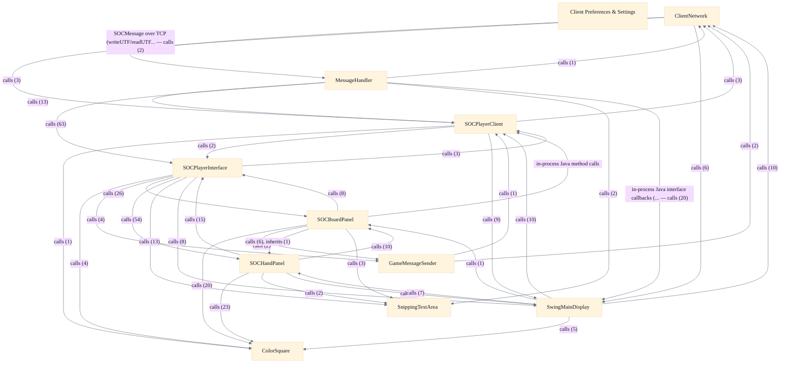

# Desktop Swing Client

## Strategic Context
- **2.0 display-abstraction seam (Paul Bilnoski refactor)** — Per doc/Readme.developer.md, the 2.0 refactor spliced the PlayerClientListener and GameDisplay interfaces between SOCPlayerClient and the AWT/Swing UI specifically so inbound network handling never touches Swing directly — this is why MessageHandler drives the UI only through SOCPlayerInterface's ClientBridge and SwingMainDisplay rather than calling widgets, and why this scope can be re-skinned/replaced without changing protocol handling.
- **One lobby over three connection kinds** — The client is deliberately built to host remote-TCP, locally-hosted-TCP, and in-JVM stringport (practice) servers simultaneously behind a single shared game list (Network & Game-List Client design), so online play and offline practice-against-bots share one lobby surface instead of separate code paths.
- **Presentation-only client by design** — This scope holds only partial game state and defers all rule enforcement to the server, which is the defining constraint that makes every rendering/UI component a read-only consumer of SOCGame/SOCPlayer and gives the desktop client no authority over game outcomes.
- **2026-06 presentation upgrades** — Per doc/Improvements-2026-06.md, recent work in this scope added a central Preferences dialog backed by a preference registry, board rendering-quality controls (antialiasing, image-scaling interpolation), a color-blind assist palette, externalized per-graphics-set themes, startup font-size scaling, and in-game build hotkeys plus left-click confirm-to-build — concentrating accessibility and rendering-quality concerns in the client without protocol changes.

## Overview
Network & Game-List Client (SOCPlayerClient): the client's network and lobby surface. At construction it resolves locale/i18n strings, reads persistent Preferences, and wires ClientNetwork (socket), an injected MessageHandler (inbound dispatch) and GameMessageSender (outbound). Designed to host three coexisting server connections — remote TCP, locally-hosted TCP, and in-JVM stringport practice — behind one shared game list; keeps only partial state with the server authoritative; gates i18n/scenario localization on negotiated server version; resolves per-game version with practice games handled specially; includes failsafe overrides for unjoinable games and graceful network-failure degradation. In-Game Player Interface (SOCPlayerInterface): the Swing host for one active game, reading the partial client-side model to paint board, hand panels, building panel and chat. All inbound game/network events route through the ClientBridge (PlayerClientListener) inner class rather than letting the network layer touch Swing. A single role-parameterized TradePanel (offer vs counter, paired via setOfferCounterPartner) chooses Normal vs Compact layout from the height its parent assigns; the auto-reject countdown reserves layout height via a single-space label; sounds are shared static Clips played through a single-thread executor gated by a per-game mute pref; frame-resize events are coalesced by one restartable Swing Timer; trade/special-build shortcuts bind through InputMap/ActionMap dispatched by PIHotkeyActionListener. Board Rendering & Visual Themes (SOCBoardPanel): a package-private renderer of the mirrored game state. Two-layer rendering caches the empty terrain buffer once (drawBoardEmpty) and composites robber and placed pieces over it each repaint (drawBoard); a single internal unscaled/un-rotated coordinate system applies transforms only at the boundary. The color-blind palette is applied once via a static initializer; per-graphics-set theme.properties enables re-skinning with hardcoded fallbacks; rendering-hint preferences are cached rather than read per frame; only hex terrain uses bitmap textures, everything else is vector primitives; larger squares come from a ColorSquareLarger subclass instead of mutating base dimensions. Client Preferences & Settings: the persistent preference layer. UserPreferences statically wraps a java.util.prefs.Preferences node keyed to the soc.client package, exposing typed getPref/putPref plus a lazily-built LinkedHashMap registry of PreferenceDescriptor metadata (insertion order determines dialog order). SwingMainDisplay's 'Preferences…' button opens PreferencesDialog, which builds one localized editor control per descriptor under section headers. Design choices: an additive descriptor mini-registry layered over the existing static API; CHOICE values stored as String or as an integer index; apply-on-OK / discard-on-Cancel writing back only changed values; split immediate- vs deferred-effect preferences; KEY_* constants declared on PreferenceDescriptor.

## Components
- **SOCPlayerClient**: Orchestrate connection lifecycle and the shared game list across three server connections (remote TCP, locally-hosted TCP, in-JVM stringport practice); gate i18n/scenario string requests on negotiated server version; resolve per-game version (practice games handled specially).
- **ClientNetwork**: Open and own the socket(s)/stringport, push outbound SOCMessage bytes, and degrade gracefully on network failure.
- **MessageHandler**: Route decoded messages to SOCPlayerInterface (ClientBridge) and SwingMainDisplay, and apply server updates onto the partial client-side game model.
- **GameMessageSender**: Serialize player intents (build, trade, roll, etc.) into protocol messages for the server.
- **SwingMainDisplay**: Render the lobby/game list and channel UI; launch the PreferencesDialog; host per-game SOCPlayerInterface frames.
- **SOCPlayerInterface**: Compose the in-game UI (board panel, hand panels, TradePanel, modal dialogs, sound, build/trade hotkeys via PIHotkeyActionListener) and translate listener callbacks into UI updates.
- **SOCBoardPanel**: Visualize the mirrored SOCGame/SOCBoard(Large) state; bitmap textures only for hex terrain, everything else as vector primitives; host BoardPopupMenu, BoardToolTip and BoardPanelSendBuildTask.
- **SOCHandPanel**: Render a single player's hand/state from the partial model and surface seat-level actions.
- **ColorSquare**: Provide a reusable colored count/indicator cell used across hand panels and the board, with color-blind-assist coloring.
- **Client Preferences & Settings**: Register, display, persist and apply client preferences (apply-on-OK / discard-on-Cancel, immediate- vs deferred-effect), additively over the existing static accessor API.
- **SnippingTextArea**: Hold scrolling textual output with a capped retained length.

## Boundaries
- **SOCPlayerClient** boundary: Top-level desktop client controller: owns network bootstrap, the game-list/lobby surface, locale + i18n resolution (SOCStringManager) and persistent Preferences reads; wires the ClientNetwork, MessageHandler and GameMessageSender collaborators and the MainDisplay. Does NOT own Swing rendering (delegates to MainDisplay) or game rules (server authoritative). _[unverified: no imports/calls edge src/main/java/soc/client/SOCPlayerClient.java::SOCPlayerClient -> MessageHandler, src/main/java/soc/client/SOCPlayerClient.java::SOCPlayerClient -> GameMessageSender, src/main/java/soc/client/SOCPlayerClient.java::SOCPlayerClient -> MainDisplay in code graph]_
- **ClientNetwork** boundary: Transport layer — the only client component that touches a server socket. Owns the outbound byte path (putNet for the TCP connection, putPractice for the in-JVM stringport) and the connect-off-the-UI-thread bootstrap.
- **MessageHandler** boundary: Inbound SOCMessage dispatch. Decodes wire messages arriving from the server and drives the rest of the client ONLY through the PlayerClientListener and GameDisplay/MainDisplay seams — it does not call AWT/Swing widgets directly. _[unverified: no imports/calls edge src/main/java/soc/client/MessageHandler.java -> PlayerClientListener, src/main/java/soc/client/MessageHandler.java -> MainDisplay in code graph]_
- **GameMessageSender** boundary: Outbound game-action encoder: constructs the SOCMessage commands for in-game player actions and hands them to ClientNetwork. Black-box counterpart to MessageHandler. _[unverified: no imports/calls edge src/main/java/soc/client/GameMessageSender.java::GameMessageSender -> MessageHandler in code graph]_
- **SwingMainDisplay** boundary: The concrete Swing main-display surface (game-list window, channels, the 'Preferences…' button) implementing the MainDisplay/GameDisplay abstraction that decouples SOCPlayerClient from AWT/Swing.
- **SOCPlayerInterface** boundary: Swing host for a single active game. Holds one SOCGame reference and reads the partial client-side model (SOCPlayer, SOCBoard, SOCResourceSet, SOCTradeOffer) to paint board, hand panels, building panel and chat. Inbound events enter through the ClientBridge inner class (a PlayerClientListener); never owns rules.
- **SOCBoardPanel** boundary: Package-private Swing board renderer. Owns a single internal unscaled/un-rotated coordinate system with transforms applied only at the boundary; two-layer rendering (cached empty-terrain buffer composited with placed pieces and robber per repaint); the per-graphics-set theme-color subsystem and rendering-hint/quality cache.
- **SOCHandPanel** boundary: Per-player hand panel widget — one component instance per seat showing resources, pieces and player status, built from ColorSquare widgets.
- **ColorSquare** boundary: Shared small resource-count/indicator widget plus the color-blind palette subsystem applied once at class load via a static initializer; a ColorSquareLarger subclass provides larger squares without changing base WIDTH/HEIGHT. _[unverified: no imports/calls edge src/main/java/soc/client/ColorSquare.java::ColorSquare -> ColorSquareLarger in code graph]_
- **Client Preferences & Settings** boundary: Persistent user-preference layer: UserPreferences statically wraps a java.util.prefs.Preferences node keyed to the soc.client package (not a class name) with typed getPref/putPref, a LinkedHashMap registry of PreferenceDescriptor metadata (insertion order = dialog order), and PreferencesDialog as the editor. _[unverified: no imports/calls edge src/main/java/soc/client/UserPreferences.java::UserPreferences -> PreferencesDialog in code graph]_
- **SnippingTextArea** boundary: Bounded-length Swing text area for chat/message and recording logs; trims oldest content (snipText) on append/replaceRange/setText so the log cannot grow without bound.

## Integration Points
- **Client⇄Server SOCMessage connection**: All lobby and game traffic flows between the desktop client and the authoritative SOCServer; the client holds only partial state and the server is authoritative for all rules. — see [Server & Message Protocol](../server-message-protocol/server-message-protocol.arch.md)
- **Partial client-side game-model reads**: Rendering and UI components read the locally-mirrored partial game model to paint the board, hand panels and building panel; they never mutate authoritative rules state. — see [Game Model & Rules Engine](../game-model-rules-engine/game-model-rules-engine.arch.md)
- **Inbound dispatch via PlayerClientListener / GameDisplay seam**: MessageHandler decodes inbound SOCMessages and drives the Swing layer only through the PlayerClientListener (SOCPlayerInterface.ClientBridge) and GameDisplay/MainDisplay (SwingMainDisplay) interfaces, keeping network handling decoupled from AWT/Swing.

## Diagrams
### Architecture

## Source Linkage
- [SOCPlayerClient — network & game-list controller](../../../src/main/java/soc/client/SOCPlayerClient.java::SOCPlayerClient)
- [ClientNetwork — socket/stringport transport](../../../src/main/java/soc/client/ClientNetwork.java::ClientNetwork)
- [MessageHandler — inbound SOCMessage dispatch](../../../src/main/java/soc/client/MessageHandler.java)
- [GameMessageSender — outbound game-action encoder](../../../src/main/java/soc/client/GameMessageSender.java::GameMessageSender)
- [SwingMainDisplay — main display / MainDisplay impl](../../../src/main/java/soc/client/SwingMainDisplay.java::SwingMainDisplay)
- [SOCPlayerInterface — in-game UI host](../../../src/main/java/soc/client/SOCPlayerInterface.java::SOCPlayerInterface)
- [SOCBoardPanel — board renderer & themes](../../../src/main/java/soc/client/SOCBoardPanel.java::SOCBoardPanel)
- [SOCHandPanel — per-player hand panel](../../../src/main/java/soc/client/SOCHandPanel.java)
- [ColorSquare — resource widget & color-blind palette](../../../src/main/java/soc/client/ColorSquare.java::ColorSquare)
- [UserPreferences — persistent preference layer](../../../src/main/java/soc/client/UserPreferences.java::UserPreferences)
- [SnippingTextArea — bounded chat/log text area](../../../src/main/java/soc/client/SnippingTextArea.java::SnippingTextArea.snipText)
- [PlayerClientListener / GameDisplay 2.0 display seam](../../../src/main/java/soc/client/SOCPlayerClient.java::SOCPlayerClient)

Parent scope: [_scope.md](_scope.md)

## Source Linkage Grounding

_Per-row confidence; `_unverified_` rows are disclosed, not verified; `0.08 (resolved, uncited)` is the resolved-but-uncited baseline, not measured evidence._

| Element | Doc Evidence | Code Evidence | Confidence |
|---------|--------------|---------------|-----------:|
| Source Linkage: SOCPlayerClient — network & game-list controller |  | src/main/java/soc/client/SOCPlayerClient.java:526-583 | 0.86 |
| Source Linkage: ClientNetwork — socket/stringport transport |  | src/main/java/soc/client/ClientNetwork.java:230-235 | 0.86 |
| Source Linkage: MessageHandler — inbound SOCMessage dispatch |  | src/main/java/soc/client/MessageHandler.java | 0.75 |
| Source Linkage: GameMessageSender — outbound game-action encoder |  | src/main/java/soc/client/GameMessageSender.java:87-96 | 0.86 |
| Source Linkage: SwingMainDisplay — main display / MainDisplay impl |  | src/main/java/soc/client/SwingMainDisplay.java:570-608 | 0.75 |
| Source Linkage: SOCPlayerInterface — in-game UI host |  | src/main/java/soc/client/SOCPlayerInterface.java:849-1103 | 0.83 |
| Source Linkage: SOCBoardPanel — board renderer & themes |  | src/main/java/soc/client/SOCBoardPanel.java:1972-2167 | 0.83 |
| Source Linkage: SOCHandPanel — per-player hand panel |  | src/main/java/soc/client/SOCHandPanel.java | 0.75 |
| Source Linkage: ColorSquare — resource widget & color-blind palette |  | src/main/java/soc/client/ColorSquare.java:527-614 | 0.83 |
| Source Linkage: UserPreferences — persistent preference layer |  | src/main/java/soc/client/UserPreferences.java:47-625 | 0.92 |
| Source Linkage: SnippingTextArea — bounded chat/log text area |  | src/main/java/soc/client/SnippingTextArea.java:186-212 | 0.75 |

Related scopes: [Game Model & Rules Engine](../game-model-rules-engine/game-model-rules-engine.arch.md), [Robot / AI Players](../robot-ai-players/robot-ai-players.arch.md), [Server & Message Protocol](../server-message-protocol/server-message-protocol.arch.md)
