# In-Game Player Interface

## Strategic Context
- **Partial client-side state by design** — SOCPlayerInterface deliberately holds only the partial game state a client is entitled to (SOCPlayer's javadoc notes a player lives within one SOCGame and is not persistent across games); the authoritative model stays at the server, so the in-game UI is a renderer of pushed state rather than a rules engine — which is why every draw path reads model objects and acts through listeners instead of mutating game logic locally.

## Overview
SOCPlayerInterface is the desktop Swing host for one active game. It holds a reference to a single SOCGame and reads the partial, client-side model objects (SOCPlayer, SOCBoard, SOCResourceSet, SOCTradeOffer) to paint the board, the per-player hand panels, the building panel, and the chat/message areas; authoritative state stays at the server, so the interface never owns the rules. Inbound game and network events arrive through the ClientBridge inner class (a PlayerClientListener), which translates each callback into a targeted UI refresh rather than letting network code touch Swing directly. Trade activity flows into TradePanel instances owned by hand panels: setTradeOffer(SOCTradeOffer) unpacks give/get SOCResourceSet pairs and the 'offered to' player list, decides button visibility, and — for robot offers — starts the AutoRejectTask countdown. All user-facing text is localized through SOCStringManager. Outbound actions (chat, button clicks, hotkeys) leave through listeners back toward the client and server.

## Components
- **SOCPlayerInterface**: In-game desktop window hosting the board panel, per-player hand panels, building panel, chat/message areas, and modal dialogs for one active SOCGame; reads partial client-side model state to draw the live game.
- **ClientBridge**: Adapts inbound network/game-listener callbacks (diceRolled, playerPiecePlaced, requestedTrade, gameStateChanged, boardLayoutUpdated, …) into UI updates, keeping message handling decoupled from Swing rendering.
- **TradePanel**: Renders one trade offer or counter-offer inside a non-client player's hand panel: two rows of resource squares with give/get labels, three role-configurable buttons, an optional 'Offered to' name list, and an auto-reject countdown line; acts on button clicks via a TPListener.
- **AutoRejectTask**: Counts down and auto-rejects a robot's trade offer to the client player, driving the lineBelow countdown label; scheduled on the PI's shared event Timer.
- **PIHotkeyActionListener**: Dispatches keyboard-shortcut actions (Accept/Reject/Counter a trade offer; ask for Special Building) bound through Swing InputMap/ActionMap.
- **PI modal dialogs (ResetBoardVoteDialog, ChooseMoveRobberOrPirateDialog, ChooseRobClothOrResourceDialog, ResetBoardConfirmDialog)** (referenced; defined externally): Game-event prompts (board-reset vote/confirm, robber-vs-pirate choice, cloth-or-resource theft) raised by the interface in response to server messages.

## Connections
- **PlayerClientListener (network/game event interface)** (inbound) — via ClientBridge inner class implements PlayerClientListener; callbacks fan in to UI updates (evidence: src/main/java/soc/client/SOCPlayerInterface.java::ClientBridge)
- **SOCHandPanel** (bidirectional) — via hands[] in SOCPlayerInterface; TradePanel.hpan parent for size/visibility and game-data callbacks (evidence: src/main/java/soc/client/TradePanel.java::hpan)
- **SOCBoardPanel** (outbound) — via SOCPlayerInterface.boardPanel field / getBoardPanel() (evidence: src/main/java/soc/client/SOCPlayerInterface.java::getBoardPanel)
- **SOCTradeOffer (soc.game model)** (inbound) — via TradePanel.setTradeOffer(SOCTradeOffer) reads give/get SOCResourceSet and getTo() (evidence: src/main/java/soc/client/TradePanel.java::setTradeOffer)
- **SOCGame / SOCPlayer / SOCBoard / SOCResourceSet (soc.game model)** (inbound) — via imported and read to draw active-game state; getGame() (evidence: src/main/java/soc/client/SOCPlayerInterface.java::getGame)
- **SOCStringManager (soc.util)** (outbound) — via strings.get(...) for all user-facing localized text (evidence: src/main/java/soc/client/TradePanel.java::strings)

## Design Decisions
- **Route all inbound game/network events through the ClientBridge (PlayerClientListener) inner class instead of letting SOCPlayerClient touch Swing directly.**: The 2.0 refactor inserted PlayerClientListener between the network layer and the AWT/Swing UI so message handling stays separate from display; SOCPlayerInterface builds its bridge in createClientListenerBridge() and exposes it via getClientListener().
- **Use a single TradePanel class parameterized by role (offer vs. counter-offer) and paired via setOfferCounterPartner, rather than separate offer/counter widgets.**: Before v2.0.00 a single TradeOfferPanel handled offer, counter-offer, and the message panel together; splitting it into one reusable TradePanel whose role is set at runtime lets a hand panel host an offer+counter pair while sharing layout and resource-square logic.
- **Let TradePanel choose Normal vs. Compact layout at layout time based on the height its parent hand panel assigns it.**: The SOCHandPanel controls each TradePanel's size, position, and visibility; when there isn't room below the squares for the button row, compact mode relocates the buttons to the right instead of clipping them.
- **Reserve layout height for the auto-reject countdown by setting the lineBelow label to a single space (not empty) when the timer is armed.**: doLayout derives panel height from visible label content; a non-blank placeholder keeps the countdown line's height stable so the panel doesn't reflow when the timer text appears — the countdown layout fix.
- **Generate sound effects once as shared static Clips and play them through a single-thread executor, gated by a per-game mute preference.**: SOUND_BEGIN_TURN / SOUND_PUT_PIECE / SOUND_RSRC_LOST etc. are created at first construction and reused across every SOCPlayerInterface; soundQueueThreader keeps playback off the AWT event thread, and PREF_SOUND_MUTE allows muting one game without changing client-wide prefs.
- **Coalesce frame-resize events with a single restartable Swing Timer that fires frameResizeDone() once.**: Dragging a frame edge emits many resize events; the restarting timer ensures the expensive relayout/size-pref write runs a single time after the user stops, guarded by wasResized to avoid needless pref rewrites.
- **Bind trade and special-build shortcuts through Swing InputMap/ActionMap dispatched by PIHotkeyActionListener.**: Keyboard Accept/Reject/Counter (v2.3.00) and ask-for-Special-Building (v2.5.00) are added as named actions so new shortcuts attach without threading key handling through every component; doc/Improvements-2026-06.md records additional in-game build hotkeys on this surface.

## Constraints
- **[HARD]** A TradePanel MUST be constructed with exactly 3 button texts, a non-null listener, and a square-label array of length 2 or 4; otherwise construction fails. — src/main/java/soc/client/TradePanel.java::TradePanel (IllegalArgumentException guards on buttonTexts/listener/sqLabelTexts)
- **[HARD]** setOfferCounterPartner MUST NOT be given null or the panel itself as the other member of an offer/counter pair. — src/main/java/soc/client/TradePanel.java::setOfferCounterPartner (throws IllegalArgumentException)
- **[SOFT]** The optional player passed to setPlayer SHOULD be the client player by current convention, since canPlayerGiveTradeResources / setTradeOffer assume that role. — src/main/java/soc/client/TradePanel.java::setPlayer

## Non-Functional Requirements
- **reliability** — Chat-history and hover/resize state are confined to the AWT event thread (textInputHistory documented 'Not thread-safe: Changed only on AWT event thread'); cross-thread-visible flags (mouse-hover, frameResizeDoneTimer, textDisplaysLargerWhen) are declared volatile to publish their state safely. — src/main/java/soc/client/SOCPlayerInterface.java (textInputHistory javadoc; volatile fields)
- **performance** — Sound effects are synthesized once into shared static Clips reused by every interface, and played on a dedicated single-thread executor to keep audio work off the Swing event thread. — src/main/java/soc/client/SOCPlayerInterface.java::soundQueueThreader
- **reliability** — The auto-reject countdown task is scheduled with a 300ms initial delay so the TradePanel is guaranteed visible before the first AutoRejectTask.run(). — src/main/java/soc/client/TradePanel.java::setTradeOffer (scheduleAtFixedRate, 300ms delay)

## Examples
*Shows the auto-reject countdown layout fix: a non-blank placeholder reserves the label's height so the panel does not reflow when the timer text appears.*
*Source: `src/main/java/soc/client/TradePanel.java::setTradeOffer`*
```
lineBelow.setText(" ");  // clear any previous; not entirely blank, to show up in doLayout height calc
```

*Fail-closed construction contract enforcing the three-button / two-or-four-label shape the layout code relies on.*
*Source: `src/main/java/soc/client/TradePanel.java::TradePanel`*
```
if ((buttonTexts == null) || (buttonTexts.length != 3))
    throw new IllegalArgumentException("buttonTexts");
if (listener == null)
    throw new IllegalArgumentException("listener");
if ((sqLabelTexts == null) || ((sqLabelTexts.length != 2) && (sqLabelTexts.length != 4)))
    throw new IllegalArgumentException("sqLabelTexts");
```

## Diagrams
### Class

```mermaid
%%{init: {'theme': 'base', 'themeVariables': {'primaryTextColor': '#111827', 'secondaryTextColor': '#111827', 'tertiaryTextColor': '#111827', 'lineColor': '#6b7280', 'fontFamily': 'Inter, ui-sans-serif, system-ui, sans-serif'}}}%%
classDiagram
    class PIPlaySound {
        +PIPlaySound()
        +public void run()
    }
    class ChooseRobClothOrResourceDialog {
        -protected ChooseRobClothOrResourceDialog(final int vpn)
        +@Override
        public void button1Chosen()
        +@Override
        public void button2Chosen()
        +@Override
        public void windowCloseChosen()
    }
    class SOCPITextDisplaysLargerTask {
        +@Override
        public void run()
    }
    class ClientBridge {
        +public ClientBridge(SOCPlayerInterface pi)
        +public SOCGame getGame()
        +public int getClientPlayerNumber()
        +public boolean isClientCurrentPlayer()
        +public void diceRolled(SOCPlayer player, final int rollSum)
        +diceRolledResources()
        +public void playerJoined(String nickname)
        +public void playerLeft(String nickname, SOCPlayer player)
        +playerSitdown()
        +public void playerTurnSet(int playerNumber)
        +playerPiecePlaced()
        +playerPieceMoved()
        +playerPieceRemoved()
        +playerPiecePlacementUndone()
        +playerPiecePlacementUndoDeclined()
        +playerSVPAwarded()
        +public void playerResourcesUpdated(SOCPlayer player)
        +playerPickedResources()
        +playerElementUpdated()
        +public void requestedSpecialBuild(SOCPlayer player)
        +requestedGoldResourceCountUpdated()
        +playerDevCardsUpdated()
        +playerCanCancelInvItemPlay()
        +public void playerFaceChanged(SOCPlayer player, int faceId)
        +playerStats()
        +largestArmyRefresh()
        +longestRoadRefresh()
        +public void membersListed(final List<String> names)
        +public void boardLayoutUpdated()
        +public void boardUpdated()
        +public void pieceValueUpdated(final SOCPlayingPiece piece)
        +public void boardPotentialsUpdated()
        +boardReset()
        +public void boardResetVoteRequested(SOCPlayer requestor)
        +boardResetVoteCast()
        +public void boardResetVoteRejected()
        +public void seatLockUpdated()
        +public final boolean isNonBlockingDialogVisible()
        +public void gameStarted()
        +gameStateChanged()
        +public void gameEnded(Map<SOCPlayer, Integer> scores)
        +gameDisconnected()
        +public void messageBroadcast(String msg)
        +public void printText(String txt, boolean addStarPrefix)
        +messageReceived()
        +showNotifyDialog()
        +simpleRequest()
        +simpleAction()
        +playerRequestDeclined()
        +public void buildRequestCanceled(SOCPlayer player)
        +invItemPlayRejected()
        +playerPickSpecialItem()
        +playerSetSpecialItem()
        +scen_SC_PIRI_pirateFortressAttackResult()
        +robberMoved()
        +public void devCardDeckUpdated()
        +public void requestedDiscard(int countToDiscard)
        +public void promptPickResources(int countToPick)
        +playerDiscarded()
        +requestedChoosePlayer()
        +requestedChooseRobResourceType()
        +reportRobberyResult()
        +playerBankTrade()
        +requestedTrade()
        +requestedTradeClear()
        +public void requestedTradeRejection(SOCPlayer rejecter)
        +playerTradeAccepted()
        +playerTradeDisallowed()
        +public void requestedTradeReset(SOCPlayer playerToReset)
        +clearTradeOffer()
        +public void requestedDiceRoll(final int pn)
        +public void debugFreePlaceModeToggled(boolean isEnabled)
    }
    class ResetBoardVoteDialog {
        -ResetBoardVoteDialog()
        +@Override
        public void button1Chosen()
        +@Override
        public void button2Chosen()
        +@Override
        public void windowCloseChosen()
        +public void disposeQuietly()
    }
    class SOCPIDiscardOrPickMsgTask {
        +SOCPIDiscardOrPickMsgTask()
        +@Override
        public void run()
    }
    class ResetBoardConfirmDialog {
        -ResetBoardConfirmDialog()
        +@Override
        public void button1Chosen()
        +@Override
        public void button2Chosen()
        +@Override
        public void windowCloseChosen()
    }
    class PIHotkeyActionListener {
        +public PIHotkeyActionListener(final int forButton)
        +public void actionPerformed(ActionEvent e)
    }
    class AutoRejectTask {
        +public AutoRejectTask(final int sec)
        +public void run()
    }
    class SOCPlayerInterface {
        -addHotkeysInputMap_one()
        -removeHotkeysInputMap_one()
        +SOCPlayerInterface()
        -protected ClientBridge createClientListenerBridge()
        +public PlayerClientListener getClientListener()
        -protected void initUIElements(final boolean firstCall)
        -addHotkeysInputMap()
        -textComponentAddClipboardContextMenu()
        +public SOCPlayerClient getClient()
        +public MainDisplay getMainDisplay()
        +public SOCGame getGame()
        +public SOCGameStatistics getGameStats()
        +public boolean isSoundMuted()
        +public void setSoundMuted(boolean mute)
        +public int getBotTradeRejectSec()
        +public void setBotTradeRejectSec(final int sec)
        +public Color getPlayerColor(int pn, boolean isGhost)
        +public SOCHandPanel getPlayerHandPanel(final int pn)
        +public SOCBoardPanel getBoardPanel()
        +public Timer getEventTimer()
        -private void frameResizeDone()
        +public void updateDevCardCount()
        +updateLongestLargest()
        -updatePlayerLimitDisplay()
        -void hideHandMessage(final int pn)
        -void setDebugFreePlacementMode(final boolean setOn)
        -void setDebugFreePlacementPlayer(final int pn)
        +public SOCBuildingPanel getBuildingPanel()
        +public SOCHandPanel getClientHand()
        +public void setClientHand(SOCHandPanel h)
        +public final boolean isClientCurrentPlayer()
        +public final String getClientNickname()
        +public final SOCPlayer getClientPlayer()
        +public final int getClientPlayerNumber()
        +showDiceResult()
        +public void actionPerformed(ActionEvent e)
        +checkTextCharactersOrPopup()
        -private boolean doLocalCommand(String cmd)
        -doLocalCommand_botConsiderMode()
        +public void leaveGame()
        +resetBoardRequest()
        +public void resetBoardVoted(int pn, boolean vyes)
        +public void resetBoardRejected()
        +public void resetBoardAskVote(int pnRequester)
        -private void resetBoardClearDia()
        +printTradeResources()
        +printKeyed()
        +printKeyedSpecial()
        +public void print(String s, final boolean addStarPrefix)
        +public void chatPrint(String s)
        +public void playSound(final Clip c)
        +gameDisconnected()
        +public void began(final List<String> members)
        +public void addPlayer(final String name, final int pn)
        +public void removePlayer(int pn)
        +public boolean isNonBlockingDialogVisible()
        +public void startGame()
        +public void updateAtOver(final int[] finalScores)
        +public void updateAtTurn(final int pnum)
        +public void updateAtRollPrompt(final int pn)
        -showDeclinedPlayerRequest()
        +public void updateAtClientPlayerResources()
        +updateAtSVPText()
        +public void clearChatTextInput()
        -textInputSetToInitialPrompt()
        +showDiscardOrGainDialog()
        +reportDiscard()
        +showChoosePlayerDialog()
        +showChooseRobClothOrResourceDialog()
        +public void showMonopolyDialog()
        +public void showScenarioInfoDialog()
        +reportRobberyResult()
        +public void updateAtNewBoard()
        +public void updateAtGameState(boolean isForDecline)
        +public void updateAtPiecesChanged()
        +updateAtPutPiece()
        +updateAtPieceRemoved()
        +updateAtUndoPutPiece()
        +public void updateAtWarshipsChanged(final boolean isGain)
        +updateAtRobberMoved()
        +gameEvent()
        +playerEvent()
        +dialogDismissed()
        -private void discardOrPickTimerSet(final boolean isDiscard)
        -private void discardOrPickTimerClear()
        +resetBoard()
        +public void changeFace(int pn, int id)
        +public void chatPrintDebug(String debugMsg)
        -chatPrintStackTrace()
        +public static Color makeGhostColor(Color srcColor)
        -private void textDisplaysLargerSetResizeTimer()
        +public void mouseEntered(MouseEvent e)
        +public void mouseExited(MouseEvent e)
        +public void mouseClicked(MouseEvent e)
        +public void mousePressed(MouseEvent e)
        +public void mouseReleased(MouseEvent e)
        -protected boolean isClientPlayer(SOCPlayer p)
    }
    class TradePanel {
        +TradePanel()
        +setOfferCounterPartner()
        +public SOCResourceSet[] getTradeResources()
        +setTradeResources()
        +public boolean isOfferToPlayer()
        +public void setTradeOffer(SOCTradeOffer offer)
        +public void updateOfferButtons()
        -private void cancelRejectCountdown()
        +public boolean canPlayerGiveTradeResources()
        +setPlayer()
        +setButtonRowVisible()
        +public void setLine1Text(String txt)
        +getPreferredHeight()
        +@Override
    public Dimension getPreferredSize()
        +public int[] getCompactPreferredSize()
        +public void doLayout()
        -private int calcLabelWidth()
        +public void actionPerformed(ActionEvent e)
    }
    class ChooseMoveRobberOrPirateDialog {
        -ChooseMoveRobberOrPirateDialog()
        +@Override
        public void button1Chosen()
        +@Override
        public void button2Chosen()
        +@Override
        public void button3Chosen()
        +@Override
        public void windowCloseChosen()
    }

```



### Dependency

```mermaid
%%{init: {'theme': 'base', 'themeVariables': {'primaryTextColor': '#111827', 'secondaryTextColor': '#111827', 'tertiaryTextColor': '#111827', 'lineColor': '#6b7280', 'fontFamily': 'Inter, ui-sans-serif, system-ui, sans-serif'}}}%%
graph TD
    classDef default fill:#f8fafc,stroke:#475569,color:#111827

    src_main_java_soc_client_SOCPlayerInterface_java["SOCPlayerInterface.java"]
    src_main_java_soc_client_TradePanel_java["TradePanel.java"]


    ext_src_main_java_soc_client_stats_SOCGameStatistics_java["SOCGameStatistics.java"]:::default
    src_main_java_soc_client_SOCPlayerInterface_java -.->|"imports"| ext_src_main_java_soc_client_stats_SOCGameStatistics_java
    ext_src_main_java_soc_game_SOCBoard_java["SOCBoard.java"]:::default
    src_main_java_soc_client_SOCPlayerInterface_java -.->|"imports"| ext_src_main_java_soc_game_SOCBoard_java
    ext_src_main_java_soc_game_SOCCity_java["SOCCity.java"]:::default
    src_main_java_soc_client_SOCPlayerInterface_java -.->|"imports"| ext_src_main_java_soc_game_SOCCity_java
    ext_src_main_java_soc_game_SOCFortress_java["SOCFortress.java"]:::default
    src_main_java_soc_client_SOCPlayerInterface_java -.->|"imports"| ext_src_main_java_soc_game_SOCFortress_java
    ext_src_main_java_soc_game_SOCGame_java["SOCGame.java"]:::default
    src_main_java_soc_client_SOCPlayerInterface_java -.->|"imports"| ext_src_main_java_soc_game_SOCGame_java
    src_main_java_soc_client_TradePanel_java -.->|"imports"| ext_src_main_java_soc_game_SOCGame_java
    ext_src_main_java_soc_game_SOCGameEventListener_java["SOCGameEventListener.java"]:::default
    src_main_java_soc_client_SOCPlayerInterface_java -.->|"imports"| ext_src_main_java_soc_game_SOCGameEventListener_java
    ext_src_main_java_soc_game_SOCGameOptionSet_java["SOCGameOptionSet.java"]:::default
    src_main_java_soc_client_SOCPlayerInterface_java -.->|"imports"| ext_src_main_java_soc_game_SOCGameOptionSet_java
    ext_src_main_java_soc_game_SOCInventory_java["SOCInventory.java"]:::default
    src_main_java_soc_client_SOCPlayerInterface_java -.->|"imports"| ext_src_main_java_soc_game_SOCInventory_java
    ext_src_main_java_soc_game_SOCInventoryItem_java["SOCInventoryItem.java"]:::default
    src_main_java_soc_client_SOCPlayerInterface_java -.->|"imports"| ext_src_main_java_soc_game_SOCInventoryItem_java
    ext_src_main_java_soc_game_SOCPlayer_java["SOCPlayer.java"]:::default
    src_main_java_soc_client_SOCPlayerInterface_java -.->|"imports"| ext_src_main_java_soc_game_SOCPlayer_java
    src_main_java_soc_client_TradePanel_java -.->|"imports"| ext_src_main_java_soc_game_SOCPlayer_java
    ext_src_main_java_soc_game_SOCPlayingPiece_java["SOCPlayingPiece.java"]:::default
    src_main_java_soc_client_SOCPlayerInterface_java -.->|"imports"| ext_src_main_java_soc_game_SOCPlayingPiece_java
    ext_src_main_java_soc_game_SOCResourceConstants_java["SOCResourceConstants.java"]:::default
    src_main_java_soc_client_SOCPlayerInterface_java -.->|"imports"| ext_src_main_java_soc_game_SOCResourceConstants_java
    ext_src_main_java_soc_game_SOCResourceSet_java["SOCResourceSet.java"]:::default
    src_main_java_soc_client_SOCPlayerInterface_java -.->|"imports"| ext_src_main_java_soc_game_SOCResourceSet_java
    src_main_java_soc_client_TradePanel_java -.->|"imports"| ext_src_main_java_soc_game_SOCResourceSet_java
    ext_src_main_java_soc_game_SOCRoad_java["SOCRoad.java"]:::default
    src_main_java_soc_client_SOCPlayerInterface_java -.->|"imports"| ext_src_main_java_soc_game_SOCRoad_java
    ext_src_main_java_soc_game_SOCScenario_java["SOCScenario.java"]:::default
    src_main_java_soc_client_SOCPlayerInterface_java -.->|"imports"| ext_src_main_java_soc_game_SOCScenario_java
    ext_src_main_java_soc_game_SOCSettlement_java["SOCSettlement.java"]:::default
    src_main_java_soc_client_SOCPlayerInterface_java -.->|"imports"| ext_src_main_java_soc_game_SOCSettlement_java
    ext_src_main_java_soc_game_SOCShip_java["SOCShip.java"]:::default
    src_main_java_soc_client_SOCPlayerInterface_java -.->|"imports"| ext_src_main_java_soc_game_SOCShip_java
    ext_src_main_java_soc_game_SOCSpecialItem_java["SOCSpecialItem.java"]:::default
    src_main_java_soc_client_SOCPlayerInterface_java -.->|"imports"| ext_src_main_java_soc_game_SOCSpecialItem_java
    ext_src_main_java_soc_game_SOCTradeOffer_java["SOCTradeOffer.java"]:::default
    src_main_java_soc_client_SOCPlayerInterface_java -.->|"imports"| ext_src_main_java_soc_game_SOCTradeOffer_java
    src_main_java_soc_client_TradePanel_java -.->|"imports"| ext_src_main_java_soc_game_SOCTradeOffer_java
    ext_src_main_java_soc_game_SOCVillage_java["SOCVillage.java"]:::default
    src_main_java_soc_client_SOCPlayerInterface_java -.->|"imports"| ext_src_main_java_soc_game_SOCVillage_java
    ext_src_main_java_soc_util_SOCStringManager_java["SOCStringManager.java"]:::default
    src_main_java_soc_client_SOCPlayerInterface_java -.->|"imports"| ext_src_main_java_soc_util_SOCStringManager_java
    src_main_java_soc_client_TradePanel_java -.->|"imports"| ext_src_main_java_soc_util_SOCStringManager_java
    ext_web_src_components_Dialog_tsx["Dialog.tsx"]:::default
    src_main_java_soc_client_SOCPlayerInterface_java -.->|"imports"| ext_web_src_components_Dialog_tsx
```



## Source Linkage
- [In-game interface host](../../../src/main/java/soc/client/SOCPlayerInterface.java)
- [Network/display decoupling via PlayerClientListener bridge](../../../src/main/java/soc/client/SOCPlayerInterface.java::ClientBridge)
- [TradePanel rendering of trade offers](../../../src/main/java/soc/client/TradePanel.java::TradePanel)
- [TradePanel auto-reject countdown layout fix](../../../src/main/java/soc/client/TradePanel.java::setTradeOffer)
- [Trade offer model (give/get resource sets, game-scoped)](../../../src/main/java/soc/game/SOCTradeOffer.java::SOCTradeOffer)
- [In-game build/trade hotkeys](../../../src/main/java/soc/client/SOCPlayerInterface.java::PIHotkeyActionListener)

Parent scope: [_scope.md](_scope.md)
Sibling feature: [in-game-player-interface.feature.md](in-game-player-interface.feature.md)
Scope architecture: [desktop-swing-client.arch.md](desktop-swing-client.arch.md)

## Source Linkage Grounding

_Per-row confidence; `_unverified_` rows are disclosed, not verified; `0.08 (resolved, uncited)` is the resolved-but-uncited baseline, not measured evidence._

| Element | Doc Evidence | Code Evidence | Confidence |
|---------|--------------|---------------|-----------:|
| Source Linkage: In-game interface host |  | src/main/java/soc/client/SOCPlayerInterface.java | 0.83 |
| Source Linkage: Network/display decoupling via PlayerClientListener bridge |  | src/main/java/soc/client/SOCPlayerInterface.java:4169-4172 | 0.83 |
| Source Linkage: TradePanel rendering of trade offers |  | src/main/java/soc/client/TradePanel.java:299-378 | 0.75 |
| Source Linkage: TradePanel auto-reject countdown layout fix |  | src/main/java/soc/client/TradePanel.java:463-582 | 0.75 |
| Source Linkage: Trade offer model (give/get resource sets, game-scoped) |  | src/main/java/soc/game/SOCTradeOffer.java:85-94 | 0.75 |
| Source Linkage: In-game build/trade hotkeys |  | src/main/java/soc/client/SOCPlayerInterface.java:6100-6104 | 0.83 |

Related scopes: [Game Model & Rules Engine](../game-model-rules-engine/game-model-rules-engine.arch.md), [Robot / AI Players](../robot-ai-players/robot-ai-players.arch.md), [Server & Message Protocol](../server-message-protocol/server-message-protocol.arch.md)
