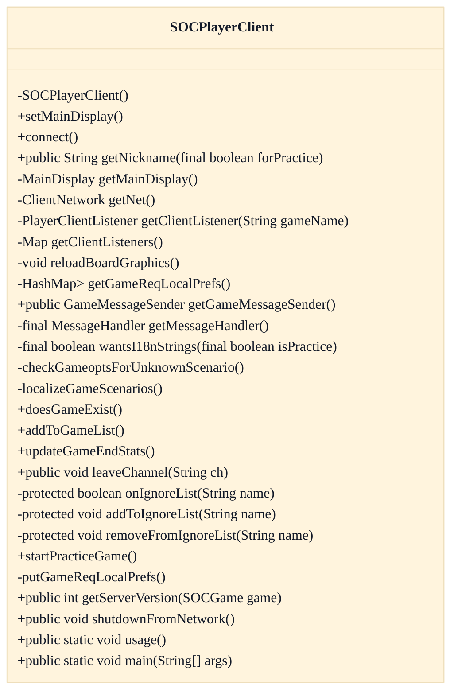

# Network & Game-List Client

## Strategic Context
- **Practice-against-robots as a first-class client mode** — Per CLAUDE.md and doc/Readme.developer.md, the project originated as a robot/AI dissertation, so the bot subsystem is first-class; `SOCPlayerClient` reflects this by embedding a stringport practice server and robot launch path so a user can play fully offline, distinct from a thin remote-only lobby client.
- **Network/UI separation introduced in the 2.0 refactor** — doc/Readme.developer.md attributes the splicing of network communication away from the Swing UI to the 2.0 refactor; this is why SOCPlayerClient holds `MainDisplay`/`PlayerClientListener` abstractions rather than driving AWT widgets directly — distinctive to this client surface, not a platform-wide statement.

## Overview
`SOCPlayerClient` is the desktop client's network and lobby surface. At construction it resolves locale and i18n strings (`SOCStringManager`), reads persistent `Preferences`, and wires three collaborators: `ClientNetwork` (`net`) for the socket, an injected `MessageHandler` for inbound dispatch, and a `GameMessageSender` for outbound traffic. `connect(...)` hands username/password to `MainDisplay` then runs `net.connect` off the UI thread. Inbound `SOCMessage` traffic arrives at the `MessageHandler`, which mutates the partial client-side `games` map and notifies per-game `PlayerClientListener`s; the authoritative game model remains at the server. The single shared game list spans a remote/local TCP server plus an optional stringport practice server, with each `SOCGame.isPractice` flag selecting the connection. Version and `SOCFeatureSet` data captured during the handshake gate behavior such as i18n string requests and lazy scenario-info fetches.

## Components
- **SOCPlayerClient**: Standalone desktop client: owns network connectivity, the shared game list, channel list, ignore list, persistent user preferences, and per-game client listeners. Holds only partial game state in its `games` Hashtable while the authoritative model lives at the server.
- **net (ClientNetwork)** (referenced; defined externally): Helper field that owns TCP/stringport connectivity (remote server, locally-launched TCP server, and the stringport practiceServer); SOCPlayerClient delegates connect/putNet/putLeaveAll to it. Defined elsewhere in soc.client (not in supplied context); described as integration, not owned here.
- **messageHandler (MessageHandler)** (referenced; defined externally): Injected helper that dispatches inbound SOCMessage traffic (handleVERSION, handleGAMES, handleNEWGAMEWITHOPTIONS, etc.); constructor accepts one so tests can substitute it. Definition not in supplied context.
- **gameMessageSender (GameMessageSender)** (referenced; defined externally): Helper that forms and sends outbound game-action traffic to the server; constructed with the client and its clientListeners map. Definition not in supplied context.
- **mainDisplay (MainDisplay)** (referenced; defined externally): Display abstraction for the lobby/game-list/channel UI; SOCPlayerClient calls it for connect, addToGameList, error panels, keeping network logic out of the AWT/Swing layer. Definition not in supplied context.

## Connections
- **ClientNetwork** (outbound) — via net field; net.connect / net.putNet / net.putLeaveAll / net.startPracticeGame (evidence: src/main/java/soc/client/SOCPlayerClient.java:net)
- **MessageHandler** (inbound) — via messageHandler field; dispatches inbound SOCMessage handle(...) (evidence: src/main/java/soc/client/SOCPlayerClient.java:messageHandler)
- **GameMessageSender** (outbound) — via gameMessageSender field constructed with clientListeners (evidence: src/main/java/soc/client/SOCPlayerClient.java:gameMessageSender)
- **MainDisplay** (bidirectional) — via mainDisplay field; connect/addToGameList/showErrorPanel/channelsClosed (evidence: src/main/java/soc/client/SOCPlayerClient.java:mainDisplay)
- **soc.server.SOCServer** (outbound) — via SOCServer.startupKnownOpts.put(gameopt3p) in constructor; net.connect for runtime traffic (evidence: src/main/java/soc/client/SOCPlayerClient.java::SOCPlayerClient(MessageHandler))
- **SOCStringManager** (outbound) — via strings = SOCStringManager.getClientManager(cliLocale); VERSION_FOR_I18N gate (evidence: src/main/java/soc/client/SOCPlayerClient.java:strings)
- **soc.message.* (SOCMessage subclasses)** (bidirectional) — via import soc.message.*; SOCScenarioInfo/SOCLocalizedStrings/SOCLeaveChannel toCmd() (evidence: src/main/java/soc/client/SOCPlayerClient.java::checkGameoptsForUnknownScenario, leaveChannel)
- **SOCFeatureSet** (inbound) — via sFeatures field populated from server SOCVersion handshake (evidence: src/main/java/soc/client/SOCPlayerClient.java:sFeatures)

## Design Decisions
- **Three coexisting server connections (remote TCP, locally-hosted TCP, stringport practice) behind one shared game list**: A client may connect to at most one TCP server plus the always-local practice server; `SOCGame.isPractice` routes each game to the right connection. This lets users practice offline against robots with no network or DB while reusing the same list UI and message-handling code, rather than maintaining a separate offline client.
- **Separate network handling from the AWT/Swing display via injected helper objects**: `net`, `messageHandler`, `gameMessageSender`, and `mainDisplay` are distinct collaborators so inbound/outbound traffic and the UI evolve independently; the 2.0-era refactor (doc/Readme.developer.md) drove this split. The `MessageHandler` is constructor-injected so tests/subclasses can supply their own.
- **Client keeps only partial state; server is authoritative**: The `games` Hashtable is accessed from both the GUI and the network thread and is updated from server `SOCMessage` traffic rather than computed locally, avoiding client/server divergence and keeping hidden information (e.g. opponents' cards) server-side until revealed (see `updateGameEndStats` revealing true VP scores at game end).
- **Gate i18n string requests and scenario localization on negotiated server version**: `wantsI18nStrings` requests localized text only when the server meets `SOCStringManager.VERSION_FOR_I18N` (practice server always qualifies) and the locale differs from the en_US fallback, avoiding wasted requests to older servers. `checkGameoptsForUnknownScenario` further branches on whether the server version matches the client: a differing version fetches full `SOCScenarioInfo`, an equal version fetches only `SOCLocalizedStrings`.
- **Per-game version resolution treats practice games specially**: `getServerVersion` returns the client's own `Version.versionNumber()` for practice games and the remote `sVersion` otherwise, so feature-availability checks need a single accessor instead of every call site re-checking `isPractice` against two version fields.
- **Failsafe override for unjoinable games and graceful network-failure degradation**: `gamesUnjoinableOverride` lets a user retry joining a game the client believed unjoinable, guarding against client/server version-recognition bugs. On network trouble, `shutdownFromNetwork` consults `net.putLeaveAll()` and keeps practice games playable when possible instead of tearing down everything.

## Constraints
- **[UNVERIFIED]** The constructor MUST reject a null MessageHandler. — src/main/java/soc/client/SOCPlayerClient.java::SOCPlayerClient(MessageHandler) — throws IllegalArgumentException("mh") when mh == null (cross-document reconciliation: not verified against `src/main/java/soc/client/SOCPlayerClient.java`; recorded as design intent, not current code fact.)
- **[UNVERIFIED]** setMainDisplay MUST reject a null MainDisplay. — src/main/java/soc/client/SOCPlayerClient.java::setMainDisplay — throws IllegalArgumentException("null") (cross-document reconciliation: not verified against `src/main/java/soc/client/SOCPlayerClient.java`; recorded as design intent, not current code fact.)
- **[UNVERIFIED]** Code MUST check SOCGame.isPractice before reading sVersion/sFeatures, because a practice game's effective version is the client's own and those remote fields do not apply. — src/main/java/soc/client/SOCPlayerClient.java::getServerVersion and sVersion/sFeatures javadoc (cross-document reconciliation: not verified against `src/main/java/soc/client/SOCPlayerClient.java`; recorded as design intent, not current code fact.)
- **[UNVERIFIED]** checkGameoptsForUnknownScenario MUST NOT be called for practice games (it assumes the TCP server already lacks full scenario info locally). — src/main/java/soc/client/SOCPlayerClient.java::checkGameoptsForUnknownScenario javadoc (cross-document reconciliation: not verified against `src/main/java/soc/client/SOCPlayerClient.java`; recorded as design intent, not current code fact.)
- **[HARD]** main MUST abort startup with a packaging error when the build version cannot be determined (versionNumber() == 0). — src/main/java/soc/client/SOCPlayerClient.java::main — early return after showErrorPanel("Packaging error...")

## Non-Functional Requirements
- **observability** — Inbound/outbound message traffic can be debug-printed when the jsettlers.debug.traffic property is set. — src/main/java/soc/client/SOCPlayerClient.java:debugTraffic (set from SOCDisplaylessPlayerClient.PROP_JSETTLERS_DEBUG_TRAFFIC)
- **reliability** — On network failure the client degrades gracefully, preserving in-progress practice games when net.putLeaveAll() permits and tearing down only networked games. — src/main/java/soc/client/SOCPlayerClient.java::shutdownFromNetwork
- **error-handling** — Board-graphics reload runs on the UI thread inside a try/catch(Throwable) so a redraw failure cannot crash the event loop. — src/main/java/soc/client/SOCPlayerClient.java::reloadBoardGraphics
- **reliability** — Network connect attempts are dispatched via EventQueue.invokeLater to keep the blocking connect off the UI repaint path. — src/main/java/soc/client/SOCPlayerClient.java::connect

## Examples
*Centralizes the practice-vs-remote version distinction so feature checks need one accessor.*
*Source: `src/main/java/soc/client/SOCPlayerClient.java::getServerVersion`*
```
public int getServerVersion(SOCGame game)
{
    if (game.isPractice)
        return Version.versionNumber();
    else
        return sVersion;
}
```

*Shows the version-and-locale gate that avoids requesting i18n strings from older servers or for the fallback locale.*
*Source: `src/main/java/soc/client/SOCPlayerClient.java::wantsI18nStrings`*
```
return (isPractice || (sVersion >= SOCStringManager.VERSION_FOR_I18N))
    && (cliLocale != null)
    && ! ("en".equals(cliLocale.getLanguage()) && "US".equals(cliLocale.getCountry()));
```

## Diagrams
### Class



### Dependency

```mermaid
%%{init: {'theme': 'base', 'themeVariables': {'primaryTextColor': '#111827', 'secondaryTextColor': '#111827', 'tertiaryTextColor': '#111827', 'lineColor': '#6b7280', 'fontFamily': 'Inter, ui-sans-serif, system-ui, sans-serif'}}}%%
graph TD
    classDef default fill:#f8fafc,stroke:#475569,color:#111827

    src_main_java_soc_client_SOCPlayerClient_java["SOCPlayerClient.java"]


    ext_src_main_java_net_nand_util_i18n_mgr_StringManager_java["StringManager.java"]:::default
    src_main_java_soc_client_SOCPlayerClient_java -.->|"imports"| ext_src_main_java_net_nand_util_i18n_mgr_StringManager_java
    ext_src_main_java_soc_baseclient_SOCDisplaylessPlayerClient_java["SOCDisplaylessPlayerClient.java"]:::default
    src_main_java_soc_client_SOCPlayerClient_java -.->|"imports"| ext_src_main_java_soc_baseclient_SOCDisplaylessPlayerClient_java
    ext_src_main_java_soc_game_SOCGame_java["SOCGame.java"]:::default
    src_main_java_soc_client_SOCPlayerClient_java -.->|"imports"| ext_src_main_java_soc_game_SOCGame_java
    ext_src_main_java_soc_game_SOCGameOption_java["SOCGameOption.java"]:::default
    src_main_java_soc_client_SOCPlayerClient_java -.->|"imports"| ext_src_main_java_soc_game_SOCGameOption_java
    ext_src_main_java_soc_game_SOCGameOptionSet_java["SOCGameOptionSet.java"]:::default
    src_main_java_soc_client_SOCPlayerClient_java -.->|"imports"| ext_src_main_java_soc_game_SOCGameOptionSet_java
    ext_src_main_java_soc_game_SOCPlayer_java["SOCPlayer.java"]:::default
    src_main_java_soc_client_SOCPlayerClient_java -.->|"imports"| ext_src_main_java_soc_game_SOCPlayer_java
    ext_src_main_java_soc_game_SOCScenario_java["SOCScenario.java"]:::default
    src_main_java_soc_client_SOCPlayerClient_java -.->|"imports"| ext_src_main_java_soc_game_SOCScenario_java
    ext_src_main_java_soc_util_I18n_java["I18n.java"]:::default
    src_main_java_soc_client_SOCPlayerClient_java -.->|"imports"| ext_src_main_java_soc_util_I18n_java
    ext_src_main_java_soc_util_SOCFeatureSet_java["SOCFeatureSet.java"]:::default
    src_main_java_soc_client_SOCPlayerClient_java -.->|"imports"| ext_src_main_java_soc_util_SOCFeatureSet_java
    ext_src_main_java_soc_util_SOCGameList_java["SOCGameList.java"]:::default
    src_main_java_soc_client_SOCPlayerClient_java -.->|"imports"| ext_src_main_java_soc_util_SOCGameList_java
    ext_src_main_java_soc_util_SOCStringManager_java["SOCStringManager.java"]:::default
    src_main_java_soc_client_SOCPlayerClient_java -.->|"imports"| ext_src_main_java_soc_util_SOCStringManager_java
    ext_src_main_java_soc_util_Version_java["Version.java"]:::default
    src_main_java_soc_client_SOCPlayerClient_java -.->|"imports"| ext_src_main_java_soc_util_Version_java
```



## Source Linkage
- [SOCPlayerClient (network + game-list window)](../../../src/main/java/soc/client/SOCPlayerClient.java::SOCPlayerClient)
- [Three-connection model with isPractice routing](../../../src/main/java/soc/client/SOCPlayerClient.java::getServerVersion)
- [Partial client-side game state map](../../../src/main/java/soc/client/SOCPlayerClient.java::updateGameEndStats)
- [Version/feature handshake support](../../../src/main/java/soc/util/SOCFeatureSet.java::SOCFeatureSet)
- [Localized text resolution gated on min client/server version](../../../src/main/java/soc/client/SOCPlayerClient.java::wantsI18nStrings)
- [Lazy version-aware scenario info fetch](../../../src/main/java/soc/client/SOCPlayerClient.java::checkGameoptsForUnknownScenario)
- [Graceful network-failure degradation to practice](../../../src/main/java/soc/client/SOCPlayerClient.java::shutdownFromNetwork)
- [MessageHandler injection / null guard](../../../src/main/java/soc/client/SOCPlayerClient.java::SOCPlayerClient)
- [Build config (Docker, web deps/ports)](../../../Dockerfile)

Parent scope: [_scope.md](_scope.md)
Sibling feature: [network-game-list-client.feature.md](network-game-list-client.feature.md)
Scope architecture: [desktop-swing-client.arch.md](desktop-swing-client.arch.md)

## Source Linkage Grounding

_Per-row confidence; `_unverified_` rows are disclosed, not verified; `0.08 (resolved, uncited)` is the resolved-but-uncited baseline, not measured evidence._

| Element | Doc Evidence | Code Evidence | Confidence |
|---------|--------------|---------------|-----------:|
| Source Linkage: SOCPlayerClient (network + game-list window) |  | src/main/java/soc/client/SOCPlayerClient.java:526-583 | 0.86 |
| Source Linkage: Three-connection model with isPractice routing |  | src/main/java/soc/client/SOCPlayerClient.java:1038-1044 | 0.86 |
| Source Linkage: Partial client-side game state map |  | src/main/java/soc/client/SOCPlayerClient.java:881-902 | 0.86 |
| Source Linkage: Version/feature handshake support |  | src/main/java/soc/util/SOCFeatureSet.java:219-224 | 0.75 |
| Source Linkage: Localized text resolution gated on min client/server version |  | src/main/java/soc/client/SOCPlayerClient.java:742-747 | 0.86 |
| Source Linkage: Lazy version-aware scenario info fetch |  | src/main/java/soc/client/SOCPlayerClient.java:760-778 | 0.86 |
| Source Linkage: Graceful network-failure degradation to practice |  | src/main/java/soc/client/SOCPlayerClient.java:1056-1089 | 0.86 |
| Source Linkage: Build config (Docker, web deps/ports) | syntax=docker/dockerfile:1 | Dockerfile | 0.08 (resolved, uncited) |

Related scopes: [Game Model & Rules Engine](../game-model-rules-engine/game-model-rules-engine.arch.md), [Robot / AI Players](../robot-ai-players/robot-ai-players.arch.md), [Server & Message Protocol](../server-message-protocol/server-message-protocol.arch.md)
