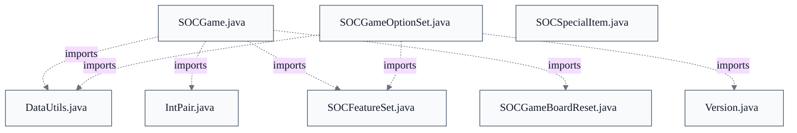

# Cities & Knights Scenario (SC_CK)

## Strategic Context
- **Incremental Cities & Knights groundwork** — In-code references to doc/Cities-and-Knights-Design.md (section 3.2) and doc/Cities-and-Knights-Implemented.md frame the _CK_* options and improvement-track special items as deliberate, not-yet-playable groundwork for a future Cities & Knights scenario, landed in main behind inactive-hidden flags so the work proceeds without exposing incomplete rules to players. Distinct from other scenarios, this one ships intentionally unselectable.

## Overview
Cities & Knights is decomposed into one scenario flag (_SC_CK) plus five capability options (_CK_KNI, _CK_IMP, _CK_PROG, _CK_BARB, _CK_METR) declared in SOCGameOptionSet and registered through getAllKnownOptions(), the codebase's central scenario-extensibility point. Because the scenario and its constituent options are registered inactive-hidden, a game's enabled option set never selects them in normal play, so the rules stay inert. When activated, the city-improvement tracks are represented as SOCSpecialItem instances keyed by typeKeys derived from the _CK_IMP option name; makeKnownItem() seeds them and playerPickItem() applies picks, charging commodities rather than resources. SOCGame is the authoritative server-side holder of the resulting per-game and per-player state — barbarian strength, metropolis ownership, knight and progress-card state — which clients only mirror partially.

## Components
- **SOCGameOptionSet**
- **SOCSpecialItem**
- **SOCGame**
- **CKCardEffect**

## Connections
- **SOCGameOptionSet** (outbound) — via improvement-track typeKeys derive from the K__CK_IMPROV ("_CK_IMP") option keyname (evidence: src/main/java/soc/game/SOCSpecialItem.java: CK_IMPROV_TRADE = K__CK_IMPROV + "/T")
- **SOCGame** (bidirectional) — via SOCGame stores/retrieves special items (getSpecialItem/setSpecialItem) and calls makeKnownItem from updateAtBoardLayout (evidence: SOCSpecialItem makeKnownItem javadoc references SOCGame#updateAtBoardLayout; SOCGame class-diagram getSpecialItems/getSpecialItem)
- **SOCPlayer** (outbound) — via improvement levels are paid in player commodity fields CK_CLOTH / CK_COIN / CK_PAPER (SOCPlayer defined outside this epic) (evidence: src/main/java/soc/game/SOCSpecialItem.java: CK_IMPROV_TYPEKEYS javadoc referencing SOCPlayer.CK_CLOTH/CK_COIN/CK_PAPER)
- **SOCServer** (outbound) — via inactive-hidden options are turned on at server startup activation (jsettlers.gameopts.activate) (evidence: src/main/java/soc/game/SOCGameOptionSet.java imports soc.server.SOCServer (for javadocs) and registry comment 'until activated at server startup')

## Design Decisions
- **Ship Cities & Knights as inactive-hidden groundwork rather than on a separate feature branch**: Every _CK_* option and the _SC_CK scenario stub are registered FLAG_INACTIVE_HIDDEN | FLAG_DROP_IF_UNUSED in getAllKnownOptions(), so the code lands in main but is hidden from the New Game UI and excluded from normal play until explicitly activated at server startup. This lets the incomplete scenario accrete incrementally without exposing unplayable rules.
- **Model city-improvement (and knight) tracks as SOCSpecialItem instances, not new SOCMessage types**: Per the SOCSpecialItem class javadoc, cost and requirement constants are initialized identically at server and client and never sent over the network because it is easier to set them up in a factory method than to create, send, and parse messages carrying every special-item detail. New scenario item types reuse existing special-item plumbing instead of widening the ~120-class wire protocol.
- **Keep the three commodities outside SOCResourceSet and charge them in playerPickItem**: makeKnownItem leaves cost null for improvement items because levels are paid in commodities (SOCPlayer CK_CLOTH / CK_COIN / CK_PAPER) that are deliberately not part of SOCResourceSet; playerPickItem checks and pays them, where building level N costs N of the track's commodity. This isolates the new economy from the five base resources.
- **Compose multi-item special-item typeKeys as optionName + "/" + shortKey**: CK_IMPROV_TRADE is defined as K__CK_IMPROV + "/T" (likewise /P and /S), following the documented SOCSpecialItem convention so a single game option (_CK_IMP) can own several special-item types while each key remains traceable to its registering option for cross-scenario compatibility.
- **Hold all authoritative C&K state in SOCGame at the server**: Consistent with the model that the server's SOCGame holds complete state while clients hold partial state, the barbarian counter, metropolis ownership, knight state and progress decks are SOCGame fields and ck* methods (e.g. rollDice() advances barbarian strength when _CK_BARB is set) rather than client-reconstructed values.

## Constraints
- **[HARD]** The _CK_* options and the _SC_CK scenario stub MUST be registered inactive-hidden (FLAG_INACTIVE_HIDDEN | FLAG_DROP_IF_UNUSED), keeping them out of the New Game UI and normal play until server-activated. — src/main/java/soc/game/SOCGameOptionSet.java::getAllKnownOptions (registry comment for _CK_* keynames)
- **[HARD]** The _SC_CK scenario MUST NOT be selectable in normal play because its constituent _CK_* options are inactive-hidden. — src/main/java/soc/game/SOCGameOptionSet.java::K_SC_CK (javadoc)
- **[HARD]** playerPickItem MUST run at the server only and only when the requester is the current player and game state is PLAY1 or SPECIAL_BUILDING, otherwise it throws IllegalStateException. — src/main/java/soc/game/SOCSpecialItem.java::playerPickItem (current-player / game-state guard)
- **[HARD]** Callers MUST hold the game monitor (SOCGame.takeMonitor()) before invoking playerPickItem. — src/main/java/soc/game/SOCSpecialItem.java::playerPickItem (Locks javadoc)
- **[HARD]** Any city-improvement track level MUST NOT exceed CK_IMPROV_MAX_LEVEL (5). — src/main/java/soc/game/SOCSpecialItem.java::CK_IMPROV_MAX_LEVEL
- **[SOFT]** A special item belonging to a game option with more than one item type SHOULD use a typeKey of optionName + "/" + a short alphanumeric key. — src/main/java/soc/game/SOCSpecialItem.java (class javadoc convention)

## Non-Functional Requirements
- **error-handling** — Invalid picks (wrong turn, wrong game state, unmet cost/requirements, missing starting-cost piece, or unknown typeKey) are rejected by throwing IllegalStateException rather than mutating game state. — src/main/java/soc/game/SOCSpecialItem.java::playerPickItem (throws clause and guard)
- **reliability** — Groundwork C&K rules remain inert by default; the scenario and its options ship disabled and cannot affect live games until activated at server startup. — src/main/java/soc/game/SOCGameOptionSet.java::getAllKnownOptions (inactive-hidden registration)
- **security** — C&K state changes are server-authoritative; picks are validated and resources/commodities deducted at the server, with clients holding only partial mirrored state. — src/main/java/soc/game/SOCSpecialItem.java::playerPickItem ('Called at server, not at client'); SOCGame class javadoc (server holds complete state)

## Examples
*Shows the optionName + "/" + shortKey typeKey convention binding each track back to the _CK_IMP option.*
*Source: `src/main/java/soc/game/SOCSpecialItem.java`*
```
public static final String CK_IMPROV_TRADE = "_CK_IMP/T";
public static final String[] CK_IMPROV_TYPEKEYS = { CK_IMPROV_TRADE, CK_IMPROV_POLITICS, CK_IMPROV_SCIENCE };
```

*Documents the decision to keep commodities outside SOCResourceSet and charge them in playerPickItem.*
*Source: `src/main/java/soc/game/SOCSpecialItem.java (makeKnownItem CK branch)`*
```
// Cities & Knights city-improvement track: level starts at 0, no requirements or
// string value. Cost is null because levels are paid for in commodities, which aren't
// part of SOCResourceSet; playerPickItem checks and pays them. See CK_IMPROV_TYPEKEYS.
```

*The server-side turn/state guard that fails a pick made out of turn or in the wrong state.*
*Source: `src/main/java/soc/game/SOCSpecialItem.java (playerPickItem)`*
```
if ((pl.getPlayerNumber() != ga.getCurrentPlayerNumber())
    || ((ga.getGameState() != SOCGame.PLAY1) && (ga.getGameState() != SOCGame.SPECIAL_BUILDING)))
```

## Diagrams
### Class

```mermaid
%%{init: {'theme': 'base', 'themeVariables': {'primaryTextColor': '#111827', 'secondaryTextColor': '#111827', 'tertiaryTextColor': '#111827', 'lineColor': '#6b7280', 'fontFamily': 'Inter, ui-sans-serif, system-ui, sans-serif'}}}%%
classDiagram
    class SOCGame {
        +SOCGame()
        +public synchronized void takeMonitor()
        +public synchronized void releaseMonitor()
        +public final boolean[] getFlagFieldsForSave()
        +setFieldsForLoad()
        +public boolean allOriginalPlayers()
        +public boolean hasHumanPlayers()
        +public Date getStartTime()
        +public int getDurationSeconds()
        +setTimeSinceCreated()
        +setDurationSecondsFinished()
        +public long getExpiration()
        +public boolean hasWarnedExpiration()
        +public void setWarnedExpiration()
        +setGameEventListener()
        +public boolean hasGameEventListener()
        +public void setExpiration(final long ex)
        +public String getOwner()
        +setOwner()
        +public final String getOwnerLocale()
        +addPlayer()
        +removePlayer()
        +public boolean isSeatVacant(final int pn)
        +public int getAvailableSeatCount()
        +public SeatLockState getSeatLock(final int pn)
        +public SeatLockState[] getSeatLocks()
        +setSeatLock()
        +setSeatLocks()
        +public int getPlayerCount()
        +public SOCPlayer getPlayer(final String nn)
        +public boolean isMemberChatAllowed(final String memberName)
        +setMemberChatAllowed()
        +public Set<String> getMemberChatAllowList()
        +public boolean isCurrentPlayerStubbornRobot()
        +public String getName()
        +setName()
        +public SOCGameOptionSet getGameOptions()
        +public boolean isGameOptionDefined(final String optKey)
        +public boolean isGameOptionSet(final String optKey)
        +getGameOptionIntValue()
        +public String getGameOptionStringValue(final String optKey)
        +public int getClientVersionMinRequired()
        +public int getClientVersionMinSitDown()
        +public SOCFeatureSet getClientFeaturesRequired()
        +public void setClientFeaturesRequired(SOCFeatureSet feats)
        +public boolean canClientJoin(final SOCFeatureSet cliFeats)
        +checkClientFeatures()
        +public boolean isBoardReset()
        +public SOCBoard getBoard()
        +public SOCPlayer[] getPlayers()
        -protected void setPlayer(final int pn, SOCPlayer pl)
        +public int getCurrentPlayerNumber()
        +public void setCurrentPlayerNumber(final int pn)
        +public int getSpecialBuildingPlayerNumberAfter()
        +setSpecialBuildingPlayerNumberAfter()
        +public int getRoundCount()
        +public void setRoundCount(final int count)
        +public boolean hasBuiltCity()
        +public void setHasBuiltCity(final boolean hasBuilt)
        +public int getCurrentDice()
        +public void setCurrentDice(final int dr)
        +public boolean hasRolledSeven()
        +public int getBarbarianStrength()
        +public void setBarbarianStrength(final int strength)
        +public int advanceBarbarianStrength()
        +public void ckResolveBarbarianAttack(final RollResult rr)
        +public void ckDowngradeCity(final SOCCity city)
        +public int getCKMetropolisOwner(final int track)
        +setCKMetropolisOwner()
        +public int ckCheckMetropolis(final int track)
        +ckGetImprovementLevel()
        +public boolean canCKBuyKnight(final int pn)
        +public void ckBuyKnight(final int pn)
        +public boolean canCKActivateKnight(final int pn)
        +public void ckActivateKnight(final int pn)
        +public boolean canCKPromoteKnight(final int pn)
        +public void ckPromoteKnight(final int pn)
        -private void ckInitProgressDecks()
        +ckDrawProgressCard()
        -private void ckReturnProgressCard(final int itype)
        +canCKPlayProgressCard()
        +ckPlayProgressCard()
        -ckGainPerAdjacentHex()
        -private int ckPickRandomResource(final SOCResourceSet rs)
        +public int getCKMonopolyCardInPlay()
        +public CKCardEffect getCKLastCardEffect()
        +public int[] ckDoMonopolyAction(final int ptype)
        +ckGetCommoditiesGainedFromRoll()
        -ckGetCommoditiesGainedFromRollNumber()
        -ckDrawProgressCardsFromRoll()
        +public int getGameState()
        +public void setGameState(final int gs)
        -private void setGameStateOVER()
        +getResetOldGameState()
        +public int getOldGameState()
        +public final boolean isInitialPlacement()
        +isInitialPlacementRoundDone()
        +public boolean isForcingEndTurn()
        +isPickResourceIncludingPirateFleet()
        +public int getNumDevCards()
        +public void setNumDevCards(final int nd)
        +public int[] getDevCardDeck()
        +shuffleDevCardDeck()
        +public Set<String> getSpecialItemTypes()
        +getSpecialItems()
        +getSpecialItem()
        +setSpecialItem()
        +public SOCInventoryItem getPlacingItem()
        +public void setPlacingItem(SOCInventoryItem item)
        +public SOCPlayer getPlayerWithLargestArmy()
        +public void setPlayerWithLargestArmy(SOCPlayer pl)
        +public SOCPlayer getPlayerWithLongestRoad()
        +public void setPlayerWithLongestRoad(SOCPlayer pl)
        +public SOCPlayer getPlayerWithWin()
        +setPlayersLandHexCoordinates()
        +gameOverMessageToPlayer()
        -protected boolean advanceTurnBackwards()
        -protected boolean advanceTurn()
        -private boolean advanceTurnToSpecialBuilding()
        +revealFogHiddenHex()
        +canRemovePort()
        +removePort()
        +canPlacePort()
        +placePort()
        +canPlaceShip()
        +public List<Integer> getShipsPlacedThisTurn()
        +public void addShipPlacedThisTurn(final int edge)
        +public void putPiece(SOCPlayingPiece pp)
        -putPieceCommon()
        -putPieceCommon_checkFogHexes()
        -private boolean advanceTurnStateAfterPutPiece()
        +public void putTempPiece(SOCPlayingPiece pp)
        +canMoveShip()
        +public void moveShip(SOCShip sh, final int toEdge)
        +canUndoMoveShip()
        +undoMoveShip()
        +public void removeShip(SOCShip sh)
        +canUndoPutPiece()
        +undoPutPiece()
        -undoPutPieceCommon()
        +public void undoPutTempPiece(SOCPlayingPiece pp)
        +public void undoPutInitSettlement(SOCPlayingPiece pp)
        -undoActionSideEffects_pre()
        +setLastActionCannotUndo()
        -undoActionSideEffects_post()
        +public void initAtServer()
        +startGame()
        -private final void startGame_setupDevCards()
        +public void setFirstPlayer(final int pn)
        +public int getFirstPlayer()
        +public boolean canEndTurn(final int pn)
        +public void endTurn()
        +public void updateAtBoardLayout()
        -private void updateAtGameFirstTurn()
        +public void updateAtTurn()
        +forceEndTurn()
        -forceEndTurnStartState()
        -forceEndTurnChkDiscardOrGain()
        +discardOrGainPickRandom()
        +playerDiscardOrGainRandom()
        +public boolean canRollDice(int pn)
        +public RollResult rollDice()
        -private final void rollDice_update7gameState()
        +getResourcesGainedFromRoll()
        -private int getDice2And12PairedRoll(final int roll)
        -getResourcesGainedFromRollPieces()
        +public boolean canDiscard(final int pn, ResourceSet rs)
        +public void discard(final int pn, ResourceSet rs)
        +canPickGoldHexResources()
        +pickGoldHexResources()
        +public boolean canChooseMovePirate()
        +chooseMovePirate()
        +public boolean canMoveRobber(final int pn, final int co)
        +moveRobber()
        +public boolean canMovePirate(final int pn, final int hco)
        +movePirate()
        +public boolean canChoosePlayer(final int pn)
        +public int choosePlayerForRobbery(final int pn)
        +public boolean canChooseRobClothOrResource(final int pn)
        +canAttackPirateFortress()
        +public int[] attackPirateFortress(final SOCShip adjacent)
        +getPlayersOnHex()
        +public List<SOCPlayer> getPlayersShipsOnHex(final int hex)
        +public SOCFortress getFortress(final int node)
        +public GameAction getLastAction()
        +public void setLastAction(final GameAction act)
        +public boolean isPlacingRobberForKnightCard()
        +setPlacingRobberForKnightCard()
        +public SOCMoveRobberResult getRobberyResult()
        +public boolean getRobberyPirateFlag()
        +public List<SOCPlayer> getPossibleVictims()
        +stealFromPlayer()
        -stealFromPlayerPirateFleet()
        +public boolean hasTradeOffers()
        +rejectTradeOffersTo()
        +canMakeTrade()
        +makeTrade()
        +canUndoBankTrade()
        +canMakeBankTrade()
        +makeBankTrade()
        +public boolean couldBuildRoad(final int pn)
        +public boolean couldBuildSettlement(final int pn)
        +public boolean couldBuildCity(final int pn)
        +public boolean couldBuyDevCard(final int pn)
        +public boolean couldBuildShip(final int pn)
        +public void buyRoad(final int pn)
        +public void buySettlement(final int pn)
        +public void buyCity(final int pn)
        +public void buyShip(final int pn)
        +public boolean canCancelBuildPiece(final int buildType)
        +public boolean doesCancelRoadBuildingReturnCard()
        +public boolean cancelBuildRoad(final int pn)
        +public void cancelBuildSettlement(int pn)
        +public void cancelBuildCity(final int pn)
        +public boolean cancelBuildShip(final int pn)
        +cancelPlaceInventoryItem()
        +public boolean isShipWarship(final SOCShip sh)
        +setNextDevCard()
        +public int buyDevCard()
        +public boolean canPlayKnight(final int pn)
        +public boolean canPlayRoadBuilding(final int pn)
        +public boolean canPlayDiscovery(final int pn)
        +public boolean canPlayMonopoly(final int pn)
        +canPlayInventoryItem()
        +public SOCInventoryItem playInventoryItem(final int itype)
        +public void playKnight()
        +public void playRoadBuilding()
        +public void playDiscovery()
        +public void playMonopoly()
        +public boolean canCancelPlayCurrentDevCard()
        +cancelPlayCurrentDevCard()
        +public boolean canDoDiscoveryAction(ResourceSet pick)
        +public boolean canDoMonopolyAction()
        +public void doDiscoveryAction(SOCResourceSet pick)
        +public int[] doMonopolyAction(final int rtype)
        +public void updateLargestArmy()
        +public void saveLargestArmyState()
        +public void restoreLargestArmyState()
        +public void updateLongestRoad(final int pn)
        +public void checkForWinner()
        -private final boolean checkForWinner_SC_CLVI()
        +public void destroyGame()
        +public SOCGame resetAsCopy()
        +resetVoteBegin()
        +public int getResetVoteRequester()
        +public boolean getResetVoteActive()
        +resetVoteRegister()
        +public int getResetPlayerVote(final int pn)
        +public void resetVoteClear()
        +getResetVoteResult()
        +public boolean canBuyOrAskSpecialBuild(final int pn)
        +public boolean isSpecialBuilding()
        +canAskSpecialBuild()
        +askSpecialBuild()
        +public boolean isDebugFreePlacement()
        +setDebugFreePlacement()
        +public int getTurnCount()
        +@Override
    public String toString()
    }
    class SOCGameOptionSet {
        +SOCGameOptionSet()
        +public static SOCGameOptionSet getAllKnownOptions()
        +public int size()
        +public boolean isEmpty()
        +contains()
        +public boolean containsKey(final String optKey)
        +public boolean add(final SOCGameOption opt)
        +public SOCGameOption put(final SOCGameOption opt)
        +public SOCGameOption get(final String optKey)
        +public Map<String, SOCGameOption> getAll()
        +public Collection<SOCGameOption> values()
        +public Set<String> keySet()
        +public Iterator<SOCGameOption> iterator()
        +public SOCGameOption remove(final String optKey)
        +public void clear()
        +public boolean isOptionSet(final String optKey)
        +setBoolOption()
        +setIntOption()
        +getOptionIntValue()
        +public String getOptionStringValue(final String optKey)
        +getKnownOption()
        +public boolean addKnownOption(final SOCGameOption onew)
        +activate()
        +setKnownOptionCurrentValue()
        +optionsNewerThanVersion()
        +optionsForVersion()
        -implOptionsVersionCheck()
        +adjustOptionsToKnown()
        +removeOpportunisticIfOlderClients()
        +optionsNotSupported()
        +optionsTrimmedForSupport()
        +optionsWithFlag()
        +@Override
    public String toString()
    }
    class SOCSpecialItem {
        +makeKnownItem()
        +playerPickItem()
        +playerSetItem()
        +SOCSpecialItem()
        +public int getGameIndex()
        +public void setGameIndex(final int gi)
        +public SOCPlayer getPlayer()
        +public void setPlayer(SOCPlayer pl)
        +public int getCoordinates()
        +public void setCoordinates(final int co)
        +public int getLevel()
        +public void setLevel(final int lv)
        +public String getStringValue()
        +public void setStringValue(final String sv)
        +public SOCResourceSet getCost()
        +public void setCost(SOCResourceSet co)
        +public final boolean checkCost(final SOCPlayer pl)
        +public final int getStartingCostPiecetype()
        +checkStartingCostPiecetype()
        +checkRequirements()
        +@Override
    public String toString()
        +@Override
    public boolean equals(Object other)
        +clone()
    }
    class Requirement {
        +parse()
        +Requirement()
        +public final boolean equals(final Object other)
        +public final String toString()
    }
    class RollResult {
        +public void update(final int dA, final int dB)
    }
    class RemoveOpportunisticResults {
        +RemoveOpportunisticResults()
    }
    class CKCardEffect {
        +public CKCardEffect(final int itype)
    }

```



### Dependency



## Source Linkage
- [Scenario gating via Known-Options registry (_CK_* and _SC_CK keynames)](../../../src/main/java/soc/game/SOCGameOptionSet.java::getAllKnownOptions)
- [City-improvement tracks modeled as SOCSpecialItem typeKeys (levels 0-5)](../../../src/main/java/soc/game/SOCSpecialItem.java::CK_IMPROV_TYPEKEYS)
- [Improvement-item factory and pick validation (commodity-paid, null cost)](../../../src/main/java/soc/game/SOCSpecialItem.java::makeKnownItem)
- [Server-side pick application with turn/state guard](../../../src/main/java/soc/game/SOCSpecialItem.java::playerPickItem)
- [Per-track level ceiling](../../../src/main/java/soc/game/SOCSpecialItem.java::CK_IMPROV_MAX_LEVEL)
- [Authoritative barbarian-strength counter advanced on dice roll](../../../src/main/java/soc/game/SOCGame.java::getBarbarianStrength)
- [Knight lifecycle and progress-card / metropolis state in SOCGame](../../../src/main/java/soc/game/SOCGame.java::SOCGame)
- [Progress-card effect helper](../../../src/main/java/soc/game/SOCGame.java::CKCardEffect)

Parent scope: [_scope.md](_scope.md)
Sibling feature: [cities-knights-scenario-sc-ck.feature.md](cities-knights-scenario-sc-ck.feature.md)
Scope architecture: [game-model-rules-engine.arch.md](game-model-rules-engine.arch.md)

## Source Linkage Grounding

_Per-row confidence; `_unverified_` rows are disclosed, not verified; `0.08 (resolved, uncited)` is the resolved-but-uncited baseline, not measured evidence._

| Element | Doc Evidence | Code Evidence | Confidence |
|---------|--------------|---------------|-----------:|
| Source Linkage: Scenario gating via Known-Options registry (_CK_* and _SC_CK keynames) |  | src/main/java/soc/game/SOCGameOptionSet.java:546-910 | 0.83 |
| Source Linkage: City-improvement tracks modeled as SOCSpecialItem typeKeys (levels 0-5) |  | src/main/java/soc/game/SOCSpecialItem.java | 0.86 |
| Source Linkage: Improvement-item factory and pick validation (commodity-paid, null cost) |  | src/main/java/soc/game/SOCSpecialItem.java:280-336 | 0.86 |
| Source Linkage: Server-side pick application with turn/state guard |  | src/main/java/soc/game/SOCSpecialItem.java:378-477 | 0.86 |
| Source Linkage: Per-track level ceiling |  | src/main/java/soc/game/SOCSpecialItem.java | 0.86 |
| Source Linkage: Authoritative barbarian-strength counter advanced on dice roll |  | src/main/java/soc/game/SOCGame.java:2934-2937 | 0.95 |
| Source Linkage: Knight lifecycle and progress-card / metropolis state in SOCGame |  | src/main/java/soc/game/SOCGame.java:1637-1732 | 0.95 |
| Source Linkage: Progress-card effect helper |  | src/main/java/soc/game/SOCGame.java:3807-3810 | 0.95 |

Related scopes: [Desktop Swing Client](../desktop-swing-client/desktop-swing-client.arch.md), [Robot / AI Players](../robot-ai-players/robot-ai-players.arch.md), [Server & Message Protocol](../server-message-protocol/server-message-protocol.arch.md)
