# Core Game State & Board Model

## Strategic Context
- **Robot/AI subsystem is first-class, not bolted on** — SOCPlayer's 'legal' vs 'potential' road/settlement/city vocabulary is defined by reference to 'page 61 of Robert S Thomas' dissertation' — the model carries the original AI-agent dissertation's abstractions because the codebase originated as that dissertation, so the game model is shaped to feed a planning bot, not only to render a UI.
- **Network-frozen coordinate encoding constrained the model's evolution** — The classic board's two-hex-digit coordinate format is acknowledged in-code as un-expandable because it 'is used across the network'; the sea board therefore arrived as a new v3 encoding (added in v2.0.00) rather than a revision of v1/v2 — a superseded-design genealogy that explains why two coordinate systems coexist.

## Overview
This feature is the model layer of the client/server game. SOCGame is the single authoritative holder of complete game state at the server; game logic advances there, and the server pushes deltas to clients (via SOCGameState, SOCSetPlayedDevCard, and similar messages) so each client's local SOCGame carries only partial state — other players' resources or dev cards may be of unknown type. A SOCGame owns one SOCBoard (constructed through SOCBoard.BoardFactory.createBoard and initialized in makeNewBoard(SOCGameOptionSet)) and an array of SOCPlayer objects, each scoped to that game. The board is purely geometric/topological: it resolves coordinates to adjacent hexes, nodes, and edges but never mutates game state, while SOCGame and SOCPlayer enforce the rules on top of it. Turn flow is driven by the integer game-state machine inside SOCGame, advanced by putPiece, advanceTurn, updateAtTurn, and endTurn.

## Components
- **SOCGame**
- **SOCPlayer**
- **SOCBoard**
- **SOCBoardLarge**

## Connections
- **soc.util (DataUtils, IntPair, SOCFeatureSet, SOCGameBoardReset)** (outbound) — via import in SOCGame.java (evidence: src/main/java/soc/game/SOCGame.java imports soc.util.DataUtils, soc.util.IntPair, soc.util.SOCFeatureSet, soc.util.SOCGameBoardReset)
- **soc.server.SOCBoardAtServer** (outbound) — via import for server-only methods such as distributeClothFromRoll (evidence: src/main/java/soc/game/SOCGame.java: `import soc.server.SOCBoardAtServer;  // For calling server-only methods`)
- **soc.message.SOCMessage** (outbound) — via import for static calls only (SOCGame does not handle network messages) (evidence: src/main/java/soc/game/SOCGame.java: `import soc.message.SOCMessage;  // For static calls only`)
- **soc.util.NodeLenVis** (outbound) — via import in SOCPlayer.java for longest-road tracing state (evidence: src/main/java/soc/game/SOCPlayer.java imports soc.util.NodeLenVis)
- **soc.server.savegame.SavedGameModel** (outbound) — via import (javadoc reference) for save/load persistence of game and player data (evidence: src/main/java/soc/game/SOCPlayer.java: `import soc.server.savegame.SavedGameModel;  // for javadocs only`)
- **soc.client.SOCPlayerInterface / SOCBoardPanel** (inbound) — via client UI switches on SOCGame state constants (updateAtGameState, updateMode) (evidence: src/main/java/soc/game/SOCGame.java::NEW (javadoc 'main places to check' list))
- **soc.robot.SOCRobotBrain** (inbound) — via bot decision loop reacts to SOCGame state in run() (evidence: src/main/java/soc/game/SOCGame.java::NEW (javadoc lists SOCRobotBrain.run()))

## Design Decisions
- **Server holds complete state; clients hold partial state**: SOCGame's javadoc fixes the model: 'The SOCGame at server contains the game's complete state information, and game logic advances there' while each client's local SOCGame contains only partial state. This keeps the server authoritative over hidden information (opponent resources/dev-card types) and reduces the client to a view updated by messages, rather than trusting clients with rules enforcement.
- **Board holds no back-reference to game or players**: SOCBoard's javadoc states the board 'does not hold a reference to the game or players, to enforce layering and keep the board logic simple. Game rules should be enforced at the game, not the board.' This one-directional dependency (game → board) keeps coordinate geometry reusable and side-effect-free; calling board methods cannot change game state.
- **Explicit monitor instead of implicit thread-safety**: Most SOCGame methods are documented as not implicitly thread-safe; callers must wrap them in takeMonitor()/releaseMonitor(). Pushing locking to the caller lets multi-step game mutations be made atomic as a unit rather than paying per-method synchronization that still wouldn't compose across a multi-method action.
- **Separate subclass (SOCBoardLarge) for the sea board rather than parameterizing SOCBoard**: The classic v1/v2 encodings hardcode land/water/port positions inside two-hex-digit coordinates, which 'means the board can't be expanded without changing its encoding, which is used across the network.' Rather than retrofit, the v3 large encoding was added as a subclass with its own 2-D hexLayoutLg, up to 127×127 hexes and runtime-variable land/water — isolating the differing coordinate system from the legacy fixed layout.
- **Game options drive board construction**: makeNewBoard takes a SOCGameOptionSet, so house rules and scenarios (keys like 'SBL', '_BHW', and '_SC_*') select board size, encoding, and scenario features at construction time instead of via separate board classes per ruleset — the same extensibility mechanism used across the codebase.
- **Game state modeled as documented integer constants with explicit 'where-used' checklists**: Game phases are dense integer constants (NEW=0…OVER) whose javadoc enumerates every site that must switch on state when a new state is added (SOCBoardPanel.updateMode, SOCRobotBrain.run, SOCGameHandler.sendGameState, etc.). The trade-off accepts maintenance discipline (a manually-curated list) in exchange for a compact, serializable, network-cheap representation shared by client, server, and bots.

## Constraints
- **[HARD]** STARTS_WAITING_FOR_PICK_GOLD_RESOURCE MUST equal ROLL_OR_CARD - 1, so it remains the highest-numbered starting state. — src/main/java/soc/game/SOCGame.java: `public static final int STARTS_WAITING_FOR_PICK_GOLD_RESOURCE = 14;  // value must be 1 less than ROLL_OR_CARD`
- **[HARD]** MISC_PORT MUST be 0 and equal WATER_HEX; the CLAY_PORT..WOOD_PORT range MUST be 1..5 and CLAY_HEX MUST equal CLAY_PORT — these numeric identities are hardcoded in board-drawing code. — src/main/java/soc/game/SOCBoard.java::MISC_PORT (`Must be 0 (hardcoded in places here)`) and the MISC_PORT/WATER_HEX equivalence note
- **[SOFT]** Callers MUST wrap most SOCGame mutating methods in takeMonitor()/releaseMonitor(); the methods are not implicitly thread-safe. — src/main/java/soc/game/SOCGame.java::SOCGame (class javadoc: 'Most methods are not implicitly thread-safe')
- **[SOFT]** Callers SHOULD check a can* guard (e.g. canPlayKnight(int)) before invoking the corresponding action method (playKnight()); action methods assume validity and do not re-check. — src/main/java/soc/game/SOCGame.java::SOCGame (class javadoc: 'Many methods assume you've already checked whether the move is valid')
- **[HARD]** Port-type integers MUST be contiguous with MISC_PORT first and WOOD_PORT last; port-hextype integers MUST run MISC_PORT_HEX(7) first through WOOD_PORT_HEX(12) last. — src/main/java/soc/game/SOCBoard.java::MISC_PORT / WOOD_PORT / MISC_PORT_HEX / WOOD_PORT_HEX (`Must be first/last port-type integer`)

## Non-Functional Requirements
- **reliability** — Multi-step game mutations are guarded by an explicit caller-held monitor (takeMonitor/releaseMonitor) rather than per-method synchronization, so a composite action stays atomic against concurrent access. — src/main/java/soc/game/SOCGame.java::takeMonitor / releaseMonitor
- **reliability** — Games are created with a 120-minute expiration (GAME_TIME_EXPIRE_MINUTES) and expose getExpiration/setExpiration/hasWarnedExpiration so the server can reclaim abandoned games. — src/main/java/soc/game/SOCGame.java::SOCGame (class javadoc) / getExpiration
- **security** — Hidden information (opponent resource/dev-card types) is withheld from clients: the authoritative complete state exists only at the server and clients receive partial state via messages. — src/main/java/soc/game/SOCGame.java::isAtServer (class javadoc)
- **compatibility** — SOCGame persistence is version-tracked via serialVersionUID (2700L, last structural change v2.7.00); cross-version persistence is delegated to SavedGameModel rather than raw serialization. — src/main/java/soc/game/SOCGame.java::serialVersionUID

## Examples
*Shows that game-state constant values encode an ordering invariant, not arbitrary labels.*
*Source: `src/main/java/soc/game/SOCGame.java`*
```
public static final int STARTS_WAITING_FOR_PICK_GOLD_RESOURCE = 14;  // value must be 1 less than ROLL_OR_CARD
```

*Documents the one-directional game→board dependency that keeps board geometry rule-free.*
*Source: `src/main/java/soc/game/SOCBoard.java`*
```
A {@link SOCGame} uses this board; the board does not hold a reference to the game or players, to enforce layering
```

## Diagrams
### Class

```mermaid
%%{init: {'theme': 'base', 'themeVariables': {'primaryTextColor': '#111827', 'secondaryTextColor': '#111827', 'tertiaryTextColor': '#111827', 'lineColor': '#6b7280', 'fontFamily': 'Inter, ui-sans-serif, system-ui, sans-serif'}}}%%
classDiagram
    class SOCGame {
        +SOCGame()
        +public synchronized void takeMonitor()
        +public synchronized void releaseMonitor()
        +public final boolean[] getFlagFieldsForSave()
        +setFieldsForLoad()
        +public boolean allOriginalPlayers()
        +public boolean hasHumanPlayers()
        +public Date getStartTime()
        +public int getDurationSeconds()
        +setTimeSinceCreated()
        +setDurationSecondsFinished()
        +public long getExpiration()
        +public boolean hasWarnedExpiration()
        +public void setWarnedExpiration()
        +setGameEventListener()
        +public boolean hasGameEventListener()
        +public void setExpiration(final long ex)
        +public String getOwner()
        +setOwner()
        +public final String getOwnerLocale()
        +addPlayer()
        +removePlayer()
        +public boolean isSeatVacant(final int pn)
        +public int getAvailableSeatCount()
        +public SeatLockState getSeatLock(final int pn)
        +public SeatLockState[] getSeatLocks()
        +setSeatLock()
        +setSeatLocks()
        +public int getPlayerCount()
        +public SOCPlayer getPlayer(final String nn)
        +public boolean isMemberChatAllowed(final String memberName)
        +setMemberChatAllowed()
        +public Set<String> getMemberChatAllowList()
        +public boolean isCurrentPlayerStubbornRobot()
        +public String getName()
        +setName()
        +public SOCGameOptionSet getGameOptions()
        +public boolean isGameOptionDefined(final String optKey)
        +public boolean isGameOptionSet(final String optKey)
        +getGameOptionIntValue()
        +public String getGameOptionStringValue(final String optKey)
        +public int getClientVersionMinRequired()
        +public int getClientVersionMinSitDown()
        +public SOCFeatureSet getClientFeaturesRequired()
        +public void setClientFeaturesRequired(SOCFeatureSet feats)
        +public boolean canClientJoin(final SOCFeatureSet cliFeats)
        +checkClientFeatures()
        +public boolean isBoardReset()
        +public SOCBoard getBoard()
        +public SOCPlayer[] getPlayers()
        -protected void setPlayer(final int pn, SOCPlayer pl)
        +public int getCurrentPlayerNumber()
        +public void setCurrentPlayerNumber(final int pn)
        +public int getSpecialBuildingPlayerNumberAfter()
        +setSpecialBuildingPlayerNumberAfter()
        +public int getRoundCount()
        +public void setRoundCount(final int count)
        +public boolean hasBuiltCity()
        +public void setHasBuiltCity(final boolean hasBuilt)
        +public int getCurrentDice()
        +public void setCurrentDice(final int dr)
        +public boolean hasRolledSeven()
        +public int getBarbarianStrength()
        +public void setBarbarianStrength(final int strength)
        +public int advanceBarbarianStrength()
        +public void ckResolveBarbarianAttack(final RollResult rr)
        +public void ckDowngradeCity(final SOCCity city)
        +public int getCKMetropolisOwner(final int track)
        +setCKMetropolisOwner()
        +public int ckCheckMetropolis(final int track)
        +ckGetImprovementLevel()
        +public boolean canCKBuyKnight(final int pn)
        +public void ckBuyKnight(final int pn)
        +public boolean canCKActivateKnight(final int pn)
        +public void ckActivateKnight(final int pn)
        +public boolean canCKPromoteKnight(final int pn)
        +public void ckPromoteKnight(final int pn)
        -private void ckInitProgressDecks()
        +ckDrawProgressCard()
        -private void ckReturnProgressCard(final int itype)
        +canCKPlayProgressCard()
        +ckPlayProgressCard()
        -ckGainPerAdjacentHex()
        -private int ckPickRandomResource(final SOCResourceSet rs)
        +public int getCKMonopolyCardInPlay()
        +public CKCardEffect getCKLastCardEffect()
        +public int[] ckDoMonopolyAction(final int ptype)
        +ckGetCommoditiesGainedFromRoll()
        -ckGetCommoditiesGainedFromRollNumber()
        -ckDrawProgressCardsFromRoll()
        +public int getGameState()
        +public void setGameState(final int gs)
        -private void setGameStateOVER()
        +getResetOldGameState()
        +public int getOldGameState()
        +public final boolean isInitialPlacement()
        +isInitialPlacementRoundDone()
        +public boolean isForcingEndTurn()
        +isPickResourceIncludingPirateFleet()
        +public int getNumDevCards()
        +public void setNumDevCards(final int nd)
        +public int[] getDevCardDeck()
        +shuffleDevCardDeck()
        +public Set<String> getSpecialItemTypes()
        +getSpecialItems()
        +getSpecialItem()
        +setSpecialItem()
        +public SOCInventoryItem getPlacingItem()
        +public void setPlacingItem(SOCInventoryItem item)
        +public SOCPlayer getPlayerWithLargestArmy()
        +public void setPlayerWithLargestArmy(SOCPlayer pl)
        +public SOCPlayer getPlayerWithLongestRoad()
        +public void setPlayerWithLongestRoad(SOCPlayer pl)
        +public SOCPlayer getPlayerWithWin()
        +setPlayersLandHexCoordinates()
        +gameOverMessageToPlayer()
        -protected boolean advanceTurnBackwards()
        -protected boolean advanceTurn()
        -private boolean advanceTurnToSpecialBuilding()
        +revealFogHiddenHex()
        +canRemovePort()
        +removePort()
        +canPlacePort()
        +placePort()
        +canPlaceShip()
        +public List<Integer> getShipsPlacedThisTurn()
        +public void addShipPlacedThisTurn(final int edge)
        +public void putPiece(SOCPlayingPiece pp)
        -putPieceCommon()
        -putPieceCommon_checkFogHexes()
        -private boolean advanceTurnStateAfterPutPiece()
        +public void putTempPiece(SOCPlayingPiece pp)
        +canMoveShip()
        +public void moveShip(SOCShip sh, final int toEdge)
        +canUndoMoveShip()
        +undoMoveShip()
        +public void removeShip(SOCShip sh)
        +canUndoPutPiece()
        +undoPutPiece()
        -undoPutPieceCommon()
        +public void undoPutTempPiece(SOCPlayingPiece pp)
        +public void undoPutInitSettlement(SOCPlayingPiece pp)
        -undoActionSideEffects_pre()
        +setLastActionCannotUndo()
        -undoActionSideEffects_post()
        +public void initAtServer()
        +startGame()
        -private final void startGame_setupDevCards()
        +public void setFirstPlayer(final int pn)
        +public int getFirstPlayer()
        +public boolean canEndTurn(final int pn)
        +public void endTurn()
        +public void updateAtBoardLayout()
        -private void updateAtGameFirstTurn()
        +public void updateAtTurn()
        +forceEndTurn()
        -forceEndTurnStartState()
        -forceEndTurnChkDiscardOrGain()
        +discardOrGainPickRandom()
        +playerDiscardOrGainRandom()
        +public boolean canRollDice(int pn)
        +public RollResult rollDice()
        -private final void rollDice_update7gameState()
        +getResourcesGainedFromRoll()
        -private int getDice2And12PairedRoll(final int roll)
        -getResourcesGainedFromRollPieces()
        +public boolean canDiscard(final int pn, ResourceSet rs)
        +public void discard(final int pn, ResourceSet rs)
        +canPickGoldHexResources()
        +pickGoldHexResources()
        +public boolean canChooseMovePirate()
        +chooseMovePirate()
        +public boolean canMoveRobber(final int pn, final int co)
        +moveRobber()
        +public boolean canMovePirate(final int pn, final int hco)
        +movePirate()
        +public boolean canChoosePlayer(final int pn)
        +public int choosePlayerForRobbery(final int pn)
        +public boolean canChooseRobClothOrResource(final int pn)
        +canAttackPirateFortress()
        +public int[] attackPirateFortress(final SOCShip adjacent)
        +getPlayersOnHex()
        +public List<SOCPlayer> getPlayersShipsOnHex(final int hex)
        +public SOCFortress getFortress(final int node)
        +public GameAction getLastAction()
        +public void setLastAction(final GameAction act)
        +public boolean isPlacingRobberForKnightCard()
        +setPlacingRobberForKnightCard()
        +public SOCMoveRobberResult getRobberyResult()
        +public boolean getRobberyPirateFlag()
        +public List<SOCPlayer> getPossibleVictims()
        +stealFromPlayer()
        -stealFromPlayerPirateFleet()
        +public boolean hasTradeOffers()
        +rejectTradeOffersTo()
        +canMakeTrade()
        +makeTrade()
        +canUndoBankTrade()
        +canMakeBankTrade()
        +makeBankTrade()
        +public boolean couldBuildRoad(final int pn)
        +public boolean couldBuildSettlement(final int pn)
        +public boolean couldBuildCity(final int pn)
        +public boolean couldBuyDevCard(final int pn)
        +public boolean couldBuildShip(final int pn)
        +public void buyRoad(final int pn)
        +public void buySettlement(final int pn)
        +public void buyCity(final int pn)
        +public void buyShip(final int pn)
        +public boolean canCancelBuildPiece(final int buildType)
        +public boolean doesCancelRoadBuildingReturnCard()
        +public boolean cancelBuildRoad(final int pn)
        +public void cancelBuildSettlement(int pn)
        +public void cancelBuildCity(final int pn)
        +public boolean cancelBuildShip(final int pn)
        +cancelPlaceInventoryItem()
        +public boolean isShipWarship(final SOCShip sh)
        +setNextDevCard()
        +public int buyDevCard()
        +public boolean canPlayKnight(final int pn)
        +public boolean canPlayRoadBuilding(final int pn)
        +public boolean canPlayDiscovery(final int pn)
        +public boolean canPlayMonopoly(final int pn)
        +canPlayInventoryItem()
        +public SOCInventoryItem playInventoryItem(final int itype)
        +public void playKnight()
        +public void playRoadBuilding()
        +public void playDiscovery()
        +public void playMonopoly()
        +public boolean canCancelPlayCurrentDevCard()
        +cancelPlayCurrentDevCard()
        +public boolean canDoDiscoveryAction(ResourceSet pick)
        +public boolean canDoMonopolyAction()
        +public void doDiscoveryAction(SOCResourceSet pick)
        +public int[] doMonopolyAction(final int rtype)
        +public void updateLargestArmy()
        +public void saveLargestArmyState()
        +public void restoreLargestArmyState()
        +public void updateLongestRoad(final int pn)
        +public void checkForWinner()
        -private final boolean checkForWinner_SC_CLVI()
        +public void destroyGame()
        +public SOCGame resetAsCopy()
        +resetVoteBegin()
        +public int getResetVoteRequester()
        +public boolean getResetVoteActive()
        +resetVoteRegister()
        +public int getResetPlayerVote(final int pn)
        +public void resetVoteClear()
        +getResetVoteResult()
        +public boolean canBuyOrAskSpecialBuild(final int pn)
        +public boolean isSpecialBuilding()
        +canAskSpecialBuild()
        +askSpecialBuild()
        +public boolean isDebugFreePlacement()
        +setDebugFreePlacement()
        +public int getTurnCount()
        +@Override
    public String toString()
    }
    class SOCPlayer {
        +SOCPlayer()
        +public void clearPotentialSettlements()
        -void updateAtTurn()
        -void updateAtOurTurn()
        +setName()
        +public String getName()
        +public int getPlayerNumber()
        +public SOCGame getGame()
        +public boolean hasPlayedDevCard()
        +public void setPlayedDevCard(boolean value)
        +updateDevCardsPlayed()
        +public List<Integer> getDevCardsPlayed()
        +public boolean hasAskedBoardReset()
        +public void setAskedBoardReset(boolean value)
        +public boolean hasAskedSpecialBuild()
        +public void setAskedSpecialBuild(boolean set)
        +public boolean hasSpecialBuilt()
        +public void setSpecialBuilt(boolean set)
        +public void setNeedToDiscard(boolean value)
        +public boolean getNeedToDiscard()
        +public int getCountToDiscard()
        +public void setNeedToPickGoldHexResources(final int numRes)
        +public int getNeedToPickGoldHexResources()
        +setRobotFlag()
        +public boolean isRobot()
        +public boolean isBuiltInRobot()
        +public boolean isStubbornRobot()
        +public void addForcedEndTurn()
        +public void setFaceId(int id)
        +public int getFaceId()
        +public SOCPlayerNumbers getNumbers()
        +public boolean hasAskedDiscardTwiceThisTurn()
        +public void setAskedDiscardTwiceThisTurn()
        +getNumPieces()
        +public void setNumPieces(int ptype, int amt)
        +public int getNumWarships()
        +public void setNumWarships(final int count)
        +public Vector<SOCPlayingPiece> getPieces()
        +public Vector<SOCRoutePiece> getRoadsAndShips()
        +public SOCRoutePiece getRoadOrShip(final int edge)
        +public SOCShip getMostRecentShip()
        +public Vector<SOCSettlement> getSettlements()
        +getSettlementOrCityAtNode()
        +public Vector<SOCCity> getCities()
        +getSpecialItems()
        +getSpecialItem()
        +setSpecialItem()
        +public SOCFortress getFortress()
        +public int getCloth()
        +public void setCloth(final int numCloth)
        +getCKCommodity()
        +setCKCommodity()
        +getCKKnights()
        +setCKKnights()
        +getCKActiveKnights()
        +setCKActiveKnights()
        +public int getCKTotalKnightStrength()
        +public int getCKTotalKnights()
        +public boolean canMoveShip(SOCShip sh)
        -doesTradeRouteContinuePastEdge()
        -doesTradeRouteContinuePastNode()
        -checkTradeRouteFarEndClosed()
        -isTradeRouteFarEndClosed()
        +public int getLastSettlementCoord()
        +public int getLastRoadCoord()
        +public int getLongestRoadLength()
        +public Vector<SOCLRPathData> getLRPaths()
        +public void setLRPaths(List<SOCLRPathData> lrList)
        +public void setLastSettlementCoord(final int node)
        +public void setLongestRoadLength(int len)
        +public SOCResourceSet getResources()
        +public int[] getResourceRollStats()
        +setResourceRollStats()
        +public void addRolledResources(SOCResourceSet rolled)
        +public SOCResourceSet getRolledResources()
        +public SOCResourceSet[][] getResourceTradeStats()
        +public void setResourceTradeStats(ResourceSet[][] stats)
        +public SOCInventory getInventory()
        +public boolean hasUnplayedDevCards()
        +public int getNumKnights()
        +public void setNumKnights(int nk)
        +public void incrementNumKnights()
        +public boolean hasLongestRoad()
        +public boolean hasLargestArmy()
        +public int getUndosRemaining()
        +public void setUndosRemaining(final int newRemain)
        +decrementUndosRemaining()
        +public int getSpecialVP()
        +public void setSpecialVP(int svp)
        +public int getPublicVP()
        +public int getTotalVP()
        +public void forceFinalVP(int score)
        +addSpecialVPInfo()
        +public ArrayList<SpecialVPInfo> getSpecialVPInfo()
        +public void setSpecialVPInfo(ArrayList<SpecialVPInfo> info)
        +public int getPlayerEvents()
        +public void setPlayerEvents(final int events)
        +hasPlayerEvent()
        -setPlayerEvent()
        -clearPlayerEvent()
        +public int getScenarioSVPLandAreas()
        +public void setScenarioSVPLandAreas(final int las)
        +public int getStartingLandAreasEncoded()
        +public void setStartingLandAreasEncoded(final int slas)
        +public Vector<Integer> getRoadNodes()
        +public SOCTradeOffer getCurrentOffer()
        +public void setCurrentOffer(final SOCTradeOffer offer)
        +public long getCurrentOfferTime()
        +makeTrade()
        +makeBankTrade()
        +isConnectedByRoad()
        +canPlaceShip_debugFreePlace()
        +putPiece()
        -putPiece_roadOrShip()
        -putPiece_roadOrShip_checkNewShipTradeRouteAndSpecialEdges()
        -putPiece_settlement_checkTradeRoutes()
        -putPiece_settlement_checkScenarioSVPs()
        +undoPutPiece()
        -undoPutPieceAuxSettlement()
        +removePiece()
        -removePieceUpdateSpecialVP()
        -updatePortFlagsAfterRemove()
        -void updateLegalShipsAddHex(final int hexCoord)
        -updatePotentialsAndLegalsAroundRevealedHex()
        +public void updatePotentials(SOCPlayingPiece piece)
        +public HashSet<Integer> getPotentialSettlements()
        +public int[] getPotentialSettlements_arr()
        +setPotentialAndLegalSettlements()
        +public boolean hasPotentialSettlementsInitialInFog()
        +public Set<Integer> getLegalSettlements()
        +addLegalSettlement()
        +public boolean canPlaceSettlement(final int node)
        +public boolean isPotentialSettlement(final int node)
        +public void clearPotentialSettlement(final int node)
        +public boolean isLegalSettlement(final int node)
        +public int getAddedLegalSettlement()
        +public boolean isPotentialCity(final int node)
        +public void clearPotentialCity(final int node)
        +public boolean isPotentialRoad(int edge)
        +public void clearPotentialRoad(int edge)
        +public boolean isLegalRoad(int edge)
        +isPotentialShipMoveTo()
        +public boolean isPotentialShip(int edge)
        +public void clearPotentialShip(int edge)
        +public boolean isLegalShip(final int edge)
        +public HashSet<Integer> getRestrictedLegalShips()
        +public void setRestrictedLegalShips(final int[] edgeList)
        +public boolean hasPotentialRoad()
        +public boolean hasTwoPotentialRoads()
        +public boolean hasPotentialSettlement()
        +public boolean hasPotentialCity()
        +public boolean hasPotentialShip()
        +canBuildInitialPieceType()
        +public int calcLongestRoad2()
        +getPortMovePotentialLocations()
        +public void setPortFlag(int portType, boolean value)
        +public boolean getPortFlag(int portType)
        +public boolean[] getPortFlags()
        +public StringBuffer numpieces(StringBuffer sb)
        +public boolean hasSettlementOrCityAtNode(final int node)
        +public boolean hasSettlementAtNode(final int node)
        +public boolean hasCityAtNode(final int node)
        +public boolean hasRoadOrShipAtEdge(final int edge)
        +public void destroyPlayer()
        +@Override
    public String toString()
    }
    class SOCBoard {
        -SOCBoard()
        -private void initNodesOnLand()
        -private void initHexIDtoNumAux(int begin, int end, int num)
        +public void makeNewBoard(final SOCGameOptionSet opts)
        -makeNewBoard_placeHexes()
        -makeNewBoard_checkLandHexResourceClumps()
        -makeNewBoard_shufflePorts()
        -placePort()
        +public HashSet<Integer> initPlayerLegalRoads()
        +public HashSet<Integer> initPlayerLegalSettlements()
        +getHexLayout()
        +public abstract int[] getLandHexCoords();
        +public boolean isHexOnLand(final int hexCoord)
        +public boolean isHexOnWater(final int hexCoord)
        +getNumberLayout()
        +public int[] getPortsLayout()
        +public abstract int[] getPortsFacing();
        +public abstract int[] getPortsEdges();
        +public int getRobberHex()
        +public int getPreviousRobberHex()
        +setHexLayout()
        +public void setPortsLayout(int[] portTypes)
        -private int getPortTypeFromHexType(final int hexType)
        +setNumberLayout()
        +setRobberHex()
        +public abstract int getPortsCount();
        +public List<Integer> getPortCoordinates(int portType)
        +public int getPortTypeFromNodeCoord(final int nodeCoord)
        +getPortDescForType()
        +public int getNumberOnHexFromCoord(final int hex)
        +public int getNumberOnHexFromNumber(final int hex)
        +getHexNumFromCoord()
        +public int getHexTypeFromCoord(final int hex)
        +public int getHexTypeFromNumber(final int hex)
        +public void putPiece(SOCPlayingPiece pp)
        +public void removePiece(SOCPlayingPiece piece)
        +public List<SOCRoutePiece> getRoadsAndShips()
        +public List<SOCSettlement> getSettlements()
        +public List<SOCCity> getCities()
        +public int getBoardWidth()
        +public int getBoardHeight()
        -setBoardBounds()
        +public int getBoardEncodingFormat()
        +getAdjacentNodesToEdge()
        +public int[] getAdjacentNodesToEdge_arr(final int coord)
        +getAdjacentNodeFarEndOfEdge()
        +getNodeBetweenAdjacentEdges()
        +isEdgeSameOrAdjacent()
        +public List<Integer> getAdjacentEdgesToEdge(int coord)
        +getAdjacentHexesToNode()
        +getAdjacentEdgesToNode()
        +getAdjacentEdgesToNode_arr()
        +getAdjacentEdgeToNode()
        +getEdgeBetweenAdjacentNodes()
        +isEdgeAdjacentToNode()
        +isNodeSameOrAdjacent()
        +getAdjacentNodesToNode()
        +getAdjacentNodesToNode_arr()
        +isNodeAdjacentToNode()
        +getAdjacentNodeToNode()
        +getAdjacentNodeToNode2Away()
        +isNode2AwayFromNode()
        +getAdjacentEdgeToNode2Away()
        +getAdjacentHexesToHex()
        -getAdjacentHexes_AddIfOK()
        +getAdjacentNodeToHex()
        +getAdjacentNodesToHex()
        +public int[] getAdjacentNodesToHex_arr(final int hexCoord)
        +getAdjacentHexToEdge()
        +settlementAtNode()
        +public SOCRoutePiece roadOrShipAtEdge(int edgeCoord)
        +public boolean isNodeOnLand(int node)
        +public String nodeCoordToString(int node)
        +public String edgeCoordToString(int edge)
    }
    class SpecialVPInfo {
        +public SpecialVPInfo(final int svp, final String desc)
    }
    class SOCBoardLarge {
        +SOCBoardLarge()
        +@Override
    public int getBoardEncodingFormat()
        +getBoardSize()
        +makeNewBoard()
        -initLegalRoadsFromLandNodes()
        +addLegalNodes()
        -protected void initLegalShipEdges()
        +revealFogHiddenHexPrep()
        -revealFogHiddenHex()
        +getHexLayout()
        +setHexLayout()
        +getNumberLayout()
        +setNumberLayout()
        +public HashMap<String, int[]> getAddedLayoutParts()
        +public int[] getAddedLayoutPart(final String key)
        +setAddedLayoutParts()
        +setAddedLayoutPart()
        +drawItemFromStack()
        +putItemInStackRandomly()
        -placePort()
        +movePirateHexAlongPath()
        +setPirateHex()
        +public int getPirateHex()
        +public int getPreviousPirateHex()
        +public int[] getPlayerExcludedLandAreas()
        +public void setPlayerExcludedLandAreas(final int[] px)
        +public int[] getRobberExcludedLandAreas()
        +public void setRobberExcludedLandAreas(final int[] rx)
        +getNumberOnHexFromCoord()
        +getNumberOnHexFromNumber()
        +getHexNumFromCoord()
        +@Override
    public int getHexTypeFromCoord(final int hex)
        +getHexTypeFromNumber()
        +public SOCVillage getVillageAtNode(final int nodeCoord)
        +public final boolean isEdgeCoastline(final int edge)
        +public final boolean isEdgeLegalRoad(final int edge)
        +public HashSet<Integer> getLandHexCoordsSet()
        +@Override
    public int[] getLandHexCoords()
        +@Override
    public void putPiece(SOCPlayingPiece pp)
        +setShipsClosed()
        +addLoneLegalSettlements()
        +public boolean hasSpecialEdges()
        +public int getSpecialEdgeType(final int edge)
        +getSpecialEdges()
        +setSpecialEdge()
        +setSpecialEdges()
        +public void clearSpecialEdges(final int seType)
        +public int[] getVillageAndClothLayout()
        +setVillageAndClothLayout()
        +public HashMap<Integer, SOCVillage> getVillages()
        +public int getCloth()
        +public void setCloth(final int numCloth)
        +public int takeCloth(int numTake)
        +isHexOnLand()
        +isHexOnWater()
        +isHexCoastline()
        +isHexInLandAreas()
        +isNodeInLandAreas()
        +public int getNodeLandArea(final int nodeCoord)
        +public final boolean isNodeCoastline(final int node)
        +public int[] getLandHexLayout()
        +public void setLandHexLayout(final int[] lh)
        +public final HashMap<Integer, Integer> getFogHiddenHexes()
        +setFogHiddenHexes()
        +public int getStartingLandArea()
        +public HashSet<Integer>[] getLandAreasLegalNodes()
        +public HashSet<Integer> getLegalSettlements()
        +setLegalSettlements()
        +initPlayerLegalRoads()
        -HashSet<Integer> initPlayerLegalShips()
        +getAdjacentHexesToHex()
        -getAdjacentHexes2Hex_AddIfOK()
        +getAdjacentHexToHex()
        +isHexAdjacentToHex()
        +getAdjacentEdgesToHex()
        +public int[] getAdjacentEdgesToHex_arr(final int hexCoord)
        +isEdgeAdjacentToHex()
        +getAdjacentNodeToHex()
        +getAdjacentNodesToHex_arr()
        +getAdjacentHexToEdge()
        +getAdjacentHexesToEdge_arr()
        +getAdjacentHexesToEdgeEnds()
        +getAdjacentEdgesToEdge()
        +getAdjacentNodeToEdge()
        +getAdjacentNodesToEdge()
        +getAdjacentNodesToEdge_arr()
        +getNodeBetweenAdjacentEdges()
        +getAdjacentHexesToNode()
        +getAdjacentEdgeToNode()
        +getEdgeBetweenAdjacentNodes()
        +isEdgeAdjacentToNode()
        +getAdjacentEdgesToNode_coastal()
        +getAdjacentNodeToNode()
        +getAdjacentEdgeToNode2Away()
        +getAdjacentNodeToNode2Away()
        +isNode2AwayFromNode()
        +isHexInBounds()
        +public final boolean isHexAtBoardMargin(final int hexCoord)
        +isNodeInBounds()
        +isEdgeInBounds()
        +@Override
    public int getPortsCount()
        +setPortsLayout()
        +@Override
    public int[] getPortsEdges()
        +@Override
    public int[] getPortsFacing()
        +public int getPortEdgeFromNode(final int node)
        -getPortFacingFromEdge()
        +public boolean canRemovePort(final int edge)
        +removePort()
        +edgeCoordToString()
    }
    class BoardFactory {
        <<interface>>
    }
    class RollResult {
        +public void update(final int dA, final int dB)
    }
    class CKCardEffect {
        +public CKCardEffect(final int itype)
    }
    class DefaultBoardFactory {
        +staticCreateBoard()
        +createBoard()
    }

    SOCBoardLarge --|> SOCBoard : extends
    DefaultBoardFactory ..|> BoardFactory : implements
```

### Dependency

```mermaid
%%{init: {'theme': 'base', 'themeVariables': {'primaryTextColor': '#111827', 'secondaryTextColor': '#111827', 'tertiaryTextColor': '#111827', 'lineColor': '#6b7280', 'fontFamily': 'Inter, ui-sans-serif, system-ui, sans-serif'}}}%%
graph TD
    classDef default fill:#f8fafc,stroke:#475569,color:#111827

    src_main_java_soc_game_SOCBoard_java["SOCBoard.java"]
    src_main_java_soc_game_SOCBoardLarge_java["SOCBoardLarge.java"]
    src_main_java_soc_game_SOCGame_java["SOCGame.java"]
    src_main_java_soc_game_SOCPlayer_java["SOCPlayer.java"]


    ext_src_main_java_soc_util_DataUtils_java["DataUtils.java"]:::default
    src_main_java_soc_game_SOCGame_java -.->|"imports"| ext_src_main_java_soc_util_DataUtils_java
    ext_src_main_java_soc_util_IntPair_java["IntPair.java"]:::default
    src_main_java_soc_game_SOCBoardLarge_java -.->|"imports"| ext_src_main_java_soc_util_IntPair_java
    src_main_java_soc_game_SOCGame_java -.->|"imports"| ext_src_main_java_soc_util_IntPair_java
    src_main_java_soc_game_SOCPlayer_java -.->|"imports"| ext_src_main_java_soc_util_IntPair_java
    ext_src_main_java_soc_util_NodeLenVis_java["NodeLenVis.java"]:::default
    src_main_java_soc_game_SOCPlayer_java -.->|"imports"| ext_src_main_java_soc_util_NodeLenVis_java
    ext_src_main_java_soc_util_SOCFeatureSet_java["SOCFeatureSet.java"]:::default
    src_main_java_soc_game_SOCGame_java -.->|"imports"| ext_src_main_java_soc_util_SOCFeatureSet_java
    ext_src_main_java_soc_util_SOCGameBoardReset_java["SOCGameBoardReset.java"]:::default
    src_main_java_soc_game_SOCGame_java -.->|"imports"| ext_src_main_java_soc_util_SOCGameBoardReset_java
```



## Source Linkage
- [Game state container and turn/phase flow](../../../src/main/java/soc/game/SOCGame.java::SOCGame)
- [Per-player state, scoped to one game and non-persistent](../../../src/main/java/soc/game/SOCPlayer.java::SOCPlayer)
- [Abstract board model by integer coordinates](../../../src/main/java/soc/game/SOCBoard.java::SOCBoard)
- [Sea board large layout for all scenarios](../../../src/main/java/soc/game/SOCBoardLarge.java::SOCBoardLarge)
- [Board initialization driven by game options](../../../src/main/java/soc/game/SOCBoard.java::makeNewBoard)
- [Caller-held monitor for game mutations](../../../src/main/java/soc/game/SOCGame.java::takeMonitor)
- [Board-encoding format constants (v1/v2/v3)](../../../src/main/java/soc/game/SOCBoard.java::BOARD_ENCODING_LARGE)
- [Container build/runtime configuration](../../../web/package.json)

Parent scope: [_scope.md](_scope.md)
Sibling feature: [core-game-state-board-model.feature.md](core-game-state-board-model.feature.md)
Scope architecture: [game-model-rules-engine.arch.md](game-model-rules-engine.arch.md)

## Source Linkage Grounding

_Per-row confidence; `_unverified_` rows are disclosed, not verified; `0.08 (resolved, uncited)` is the resolved-but-uncited baseline, not measured evidence._

| Element | Doc Evidence | Code Evidence | Confidence |
|---------|--------------|---------------|-----------:|
| Source Linkage: Game state container and turn/phase flow |  | src/main/java/soc/game/SOCGame.java:1637-1732 | 0.95 |
| Source Linkage: Per-player state, scoped to one game and non-persistent |  | src/main/java/soc/game/SOCPlayer.java:944-1027 | 0.83 |
| Source Linkage: Abstract board model by integer coordinates |  | src/main/java/soc/game/SOCBoard.java:753-786 | 0.83 |
| Source Linkage: Sea board large layout for all scenarios |  | src/main/java/soc/game/SOCBoardLarge.java:686-724 | 0.83 |
| Source Linkage: Board initialization driven by game options |  | src/main/java/soc/game/SOCBoard.java:875-920 | 0.83 |
| Source Linkage: Caller-held monitor for game mutations |  | src/main/java/soc/game/SOCGame.java:1738-1754 | 0.95 |
| Source Linkage: Board-encoding format constants (v1/v2/v3) |  | src/main/java/soc/game/SOCBoard.java | 0.83 |
| Source Linkage: Container build/runtime configuration |  | web/package.json | 0.08 (resolved, uncited) |

Related scopes: [Desktop Swing Client](../desktop-swing-client/desktop-swing-client.arch.md), [Quality Infrastructure](../quality-infrastructure/quality-infrastructure.arch.md), [Robot / AI Players](../robot-ai-players/robot-ai-players.arch.md), [Server & Message Protocol](../server-message-protocol/server-message-protocol.arch.md), [Web Client & Board Rendering](../web-client-board-rendering/web-client-board-rendering.arch.md)
