# Custom Map Loading & Validation

## Overview
At server startup (after SOCServer verifies GSON is on the classpath), loadAndRegisterAll scans the directory named by jsettlers.custommaps.dir for files ending in .map.json. For each, loadAndRegisterOne reads UTF-8, GSON-deserializes a CustomMapJson, and derives an 8-character scenario key from the filename using the reserved SC_X prefix. CustomMapValidator.validateAndParse then converts the raw DTO into a ParsedCustomMap of parallel integer arrays, checking hex types, dice numbers, land-area ranges, ports, and coordinate ranges. After a collision check against existing scenarios, the loader builds a SOCScenario (SBL=t,VP=t10), registers it, and caches the ParsedCustomMap keyed by scenario key. Later, when a game using that scenario starts, SOCBoardAtServer.makeNewBoard fetches the cached map via getLoadedMap and feeds its arrays through the existing makeNewBoard_placeHexes board-generation pipeline. Invalid files raise CustomMapException, which is caught and logged so startup continues.

## Components
- **CustomMapLoader**
- **CustomMapValidator**
- **ParsedCustomMap**
- **CustomMapJson / HexJson / LandAreaJson / PortJson** (referenced; defined externally)
- **CustomMapException**

## Connections
- **SOCServer** (inbound) — via loadAndRegisterAll(File) called at startup with the jsettlers.custommaps.dir directory, after SOCServer verifies GSON on the classpath (evidence: src/main/java/soc/server/CustomMapLoader.java class javadoc + loadAndRegisterAll(File))
- **SOCScenario (soc.game)** (outbound) — via registerCustomScenario / getScenario / CUSTOM_SCENARIO_KEY_PREFIX / VERSION_FOR_SCENARIOS (evidence: src/main/java/soc/server/CustomMapLoader.java::loadAndRegisterOne and deriveScenarioKey)
- **SOCBoardAtServer.makeNewBoard** (outbound) — via getLoadedMap(scenarioKey) returns ParsedCustomMap arrays feeding makeNewBoard_placeHexes (evidence: src/main/java/soc/server/CustomMapLoader.java::getLoadedMap javadoc (used by SOCBoardAtServer.makeNewBoard))
- **GSON (com.google.gson)** (outbound) — via import com.google.gson.Gson / new Gson().fromJson(...) deserializing CustomMapJson (evidence: src/main/java/soc/server/CustomMapLoader.java::loadAndRegisterOne)
- **SOCBoard / SOCBoardLarge (soc.game)** (outbound) — via hex-type, port-type, and FACING_* constants (e.g. SOCBoard.CLAY_HEX, SOCBoardLarge.GOLD_HEX) resolved during validation (evidence: src/main/java/soc/server/CustomMapValidator.java::parseHexType / parsePortType / parseFacing)

## Design Decisions
- **Register custom maps as SOCScenarios under the reserved SC_X prefix rather than introducing a new board type**: deriveScenarioKey always prepends SOCScenario.CUSTOM_SCENARIO_KEY_PREFIX so a user-supplied key can never shadow a built-in scenario, and loadAndRegisterOne constructs the scenario with "SBL=t,VP=t10" so custom maps ride the existing sea-board + standard-win pipeline. This keeps custom maps a thin data layer over SOCBoardAtServer instead of new game logic.
- **Split validation/parsing (CustomMapValidator) from I/O and registration (CustomMapLoader)**: CustomMapValidator is a side-effect-free transform that produces a ParsedCustomMap or throws; CustomMapLoader owns file scanning, scenario registration, and caching. parseAndValidateForTests exposes the validation pipeline without registration so tests can exercise parsing alone.
- **Never let a bad map file abort server startup**: loadAndRegisterAll wraps each file in try/catch for both CustomMapException and Throwable, logging an actionable warning to System.err and continuing; loading returns a count rather than propagating. A missing/unlistable directory also logs and returns 0 rather than throwing.
- **Shape ParsedCustomMap arrays to the makeNewBoard_placeHexes contract**: landHexNumber is compacted to only non-desert/non-water hexes in file order, and landAreaPathRanges is emitted as (area,count,...) pairs covering all hexes — both matching the existing SOCBoardAtServer parameter shapes — so the custom map feeds the unchanged board generator.
- **Import GSON directly and require a classpath check by the caller**: Like soc.server.savegame, the class references com.google.gson.Gson directly; SOCServer performs Class.forName before calling loadAndRegisterAll so a server without gson.jar still starts, just without custom maps.
- **Validate structure and safety but not playability/fairness**: The validator's own javadoc enumerates what is NOT checked: resource balance, island connectivity, land-area contiguity, 6/8 adjacency, and coastline correctness beyond a cheap facing-faces-land check.

## Constraints
- **[HARD]** A derived custom scenario key MUST begin with the reserved SC_X prefix so it can never shadow a built-in scenario. — src/main/java/soc/server/CustomMapLoader.java::deriveScenarioKey (returns SOCScenario.CUSTOM_SCENARIO_KEY_PREFIX + sb)
- **[HARD]** A map whose derived key collides with an already-known scenario MUST be rejected, not registered. — src/main/java/soc/server/CustomMapLoader.java::loadAndRegisterOne (throws CustomMapException when SOCScenario.getScenario(scenKey) != null)
- **[HARD]** Loading MUST NOT throw to the server startup path; every per-file failure is caught and logged. — src/main/java/soc/server/CustomMapLoader.java::loadAndRegisterAll (catch CustomMapException and catch Throwable)
- **[HARD]** Every supported player count MUST be one of 2, 3, 4, or 6. — src/main/java/soc/server/CustomMapValidator.java::validateAndParse (playerCounts entry check)
- **[HARD]** A resource hex's dice number MUST be 2..12 excluding 7; deserts and water MUST have no dice number. — src/main/java/soc/server/CustomMapValidator.java::validateAndParse (diceNum range guard and desert/water diceNum != 0 guard)
- **[HARD]** Land hex coordinates and port edges MUST be unique within a map. — src/main/java/soc/server/CustomMapValidator.java::validateAndParse (seenCoords / seenEdges HashSet add() guards)
- **[HARD]** Declared land-area counts MUST sum to the land-hex count, MUST include area 1, and MUST be contiguous 1..maxA. — src/main/java/soc/server/CustomMapValidator.java::validateAndParse (total != nHex, missing-area-1, and contiguity loop guards)
Repository evidence: `src/main/java/soc/server/CustomMapValidator.java`.
- **[HARD]** Map name SHOULD/MUST stay single-line and free of '|', ',', and control characters for network-message safety. — src/main/java/soc/server/CustomMapValidator.java::validateAndParse (name '|'/',' and hasControlChar guards, matching SOCMessage.isSingleLineAndSafe)
- **[SOFT]** Callers MUST verify GSON is on the classpath before referencing CustomMapLoader. — src/main/java/soc/server/CustomMapLoader.java class javadoc (GSON dependency note; SOCServer performs Class.forName check)

## Non-Functional Requirements
- **reliability** — A malformed or invalid map file must not crash the server; loadAndRegisterAll catches CustomMapException and any Throwable per file and continues, returning the count registered. — src/main/java/soc/server/CustomMapLoader.java::loadAndRegisterAll
- **error-handling** — Validation fails fast on the first problem with an actionable message; CustomMapException carries a human-readable cause logged as a startup warning. — src/main/java/soc/server/CustomMapValidator.java::validateAndParse
- **security** — Map name/description are constrained to single-line, control-character-free, delimiter-safe strings so they are safe to embed in SOCMessage network traffic. — src/main/java/soc/server/CustomMapValidator.java::hasControlChar / validateAndParse name+description checks
- **reliability** — The GSON dependency is optional at runtime; the loader must only be invoked after the caller confirms gson.jar is present, so a server without it still starts (without custom maps). — src/main/java/soc/server/CustomMapLoader.java class javadoc (GSON dependency note)
- **observability** — Each successfully-loaded map and each skipped invalid map is reported to System.err with filename, derived scenario key, and reason. — src/main/java/soc/server/CustomMapLoader.java::loadAndRegisterAll (success and warning prints)

## Examples
*Shows the catch-and-skip design: a bad map is logged and skipped, never aborting startup.*
*Source: `src/main/java/soc/server/CustomMapLoader.java:loadAndRegisterAll`*
```
catch (CustomMapException e) {
    System.err.println("Warning: Skipping custom map " + fname + ": " + e.getMessage());
}
catch (Throwable th) {
    System.err.println("Warning: Skipping custom map " + fname + ": unexpected error: " + th);
}
```

*Enforces the no-shadowing invariant before a custom scenario is registered.*
*Source: `src/main/java/soc/server/CustomMapLoader.java:loadAndRegisterOne`*
```
if (SOCScenario.getScenario(scenKey) != null)
    throw new CustomMapException
        ("derived scenario key " + scenKey + " collides with an existing scenario; rename the map file");
```

*The SC_X prefix guarantees the key starts with a letter and stays in the reserved custom namespace.*
*Source: `src/main/java/soc/server/CustomMapLoader.java:deriveScenarioKey`*
```
return SOCScenario.CUSTOM_SCENARIO_KEY_PREFIX + sb.toString();
```

## Diagrams
### Class

```mermaid
%%{init: {'theme': 'base', 'themeVariables': {'primaryTextColor': '#111827', 'secondaryTextColor': '#111827', 'tertiaryTextColor': '#111827', 'lineColor': '#6b7280', 'fontFamily': 'Inter, ui-sans-serif, system-ui, sans-serif'}}}%%
classDiagram
    class CustomMapException {
        +public CustomMapException(final String msg)
    }
    class BoardFactoryAtServer {
        +createBoard()
    }
    class SOCBoardAtServer {
        +SOCBoardAtServer()
        +setNewBoardProgressListener()
        +public int getBonusExcludeLandArea()
        -protected void setBonusExcludeLandArea(final int la)
        +@Override
    public Integer drawItemFromStack()
        +putItemInStackRandomly()
        +distributeClothFromRoll()
        +movePirateHexAlongPath()
        +makeNewBoard()
        -makeNewBoard_placeHexes()
        -makeNewBoard_placeHexes_arrangeGolds()
        -makeNewBoard_placeHexes_arrGolds_addToAdjacList()
        -makeNewBoard_placeHexes_arrGolds_swapWithRandom()
        -makeNewBoard_placeHexes_moveFrequentNumbers()
        -makeNewBoard_placeHexes_moveFrequentNumbers_buildArrays()
        -makeNewBoard_placeHexes_moveFrequentNumbers_checkSpecialHexes()
        -makeNewBoard_placeHexes_moveFrequentNumbers_swapOne()
        -makeNewBoard_checkPortLocationsConsistent()
        -makeNewBoard_fillNodesOnLandFromHexes()
        -makeNewBoard_removeLegalNodes()
        -makeNewBoard_hideHexesInFog()
        -getBoardSize()
        -getBoardShift()
        +getLegalSeaEdges()
        +startGame_scenarioSetup()
        +public void startGame_putInitPieces(SOCGame ga)
    }
    class CustomMapLoader {
        +getLoadedMap()
        +public static boolean isCustomMap(final String scenarioKey)
        +public static int loadAndRegisterAll(final File mapsDir)
        +loadAndRegisterOne()
        +parseAndValidateForTests()
        +deriveScenarioKey()
        +public static void clearLoadedMapsForTests()
    }
    class ParsedCustomMap {
        -ParsedCustomMap()
        +public boolean supportsPlayerCount(final int maxPl)
    }
    class CustomMapJson {
    }
    class HexJson {
    }
    class LandAreaJson {
    }
    class PortJson {
    }
    class NewBoardProgressListener {
        <<interface>>
    }
    class CustomMapValidator {
        +validateAndParse()
        -private static boolean hasControlChar(final String s)
        -parseBoardDimension()
        -parseHexType()
        -parsePortType()
        -parseFacing()
        -parseCoord()
        -checkHexCoordInRange()
        -checkEdgeCoordInRange()
        -checkPortFacingGeometry()
        -checkPortFacesLand()
        -adjacentHexToEdge()
        -parseOptionalDeclaredHex()
    }

```



### Dependency

```mermaid
%%{init: {'theme': 'base', 'themeVariables': {'primaryTextColor': '#111827', 'secondaryTextColor': '#111827', 'tertiaryTextColor': '#111827', 'lineColor': '#6b7280', 'fontFamily': 'Inter, ui-sans-serif, system-ui, sans-serif'}}}%%
graph TD
    classDef default fill:#f8fafc,stroke:#475569,color:#111827

    src_main_java_soc_server_CustomMapLoader_java["CustomMapLoader.java"]
    src_main_java_soc_server_CustomMapValidator_java["CustomMapValidator.java"]
    src_main_java_soc_server_SOCBoardAtServer_java["SOCBoardAtServer.java"]

    src_main_java_soc_server_CustomMapValidator_java -->|"imports"| src_main_java_soc_server_CustomMapLoader_java

    ext_src_main_java_soc_game_SOCBoard_java["SOCBoard.java"]:::default
    src_main_java_soc_server_CustomMapValidator_java -.->|"imports"| ext_src_main_java_soc_game_SOCBoard_java
    src_main_java_soc_server_SOCBoardAtServer_java -.->|"imports"| ext_src_main_java_soc_game_SOCBoard_java
    ext_src_main_java_soc_game_SOCBoard4p_java["SOCBoard4p.java"]:::default
    src_main_java_soc_server_SOCBoardAtServer_java -.->|"imports"| ext_src_main_java_soc_game_SOCBoard4p_java
    ext_src_main_java_soc_game_SOCBoard6p_java["SOCBoard6p.java"]:::default
    src_main_java_soc_server_SOCBoardAtServer_java -.->|"imports"| ext_src_main_java_soc_game_SOCBoard6p_java
    ext_src_main_java_soc_game_SOCBoardLarge_java["SOCBoardLarge.java"]:::default
    src_main_java_soc_server_CustomMapValidator_java -.->|"imports"| ext_src_main_java_soc_game_SOCBoardLarge_java
    src_main_java_soc_server_SOCBoardAtServer_java -.->|"imports"| ext_src_main_java_soc_game_SOCBoardLarge_java
    ext_src_main_java_soc_game_SOCDevCardConstants_java["SOCDevCardConstants.java"]:::default
    src_main_java_soc_server_SOCBoardAtServer_java -.->|"imports"| ext_src_main_java_soc_game_SOCDevCardConstants_java
    ext_src_main_java_soc_game_SOCFortress_java["SOCFortress.java"]:::default
    src_main_java_soc_server_SOCBoardAtServer_java -.->|"imports"| ext_src_main_java_soc_game_SOCFortress_java
    ext_src_main_java_soc_game_SOCGame_java["SOCGame.java"]:::default
    src_main_java_soc_server_SOCBoardAtServer_java -.->|"imports"| ext_src_main_java_soc_game_SOCGame_java
    ext_src_main_java_soc_game_SOCGameOption_java["SOCGameOption.java"]:::default
    src_main_java_soc_server_SOCBoardAtServer_java -.->|"imports"| ext_src_main_java_soc_game_SOCGameOption_java
    ext_src_main_java_soc_game_SOCGameOptionSet_java["SOCGameOptionSet.java"]:::default
    src_main_java_soc_server_SOCBoardAtServer_java -.->|"imports"| ext_src_main_java_soc_game_SOCGameOptionSet_java
    ext_src_main_java_soc_game_SOCPlayer_java["SOCPlayer.java"]:::default
    src_main_java_soc_server_SOCBoardAtServer_java -.->|"imports"| ext_src_main_java_soc_game_SOCPlayer_java
    ext_src_main_java_soc_game_SOCScenario_java["SOCScenario.java"]:::default
    src_main_java_soc_server_CustomMapLoader_java -.->|"imports"| ext_src_main_java_soc_game_SOCScenario_java
    src_main_java_soc_server_SOCBoardAtServer_java -.->|"imports"| ext_src_main_java_soc_game_SOCScenario_java
    ext_src_main_java_soc_game_SOCSettlement_java["SOCSettlement.java"]:::default
    src_main_java_soc_server_SOCBoardAtServer_java -.->|"imports"| ext_src_main_java_soc_game_SOCSettlement_java
    ext_src_main_java_soc_game_SOCShip_java["SOCShip.java"]:::default
    src_main_java_soc_server_SOCBoardAtServer_java -.->|"imports"| ext_src_main_java_soc_game_SOCShip_java
    ext_src_main_java_soc_game_SOCVillage_java["SOCVillage.java"]:::default
    src_main_java_soc_server_SOCBoardAtServer_java -.->|"imports"| ext_src_main_java_soc_game_SOCVillage_java
    ext_src_main_java_soc_util_IntPair_java["IntPair.java"]:::default
    src_main_java_soc_server_SOCBoardAtServer_java -.->|"imports"| ext_src_main_java_soc_util_IntPair_java
    ext_src_main_java_soc_util_IntTriple_java["IntTriple.java"]:::default
    src_main_java_soc_server_SOCBoardAtServer_java -.->|"imports"| ext_src_main_java_soc_util_IntTriple_java
```



## Source Linkage
- [CustomMapLoader scans and registers maps](../../../src/main/java/soc/server/CustomMapLoader.java::CustomMapLoader)
- [loadAndRegisterAll catch-and-skip on invalid map](../../../src/main/java/soc/server/CustomMapLoader.java::loadAndRegisterAll)
- [Scenario key derivation with reserved prefix](../../../src/main/java/soc/server/CustomMapLoader.java::deriveScenarioKey)
- [Scenario collision rejection](../../../src/main/java/soc/server/CustomMapLoader.java::loadAndRegisterOne)
- [CustomMapValidator validates file-format constraints](../../../src/main/java/soc/server/CustomMapValidator.java::validateAndParse)
- [Parsed map DTO structure](../../../src/main/java/soc/server/CustomMapLoader.java::ParsedCustomMap)
- [Board dimension bounds and fallback](../../../src/main/java/soc/server/CustomMapValidator.java::parseBoardDimension)
- [Custom maps built on the sea board via existing pipeline](../../../src/main/java/soc/server/SOCBoardAtServer.java::SOCBoardAtServer)

Parent scope: [_scope.md](_scope.md)
Sibling feature: [custom-map-loading-validation.feature.md](custom-map-loading-validation.feature.md)
Scope architecture: [game-model-rules-engine.arch.md](game-model-rules-engine.arch.md)

## Source Linkage Grounding

_Per-row confidence; `_unverified_` rows are disclosed, not verified; `0.08 (resolved, uncited)` is the resolved-but-uncited baseline, not measured evidence._

| Element | Doc Evidence | Code Evidence | Confidence |
|---------|--------------|---------------|-----------:|
| Source Linkage: CustomMapLoader scans and registers maps |  | src/main/java/soc/server/CustomMapLoader.java:59-519 | 0.83 |
| Source Linkage: loadAndRegisterAll catch-and-skip on invalid map |  | src/main/java/soc/server/CustomMapLoader.java:113-157 | 0.83 |
| Source Linkage: Scenario key derivation with reserved prefix |  | src/main/java/soc/server/CustomMapLoader.java:261-285 | 0.83 |
| Source Linkage: Scenario collision rejection |  | src/main/java/soc/server/CustomMapLoader.java:167-214 | 0.83 |
| Source Linkage: CustomMapValidator validates file-format constraints |  | src/main/java/soc/server/CustomMapValidator.java:101-290 | 0.83 |
| Source Linkage: Parsed map DTO structure |  | src/main/java/soc/server/CustomMapLoader.java:459-483 | 0.83 |
| Source Linkage: Board dimension bounds and fallback |  | src/main/java/soc/server/CustomMapValidator.java:318-331 | 0.83 |
| Source Linkage: Custom maps built on the sea board via existing pipeline |  | src/main/java/soc/server/SOCBoardAtServer.java:227-236 | 0.75 |

Related scopes: [Desktop Swing Client](../desktop-swing-client/desktop-swing-client.arch.md), [Optional Database](../optional-database/optional-database.arch.md), [Robot / AI Players](../robot-ai-players/robot-ai-players.arch.md), [Server & Message Protocol](../server-message-protocol/server-message-protocol.arch.md)
