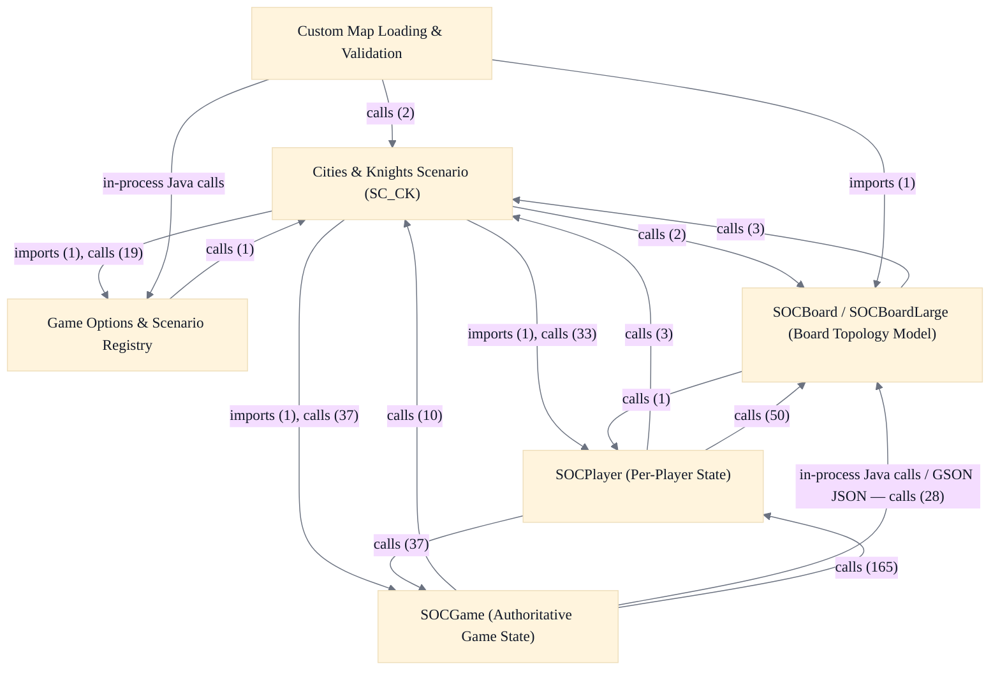

# Game Model & Rules Engine

## Strategic Context
- **Authoritative-server, partial-client split** — Per doc/Readme.developer.md, complete game state is deliberately held at the server in SOCGame while clients hold only partial state (other players' resources and dev-card types may be unknown) — this keeps the server the single source of truth and lets non-Java clients/bots interoperate by mirroring deltas rather than computing authoritative state.
- **Rules-as-data extensibility** — Game rules, house rules, and scenarios are modeled as a convention-driven SOCGameOption/SOCScenario data registry keyed by short name strings rather than as code branches, so new rules and scenarios are added as catalog entries with keyname-encoded semantics — the central extensibility mechanism the epic is built around.
- **Ship-inactive scenario groundwork** — Cities & Knights ships as inactive-hidden `_SC_CK` + `_CK_*` groundwork inside the mainline model rather than on a separate feature branch, letting incomplete scenario rules live in the shipped code while staying inert in normal play until explicitly activated.

## Overview
Core Game State & Board Model: SOCGame is the single authoritative holder of complete game state at the server; logic advances there and the server pushes deltas (SOCGameState, SOCSetPlayedDevCard, etc.) so each client's local SOCGame carries only partial state. A SOCGame owns one SOCBoard built via SOCBoard.BoardFactory.createBoard with game options driving construction; the board holds no back-reference to game or players, the sea board is a separate SOCBoardLarge subclass, thread-safety is an explicit monitor, and game state is modeled as documented integer constants. Game Options & Scenarios: Rules, house rules, and scenarios are expressed as data, not branching code — SOCGameOptionSet.getAllKnownOptions() builds the authoritative SOCGameOption catalog and SOCScenario.initAllScenarios() the scenario catalog, each scenario carrying an scOpts string that decomposes into option key/value pairs. Option semantics are encoded in the keyname (`_SC_`, leading-underscore internal, `_3` third-party, `_EXT_` reserved); both options and scenarios extend SOCVersionedItem for client/server version negotiation, and an optFlags bitfield gives graduated drop/visibility/compat semantics. Cities & Knights Scenario (SC_CK): Decomposed into the `_SC_CK` scenario flag plus five `_CK_*` capability options registered through getAllKnownOptions(), shipped inactive-hidden so normal play never selects them and the rules stay inert until activated. City-improvement and knight tracks are modeled as SOCSpecialItem instances (not new SOCMessage types), the three commodities are held outside SOCResourceSet and charged in playerPickItem, multi-item special-item typeKeys compose as optionName + "/" + shortKey, and all authoritative C&K state lives in SOCGame at the server. Custom Map Loading & Validation: At server startup (after SOCServer verifies GSON on the classpath), loadAndRegisterAll scans jsettlers.custommaps.dir for *.map.json; loadAndRegisterOne reads UTF-8, GSON-deserializes a CustomMapJson, and derives an 8-char SC_X scenario key from the filename. CustomMapValidator.validateAndParse converts the raw DTO into a ParsedCustomMap of parallel integer arrays (validating hex types, dice numbers, land areas) shaped to the makeNewBoard_placeHexes contract. Validation/parsing is split from I/O and registration, a bad map file never aborts startup, and maps register as SOCScenarios under the reserved SC_X prefix rather than introducing a new board type.

## Components
- **SOCGame (Authoritative Game State)**: Single source of truth for a game in progress: advances game state, validates and applies player actions, and produces the deltas the server pushes to clients. Composes SOCPlayer and SOCBoard rather than letting them reference back up to it.
- **SOCPlayer (Per-Player State)**: Models an individual player's holdings and legal-placement bookkeeping within a single game; mutated by SOCGame as actions are applied and queried when computing legal moves and victory points.
- **SOCBoard / SOCBoardLarge (Board Topology Model)**: Provides authoritative board geometry and layout queries consumed by SOCGame and SOCPlayer; constructed through SOCBoard.BoardFactory.createBoard with game options driving which layout is built.
- **Game Options & Scenario Registry**: Defines which rules and scenarios exist and how they decompose into option key/value pairs (scOpts strings); drives board construction and rule gating without branching code. Queried by the server during game creation and version negotiation.
- **Cities & Knights Scenario (SC_CK)**: Encodes C&K rules (commodities, improvement tracks, knights, barbarians, metropolis) as data + special items within SOCGame, gated entirely on the `_CK_*`/`_SC_CK` options so the rules stay inert until activated.
- **Custom Map Loading & Validation**: Reads, GSON-deserializes, validates (structure/safety, not playability), and registers custom maps as SOCScenarios without ever aborting server startup on a bad file.

## Boundaries
- **SOCGame (Authoritative Game State)** boundary: Owns the complete, authoritative game state and turn/state-machine logic at the server; clients hold only a partial mirror. Holds the player roster, current-player and game-state integer constants, the dice/robber lifecycle, and (when activated) Cities & Knights state. Owns exactly one SOCBoard per game.
- **SOCPlayer (Per-Player State)** boundary: Owns one player's seat-scoped state — resources, pieces, inventory/dev cards, settlement and road placements, and per-player scenario counters. Reads board geometry via SOCBoard/SOCBoardLarge; does not own board topology.
- **SOCBoard / SOCBoardLarge (Board Topology Model)** boundary: Owns the hex/edge/node coordinate system and board layout (hex types, dice numbers, ports, land areas). SOCBoardLarge is a distinct subclass carrying the sea board and every scenario layout rather than parameterizing SOCBoard. Holds no back-reference to its owning game or players.
- **Game Options & Scenario Registry** boundary: Owns the convention-driven data catalog of rules, house rules, and scenarios: SOCGameOption (one rule/flag) registered via SOCGameOptionSet.getAllKnownOptions(), and SOCScenario.initAllScenarios() building the scenario catalog. Keyname conventions (`_SC_` scenario, leading-underscore internal, `_3` third-party, `_EXT_` reserved) encode semantics; both extend the shared SOCVersionedItem base for client/server version negotiation.
- **Cities & Knights Scenario (SC_CK)** boundary: Owns the shipped-but-inactive Cities & Knights groundwork: the `_SC_CK` scenario flag plus five `_CK_*` capability options, with city-improvement and knight tracks modeled as SOCSpecialItem instances and the three commodities held outside SOCResourceSet. Registered inactive-hidden so normal play never selects it.
- **Custom Map Loading & Validation** boundary: Owns server-side ingestion of user-defined board layouts: CustomMapLoader scans `jsettlers.custommaps.dir` for `*.map.json` and registers each under the reserved `SC_X` scenario prefix; CustomMapValidator converts the raw GSON DTO into a ParsedCustomMap of parallel integer arrays shaped to the makeNewBoard_placeHexes contract. Lives in soc.server, integrating with this epic's scenario registry.

## Integration Points
- **Server game logic drives the game model**: SOCGameMessageHandler and SOCGameHandler translate in-game player-action messages into calls on SOCGame and SOCPlayer, then broadcast resulting state deltas. This is the primary inbound edge into the game model from the server runtime. — see [Server & Message Protocol](../server-message-protocol/server-message-protocol.arch.md)
- **Server queries the option/scenario registry at game creation**: SOCServer consults SOCGameOptionSet to validate and resolve game options when creating games and negotiating client/server versions; custom-map registration also feeds new SOCScenarios into this catalog. — see [Server & Message Protocol](../server-message-protocol/server-message-protocol.arch.md)
- **Clients and robots mirror partial game state**: The desktop client (SOCBoardPanel, SOCPlayerInterface, MessageHandler), the displayless base client, and robot brains each hold a local SOCGame/SOCPlayer mirror updated from server deltas; they read the model to render and to make decisions but are not authoritative. — see [Desktop Swing Client](../desktop-swing-client/desktop-swing-client.arch.md)
- **Custom-map ingestion registers into the scenario registry**: CustomMapLoader (in soc.server) registers validated ParsedCustomMap layouts as SOCScenarios under the reserved SC_X prefix, extending this epic's scenario catalog at server startup.
- **Saved-game persistence reads/writes the game model**: SavedGameModel maps SOCGame/SOCPlayer state to and from a JSON snapshot for the *SAVEGAME*/*LOADGAME* debug feature, reading authoritative state and reconstructing it on load. — see [Server & Message Protocol](../server-message-protocol/server-message-protocol.arch.md)

## Diagrams
### Architecture

## Source Linkage
- [SOCGame (authoritative game state)](../../../src/main/java/soc/game/SOCGame.java::SOCGame)
- [SOCPlayer (per-player state)](../../../src/main/java/soc/game/SOCPlayer.java::SOCPlayer)
- [SOCBoard topology model](../../../src/main/java/soc/game/SOCBoard.java::SOCBoard)
- [SOCBoardLarge (sea board / scenario board)](../../../src/main/java/soc/game/SOCBoardLarge.java::SOCBoardLarge)
- [Game options registry](../../../src/main/java/soc/game/SOCGameOptionSet.java::SOCGameOptionSet.getAllKnownOptions)
- [SOCGameOption](../../../src/main/java/soc/game/SOCGameOption.java::SOCGameOption)
- [Custom map loader](../../../src/main/java/soc/server/CustomMapLoader.java::CustomMapLoader)
- [Cities & Knights tests exercising SC_CK](../../../src/test/java/soctest/game/TestCitiesAndKnights.java)

Parent scope: [_scope.md](_scope.md)

## Source Linkage Grounding

_Per-row confidence; `_unverified_` rows are disclosed, not verified; `0.08 (resolved, uncited)` is the resolved-but-uncited baseline, not measured evidence._

| Element | Doc Evidence | Code Evidence | Confidence |
|---------|--------------|---------------|-----------:|
| Source Linkage: SOCGame (authoritative game state) |  | src/main/java/soc/game/SOCGame.java:1637-1732 | 0.95 |
| Source Linkage: SOCPlayer (per-player state) |  | src/main/java/soc/game/SOCPlayer.java:944-1027 | 0.83 |
| Source Linkage: SOCBoard topology model |  | src/main/java/soc/game/SOCBoard.java:753-786 | 0.83 |
| Source Linkage: SOCBoardLarge (sea board / scenario board) |  | src/main/java/soc/game/SOCBoardLarge.java:686-724 | 0.83 |
| Source Linkage: Game options registry |  | src/main/java/soc/game/SOCGameOptionSet.java:546-910 | 0.83 |
| Source Linkage: SOCGameOption |  | src/main/java/soc/game/SOCGameOption.java:976-985 | 0.83 |
| Source Linkage: Custom map loader |  | src/main/java/soc/server/CustomMapLoader.java:59-519 | 0.83 |
| Source Linkage: Cities & Knights tests exercising SC_CK |  | src/test/java/soctest/game/TestCitiesAndKnights.java | 0.75 |

Related scopes: [Desktop Swing Client](../desktop-swing-client/desktop-swing-client.arch.md), [Optional Database](../optional-database/optional-database.arch.md), [Quality Infrastructure](../quality-infrastructure/quality-infrastructure.arch.md), [Robot / AI Players](../robot-ai-players/robot-ai-players.arch.md), [Server & Message Protocol](../server-message-protocol/server-message-protocol.arch.md)
