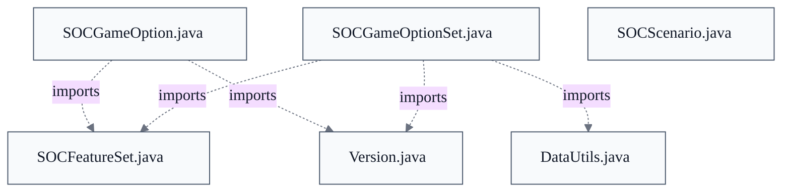

# Game Options & Scenarios

## Overview
Game rules, house rules, and scenarios are expressed as data rather than branching code: SOCGameOptionSet.getAllKnownOptions() builds the authoritative catalog of SOCGameOption objects, and SOCScenario.initAllScenarios() builds the catalog of scenarios, each carrying a scOpts string (e.g. "_SC_PIRI=t,SBL=t,VP=t10,_SC_0RVP=t") that decomposes into option key/value pairs. Repository evidence: `src/main/java/soc/game/SOCVersionedItem.java`. At game creation the chosen scenario's scOpts are parsed into a SOCGameOption set, then adjustOptionsToKnown normalizes them against Known Options — applying server pre-adjustment, dropping unset options flagged FLAG_DROP_IF_UNUSED/FLAG_DROP_IF_PARENT_UNUSED, and packing the surviving set to a wire string. In-game code never branches on a scenario's name; it queries the resulting option keys, keeping scenarios purely a bundle of options over the shared board model.

## Components
- **SOCGameOption**
- **SOCGameOptionSet**
- **SOCScenario**

## Connections
- **SOCScenario** (bidirectional) — via scOpts strings reference SOCGameOption keys (e.g. _SC_PIRI=t,SBL=t,VP=t10); SOCGameOptionSet defines K_SC_* keys cross-linked in SOCScenario javadoc (evidence: src/main/java/soc/game/SOCScenario.java initAllScenarios scOpts; SOCGameOptionSet.java K_SC_PIRI/K_SC_WOND constants)
- **SOCVersionedItem** (outbound) — via class extension: SOCGameOption and SOCScenario both extend SOCVersionedItem for minVersion/lastModVersion/isKnown and isAlphanumericUpcaseAscii (evidence: src/main/java/soc/game/SOCGameOption.java class decl; src/main/java/soc/game/SOCScenario.java class decl)
- **SOCFeatureSet** (outbound) — via import soc.util.SOCFeatureSet; options gate on client features (CLIENT_SEA_BOARD auto-set for _SC_ options) and adjustOptionsToKnown takes a SOCFeatureSet (evidence: src/main/java/soc/game/SOCGameOption.java imports soc.util.SOCFeatureSet; SOCGameOptionSet.optionsNotSupported(SOCFeatureSet))
- **SOCMessage** (outbound) — via import soc.message.SOCMessage; isSingleLineAndSafe value validation and packing options to wire strings for network negotiation (evidence: src/main/java/soc/game/SOCGameOption.java imports soc.message.SOCMessage; SOCScenario.java imports soc.message.SOCMessage)
- **SOCServer** (inbound) — via import soc.server.SOCServer (javadocs); server startup activates inactive options and is authoritative for known-option negotiation (evidence: src/main/java/soc/game/SOCGameOptionSet.java imports soc.server.SOCServer and soc.server.savegame.SavedGameModel for javadocs)

## Design Decisions
- **Represent rules/scenarios as a convention-driven data registry keyed by short name strings, not as code branches**: getAllKnownOptions() and initAllScenarios() centralize every rule toggle as a SOCGameOption/SOCScenario object queried by key. The class javadoc states all in-game code uses key strings to query and change settings, and that within SOCGame game-behavior changes are based only on the SOCGameOptions implementing a scenario, never on the scenario name. This makes options/scenarios the system's central extensibility point: a new rule is a new catalog entry plus key, not edits scattered across game logic.
- **Encode option semantics in the keyname itself (_SC_ scenario flags, leading-underscore internal, _3 third-party, _EXT_ reserved)**: Names starting with _SC_ auto-receive CLIENT_SEA_BOARD client feature in the constructor; leading-underscore names mark server-set internal options hidden from the New Game UI; '3' as the second char is reserved for third-party opts to avoid collision with built-ins; _EXT_BOT/_EXT_CLI/_EXT_GAM are pre-reserved passthrough channels. Encoding intent in the key lets the constructor and sync machinery infer behavior without a separate metadata table.
- **Extend a shared SOCVersionedItem base for both options and scenarios to drive client/server version negotiation**: Both carry minVersion/lastModVersion so the authoritative server can withhold, downgrade, or trim items a client is too old to understand. The class javadoc establishes the server-authoritative rule: if the client is newer it defers to the server's older known set. Sharing the base means options and scenarios negotiate identically (VERSION_FOR_SCENARIOS mirrors the option flow), avoiding two parallel negotiation protocols.
- **Use an optFlags bitfield with graduated drop/visibility/compat semantics instead of boolean fields**: Flags like FLAG_DROP_IF_UNUSED (omit default-valued opts from the wire to cut overhead), FLAG_INACTIVE_HIDDEN/FLAG_ACTIVATED (hide developer options until server startup activation), FLAG_3RD_PARTY (forward/backward compat for fork-defined opts), and FLAG_OPPORTUNISTIC (set for new-enough clients but gracefully removed rather than blocking older clients) express orthogonal lifecycle concerns compactly and let new compat strategies be added as new bits without widening the class.
- **Ship Cities & Knights as inactive-hidden _CK_* option groundwork plus a disabled _SC_CK scenario stub**: The _CK_KNI/_CK_IMP/_CK_PROG/_CK_BARB/_CK_METR options are registered with FLAG_INACTIVE_HIDDEN | FLAG_DROP_IF_UNUSED and the SC_CK scenario references them, so the scenario cannot be selected in normal play until activated at server startup. This reserves the keyname space and lands the negotiation/groundwork incrementally without exposing an unfinished feature, per doc/Cities-and-Knights-Design.md.

## Constraints
- **[HARD]** Option and scenario name keys MUST start with a letter and contain only ASCII uppercase letters and digits (underscore also allowed for options/scenarios per version), enforced in constructors. — src/main/java/soc/game/SOCGameOption.java class javadoc: enforced via SOCVersionedItem.isAlphanumericUpcaseAscii(String); SOCScenario.java constructor calls SOCGameOption.isAlphanumericUpcaseAscii
- **[HARD]** Option string values and enum choices MUST NOT contain unsafe characters or span more than one line; checked in constructors and setters. — src/main/java/soc/game/SOCGameOption.java class javadoc: calls SOCMessage.isSingleLineAndSafe(String) within constructors and setters
- **[HARD]** An option carrying FLAG_OPPORTUNISTIC MUST also carry FLAG_DROP_IF_UNUSED or FLAG_DROP_IF_PARENT_UNUSED so the server can gracefully remove it for older clients at game start. — src/main/java/soc/game/SOCGameOption.java FLAG_OPPORTUNISTIC javadoc: "this option must also have FLAG_DROP_IF_UNUSED or FLAG_DROP_IF_PARENT_UNUSED"
- **[SOFT]** Third-party game options SHOULD use '3' as the second character of their name key to avoid collision with built-in options. — src/main/java/soc/game/SOCGameOption.java FLAG_3RD_PARTY javadoc: "The game option name key should use '3' as the second character"
- **[SOFT]** A scenario's declared minVersion SHOULD be >= the minimum versions of any options it names in scOpts; this is not validated at runtime. — src/main/java/soc/game/SOCScenario.java initAllScenarios javadoc: "be sure the scenario's declared minimum version is >= those options' minimum versions; this won't be validated at runtime"
- **[HARD]** A scenario's name key and minVersion MUST NOT change once shipped; only description, long description, and scOpts may change (with lastModVersion bumped). — src/main/java/soc/game/SOCScenario.java initAllScenarios javadoc: lists key and minVersion under "Things you can't change about a scenario, because inconsistencies would occur"

## Non-Functional Requirements
- **performance** — Options whose value equals their default and carry FLAG_DROP_IF_UNUSED are dropped from game options and not sent over the network, to reduce per-game overhead and message size. — src/main/java/soc/game/SOCGameOption.java FLAG_DROP_IF_UNUSED javadoc; removal in SOCGameOptionSet.adjustOptionsToKnown
- **reliability** — Client/server version mismatches are reconciled rather than failed: newer items are withheld or sent as unknown, enum/int ranges trimmed to the client's max, and feature-unsupported options dropped, so a newer client can still join an older server's games. — src/main/java/soc/game/SOCGameOptionSet.java: optionsNewerThanVersion, optionsForVersion, optionsTrimmedForSupport, optionsNotSupported
- **security** — Option values entering from the wire must pass single-line/safe-character validation before acceptance, preventing malformed or multi-line values from corrupting network message framing. — src/main/java/soc/game/SOCGameOption.java class javadoc: SOCMessage.isSingleLineAndSafe(String) checked in constructors and setters

## Examples
*A scenario is defined declaratively: its scOpts string is the bundle of SOCGameOption key/value pairs that implement its rules, not custom game-logic code.*
*Source: `src/main/java/soc/game/SOCScenario.java:initAllScenarios`*
```
allSc.put(K_SC_PIRI, new SOCScenario
    (K_SC_PIRI, 2000, 2000,
     "Pirate Islands and Fortresses",
     "A pirate fleet patrols...",
     "_SC_PIRI=t,SBL=t,VP=t10,_SC_0RVP=t"));
```

*Compat lifecycle is expressed as an orthogonal optFlags bit, so new negotiation strategies are added without widening the option class.*
*Source: `src/main/java/soc/game/SOCGameOption.java`*
```
public static final int FLAG_OPPORTUNISTIC = 0x80;
```

## Diagrams
### Class

```mermaid
%%{init: {'theme': 'base', 'themeVariables': {'primaryTextColor': '#111827', 'secondaryTextColor': '#111827', 'tertiaryTextColor': '#111827', 'lineColor': '#6b7280', 'fontFamily': 'Inter, ui-sans-serif, system-ui, sans-serif'}}}%%
classDiagram
    class SOCGameOption {
        -SOCGameOption()
        +public static SOCGameOption copyDefaults(SOCGameOption opt)
        -private void copyMiscFields(final SOCGameOption copyFrom)
        +public boolean hasValue()
        +public boolean isSet()
        +public boolean getBoolValue()
        +public void setBoolValue(boolean v)
        +public int getIntValue()
        +public void setIntValue(int v)
        +public String getStringValue()
        +setStringValue()
        +public String getClientFeature()
        +public void setClientFeature(final String clientFeat)
        +getMinVersion()
        +getMaxEnumValueForVersion()
        +getMaxIntValueForVersion()
        +packKnownOptionsToString()
        +packOptionsToString()
        +public void packValue(StringBuilder sb)
        +parseOptionsToMap()
        +parseOptionsToSet()
        +parseOptionNameValue()
        +trimEnumForVersion()
        +public SOCGameOption forClientVersion(final int clientVers)
        +getGroupParentKey()
        +public static String optionTypeName(final int optType)
        +getAndClearRefreshList()
        +public void refreshDisplay()
        +public final boolean hasFlag(final int flagMask)
        +public void addChangeListener(ChangeListener cl)
        +public boolean hasChangeListener()
        +public ChangeListener getChangeListener()
        +public String toString()
        +public final StringBuilder getPackedValue()
        +public int compareTo(Object other)
        +public boolean equals(final Object other)
        -clone()
    }
    class SOCGameOptionSet {
        +SOCGameOptionSet()
        +public static SOCGameOptionSet getAllKnownOptions()
        +public int size()
        +public boolean isEmpty()
        +contains()
        +public boolean containsKey(final String optKey)
        +public boolean add(final SOCGameOption opt)
        +public SOCGameOption put(final SOCGameOption opt)
        +public SOCGameOption get(final String optKey)
        +public Map<String, SOCGameOption> getAll()
        +public Collection<SOCGameOption> values()
        +public Set<String> keySet()
        +public Iterator<SOCGameOption> iterator()
        +public SOCGameOption remove(final String optKey)
        +public void clear()
        +public boolean isOptionSet(final String optKey)
        +setBoolOption()
        +setIntOption()
        +getOptionIntValue()
        +public String getOptionStringValue(final String optKey)
        +getKnownOption()
        +public boolean addKnownOption(final SOCGameOption onew)
        +activate()
        +setKnownOptionCurrentValue()
        +optionsNewerThanVersion()
        +optionsForVersion()
        -implOptionsVersionCheck()
        +adjustOptionsToKnown()
        +removeOpportunisticIfOlderClients()
        +optionsNotSupported()
        +optionsTrimmedForSupport()
        +optionsWithFlag()
        +@Override
    public String toString()
    }
    class SOCScenario {
        -private static Map<String, SOCScenario> initAllScenarios()
        -findAllScenariosGreatestMinVersion()
        -SOCScenario()
        +getAllKnownScenarios()
        +public static Set<String> getAllKnownScenarioKeynames()
        +public static boolean addKnownScenario(SOCScenario scNew)
        +removeUnknownScenario()
        +registerCustomScenario()
        +cloneScenarios()
        +public static SOCScenario getScenario(String key)
        +public static String packKnownScenariosToString()
        +packScenariosToString()
        +parseScenariosToMap()
        +adjustScenariosToKnown()
        +addScenario()
        +public String getLongDesc()
        +setDesc()
        +@Override
    public String toString()
        +public int compareTo(Object other)
        +@Override
    public boolean equals(final Object other)
        +@Override
    public int hashCode()
    }
    class RemoveOpportunisticResults {
        +RemoveOpportunisticResults()
    }
    class ChangeListener {
        <<interface>>
    }

```



### Dependency



## Source Linkage
- [Known Options registry and rule driver](../../../src/main/java/soc/game/SOCGameOptionSet.java::getAllKnownOptions)
- [Per-game and Known-Option model](../../../src/main/java/soc/game/SOCGameOption.java::SOCGameOption)
- [Scenario definitions on the large sea board](../../../src/main/java/soc/game/SOCScenario.java::SOCScenario)
- [Versioned-item base for options and scenarios](../../../src/main/java/soc/game/SOCScenario.java::SOCScenario)
- optFlags compat/visibility bitfield vocabulary
- Cities & Knights inactive-hidden groundwork keys
- [Scenario-to-option expansion via scOpts](../../../src/main/java/soc/game/SOCScenario.java::initAllScenarios)

Parent scope: [_scope.md](_scope.md)
Sibling feature: [game-options-scenarios.feature.md](game-options-scenarios.feature.md)
Scope architecture: [game-model-rules-engine.arch.md](game-model-rules-engine.arch.md)

## Source Linkage Grounding

_Per-row confidence; `_unverified_` rows are disclosed, not verified; `0.08 (resolved, uncited)` is the resolved-but-uncited baseline, not measured evidence._

| Element | Doc Evidence | Code Evidence | Confidence |
|---------|--------------|---------------|-----------:|
| Source Linkage: Known Options registry and rule driver |  | src/main/java/soc/game/SOCGameOptionSet.java:546-910 | 0.83 |
| Source Linkage: Per-game and Known-Option model |  | src/main/java/soc/game/SOCGameOption.java:976-985 | 0.83 |
| Source Linkage: Scenario definitions on the large sea board |  | src/main/java/soc/game/SOCScenario.java:545-575 | 0.75 |
| Source Linkage: Scenario-to-option expansion via scOpts |  | src/main/java/soc/game/SOCScenario.java:184-295 | 0.75 |

Related scopes: [Desktop Swing Client](../desktop-swing-client/desktop-swing-client.arch.md), [Robot / AI Players](../robot-ai-players/robot-ai-players.arch.md), [Server & Message Protocol](../server-message-protocol/server-message-protocol.arch.md)
