# Editor launch and file-pair selection

## Strategic Context
- **Standalone i18n tooling separate from the game** — Per CLAUDE.md, net.nand.util.PTE i18n tooling, built separately via `gradle i18neditorJar` and excluded from the shipped game JARs — so the editor's launch path is intentionally independent of SOCServer/SOCPlayerClient lifecycle and ships as its own artifact.
- **Safe editing of ISO-8859-1 .properties bundles** — Per CLAUDE.md, Java .properties files use ISO-8859-1 and out-of-range characters must be \uXXXX-escaped; the PTE editor exists so translators edit bundles through tooling that respects that encoding rather than hand-editing and risking string corruption.

## Overview
PTEMain is the process entry point for the Properties Translator Editor, the standalone Swing tool used to translate the project's `.properties` resource bundles. On launch it presents a small chooser window from which a translator drives one of three file-pair selection paths before any editing begins. The first path opens an existing destination+source pair the user browses to directly. The second path accepts a single 'destination' `.properties` file and derives its matching 'source' (base-language) file automatically from the filename convention, so a translator need only point at the localized bundle. The third path creates a brand-new destination file from an existing source, with NewDestSrcDialog recomputing the proposed destination filename live as the base name and target language are entered. Once a pair is resolved by any path, PTEMain hands off to PropertiesTranslatorEditor — the editor window owned by a sibling feature — which loads the bundle pair for side-by-side editing. PTEMain also persists the last-edited directory as a user preference so repeat sessions reopen near the translator's previous working location, and guards application exit through unsaved-change checks routed back into the open editor.

## Components
- **PTEMain**
- **NewDestSrcDialog**
- **OpenDestSrcDialog**
- **PropertiesTranslatorEditor**

## Connections
- **PropertiesTranslatorEditor** (outbound) — via PTEMain constructs and opens the editor window once a destination+source pair is resolved (src/main/java/net/nand/util/i18n/gui/PropertiesTranslatorEditor.java) (evidence: PTEMain.openPropsEditor / clickedOpenDestSrc (src/main/java/net/nand/util/i18n/gui/PTEMain.java))

## Design Decisions
- **Separate launcher (PTEMain) from editor window (PropertiesTranslatorEditor)**: The entry point, file-pair chooser, and cross-session preferences are concerns distinct from the table-editing UI. Splitting them lets PTEMain own process lifecycle and selection while the editor owns the loaded bundle pair, and lets the editor also be launched directly when a pair is already known (PropertiesTranslatorEditor has its own main()).
- **Derive the 'source' file from a single chosen 'destination' filename**: Translation bundles follow a base-name + language-suffix naming convention, so the base-language source is recoverable from the localized filename. Offering single-file selection removes a redundant second browse step in the common case where the translator only has the localized file in hand.
- **Live recomputation of the derived destination name in NewDestSrcDialog**: Creating a new translation file is error-prone if the filename must be typed by hand to match the bundle convention. Recalculating the destination name from the chosen source and language as the user edits keeps the new file consistent with the naming scheme without manual string assembly.
- **Persist 'last edited dir' as a per-user preference**: Translators work repeatedly within the same resource directory; storing and restoring the last directory avoids re-navigating the tree each session. Implemented via the dedicated tryGetPrefLastEditedDir / trySetPrefLastEditedDir helpers rather than ad-hoc state.

## Non-Functional Requirements
- **reliability** — Application exit and window-close are gated by unsaved-change checks so in-progress translations are not lost; PTEMain routes closing events through checkUnsaved/askUnsaved into the open editor. — PTEMain.checkUnsaved / askUnsaved / windowClosing (src/main/java/net/nand/util/i18n/gui/PTEMain.java)
- **error-handling** — Per-user 'last edited dir' preference access is isolated in try-prefixed helpers so missing or unreadable preferences degrade gracefully rather than blocking launch. — PTEMain.tryGetPrefLastEditedDir / trySetPrefLastEditedDir (src/main/java/net/nand/util/i18n/gui/PTEMain.java)

## Diagrams
### Class

```mermaid
%%{init: {'theme': 'base', 'themeVariables': {'primaryTextColor': '#111827', 'secondaryTextColor': '#111827', 'tertiaryTextColor': '#111827', 'lineColor': '#6b7280', 'fontFamily': 'Inter, ui-sans-serif, system-ui, sans-serif'}}}%%
classDiagram
    class RequestFocusListener {
        +public void ancestorAdded(final AncestorEvent e)
        +public void ancestorMoved(AncestorEvent e)
        +public void ancestorRemoved(AncestorEvent e)
    }
    class PTEMain {
        +tryEditFromDestOnly()
        +public static void main(String[] args)
        -static void showAbout(final JFrame parent)
        +public PTEMain()
        +public void initAndShow()
        +openPropsEditor()
        -private void tryGetPrefLastEditedDir()
        -private void trySetPrefLastEditedDir()
        -addBtn()
        -addToGrid()
        +public void actionPerformed(ActionEvent e)
        -private final void clickedNewDest()
        -private final void clickedOpenDestSrc()
        -chooseFile()
        -checkUnsaved()
        -askUnsaved()
        +public void windowClosing(WindowEvent e)
        +public void windowActivated(WindowEvent e)
        +public void windowClosed(WindowEvent e)
        +public void windowDeactivated(WindowEvent e)
        +public void windowDeiconified(WindowEvent e)
        +public void windowIconified(WindowEvent e)
        +public void windowOpened(WindowEvent e)
    }
    class NewDestSrcDialog {
        +public NewDestSrcDialog(final File src)
        +public void actionPerformed(final ActionEvent ae)
        -private void recalcDestName()
        -private void doDocEvent(DocumentEvent e)
        +public void insertUpdate(DocumentEvent e)
        +public void changedUpdate(DocumentEvent e)
        +public void removeUpdate(DocumentEvent e)
    }
    class PropertiesTranslatorEditor {
        +PropertiesTranslatorEditor()
        +public void setDestIsNew(List<String> comments)
        +@SuppressWarnings("serial")
    public void init()
        +public void actionPerformed(final ActionEvent ae)
        +public void doSearchHotkey()
        -updateSaveButtonsForEditing()
        -insertRow()
        +public boolean hasUnsavedChanges()
        +public void saveChangesToAny()
        +public void saveChangesToDest()
        +public void saveChangesToSrc()
        +public boolean checkUnsavedBeforeDispose()
        +makeParentFilename()
        +findBaseAndLangInFilename()
        +doMouseEvent()
        +public void mousePressed(MouseEvent e)
        +public void mouseReleased(MouseEvent e)
        +public void mouseClicked(MouseEvent e)
        +public void mouseEntered(MouseEvent e)
        +public void mouseExited(MouseEvent e)
        -private static void runUnitTests()
        -static void initStringManager()
        +main()
    }
    class OpenDestSrcDialog {
        -OpenDestSrcDialog()
        +public void actionPerformed(final ActionEvent ae)
        -private boolean chooseSrcOther()
    }
    class CellEditorMouseListener {
        +public void mouseReleased(MouseEvent e)
        -showCellEditDialog()
    }
    class PTCellRenderer {
        +public PTCellRenderer(PTSwingTableModel modelData)
        +getTableCellRendererComponent()
    }
    class PTSwingTableModel {
        +public PTSwingTableModel()
        +public void endSearch()
        +public boolean search(String txt, final boolean forward)
        +public final int getRowCount()
        +public final int getColumnCount()
        +getValueAt()
        +setValueAt()
        +public String getColumnName(final int col)
        +public String getPTEColumnToolTip(final int col)
        +public boolean isCellEditable(final int r, final int c)
        +public boolean isRowComment(final int r)
        +public CellStatus getCellStatus(final int r, final int c)
    }
    class SearchPanel {
        +public SearchPanel()
        +public void hideAndEndSearch()
        +public void showAndFocus()
        -private void search(final boolean forward)
        +public void actionPerformed(final ActionEvent ae)
    }

```

## Source Linkage
- [PTEMain entry point and chooser window](../../../src/main/java/net/nand/util/i18n/gui/PTEMain.java::PTEMain)
- [main() process entry](../../../src/main/java/net/nand/util/i18n/gui/PTEMain.java::main)
- [Open existing destination+source pair](../../../src/main/java/net/nand/util/i18n/gui/PTEMain.java::OpenDestSrcDialog)
- [Single-destination selection with auto-derived source file](../../../src/main/java/net/nand/util/i18n/gui/PTEMain.java::clickedOpenDestSrc)
- [Create new destination file with live-recomputed name](../../../src/main/java/net/nand/util/i18n/gui/PTEMain.java::NewDestSrcDialog)
- [Per-user last-edited-dir preference persistence](../../../src/main/java/net/nand/util/i18n/gui/PTEMain.java::tryGetPrefLastEditedDir)
- [Open the resolved file pair in the editor](../../../src/main/java/net/nand/util/i18n/gui/PTEMain.java::openPropsEditor)

Parent scope: [_scope.md](_scope.md)
Sibling feature: [editor-launch-and-file-pair-selection.feature.md](editor-launch-and-file-pair-selection.feature.md)
Scope architecture: [i18n-translation-tooling.arch.md](i18n-translation-tooling.arch.md)

## Source Linkage Grounding

_Per-row confidence; `_unverified_` rows are disclosed, not verified; `0.08 (resolved, uncited)` is the resolved-but-uncited baseline, not measured evidence._

| Element | Doc Evidence | Code Evidence | Confidence |
|---------|--------------|---------------|-----------:|
| Source Linkage: PTEMain entry point and chooser window |  | src/main/java/net/nand/util/i18n/gui/PTEMain.java:248-281 | 0.75 |
| Source Linkage: main() process entry |  | src/main/java/net/nand/util/i18n/gui/PTEMain.java:173-191 | 0.75 |
| Source Linkage: Open existing destination+source pair |  | src/main/java/net/nand/util/i18n/gui/PTEMain.java:990-1097 | 0.75 |
| Source Linkage: Single-destination selection with auto-derived source file |  | src/main/java/net/nand/util/i18n/gui/PTEMain.java:476-512 | 0.75 |
| Source Linkage: Create new destination file with live-recomputed name |  | src/main/java/net/nand/util/i18n/gui/PTEMain.java:667-766 | 0.75 |
| Source Linkage: Per-user last-edited-dir preference persistence |  | src/main/java/net/nand/util/i18n/gui/PTEMain.java:329-349 | 0.75 |
| Source Linkage: Open the resolved file pair in the editor |  | src/main/java/net/nand/util/i18n/gui/PTEMain.java:304-321 | 0.75 |
