# ISO-8859-1 encoding with Unicode escapes

## Overview
A translator opens a source/destination `.properties` PTE. `PropsFileParser.parseOneFile` reads each file from disk, decoding `\uXXXX` sequences back to live characters via `unescapeUnicodes`, and produces ordered `FileEntry` rows (comment blocks and key/value lines) that `ParsedPropsFilePair` aligns into a source-vs-destination grid for the editor table. The translator edits values as ordinary in-memory Java strings — no manual encoding bookkeeping. On save, `PropsFileWriter` walks the rows and re-serializes them: `escValue`/`appendEsc` test each character with `isValidHighISO8859_1` and emit any character outside the writable ISO-8859-1 range as a `\uXXXX` escape, so the on-disk file is always valid for a Java `ResourceBundle` regardless of the translator's editor encoding. This read-decode / edit / encode-write loop is the core round-trip; `PropsFilePseudoLocalizer` drives the same path programmatically to produce pseudo-locale files.

## Components
- **PropsFileWriter**: Serializes translation key/value pairs back to a Java `.properties` file in ISO-8859-1, escaping out-of-range characters as `\uXXXX`. Owns the write half of the round-trip: `escValue`, `appendEsc`, `isValidHighISO8859_1`, and `writeOne`/`write`/`flush`/`close`.
- **PropsFileParser**: Reads a `.properties` file, parsing it into `FileEntry` rows (comment lines and key/value lines) and reversing the `\uXXXX` escapes via `unescapeUnicodes`; also detects duplicate keys with `findDuplicateKeys`. Owns the read half of the round-trip.
- **ParsedPropsFilePair**: Holds a source/destination `.properties` pair as aligned `FileEntry` rows, mediating parse (`parseSrc`/`parseDest`) and edit operations (`insertRow`, `convertInsertedRows`, dest-only key tracking) consumed by the editor UI.
- **FileEntry / FileKeyEntry / FileCommentEntry / KeyPairLine** (referenced; defined externally): Row model for a parsed `.properties` file: `FileKeyEntry` (a key + its value and surrounding comment), `FileCommentEntry` (a standalone comment block), and `KeyPairLine` carry the in-memory representation between parser and writer.
- **PropsFilePseudoLocalizer**: Generates a pseudo-localized `.properties` file from a base file (`makePseudoPropFilename`, `pseudoLocalizeFile`) — exercises the parse/escape/write path for test/QA without a human translator.

## Connections
- **PropertiesTranslatorEditor (PTE) UI** (inbound) — via ParsedPropsFilePair consumed by PTEMain editor table (evidence: src/main/java/net/nand/util/i18n/gui/PTEMain.java)
- **Java ResourceBundle / StringManager** (outbound) — via Serialized `.properties` files loaded at runtime for i18n string lookup (evidence:  StringManager.get)

## Design Decisions
- **Round-trip the escape layer in code (parser unescapes on read, writer re-escapes on write) rather than trusting the editor's file encoding**: Java `ResourceBundle` requires `.properties` in ISO-8859-1 with `\uXXXX` for out-of-range characters; hand-editing in a UTF-8 editor silently corrupts strings. Centralizing decode in `PropsFileParser.unescapeUnicodes` and encode in `PropsFileWriter.escValue`/`appendEsc` lets the translator work with natural characters in memory while the persisted form is guaranteed valid.
- **Split read and write into separate single-responsibility classes (`PropsFileParser` vs `PropsFileWriter`) with a neutral row model (`FileEntry` subtypes) between them**: The parsed row model preserves comments and key ordering, so a save reproduces file structure rather than just a flattened key/value map. Keeping the writer independent lets `PropsFilePseudoLocalizer` reuse the encode path without going through the interactive editor.
- **Detect duplicate keys at parse time (`findDuplicateKeys`) and expose dest-only keys via `ParsedPropsFilePair`**: A translation file pair can drift (keys present in one file but not the other, or accidental duplicates); surfacing these to the editor prevents silently writing an ambiguous or lossy `.properties` file.

## Constraints
- **[HARD]** Characters outside the writable ISO-8859-1 range MUST be emitted as `\uXXXX` escapes when serializing a `.properties` file. — src/main/java/net/nand/util/i18n/PropsFileWriter.java::isValidHighISO8859_1 / escValue / appendEsc
- **[SOFT]** Java `.properties` files SHOULD be authored/saved through the PTE tooling rather than hand-edited in a UTF-8 editor, to avoid corrupting out-of-range characters. — CLAUDE.md i18n conventions; net.nand.util.i18n round-trip

## Non-Functional Requirements
- **reliability** — Save output must remain a valid ISO-8859-1 `.properties` file consumable by Java `ResourceBundle` independent of the translator's editor encoding, via programmatic Unicode escaping on write. — src/main/java/net/nand/util/i18n/PropsFileWriter.java::escValue / appendEsc / isValidHighISO8859_1

## Diagrams
### Class

```mermaid
%%{init: {'theme': 'base', 'themeVariables': {'primaryTextColor': '#111827', 'secondaryTextColor': '#111827', 'tertiaryTextColor': '#111827', 'lineColor': '#6b7280', 'fontFamily': 'Inter, ui-sans-serif, system-ui, sans-serif'}}}%%
classDiagram
    class StringManager {
        +StringManager()
        +parseLocale()
        +get()
    }
    class FileCommentEntry {
        +FileCommentEntry()
        +public final String toString()
    }
    class FileKeyEntry {
        +public FileKeyEntry(final List<String> srcComment)
        +public final String toString()
    }
    class FileEntry {
    }
    class KeyPairLine {
        +public KeyPairLine(final List<String> comment)
        +public final String toString()
    }
    class PropsFileParser {
        +parseOneFile()
        +findDuplicateKeys()
        -private static String unescapeUnicodes(String valStr)
    }
    class PropsFileWriter {
        +isValidHighISO8859_1()
        +appendEsc()
        +public static final String escValue(final String val)
        +writeOne()
        +PropsFileWriter()
        +public void flush()
        +public void close()
        +write()
    }
    class RequestFocusListener {
        +public void ancestorAdded(final AncestorEvent e)
        +public void ancestorMoved(AncestorEvent e)
        +public void ancestorRemoved(AncestorEvent e)
    }
    class ParsedPropsFilePair {
        +public ParsedPropsFilePair(final File src, final File dest)
        +public int size()
        +public Iterator<FileEntry> getContents()
        +extractContentsHalf()
        +getRow()
        +public boolean isKeyDestOnly(final String key)
        +public int getDestOnlySize()
        +public Iterator<PropsFileParser.KeyPairLine> getDestOnly()
        +public Map<String, String> getSrcDupeKeys()
        +public Map<String, String> getDestDupeKeys()
        +parseSrc()
        +setDestIsNew()
        +parseDest()
        -buildContFromSrcDest()
        -expandCommentLinesIntoCont()
        +insertRow()
        +public boolean convertInsertedRows()
    }
    class PTEMain {
        +tryEditFromDestOnly()
        +public static void main(String[] args)
        -static void showAbout(final JFrame parent)
        +public PTEMain()
        +public void initAndShow()
        +openPropsEditor()
        -private void tryGetPrefLastEditedDir()
        -private void trySetPrefLastEditedDir()
        -addBtn()
        -addToGrid()
        +public void actionPerformed(ActionEvent e)
        -private final void clickedNewDest()
        -private final void clickedOpenDestSrc()
        -chooseFile()
        -checkUnsaved()
        -askUnsaved()
        +public void windowClosing(WindowEvent e)
        +public void windowActivated(WindowEvent e)
        +public void windowClosed(WindowEvent e)
        +public void windowDeactivated(WindowEvent e)
        +public void windowDeiconified(WindowEvent e)
        +public void windowIconified(WindowEvent e)
        +public void windowOpened(WindowEvent e)
    }
    class PropsFilePseudoLocalizer {
        +makePseudoPropFilename()
        +pseudoLocalizeFile()
        +public static void main(String[] args)
    }
    class NewDestSrcDialog {
        +public NewDestSrcDialog(final File src)
        +public void actionPerformed(final ActionEvent ae)
        -private void recalcDestName()
        -private void doDocEvent(DocumentEvent e)
        +public void insertUpdate(DocumentEvent e)
        +public void changedUpdate(DocumentEvent e)
        +public void removeUpdate(DocumentEvent e)
    }

    FileCommentEntry --|> FileEntry : extends
    FileKeyEntry --|> FileEntry : extends
```

## Source Linkage
- [PropsFileWriter ISO-8859-1 + Unicode escape on write](../../../src/main/java/net/nand/util/i18n/PropsFileWriter.java)
- [PropsFileParser unescape on read](../../../src/main/java/net/nand/util/i18n/PropsFileParser.java)
- [ParsedPropsFilePair source/dest alignment](../../../src/main/java/net/nand/util/i18n/ParsedPropsFilePair.java)
- [Duplicate-key detection at parse](../../../src/main/java/net/nand/util/i18n/PropsFileParser.java::findDuplicateKeys)
- [Pseudo-localization reuse of escape path](../../../src/main/java/net/nand/util/i18n/PropsFilePseudoLocalizer.java)

Parent scope: [_scope.md](_scope.md)
Sibling feature: [iso-8859-1-encoding-with-unicode-escapes.feature.md](iso-8859-1-encoding-with-unicode-escapes.feature.md)
Scope architecture: [i18n-translation-tooling.arch.md](i18n-translation-tooling.arch.md)

## Source Linkage Grounding

_Per-row confidence; `_unverified_` rows are disclosed, not verified; `0.08 (resolved, uncited)` is the resolved-but-uncited baseline, not measured evidence._

| Element | Doc Evidence | Code Evidence | Confidence |
|---------|--------------|---------------|-----------:|
| Source Linkage: PropsFileWriter ISO-8859-1 + Unicode escape on write |  | src/main/java/net/nand/util/i18n/PropsFileWriter.java | 0.75 |
| Source Linkage: PropsFileParser unescape on read |  | src/main/java/net/nand/util/i18n/PropsFileParser.java | 0.72 |
| Source Linkage: ParsedPropsFilePair source/dest alignment |  | src/main/java/net/nand/util/i18n/ParsedPropsFilePair.java | 0.75 |
| Source Linkage: Duplicate-key detection at parse |  | src/main/java/net/nand/util/i18n/PropsFileParser.java:241-271 | 0.72 |
| Source Linkage: Pseudo-localization reuse of escape path |  | src/main/java/net/nand/util/i18n/PropsFilePseudoLocalizer.java | 0.16 |
