# Side-by-side properties translation editing

## Strategic Context
- **Why a dedicated translation editor exists at all** — Per CLAUDE.md's i18n notes, Java .properties files are ISO-8859-1 and 'it's easy to corrupt strings' when hand-edited. PTE is distinctive among the repo's tooling in that its whole reason to exist is to let translators edit safely — it owns the escape/unescape boundary so out-of-range characters become \uXXXX automatically rather than relying on translator discipline or a native2ascii pass.

## Overview
A translator opens a less-specific 'source' locale file and a more-specific 'destination' locale file. PropsFileParser reads each into ordered FileEntry rows (comment vs. key/value subtypes), decoding \uXXXX escapes and recording duplicate keys. ParsedPropsFilePair joins the two parses by key into aligned rows, tracking destination-only keys and exposing them to PTEMain's grid so the two locales render side by side and stay key-aligned during editing. PTEMain mediates user actions — key insertion, search, new-destination creation via NewDestSrcDialog — and on save hands the edited rows to PropsFileWriter, which re-encodes them to ISO-8859-1, escaping any character outside that range so strings are never silently corrupted. The whole tool is a standalone Swing application built apart from the game JARs.

## Components
- **PTEMain**
- **ParsedPropsFilePair**
- **PropsFileParser**
- **PropsFileWriter**
- **FileEntry (with FileCommentEntry, FileKeyEntry, KeyPairLine)** (referenced; defined externally)
- **NewDestSrcDialog**
- **PropsFilePseudoLocalizer**

## Connections
- **Application string resources (soc/client/strings, soc/server/strings)** (bidirectional) — via Reads/writes Java .properties locale files on disk (evidence: CLAUDE.md: 'Client strings in soc/client/strings/data*.properties, server strings in soc/server/strings/*.properties')
- **Gradle build (i18neditorJar task)** (inbound) — via Dedicated Gradle task packages this package separately from the game JARs (evidence: CLAUDE.md: 'built separately via gradle i18neditorJar')

## Design Decisions
- **Model the two files as one key-aligned pair (ParsedPropsFilePair) rather than two independent editors**: Translation is inherently comparative: the source locale is the reference and the destination is the work-in-progress. A single pair object that joins rows by key and tracks destination-only keys lets the UI present matched rows and surface missing translations, which two disconnected text editors could not do.
- **Centralize ISO-8859-1 escaping in PropsFileWriter (escValue/appendEsc/isValidHighISO8859_1) and symmetric unescaping in PropsFileParser**: Java .properties are ISO-8859-1, so any character outside that range must be \uXXXX-escaped or the file is corrupted. Making the editor own escaping on write and unescaping on read lets translators type real Unicode characters while the tool guarantees a safe on-disk encoding — the central reason the editor exists rather than hand-editing in a generic text editor.
- **Use a polymorphic FileEntry hierarchy (FileCommentEntry / FileKeyEntry) instead of a flat key→value map**: A plain map would discard comments, blank lines, and ordering, destroying the file on round-trip. Representing every physical line as a typed entry preserves non-translatable structure so a save reproduces the original layout plus edits.
- **Detect duplicate keys at parse time and expose them per-side**: Duplicate keys in a .properties file silently shadow one another; flagging them per source/destination lets the translator resolve ambiguity before it becomes a runtime string mismatch.
- **Ship PTE as a standalone Swing tool built by its own Gradle task, separate from the game JARs**: The editor is developer/translator tooling, not runtime game code; keeping it out of the server/client JARs avoids bloating shipped artifacts while still living in the same repo for shared encoding conventions.

## Constraints
- **[HARD]** Destination output MUST be written as valid ISO-8859-1; any character outside that range MUST be \uXXXX-escaped before persisting. — PropsFileWriter.isValidHighISO8859_1 / escValue / appendEsc (); CLAUDE.md i18n encoding rule
- **[SOFT]** Escapes read from a source file SHOULD be decoded to characters for display and re-encoded symmetrically on save so a no-op round-trip does not alter the file. — PropsFileParser.unescapeUnicodes paired with PropsFileWriter.escValue ()
- **[SOFT]** Duplicate keys within a file SHOULD be surfaced to the translator rather than silently merged. — PropsFileParser.findDuplicateKeys; ParsedPropsFilePair.getSrcDupeKeys/getDestDupeKeys ()

## Non-Functional Requirements
- **data-integrity** — Round-trip fidelity: parsing then writing an unedited file must preserve comments, ordering, and encoding, achieved by the typed FileEntry rows and symmetric escape/unescape. — PropsFileParser.parseOneFile/unescapeUnicodes + PropsFileWriter.writeOne/escValue; FileCommentEntry/FileKeyEntry hierarchy ()
- **error-handling** — Unsaved edits must not be lost silently on window close or file switch; the user is prompted before discarding. — PTEMain.checkUnsaved/askUnsaved and windowClosing handler ()
- **reliability** — Duplicate-key conflicts are reported per file so shadowed translations are caught before save. — PropsFileParser.findDuplicateKeys ()

## Diagrams
### Class

```mermaid
%%{init: {'theme': 'base', 'themeVariables': {'primaryTextColor': '#111827', 'secondaryTextColor': '#111827', 'tertiaryTextColor': '#111827', 'lineColor': '#6b7280', 'fontFamily': 'Inter, ui-sans-serif, system-ui, sans-serif'}}}%%
classDiagram
    class StringManager {
        +StringManager()
        +parseLocale()
        +get()
    }
    class FileCommentEntry {
        +FileCommentEntry()
        +public final String toString()
    }
    class FileKeyEntry {
        +public FileKeyEntry(final List<String> srcComment)
        +public final String toString()
    }
    class FileEntry {
    }
    class KeyPairLine {
        +public KeyPairLine(final List<String> comment)
        +public final String toString()
    }
    class PropsFileParser {
        +parseOneFile()
        +findDuplicateKeys()
        -private static String unescapeUnicodes(String valStr)
    }
    class PropsFileWriter {
        +isValidHighISO8859_1()
        +appendEsc()
        +public static final String escValue(final String val)
        +writeOne()
        +PropsFileWriter()
        +public void flush()
        +public void close()
        +write()
    }
    class RequestFocusListener {
        +public void ancestorAdded(final AncestorEvent e)
        +public void ancestorMoved(AncestorEvent e)
        +public void ancestorRemoved(AncestorEvent e)
    }
    class ParsedPropsFilePair {
        +public ParsedPropsFilePair(final File src, final File dest)
        +public int size()
        +public Iterator<FileEntry> getContents()
        +extractContentsHalf()
        +getRow()
        +public boolean isKeyDestOnly(final String key)
        +public int getDestOnlySize()
        +public Iterator<PropsFileParser.KeyPairLine> getDestOnly()
        +public Map<String, String> getSrcDupeKeys()
        +public Map<String, String> getDestDupeKeys()
        +parseSrc()
        +setDestIsNew()
        +parseDest()
        -buildContFromSrcDest()
        -expandCommentLinesIntoCont()
        +insertRow()
        +public boolean convertInsertedRows()
    }
    class PTEMain {
        +tryEditFromDestOnly()
        +public static void main(String[] args)
        -static void showAbout(final JFrame parent)
        +public PTEMain()
        +public void initAndShow()
        +openPropsEditor()
        -private void tryGetPrefLastEditedDir()
        -private void trySetPrefLastEditedDir()
        -addBtn()
        -addToGrid()
        +public void actionPerformed(ActionEvent e)
        -private final void clickedNewDest()
        -private final void clickedOpenDestSrc()
        -chooseFile()
        -checkUnsaved()
        -askUnsaved()
        +public void windowClosing(WindowEvent e)
        +public void windowActivated(WindowEvent e)
        +public void windowClosed(WindowEvent e)
        +public void windowDeactivated(WindowEvent e)
        +public void windowDeiconified(WindowEvent e)
        +public void windowIconified(WindowEvent e)
        +public void windowOpened(WindowEvent e)
    }
    class PropsFilePseudoLocalizer {
        +makePseudoPropFilename()
        +pseudoLocalizeFile()
        +public static void main(String[] args)
    }
    class NewDestSrcDialog {
        +public NewDestSrcDialog(final File src)
        +public void actionPerformed(final ActionEvent ae)
        -private void recalcDestName()
        -private void doDocEvent(DocumentEvent e)
        +public void insertUpdate(DocumentEvent e)
        +public void changedUpdate(DocumentEvent e)
        +public void removeUpdate(DocumentEvent e)
    }

    FileCommentEntry --|> FileEntry : extends
    FileKeyEntry --|> FileEntry : extends
```

## Source Linkage
- [PTEMain](../../../src/main/java/net/nand/util/i18n/gui/PTEMain.java::PTEMain)
- [ParsedPropsFilePair (key-aligned source/destination model)](../../../src/main/java/net/nand/util/i18n/ParsedPropsFilePair.java::ParsedPropsFilePair)
- [PropsFileParser (read + unescape + duplicate detection)](../../../src/main/java/net/nand/util/i18n/PropsFileParser.java::PropsFileParser)
- [PropsFileWriter (ISO-8859-1 escaping on write)](../../../src/main/java/net/nand/util/i18n/PropsFileWriter.java::PropsFileWriter)
- [FileEntry / FileCommentEntry / FileKeyEntry row hierarchy](../../../src/main/java/net/nand/util/i18n/PropsFileParser.java::FileEntry)
- [NewDestSrcDialog (create destination from source)](../../../src/main/java/net/nand/util/i18n/gui/PTEMain.java::NewDestSrcDialog)
- [PropsFilePseudoLocalizer](../../../src/main/java/net/nand/util/i18n/PropsFilePseudoLocalizer.java::PropsFilePseudoLocalizer)
- [ISO-8859-1 encoding constraint for .properties files](../../../src/main/java/net/nand/util/i18n/PropsFileWriter.java::escValue)

Parent scope: [_scope.md](_scope.md)
Sibling feature: [side-by-side-properties-translation-editing.feature.md](side-by-side-properties-translation-editing.feature.md)
Scope architecture: [i18n-translation-tooling.arch.md](i18n-translation-tooling.arch.md)

## Source Linkage Grounding

_Per-row confidence; `_unverified_` rows are disclosed, not verified; `0.08 (resolved, uncited)` is the resolved-but-uncited baseline, not measured evidence._

| Element | Doc Evidence | Code Evidence | Confidence |
|---------|--------------|---------------|-----------:|
| Source Linkage: PTEMain |  | src/main/java/net/nand/util/i18n/gui/PTEMain.java:248-281 | 0.75 |
| Source Linkage: ParsedPropsFilePair (key-aligned source/destination model) |  | src/main/java/net/nand/util/i18n/ParsedPropsFilePair.java:125-131 | 0.75 |
| Source Linkage: PropsFileParser (read + unescape + duplicate detection) |  | src/main/java/net/nand/util/i18n/PropsFileParser.java:56-360 | 0.72 |
| Source Linkage: PropsFileWriter (ISO-8859-1 escaping on write) |  | src/main/java/net/nand/util/i18n/PropsFileWriter.java:231-236 | 0.75 |
| Source Linkage: FileEntry / FileCommentEntry / FileKeyEntry row hierarchy |  | src/main/java/net/nand/util/i18n/ParsedPropsFilePair.java:612-612 | 0.75 |
| Source Linkage: NewDestSrcDialog (create destination from source) |  | src/main/java/net/nand/util/i18n/gui/PTEMain.java:667-766 | 0.75 |
| Source Linkage: PropsFilePseudoLocalizer |  | src/main/java/net/nand/util/i18n/PropsFilePseudoLocalizer.java:38-129 | 0.16 |
| Source Linkage: ISO-8859-1 encoding constraint for .properties files |  | src/main/java/net/nand/util/i18n/PropsFileWriter.java:133-187 | 0.75 |
