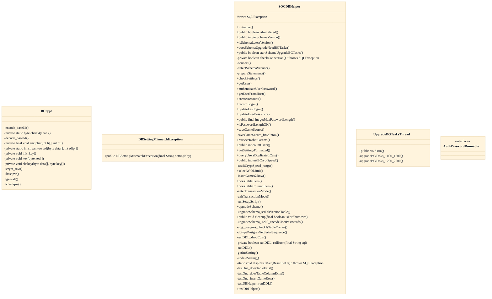

# JDBC Persistence Helper & Schema Upgrades

## Strategic Context
- **Persistence is a removable convenience, not a platform requirement** — Per CLAUDE.md the user/score/bot-params DB exists only to retain accounts and stats; the design deliberately makes it droppable so the dissertation-era 'run a server with bots, no setup' experience is preserved. That distinguishes this component from a typical app DAO whose absence would be fatal.
- **Vendor neutrality as a first-class constraint** — doc/Database.md and CLAUDE.md require the same code to run on MySQL/MariaDB, PostgreSQL, SQLite, and Oracle; the strategic 'why' for concentrating schema and access in SOCDBHelper is to keep that four-engine contract auditable in one file rather than enforcing it socially across the codebase.

## Overview
At server startup SOCDBHelper.initialize reads JDBC URL, driver, and credentials, calls connect, then detectSchemaVersion to learn the on-disk schema generation. prepareStatements builds the reusable statements that every later read/write reuses. Application code (account creation, login, score saving, robot-parameter lookup) flows exclusively through SOCDBHelper methods, which return plain values so callers never touch JDBC directly. When detectSchemaVersion reports an older generation, upgradeSchema runs DDL inside transaction mode (enterTransactionMode / runDDL / runDDL_rollback / exitTransactionMode) and defers heavy data migrations to UpgradeBGTasksThread. Credential reads and writes pass through BCrypt; settings reconciliation through checkSettings, which throws DBSettingMismatchException on conflict. If no URL is configured or connect fails, isInitialized stays false and the server proceeds without persistence.

## Components
- **SOCDBHelper**
- **UpgradeBGTasksThread**
- **BCrypt**
- **DBSettingMismatchException**
- **AuthPasswordRunnable**

## Design Decisions
- **Concentrate all JDBC access and schema definition in a single SOCDBHelper class**: Vendor neutrality across MySQL/MariaDB, PostgreSQL, SQLite, and Oracle is only tractable if dialect-specific quirks live in one place; per-engine helpers such as dbtypePostgresGetSerialSequence and upg_postgres_checkIsTableOwner show the seams are isolated here rather than scattered through callers.
- **Treat the database as entirely optional with graceful degradation**: The server's core gameplay needs no persistence, so initialize tolerates a missing URL or failed connect by leaving isInitialized false; only persistent accounts and stats are lost. This keeps the zero-config 'just run the JAR' path working and avoids a hard DB dependency.
- **Apply schema upgrades at runtime, splitting fast DDL from slow data migration**: Detecting an older schema and self-upgrading avoids a separate migration tool, but holding startup hostage to a full data rewrite is unacceptable; hence fast DDL runs inline in upgradeSchema under transaction mode while bulk work (e.g. password re-encoding) is offloaded to UpgradeBGTasksThread guarded by doesSchemaUpgradeNeedBGTasks.
- **Fail closed on settings inconsistency instead of silently proceeding**: Running against a store whose recorded settings contradict the live server risks data corruption; modeling this as a dedicated checked DBSettingMismatchException forces callers to handle the mismatch rather than ignore a boolean return.
- **Bundle a self-contained BCrypt implementation for credentials**: Adaptive password hashing must work identically regardless of DB engine and without external crypto dependencies, so hashing lives in-tree (BCrypt) and the storable length is bounded via getMaxPasswordLength / isPasswordLengthOK rather than relying on column types.

## Constraints
- **[HARD]** Persisted server settings MUST match the running configuration or initialization fails closed — src/main/java/soc/server/database/SOCDBHelper.java::checkSettings raising src/main/java/soc/server/database/DBSettingMismatchException.java
- **[HARD]** Stored passwords MUST NOT exceed the BCrypt-bounded maximum length checked before persistence — src/main/java/soc/server/database/SOCDBHelper.java::isPasswordLengthOK / getMaxPasswordLength
- **[SOFT]** Schema upgrade DDL SHOULD execute within transaction mode with rollback so a failed migration leaves the schema unchanged — src/main/java/soc/server/database/SOCDBHelper.java::enterTransactionMode / runDDL_rollback / exitTransactionMode
- **[SOFT]** Database access code SHOULD remain vendor-neutral across MySQL/MariaDB, PostgreSQL, SQLite, and Oracle, isolating engine-specific logic in dedicated helpers — src/main/java/soc/server/database/SOCDBHelper.java::dbtypePostgresGetSerialSequence (CLAUDE.md Database guidance)

## Non-Functional Requirements
- **security** — Account credentials are hashed with adaptive BCrypt rather than stored or compared in plaintext; legacy rows are re-encoded during upgrade — src/main/java/soc/server/database/BCrypt.java::hashpw/checkpw; SOCDBHelper.upgradeSchema_1200_encodeUserPasswords
- **reliability** — Server continues operating when the database is unavailable or unconfigured, degrading to no-persistence instead of failing startup — src/main/java/soc/server/database/SOCDBHelper.java::isInitialized (CLAUDE.md: DB is optional)
- **reliability** — Long-running migrations run on a background thread so server startup is not blocked by data rewrites — src/main/java/soc/server/database/SOCDBHelper.java UpgradeBGTasksThread.run / SOCDBHelper.startSchemaUpgradeBGTasks
- **observability** — Effective DB settings and query results can be surfaced for diagnostics — src/main/java/soc/server/database/SOCDBHelper.java::getSettingsFormatted / dispResultSet

## Diagrams
### Class

## Source Linkage
- [Vendor-neutral JDBC helper and schema definition concentrated in SOCDBHelper](../../../src/main/java/soc/server/database/SOCDBHelper.java)
- [Runtime schema upgrades on older-database detection](../../../src/main/java/soc/server/database/SOCDBHelper.java::upgradeSchema)
- [Background migration worker](../../../src/main/java/soc/server/database/SOCDBHelper.java::startSchemaUpgradeBGTasks)
- [Settings consistency fail-closed](../../../src/main/java/soc/server/database/DBSettingMismatchException.java)
- [Credential hashing primitive](../../../src/main/java/soc/server/database/BCrypt.java::hashpw)
- [Graceful degradation when no database URL is supplied](../../../src/main/java/soc/server/database/SOCDBHelper.java::isInitialized)
- [Server container exposes game port 8880](../../../Dockerfile)

Parent scope: [_scope.md](_scope.md)
Sibling feature: [jdbc-persistence-helper-schema-upgrades.feature.md](jdbc-persistence-helper-schema-upgrades.feature.md)
Scope architecture: [optional-database.arch.md](optional-database.arch.md)

## Source Linkage Grounding

_Per-row confidence; `_unverified_` rows are disclosed, not verified; `0.08 (resolved, uncited)` is the resolved-but-uncited baseline, not measured evidence._

| Element | Doc Evidence | Code Evidence | Confidence |
|---------|--------------|---------------|-----------:|
| Source Linkage: Vendor-neutral JDBC helper and schema definition concentrated in SOCDBHelper |  | src/main/java/soc/server/database/SOCDBHelper.java | 0.75 |
| Source Linkage: Runtime schema upgrades on older-database detection |  | src/main/java/soc/server/database/SOCDBHelper.java:3127-3549 | 0.75 |
| Source Linkage: Background migration worker |  | src/main/java/soc/server/database/SOCDBHelper.java:1140-1157 | 0.75 |
| Source Linkage: Settings consistency fail-closed |  | src/main/java/soc/server/database/DBSettingMismatchException.java | 0.08 (resolved, uncited) |
| Source Linkage: Credential hashing primitive |  | src/main/java/soc/server/database/BCrypt.java:667-721 | 0.86 |
| Source Linkage: Graceful degradation when no database URL is supplied |  | src/main/java/soc/server/database/SOCDBHelper.java:1069-1072 | 0.75 |
| Source Linkage: Server container exposes game port 8880 | syntax=docker/dockerfile:1 | Dockerfile | 0.08 (resolved, uncited) |

Related scopes: [Desktop Swing Client](../desktop-swing-client/desktop-swing-client.arch.md), [Game Model & Rules Engine](../game-model-rules-engine/game-model-rules-engine.arch.md), [Robot / AI Players](../robot-ai-players/robot-ai-players.arch.md), [Server & Message Protocol](../server-message-protocol/server-message-protocol.arch.md)
