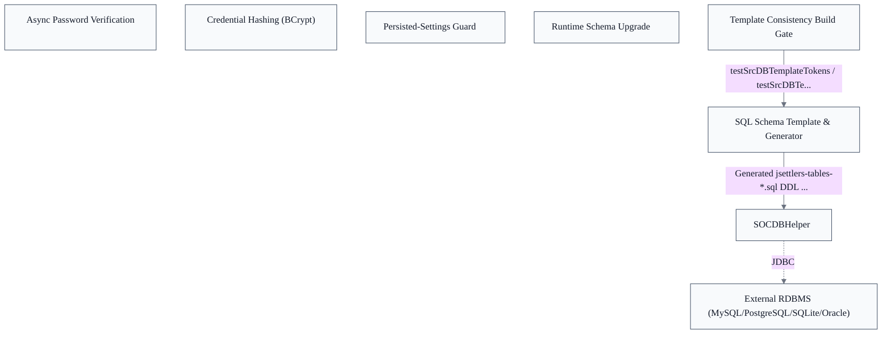
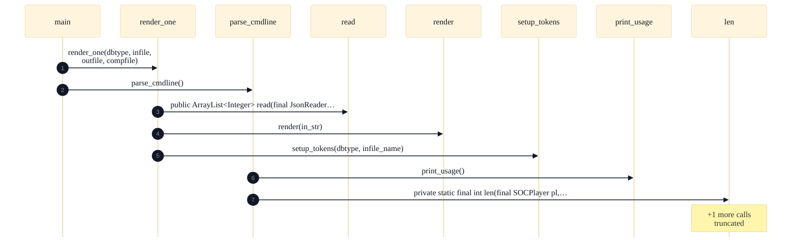

# Optional Database

## Overview
JDBC Persistence Helper & Schema Upgrades: At startup SOCDBHelper.initialize reads the JDBC URL/driver/credentials, calls connect, then detectSchemaVersion to learn the on-disk schema generation, and prepareStatements builds the reusable statements every later read/write reuses. All application code (account creation, login, score saving, robot-parameter lookup) flows exclusively through SOCDBHelper, which returns plain values so callers never touch JDBC. When detectSchemaVersion reports an older generation, fast DDL is applied inline and slow data migration is deferred to UpgradeBGTasksThread. Key decisions: concentrate all JDBC access and schema definition in one class; treat the database as entirely optional with graceful degradation; apply schema upgrades at runtime, splitting fast DDL from slow data migration; fail closed on settings inconsistency (DBSettingMismatchException); bundle a self-contained BCrypt implementation for credentials. SQL Schema Templating & Generation: A single-source-of-truth code-generation pipeline for the optional database's table and index DDL. A developer edits only the vendor-neutral template jsettlers-tables-tmpl.sql; render.py (parse_cmdline selects a target DBMS, render_one reads the input and setup_tokens/render emit the output) produces one concrete jsettlers-tables-*.sql per supported vendor (MySQL, PostgreSQL, SQLite, Oracle). The generated scripts are checked into src/main/bin/sql instead of being rendered at runtime/install. Key decisions: generate per-vendor SQL from one template rather than hand-maintaining each; ship the generated .sql files in the repo; enforce template/output consistency as a hard build gate (testSrcDBTemplateTokens / testSrcDBTemplates) rather than a manual convention; implement the renderer in Python rather than in the Java build. Player Accounts & Game Stats Persistence: The optional, opt-in persistence layer. Repository evidence: `src/main/java/soc/server/database/SOCDBHelper.java`. On account creation or login the server calls createAccount / authenticateUserPassword, which hash and compare credentials via BCrypt; verification runs asynchronously via AuthPasswordRunnable. Key decisions: funnel every persistence operation through one vendor-neutral helper; make the database entirely optional and runtime-detected; store passwords as bcrypt hashes and migrate legacy plaintext on upgrade; run schema upgrades online in a background thread; fail closed on persisted-setting drift; adapt 6-player game results into a 4-player-shaped score schema.

## Components
- **SOCDBHelper**: Persistence facade + connection lifecycle + schema versioning for the optional database.
- **Runtime Schema Upgrade**: Online, split-phase schema upgrade (inline DDL vs. deferred data migration).
- **Credential Hashing (BCrypt)**: Password hashing/verification for stored account credentials; legacy-plaintext migration on upgrade.
- **Async Password Verification**: Callback-based (non-blocking) password authentication path.
- **Persisted-Settings Guard**: Detect persisted-setting drift and fail closed via a dedicated exception.
- **SQL Schema Template & Generator**: Build-time per-vendor SQL generation from one template.
- **Template Consistency Build Gate**: Enforce template/generated-output consistency as a build gate.

## Boundaries
- **SOCDBHelper** boundary: Owns ALL JDBC access and the entire persisted schema for the server. It is the single gateway: account creation/login, completed-game score saving, and robot-parameter lookup pass through its methods, which return plain values so no caller touches JDBC. Holds the connection, the prepared-statement cache, and the schema-generation detection logic; the rest of the server only sees its boolean availability flag and value-returning methods.
- **Runtime Schema Upgrade** boundary: Owns the online schema-migration path invoked when the detected on-disk schema generation lags the code's expected generation. Fast DDL is applied inline during initialization; slow row-by-row data migration is deferred to a background thread so server startup is not blocked. This responsibility lives inside the database package and is distinct from the steady-state read/write facade.
- **Credential Hashing (BCrypt)** boundary: A self-contained bcrypt implementation bundled inside the database package so the persistence layer can hash new passwords and compare on login without an external dependency. Owned here because it is defined within this epic's directories; consumed only by the persistence facade's account-creation and authentication paths.
- **Async Password Verification** boundary: Owns the asynchronous credential-check contract: authentication is performed off the calling thread and the result delivered via a callback runnable rather than a blocking return. Bounds the persistence layer's interaction with the server's connection-handling threads.
- **Persisted-Settings Guard** boundary: Owns the fail-closed check that compares persisted server settings against the running configuration and aborts rather than silently proceeding when they drift. A distinct boundary because its job is to STOP initialization, not to read or write game data.
- **SQL Schema Template & Generator** boundary: Owns the single-source-of-truth DDL pipeline: developers edit only the vendor-neutral template jsettlers-tables-tmpl.sql, and render.py emits one concrete jsettlers-tables-*.sql per supported vendor (MySQL, PostgreSQL, SQLite, Oracle). The generated scripts are checked into src/main/bin/sql rather than rendered at install/runtime. Boundary is offline/build-time code generation — it produces the DDL that SOCDBHelper later executes, but shares no runtime path with it.
- **Template Consistency Build Gate** boundary: Owns the hard build-time enforcement that the checked-in generated SQL matches what the template would currently produce, so the two never drift. Implemented as build tasks (testSrcDBTemplateTokens / testSrcDBTemplates) that run under the test task; failure breaks the build rather than relying on developer discipline.

## Integration Points
- **Server → persistence facade**: The server runtime initializes the database (reading JDBC URL/driver/credentials at startup) and routes every durable operation — account creation, login, completed-game score saving, robot-parameter lookup — through SOCDBHelper. When no database is configured the facade's initialized flag stays false and the server runs unchanged, losing only persistence. This is the sole runtime entry into the epic. _[unverified: no imports/calls edge SOCDBHelper -> SOCServer in code graph]_ — see [Server & Message Protocol](../server-message-protocol/server-message-protocol.arch.md)
- **Facade → relational database**: SOCDBHelper opens and owns a JDBC connection to the configured external RDBMS and issues all reads/writes through cached prepared statements. The connection target and driver are vendor-neutral across MySQL/MariaDB, PostgreSQL, SQLite, and Oracle, selected by the startup configuration.
- **Generated DDL → runtime schema**: The build-time generator emits the per-vendor table/index DDL that defines the schema SOCDBHelper expects at runtime; the connect/detectSchemaVersion path reads against tables created by those generated scripts. The two components share no live call path — the contract between them is the schema shape itself, version-stamped so the runtime can detect an older generation and trigger upgrade.
- **Build gate → generated SQL**: The consistency build tasks read both the template and the checked-in generated scripts and fail the build if they diverge, guaranteeing the DDL shipped in the repo is exactly what the current template produces. Enforced under the Gradle test task, not at runtime. — see [Quality Infrastructure](../quality-infrastructure/quality-infrastructure.arch.md)

## Diagrams
### Architecture

### Sequence

## Source Linkage
- [SOCDBHelper](../../../src/main/java/soc/server/database/SOCDBHelper.java::SOCDBHelper)
- [SOCDBHelper.connect](../../../src/main/java/soc/server/database/SOCDBHelper.java::SOCDBHelper.connect)
- [SQL template](../../../src/main/bin/sql/template/jsettlers-tables-tmpl.sql)
- [SQL generator](../../../src/main/bin/sql/template/render.py::main)
- [Server→DB integration](../../../src/main/java/soc/server/SOCServer.java)
- [Template consistency build gate](../../../build.gradle)

Parent scope: [_scope.md](_scope.md)

## Source Linkage Grounding

_Per-row confidence; `_unverified_` rows are disclosed, not verified; `0.08 (resolved, uncited)` is the resolved-but-uncited baseline, not measured evidence._

| Element | Doc Evidence | Code Evidence | Confidence |
|---------|--------------|---------------|-----------:|
| Source Linkage: SOCDBHelper |  | src/main/java/soc/server/database/SOCDBHelper.java:134-5022 | 0.75 |
| Source Linkage: SOCDBHelper.connect |  | src/main/java/soc/server/database/SOCDBHelper.java:1201-1224 | 0.75 |
| Source Linkage: SQL template |  | src/main/bin/sql/template/jsettlers-tables-tmpl.sql | 0.08 (resolved, uncited) |
| Source Linkage: SQL generator | render.py - Simple template renderer for SQL DML/DDL to specific DBMS types. | src/main/bin/sql/template/render.py:224-230 | 0.75 |
| Source Linkage: Server→DB integration |  | src/main/java/soc/server/SOCServer.java | 0.83 |
| Source Linkage: Template consistency build gate | Sammys-Settlers build script for gradle 6 or 7 | build.gradle | 0.08 (resolved, uncited) |

Related scopes: [Desktop Swing Client](../desktop-swing-client/desktop-swing-client.arch.md), [Game Model & Rules Engine](../game-model-rules-engine/game-model-rules-engine.arch.md), [Robot / AI Players](../robot-ai-players/robot-ai-players.arch.md), [Server & Message Protocol](../server-message-protocol/server-message-protocol.arch.md)
