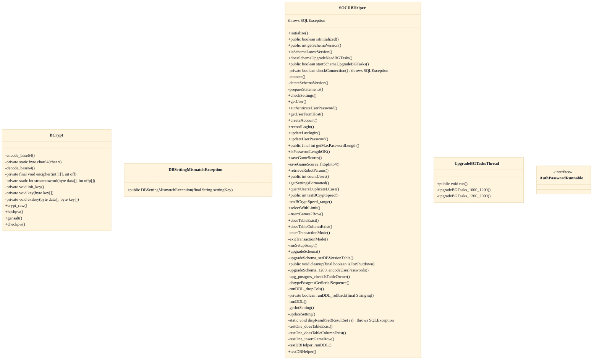

# Player Accounts & Game Stats Persistence

## Strategic Context
- **Persistence is the only thing lost without a DB** — Per CLAUDE.md and doc/Database.md the database is strictly opt-in: durable player accounts and completed-game stats/scores are the sole capabilities forfeited when the server runs DB-less, which is why this feature is built as an isolatable layer rather than a core dependency.
- **Vendor portability as a product mandate** — doc/Database.md and CLAUDE.md assert the code must stay neutral across MySQL, PostgreSQL, SQLite, and Oracle so operators can deploy on whatever they already run; this constraint drives the single-facade design of SOCDBHelper rather than performance-led, engine-specific data access.
- **Bot-parameter persistence reflects the project's research origin** — The codebase began as an AI-agent dissertation (CLAUDE.md), so retrieving tuned robot parameters from the DB (retrieveRobotParams) is a first-class persistence concern alongside human accounts, not an afterthought.

## Overview
This feature provides the optional, opt-in persistence layer of the server. Repository evidence: `src/main/java/soc/server/database/SOCDBHelper.java`. On account creation or login the server calls createAccount / authenticateUserPassword, which hash and compare credentials via BCrypt and return through the AuthPasswordRunnable callback so the expensive hash never blocks the inbound message loop. Completed games route summary data into saveGameScores. At startup SOCDBHelper connects, detects the schema version, validates persisted settings (checkSettings), and, when a migration is pending, hands the heavy work to UpgradeBGTasksThread so play can resume immediately. Bot tuning parameters are read back via retrieveRobotParams.

## Components
- **SOCDBHelper**: Single entry point for all persistence: connection setup (connect, checkConnection, prepareStatements), schema versioning (detectSchemaVersion, getSchemaVersion, isSchemaLatestVersion), account operations (getUser, createAccount, authenticateUserPassword, updateUserPassword, updateLastlogin, recordLogin), bot-parameter retrieval (retrieveRobotParams) and game stats/scores storage (saveGameScores). Isolates the rest of the server from JDBC/vendor specifics.
- **BCrypt**: Computes and verifies salted bcrypt password hashes (hashpw, checkpw, gensalt, crypt_raw); the deliberately CPU-bound work factor protects stored account credentials at rest.
- **UpgradeBGTasksThread**: Runs long-running schema upgrades (upgradeBGTasks_1000_1200, upgradeBGTasks_1200_2000) off the startup path so the server can accept connections before a large migration finishes; gated by doesSchemaUpgradeNeedBGTasks / startSchemaUpgradeBGTasks.
- **DBSettingMismatchException**: Thrown by checkSettings when a persisted DB setting disagrees with the running configuration, forcing operator attention rather than silent divergence.
- **AuthPasswordRunnable**: Callback contract returning the result of authenticateUserPassword so the bcrypt verification can complete off the main message-handling thread.

## Connections
- **Relational database engines (MySQL / PostgreSQL / SQLite / Oracle)** (outbound) — via JDBC connection established in SOCDBHelper.connect; vendor specifics in dbtypePostgresGetSerialSequence / upg_postgres_checkIsTableOwner (evidence: src/main/java/soc/server/database/SOCDBHelper.java::connect)
- **SOCServer** (inbound) — via Server calls SOCDBHelper.initialize at startup and authenticateUserPassword for login, receiving the result through the AuthPasswordRunnable callback (evidence: src/main/java/soc/server/database/SOCDBHelper.java::authenticateUserPassword)
- **Account-creation client (doc/Database.md)** (inbound) — via Server-side createAccount persists new player accounts requested by the separate account-management client app (evidence: src/main/java/soc/server/database/SOCDBHelper.java::createAccount)

## Design Decisions
- **Funnel every persistence operation through one vendor-neutral helper (SOCDBHelper) instead of scattering JDBC across the server**: Keeps the supported engines (MySQL, PostgreSQL, SQLite, Oracle) interchangeable and confines vendor-specific quirks to a few localized methods (dbtypePostgresGetSerialSequence, upg_postgres_checkIsTableOwner).
- **Make the database entirely optional and detected at runtime**: The server's core game logic is authoritative in memory; persistence is value-add, so a missing DB should degrade gracefully (only accounts/stats lost) rather than block startup.
- **Store account passwords as bcrypt hashes and migrate legacy plaintext on upgrade**: Salted adaptive hashing resists offline credential theft; upgradeSchema_1200_encodeUserPasswords re-encodes pre-existing rows so no plaintext survives a schema bump.
- **Run schema upgrades online in a background thread**: Large migrations (1000→1200, 1200→2000) would otherwise delay server availability; UpgradeBGTasksThread lets the server come up while data is upgraded behind it.
- **Verify passwords asynchronously via a callback interface**: Because bcrypt verification is deliberately CPU-expensive, performing it inline on the inbound message thread would stall unrelated traffic; AuthPasswordRunnable returns the verdict off-thread.
- **Fail closed on persisted-setting drift**: checkSettings raises DBSettingMismatchException when stored DB settings conflict with the running config, surfacing misconfiguration loudly instead of corrupting data silently.
- **Adapt 6-player game results into a 4-player-shaped score schema**: saveGameScores_fit6pInto4 lets the stats feature persist larger games without a schema fork, keeping the stats table stable across game sizes.

## Constraints
- **[HARD]** Account passwords MUST satisfy the configured length bounds before being accepted or hashed — src/main/java/soc/server/database/SOCDBHelper.java::isPasswordLengthOK / getMaxPasswordLength
- **[HARD]** The server MUST refuse to proceed when a persisted DB setting conflicts with the running configuration — src/main/java/soc/server/database/SOCDBHelper.java::checkSettings (throws DBSettingMismatchException)
- **[SOFT]** All persistence SQL SHOULD remain vendor-neutral across MySQL, PostgreSQL, SQLite, and Oracle, with engine-specific logic confined to SOCDBHelper — doc/Database.md and CLAUDE.md; localized vendor branches in src/main/java/soc/server/database/SOCDBHelper.java
- **[SOFT]** Generated jsettlers-tables-*.sql MUST NOT be hand-edited; edit the template and regenerate — CLAUDE.md (Database section); enforced by the testSrcDBTemplates build task

## Non-Functional Requirements
- **security** — Account credentials are stored only as salted bcrypt hashes and legacy plaintext is re-encoded during schema upgrade — src/main/java/soc/server/database/BCrypt.java::hashpw; SOCDBHelper.java::upgradeSchema_1200_encodeUserPasswords
- **security** — Database access uses prepared statements rather than concatenated SQL — src/main/java/soc/server/database/SOCDBHelper.java::prepareStatements
- **performance** — Bcrypt work factor is calibrated against the host so authentication cost stays bounded, and queries can cap returned rows — src/main/java/soc/server/database/SOCDBHelper.java::testBCryptSpeed; selectWithLimit
- **reliability** — Schema upgrades run as resumable background tasks with DDL rollback support so a failed migration does not leave the server unstartable — src/main/java/soc/server/database/SOCDBHelper.java::UpgradeBGTasksThread; runDDL_rollback
- **error-handling** — Configuration drift is signaled by a typed exception rather than silent fallback — src/main/java/soc/server/database/DBSettingMismatchException.java

## Diagrams
### Class

## Source Linkage
- [Vendor-neutral database helper layer mediating account and stats storage](../../../src/main/java/soc/server/database/SOCDBHelper.java)
- [Optional, runtime-detected database initialization](../../../src/main/java/soc/server/database/SOCDBHelper.java::isInitialized)
- [Player account creation and authentication](../../../src/main/java/soc/server/database/SOCDBHelper.java::createAccount)
- [Bcrypt password hashing of account credentials](../../../src/main/java/soc/server/database/BCrypt.java::hashpw)
- [Game stats/scores persistence enabled independently](../../../src/main/java/soc/server/database/SOCDBHelper.java::saveGameScores)
- [Online schema upgrade via background tasks](../../../src/main/java/soc/server/database/SOCDBHelper.java::upgradeSchema)
- [Fail-closed settings consistency check](../../../src/main/java/soc/server/database/DBSettingMismatchException.java)

Parent scope: [_scope.md](_scope.md)
Sibling feature: [player-accounts-game-stats-persistence.feature.md](player-accounts-game-stats-persistence.feature.md)
Scope architecture: [optional-database.arch.md](optional-database.arch.md)

## Source Linkage Grounding

_Per-row confidence; `_unverified_` rows are disclosed, not verified; `0.08 (resolved, uncited)` is the resolved-but-uncited baseline, not measured evidence._

| Element | Doc Evidence | Code Evidence | Confidence |
|---------|--------------|---------------|-----------:|
| Source Linkage: Vendor-neutral database helper layer mediating account and stats storage |  | src/main/java/soc/server/database/SOCDBHelper.java | 0.75 |
| Source Linkage: Optional, runtime-detected database initialization |  | src/main/java/soc/server/database/SOCDBHelper.java:1069-1072 | 0.75 |
| Source Linkage: Player account creation and authentication |  | src/main/java/soc/server/database/SOCDBHelper.java:1718-1774 | 0.75 |
| Source Linkage: Bcrypt password hashing of account credentials |  | src/main/java/soc/server/database/BCrypt.java:667-721 | 0.86 |
| Source Linkage: Game stats/scores persistence enabled independently |  | src/main/java/soc/server/database/SOCDBHelper.java:1981-2149 | 0.75 |
| Source Linkage: Online schema upgrade via background tasks |  | src/main/java/soc/server/database/SOCDBHelper.java:3127-3549 | 0.75 |
| Source Linkage: Fail-closed settings consistency check |  | src/main/java/soc/server/database/DBSettingMismatchException.java | 0.08 (resolved, uncited) |

Related scopes: [Desktop Swing Client](../desktop-swing-client/desktop-swing-client.arch.md), [Game Model & Rules Engine](../game-model-rules-engine/game-model-rules-engine.arch.md), [Robot / AI Players](../robot-ai-players/robot-ai-players.arch.md), [Server & Message Protocol](../server-message-protocol/server-message-protocol.arch.md)
