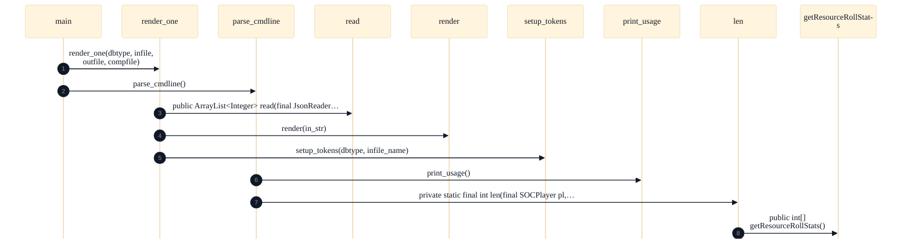

# SQL Schema Templating & Generation

## Strategic Context
- **Vendor neutrality as the reason templating exists** — Per CLAUDE.md's Database section, the optional DB layer must remain portable across MySQL, PostgreSQL, SQLite, and Oracle. This portability mandate is what makes a template-plus-render pipeline worthwhile here specifically: the schema is expressed once and specialized per dialect, rather than being one hand-tuned file.
- **Database is optional, so schema tooling must be low-friction** — CLAUDE.md states the server runs fully without a database. Because the DB is an opt-in feature, its DDL generation is deliberately kept out of the runtime path and confined to build/dev tooling, so users who never enable persistence pay no cost and contributors who do touch the schema have a single guarded entry point.

## Overview
This feature is a single-source-of-truth code-generation pipeline for the optional database's table and index DDL. A developer edits only the vendor-neutral template jsettlers-tables-tmpl.sql; render.py reads that template (parse_cmdline selects a target DBMS, render_one reads the input, sets up tokens, and renders the output) and emits one concrete jsettlers-tables-*.sql script per supported vendor (MySQL, PostgreSQL, SQLite, Oracle). Those generated scripts are checked into src/main/bin/sql and ship with the server, where SOCDBHelper executes them to create the schema on a fresh database. Because the outputs are derived, they are never hand-edited; instead the Gradle `test` task re-runs render.py through testSrcDBTemplateTokens and testSrcDBTemplates and fails the build whenever a checked-in script no longer matches what the template would produce, keeping every vendor variant in lockstep with one canonical definition.

## Components
- **jsettlers-tables-tmpl.sql** (referenced; defined externally): Authoritative, vendor-neutral definition of the user/score/bot-params table and index DDL; the only file a developer edits when the schema changes.
- **render.py** (referenced; defined externally): Renders the template into each per-vendor jsettlers-tables-*.sql script; the sequence diagram shows its internal flow (parse_cmdline -> render_one -> read/render/setup_tokens, print_usage for usage).
- **jsettlers-tables-*.sql** (referenced; defined externally): Checked-in, ship-with-the-server output artifacts (one per supported DBMS) produced from the template; treated as read-only/derived and never hand-edited.
- **testSrcDBTemplateTokens / testSrcDBTemplates** (referenced; defined externally): Build-time guards wired into the `test` task that re-render the template and fail the build if the checked-in scripts have drifted from it.

## Connections
- **SOCDBHelper (Optional Database runtime)** (outbound) — via Generated src/main/bin/sql/jsettlers-tables-*.sql scripts executed to create the schema (evidence: CLAUDE.md ('Schema lives in soc.server.database.SOCDBHelper'); generated scripts ship with the server)
- **Gradle build (`test` task)** (inbound) — via testSrcDBTemplateTokens / testSrcDBTemplates re-render the template and compare against checked-in scripts (evidence: CLAUDE.md ('The `test` task also runs testSrcDBTemplateTokens and testSrcDBTemplates'); build.gradle)
- **Python interpreter (python3/python)** (outbound) — via render.py is shelled out to via python3/python during codegen/test tasks (evidence: CLAUDE.md ('Gradle build also shells out to python3/python for several test/codegen tasks'))

## Design Decisions
- **Generate per-vendor SQL from one template rather than maintaining each script by hand**: The codebase must stay vendor-neutral across MySQL, PostgreSQL, SQLite, and Oracle; hand-maintaining four parallel DDL files invites silent divergence. A single template with a render step makes the canonical schema authoritative and the vendor files mechanical, derived artifacts.
- **Ship the generated .sql files in the repo instead of rendering them at runtime/install**: Server deployment must not depend on a Python toolchain being present on the production host; checking in the rendered scripts keeps the runtime dependency surface to just the JVM and the DB driver, while Python is needed only at development/build time.
- **Enforce template/output consistency as a hard build gate, not a manual convention**: Because the generated files are editable text in the repo, nothing physically prevents a hand-edit that the template can't reproduce. Wiring testSrcDBTemplateTokens/testSrcDBTemplates into `test` converts 'don't hand-edit' from a documentation request into a fail-closed CI guard that catches drift on every build.
- **Implement the renderer in Python rather than in the Java build**: Token-substitution templating over text is lightweight and lives next to the SQL it transforms; keeping it as a standalone render.py invoked by Gradle avoids coupling schema generation to the Java compilation graph and lets it be run on demand from the command line.

## Constraints
- **[HARD]** Generated jsettlers-tables-*.sql scripts MUST NOT be hand-edited; schema changes MUST be made in jsettlers-tables-tmpl.sql and regenerated via render.py. — build.gradle (testSrcDBTemplates / testSrcDBTemplateTokens wired into the `test` task); CLAUDE.md Database section
- **[HARD]** The checked-in per-vendor scripts MUST stay consistent with the template or the build fails. — build.gradle::testSrcDBTemplates (consistency verification in the `test` task)
- **[SOFT]** Schema DDL SHOULD remain vendor-neutral across MySQL, PostgreSQL, SQLite, and Oracle. — CLAUDE.md Database section (vendor-neutral requirement)
- **[HARD]** Rendering and the template-consistency tests require a python3/python interpreter on PATH. — CLAUDE.md ('Gradle build also shells out to python3/python for several test/codegen tasks')

## Non-Functional Requirements
- **reliability** — Drift between the SQL template and the generated per-vendor scripts is detected automatically and fails the build, preventing inconsistent schema artifacts from shipping. — build.gradle (testSrcDBTemplateTokens, testSrcDBTemplates run by `test`)
- **maintainability** — Schema DDL has a single editable source (the template); all vendor variants are derived, eliminating multi-file hand-synchronization. — CLAUDE.md Database section (template + render.py single-source workflow)
- **error-handling** — render.py exposes command-line usage handling (print_usage) for invalid/missing arguments when invoked. — .diagram_sequence_0 (parse_cmdline -> print_usage)

## Diagrams
### Sequence 0

## Source Linkage
- [Template-driven SQL generation (single source of truth)](../../../src/main/bin/sql/template/jsettlers-tables-tmpl.sql)
- [Template render script](../../../src/main/bin/sql/template/render.py)
- [render.py entry/render flow](../../../src/main/bin/sql/template/render.py)
- [Generated per-vendor schema scripts](../../../src/main/bin/sql/jsettlers-tables-mysql.sql)
- [Consistency-enforcing build tasks](../../../build.gradle)
- [Runtime schema consumer](../../../src/main/java/soc/server/database/SOCDBHelper.java)

Parent scope: [_scope.md](_scope.md)
Sibling feature: [sql-schema-templating-generation.feature.md](sql-schema-templating-generation.feature.md)
Scope architecture: [optional-database.arch.md](optional-database.arch.md)

## Source Linkage Grounding

_Per-row confidence; `_unverified_` rows are disclosed, not verified; `0.08 (resolved, uncited)` is the resolved-but-uncited baseline, not measured evidence._

| Element | Doc Evidence | Code Evidence | Confidence |
|---------|--------------|---------------|-----------:|
| Source Linkage: Template-driven SQL generation (single source of truth) |  | src/main/bin/sql/template/jsettlers-tables-tmpl.sql | 0.08 (resolved, uncited) |
| Source Linkage: Template render script | render.py - Simple template renderer for SQL DML/DDL to specific DBMS types. | src/main/bin/sql/template/render.py | 0.75 |
| Source Linkage: Generated per-vendor schema scripts |  | src/main/bin/sql/jsettlers-tables-mysql.sql | 0.08 (resolved, uncited) |
| Source Linkage: Consistency-enforcing build tasks | Sammys-Settlers build script for gradle 6 or 7 | build.gradle | 0.08 (resolved, uncited) |
| Source Linkage: Runtime schema consumer |  | src/main/java/soc/server/database/SOCDBHelper.java | 0.75 |

## Unverified Areas

Parts of this document have limited verifiable source evidence — treat normative claims as unverified until confirmed. See [documentation conventions](../documentation-conventions.md#unverified-areas).

Related scopes: [Desktop Swing Client](../desktop-swing-client/desktop-swing-client.arch.md), [Game Model & Rules Engine](../game-model-rules-engine/game-model-rules-engine.arch.md), [Robot / AI Players](../robot-ai-players/robot-ai-players.arch.md), [Server & Message Protocol](../server-message-protocol/server-message-protocol.arch.md)
