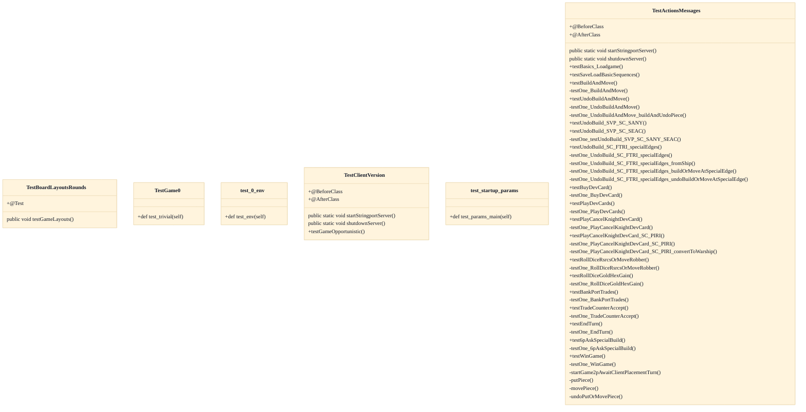

# Functional Test Suite (extraTest)

## Strategic Context
- **Isolating heavyweight e2e from build artifacts** — Per doc/Readme.developer.md, the extraTest source set has its own classpath wired in build.gradle and is excluded from the shipped JARs — the distinctive intent is to host expensive end-to-end checks (documented message sequences, multi-round layouts, client-version compatibility) without slowing the default build or contaminating released binaries.

## Overview
The extraTest feature is a dedicated Gradle source set that aggregates the heavyweight, long-running functional tests living under src/extraTest/java/soctest and src/extraTest/python. The Gradle extraTest task depends on the standard test task, so the fast unit pass runs first as a gate before the lengthy end-to-end checks execute. Java functional classes such as TestActionsMessages and TestClientVersion bring up an in-JVM stringport server in @BeforeClass and shut it down in @AfterClass, then connect bots/clients exactly like real peers to replay the documented SOCMessage sequences for each game action. Because the source set carries its own classpath and is excluded from the shipped JARs, these expensive checks never bloat the released server/full artifacts. Python tests run in the same task to exercise non-Java startup and environment paths.

## Components
- **extraTest source set** (referenced; defined externally)
- **TestActionsMessages**
- **TestBoardLayoutsRounds**
- **TestClientVersion**
- **Python functional tests** (referenced; defined externally)

## Connections
- **Gradle test task** (inbound) — via extraTest task dependsOn test (build.gradle) (evidence: build.gradle; doc/Readme.developer.md)
- **soc.extra (RecordingSOCServer / GameEventLog / GameActionExtractor)** (outbound) — via extraTest classpath references reusable test/dev infrastructure (evidence: src/main/java/soc/extra/robot/GameActionExtractor.java)
- **SOCMessage protocol / documented game-action sequences** (outbound) — via TestActionsMessages replays sequences from doc/Message-Sequences-for-Game-Actions.md against a stringport server (evidence: src/extraTest/java/soctest/server/TestActionsMessages.java; doc/Message-Sequences-for-Game-Actions.md)

## Design Decisions
- **Place heavyweight end-to-end tests in a separate extraTest source set rather than in the standard test set.**: Keeps the routine `gradle test` pass fast for everyday development while still allowing exhaustive functional coverage on demand via `gradle extraTest`.
- **Wire extraTest with its own classpath in build.gradle and exclude it from the shipped server/full JARs.**: Functional/dev-only test scaffolding must never become part of released artifacts; an isolated classpath also lets extraTest depend on soc.extra reusable test infrastructure.
- **Make the extraTest task depend on the test task.**: Runs the cheap unit pass first so an obvious unit regression fails fast before paying for the long functional run.
- **Drive functional game-action tests against an in-process stringport server brought up in @BeforeClass / torn down in @AfterClass.**: Bots and clients connect over the SOCMessage protocol exactly like production peers, so tests validate real client⇄server sequences without binding a TCP port or spawning external processes.
- **Include Python tests in the same extraTest aggregation.**: The wire protocol is deliberately language-neutral; Python functional tests assert that non-Java clients and startup-parameter handling stay interoperable.

## Constraints
- **[SOFT]** The extraTest functional run SHOULD execute only after the standard unit test pass succeeds (extraTest depends on test). — build.gradle (extraTest task dependsOn test); doc/Readme.developer.md
- **[SOFT]** extraTest code MUST NOT be packaged into the shipped server/full JARs; its classpath is wired separately. — build.gradle source-set/JAR include lists; doc/Readme.developer.md
- **[SOFT]** Functional server-backed test classes SHOULD start the in-JVM stringport server in @BeforeClass and shut it down in @AfterClass to avoid leaking server state across the suite. — TestActionsMessages.startStringportServer/shutdownServer; TestClientVersion.startStringportServer/shutdownServer

## Non-Functional Requirements
- **performance** — Long-running functional tests are segregated into extraTest so the default `gradle test`/`build` pass stays fast for routine development. — doc/Readme.developer.md; build.gradle extraTest source set
- **reliability** — Server-backed functional tests bracket an in-JVM stringport server with @BeforeClass startup and @AfterClass shutdown to ensure deterministic setup/teardown per class. — TestActionsMessages @BeforeClass startStringportServer / @AfterClass shutdownServer
- **error-handling** — The standard unit pass runs first (extraTest dependsOn test), failing fast on basic regressions before the expensive functional run starts. — build.gradle task dependency; doc/Readme.developer.md

## Diagrams
### Class

## Source Linkage
- [Functional test root (extraTest source set)](../../../src/extraTest/java/soctest)
- [Functional actions test](../../../src/extraTest/java/soctest/server/TestActionsMessages.java)
- [extraTest Gradle task wiring](../../../build.gradle)
- [Stringport server lifecycle helper](../../../src/extraTest/java/soctest/server/TestActionsMessages.java)
- [Reusable test infrastructure](../../../src/main/java/soc/extra/robot/GameActionExtractor.java)

Parent scope: [_scope.md](_scope.md)
Sibling feature: [functional-test-suite-extratest.feature.md](functional-test-suite-extratest.feature.md)
Scope architecture: [quality-infrastructure.arch.md](quality-infrastructure.arch.md)

## Source Linkage Grounding

_Per-row confidence; `_unverified_` rows are disclosed, not verified; `0.08 (resolved, uncited)` is the resolved-but-uncited baseline, not measured evidence._

| Element | Doc Evidence | Code Evidence | Confidence |
|---------|--------------|---------------|-----------:|
| Source Linkage: Functional test root (extraTest source set) |  | src/extraTest/java/soctest | 0.75 |
| Source Linkage: Functional actions test |  | src/extraTest/java/soctest/server/TestActionsMessages.java | 0.75 |
| Source Linkage: extraTest Gradle task wiring | Sammys-Settlers build script for gradle 6 or 7 | build.gradle | 0.08 (resolved, uncited) |
| Source Linkage: Reusable test infrastructure |  | src/main/java/soc/extra/robot/GameActionExtractor.java | 0.83 |

Related scopes: [Desktop Swing Client](../desktop-swing-client/desktop-swing-client.arch.md), [Game Model & Rules Engine](../game-model-rules-engine/game-model-rules-engine.arch.md), [Robot / AI Players](../robot-ai-players/robot-ai-players.arch.md), [Server & Message Protocol](../server-message-protocol/server-message-protocol.arch.md)
