# Java Unit Test Suite

## Strategic Context
- **Protocol-stability as the reason round-trip tests exist** — Per CLAUDE.md, every client⇄server message is a SOCMessage serialized as plain UTF strings, deliberately simple so non-Java clients and bots can interoperate; round-trip encoding tests therefore exist to defend that cross-language wire contract, not merely to exercise Java getters.

## Overview
The Java Unit Test Suite is the unit-level verification layer for the server and game model, rooted at src/test/java/soctest with subpackages that mirror the main source tree (message, server, server/savegame) plus companion Python tests under src/test/python. Tests construct core classes directly and assert behavior without assembling the shipped JARs, so they stay fast and artifact-independent. Gradle's `test` task compiles and runs these JUnit 4 cases and additionally drives the Python tests. A representative case, TestToCmdToStringParse, round-trips SOCMessage subclasses such as SOCBoardLayout2, SOCGameElements, and SOCPlayerElements through their command-string encoding, guarding wire-protocol stability. The suite gates `gradle build`.

## Components
- **TestToCmdToStringParse**
- **Message-protocol test group** (referenced; defined externally)
- **TestCustomMapLoader**
- **TestSavegame**
- **Python companion test suite** (referenced; defined externally)

## Connections
- **soc.message (SOCMessage subclasses: SOCBoardLayout2, SOCGameElements, SOCPlayerElements)** (outbound) — via Java imports / direct instantiation in round-trip test (evidence: src/test/java/soctest/message/TestToCmdToStringParse.java)
- **soc.server.CustomMapLoader** (outbound) — via Java import / direct call under test (evidence: src/test/java/soctest/server/TestCustomMapLoader.java)
- **soc.server savegame subsystem** (outbound) — via Java import / save-load exercised under test (evidence: src/test/java/soctest/server/savegame/TestSavegame.java)
- **Gradle build (test / testPython tasks)** (inbound) — via build.gradle task wiring that compiles and runs the suite (evidence: build.gradle)

## Design Decisions
- **Mirror the main package layout inside a dedicated soctest tree (soctest.message, soctest.server, soctest.server.savegame) rather than colocating tests with sources.**: Keeps test code physically and on the classpath separate from shipped artifacts so it is never bundled into the server/full JARs, while letting each test sit next to its subject's package for discoverability.
- **Verify the wire protocol with a round-trip (toCmd → parse → equals) invariant in TestToCmdToStringParse instead of asserting fixed encoded strings only.**: The protocol is plain UTF strings designed so non-Java clients/bots can interop; a symmetric round-trip catches both encode and decode regressions and protects backward compatibility better than one-directional snapshot assertions.
- **Run unit checks under the fast `test`/`testPython` tasks and push lengthy functional tests into a separate extraTest source set.**: Separating fast, JAR-independent business-logic checks from slow end-to-end tests keeps the default build loop quick while still allowing deep functional coverage on demand via extraTest.
- **Fold SQL-template consistency checks (testSrcDBTemplateTokens / testSrcDBTemplates) into the same `test` task that runs the unit suite.**: Treating generated-vs-template SQL drift as a unit-level failure makes the build fail closed when the generated scripts are hand-edited, rather than relying on review discipline.

## Constraints
- **[UNVERIFIED]** SOCMessage subclasses MUST survive a command-string round-trip (toCmd/toString → parse) without changing their contents. — src/test/java/soctest/message/TestToCmdToStringParse.java (cross-document reconciliation: not verified against `src/test/java/soctest/message/TestToCmdToStringParse.java`; recorded as design intent, not current code fact.)
- **[HARD]** Generated SQL scripts in src/main/bin/sql/ MUST NOT be hand-edited; they must be regenerated from the template, enforced by the test task's testSrcDBTemplates / testSrcDBTemplateTokens checks. — build.gradle (testSrcDBTemplates / testSrcDBTemplateTokens); CLAUDE.md Database section
- **[SOFT]** Long-running functional tests SHOULD live in the extraTest source set rather than the fast unit suite. — build.gradle extraTest source set; CLAUDE.md Build & test section

## Non-Functional Requirements
- **performance** — Unit tests SHOULD execute without assembling JARs to keep the default build loop fast and artifact-independent. — doc/Readme.developer.md; CLAUDE.md Build & test section
- **reliability** — Test results gate `gradle build`; a failing unit or SQL-template check fails the build. — build.gradle (build depends on test)

## Diagrams
### Class

```mermaid
%%{init: {'theme': 'base', 'themeVariables': {'primaryTextColor': '#111827', 'secondaryTextColor': '#111827', 'tertiaryTextColor': '#111827', 'lineColor': '#6b7280', 'fontFamily': 'Inter, ui-sans-serif, system-ui, sans-serif'}}}%%
classDiagram
    class MessageMs {
        +public MessageMs(List<String> pal)
        +toString()
    }
    class TestSOCGameStats {
        +@Test
    public void testConstructors()
    }
    class TestSOCStatusMessage {
        +@Test
    public void testStatusFallback()
    }
    class TestStringConstantsAndEnums {
        +@Test
    public void testDevCardAction()
        +@Test
    public void testInventoryItemAction()
        +@Test
    public void testGameElements()
        +@Test
    public void testPlayerElement()
        +@Test
    public void testSetSpecialItem()
    }
    class test_0_env {
        +def test_env(self)
    }
    class BLException {
        +public BLException(final String message)
    }
    class StartedTestGameObjects {
        +StartedTestGameObjects()
    }
    class TestDataOutputUtils {
        +@Test
    public void testNewlinesToHTML()
        +@Test
    public void testEscapeHTML()
    }
    class TestPlayingPiece {
        +@Test
    public void testTypeNamePattern()
        +@Test
    public void testPieceTypeConstants()
        +@Test
    public void testGetPieceTypeName()
        +testPieceTypeName_negative()
        +@Test
    public void testGetPieceType()
        +testGetPieceType_null()
        +testGetPieceType_empty()
        +testGetPieceType_wrongCharClass_p()
        +testGetPieceType_wrongCharClass_lc()
        +testGetPieceType_notReallyNumeric()
        +@Test
    public void testSharedGetPieceTypeName()
        +testSharedPieceTypeName_negative()
        +@Test
    public void testSharedGetPieceType()
        +testSharedGetPieceType_null()
        +testSharedGetPieceType_empty()
        +testSharedGetPieceType_wrongCharClass_p()
        +testSharedGetPieceType_wrongCharClass_lc()
        +testSharedGetPieceType_notReallyNumeric()
    }
    class TestSOCChangeGameOptions {
        +@Test
    public void testConstructor()
        +@Test
    public void testParseDataStr()
    }
    class TestSOCKeyedMessages {
        +@Test
    public void testSOCUndoNotAllowedReasonText()
    }
    class TestTemplatesAbstracts {
        +@Test
    public void testSOCMessageTemplateMsToString()
        +testSOCMessageTemplateMsParseData_FindEmptyStrs()
    }

```

## Source Linkage
- [Java unit test root](../../../src/test/java/soctest)
- [Python unit tests](../../../src/test/python)
- [SOCMessage round-trip test](../../../src/test/java/soctest/message/TestToCmdToStringParse.java)
- [Custom map loader test](../../../src/test/java/soctest/server/TestCustomMapLoader.java)
- [Savegame test](../../../src/test/java/soctest/server/savegame/TestSavegame.java)
- [Gradle test task wiring](../../../build.gradle)

Parent scope: [_scope.md](_scope.md)
Sibling feature: [java-unit-test-suite.feature.md](java-unit-test-suite.feature.md)
Scope architecture: [quality-infrastructure.arch.md](quality-infrastructure.arch.md)

## Source Linkage Grounding

_Per-row confidence; `_unverified_` rows are disclosed, not verified; `0.08 (resolved, uncited)` is the resolved-but-uncited baseline, not measured evidence._

| Element | Doc Evidence | Code Evidence | Confidence |
|---------|--------------|---------------|-----------:|
| Source Linkage: Java unit test root |  | src/test/java/soctest | 1.00 |
| Source Linkage: Python unit tests |  | src/test/python | 0.56 |
| Source Linkage: SOCMessage round-trip test |  | src/test/java/soctest/message/TestToCmdToStringParse.java | 0.32 |
| Source Linkage: Custom map loader test |  | src/test/java/soctest/server/TestCustomMapLoader.java | 0.75 |
| Source Linkage: Savegame test |  | src/test/java/soctest/server/savegame/TestSavegame.java | 0.08 (resolved, uncited) |
| Source Linkage: Gradle test task wiring | Sammys-Settlers build script for gradle 6 or 7 | build.gradle | 0.08 (resolved, uncited) |

## Unverified Areas

Parts of this document have limited verifiable source evidence — treat normative claims as unverified until confirmed. See [documentation conventions](../documentation-conventions.md#unverified-areas).

Related scopes: [Server & Message Protocol](../server-message-protocol/server-message-protocol.arch.md)
