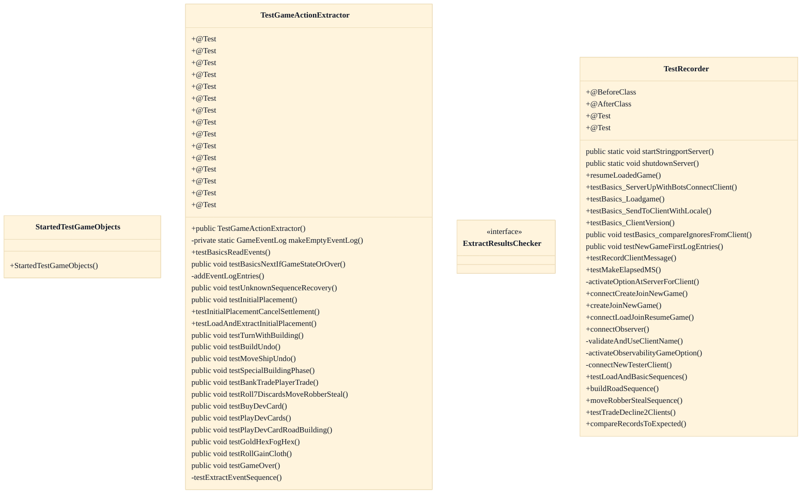

# Protocol Message-Sequence Consistency Tests

## Strategic Context
- **Wire-format interop is the asset being protected** — Per the SOCMessage design (cited in CLAUDE.md), messages are deliberately plain writeUTF strings so non-Java clients and bots can interop; the per-action sequences in doc/Message-Sequences-for-Game-Actions.md are the documented contract. These tests exist specifically as the regression guard that prevents that contract from silently drifting and breaking external readers.
- **The robot/bot subsystem is a first-class consumer** — Because bots connect exactly like human clients and recognize actions from the message stream (the GameActionExtractor path), a sequence change is not merely cosmetic — it can break the AI subsystem that originated this codebase, which is why the extraction-side test asserts recognition end-to-end rather than only checking emission.

## Overview
These two JUnit classes guard the property that the SOCMessage sequence emitted for each game action stays stable on the wire, so bots and non-Java readers can recognize an action from its stream. On the recording side, TestRecorder boots a RecordingSOCServer on a stringport, connects DisplaylessTesterClients, loads or creates games, and drives actions; the server records every outgoing (and optionally client-origin) message into a per-game GameEventLog of EventEntry rows, which compareRecordsToExpected diffs against an expected String[][] of recipient-prefixed headers and field fragments. On the extraction side, TestGameActionExtractor constructs a GameEventLog from hand-authored or soclog-loaded EventEntry strings, runs it through GameActionExtractor, and asserts the resulting GameActionLog recognizes each ActionType. Recording proves the contract is emitted; extraction proves a reader can parse it back.

## Components
- **TestRecorder**
- **TestRecorder.compareRecordsToExpected** (referenced; defined externally)
- **TestGameActionExtractor**
- **TestGameActionExtractor.makeEmptyEventLog** (referenced; defined externally)
- **TestGameActionExtractor.ExtractResultsChecker** (referenced; defined externally)
- **GameActionExtractor (integration)** (referenced; defined externally)
- **RecordingSOCServer / GameEventLog (integration)** (referenced; defined externally)

## Connections
- **RecordingSOCServer** (outbound) — via import soc.extra.server.RecordingSOCServer; srv = new RecordingSOCServer() and srv.records.get(gameName) (evidence: src/test/java/soctest/server/TestRecorder.java imports + startStringportServer)
- **GameEventLog / GameEventLog.EventEntry** (outbound) — via import soc.extra.server.GameEventLog[.EventEntry]; read log.entries and construct EventEntry fixtures (evidence: src/test/java/soctest/server/TestRecorder.java and src/test/java/soctest/robot/TestGameActionExtractor.java imports)
- **GameActionExtractor / GameActionLog** (outbound) — via class TestGameActionExtractor extends GameActionExtractor; asserts GameActionLog.Action entries (evidence: src/test/java/soctest/robot/TestGameActionExtractor.java::TestGameActionExtractor)
- **SOCServer / SOCGameHandler** (outbound) — via import soc.server.SOCServer; createAndJoinReloadedGame, resumeReloadedGame, destroyGameAndBroadcast (evidence: src/test/java/soctest/server/TestRecorder.java::testBasics_Loadgame, resumeLoadedGame)
- **TestLoadgame (savegame fixtures)** (outbound) — via import soctest.server.savegame.TestLoadgame; TestLoadgame.load("classic-botturn.game.json", server) (evidence: src/test/java/soctest/server/TestRecorder.java::testBasics_Loadgame)
- **doc/Message-Sequences-for-Game-Actions.md** (inbound) — via documented per-action message sequence contract these tests enforce (evidence: feature source_linkage doc_evidence; CLAUDE.md protocol section)

## Design Decisions
- **Split coverage into a recording-side test and an extraction-side test**: TestRecorder verifies the server emits the documented sequence for an action; TestGameActionExtractor verifies an automated reader can recover the action from that sequence. The contract only holds if both directions agree, so each end is guarded independently rather than in one round-trip test.
- **Express expected sequences as String[][] of recipient-prefix + field substring, compared by compareRecordsToExpected**: The wire format is itself textual (writeUTF strings), so a human-readable {"p3:SOCGameServerText:","text=..."} fixture mirrors what travels on the wire and reads as documentation. The substring match also tolerates localized text without pinning exact bytes.
- **TestGameActionExtractor extends the GameActionExtractor it tests**: The javadoc states it does so 'as an easy way to access its methods being tested' — extension exposes the protected read cursor (next, backtrackTo, nextIfType, state, currentSequence) to assertions without widening that API for production callers.
- **Encode message recipient in the fixture prefix (all: / p3: / f3: / !p3:)**: A sequence's correctness includes who each message is sent to (broadcast vs per-player vs from-client vs excluded), so the recipient is carried in the comparison key and the extractor is re-checked per client perspective via the toClientPN parameter.
- **Run on an in-process stringport server with unique per-test client names**: RecordingSOCServer.STRINGPORT_NAME avoids real sockets for fast, isolated runs; the clientNamesUsed set prevents two methods reusing a name, which 'would intermittently cause auth problems' when tests run in parallel.

## Constraints
- **[UNVERIFIED]** A new game's recorded log MUST begin with SOCVersion immediately followed by SOCNewGame (or SOCNewGameWithOptions for games created with options). — src/test/java/soctest/server/TestRecorder.java::testNewGameFirstLogEntries asserts log.entries.size()==2 and the exact {all:SOCVersion, all:SOCNewGame[WithOptions]} prologue (cross-document reconciliation: not verified against `src/test/java/soctest/server/TestRecorder.java`; recorded as design intent, not current code fact.)
- **[UNVERIFIED]** Client-origin (from-client) messages MUST NOT appear in the recorded log unless isRecordGameEventsFromClientsActive() is enabled (srv.isRecordingFromClients). — src/test/java/soctest/server/TestRecorder.java::testRecordClientMessage — empty expected log before toggle, f3:* entries only after setting isRecordingFromClients=true (cross-document reconciliation: not verified against `src/test/java/soctest/server/TestRecorder.java`; recorded as design intent, not current code fact.)
- **[SOFT]** The extractor input log SHOULD start with version, newgame, and startgame entries before any action sequence. — src/test/java/soctest/robot/TestGameActionExtractor.java::makeEmptyEventLog comment "Extractor expects to see version, newgame, and startgame"
- **[UNVERIFIED]** Each test SHOULD use a unique client nickname to avoid auth interference across parallel runs. — src/test/java/soctest/server/TestRecorder.java::clientNamesUsed and per-method CLIENT_NAME constants (cross-document reconciliation: not verified against `src/test/java/soctest/server/TestRecorder.java`; recorded as design intent, not current code fact.)

## Non-Functional Requirements
- **reliability** — Acts as the regression guard that documented per-action message sequences do not drift on the wire; TestRecorder additionally cross-checks loaded-game asserts by keeping bot-only games alive (DESTROY_BOT_ONLY_GAMES_WHEN_OVER=false). — src/test/java/soctest/server/TestRecorder.java::startStringportServer
- **observability** — Recorded EventEntry rows retain recipient routing (all/per-player/from-client) and message fields, enabling assertions on both content and addressing. — src/test/java/soctest/server/TestRecorder.java::compareRecordsToExpected and EventEntry usage
- **performance** — Tests run against an in-memory stringport server rather than real sockets, with short Thread.sleep waits for client/server thread hand-off, keeping the unit suite fast. — src/test/java/soctest/server/TestRecorder.java — RecordingSOCServer.STRINGPORT_NAME, DisplaylessTesterClient.init() + Thread.sleep(120)
- **error-handling** — Extractor must recover from an unknown sequence and continue recognizing subsequent actions; verified by an UNKNOWN action surrounded by recognized ones. — src/test/java/soctest/robot/TestGameActionExtractor.java::testUnknownSequenceRecovery

## Examples
*Shows the recipient-prefixed String[][] fixture encoding the required log-header invariant.*
*Source: `src/test/java/soctest/server/TestRecorder.java (testNewGameFirstLogEntries)`*
```
{"all:SOCVersion:" + Version.versionNumber(), "str=" + Version.version()},
{"all:SOCNewGame:", "game=" + gaName}
```

*Documents the prologue the extractor depends on before any action sequence is appended.*
*Source: `src/test/java/soctest/robot/TestGameActionExtractor.java (makeEmptyEventLog)`*
```
log.add(new EventEntry("Extractor expects to see version, newgame, and startgame"));
```

*Verifies the extractor degrades an unrecognized middle sequence to UNKNOWN yet still recognizes the actions after it.*
*Source: `src/test/java/soctest/robot/TestGameActionExtractor.java (testUnknownSequenceRecovery)`*
```
act = actionLog.get(4);
assertEquals(desc, ActionType.UNKNOWN, act.actType);
```

## Diagrams
### Class



### Dependency


## Source Linkage
- [Protocol recorder consistency test](../../../src/test/java/soctest/server/TestRecorder.java::TestRecorder)
- [Recorder expected-sequence comparison helper](../../../src/test/java/soctest/server/TestRecorder.java::TestRecorder)
- [New-game log-header invariant test](../../../src/test/java/soctest/server/TestRecorder.java::TestRecorder)
- [Game-action extractor recognition test](../../../src/test/java/soctest/robot/TestGameActionExtractor.java::TestGameActionExtractor)
- [Minimal event-log fixture builder](../../../src/test/java/soctest/robot/TestGameActionExtractor.java::TestGameActionExtractor)
- [Game-action extractor under test](../../../src/main/java/soc/extra/robot/GameActionExtractor.java::GameActionExtractor)
- [Recorded game-event log model](../../../src/main/java/soc/extra/server/GameEventLog.java::GameEventLog)
- [Recording server fixture source](../../../src/main/java/soc/extra/server/RecordingSOCServer.java::RecordingSOCServer)
- [Recorded game-event fixture (hypothesized)](../../../src/test/resources/resources/gameevent/all-basic-actions.soclog)

Parent scope: [_scope.md](_scope.md)
Sibling feature: [protocol-message-sequence-consistency-tests.feature.md](protocol-message-sequence-consistency-tests.feature.md)
Scope architecture: [quality-infrastructure.arch.md](quality-infrastructure.arch.md)

## Source Linkage Grounding

_Per-row confidence; `_unverified_` rows are disclosed, not verified; `0.08 (resolved, uncited)` is the resolved-but-uncited baseline, not measured evidence._

| Element | Doc Evidence | Code Evidence | Confidence |
|---------|--------------|---------------|-----------:|
| Source Linkage: Protocol recorder consistency test |  | src/test/java/soctest/server/TestRecorder.java:87-2045 | 0.75 |
| Source Linkage: Game-action extractor recognition test |  | src/test/java/soctest/robot/TestGameActionExtractor.java:69-72 | 0.75 |
| Source Linkage: Game-action extractor under test |  | src/main/java/soc/extra/robot/GameActionExtractor.java:201-249 | 0.83 |
| Source Linkage: Recorded game-event log model |  | src/main/java/soc/extra/server/GameEventLog.java:231-280 | 0.75 |
| Source Linkage: Recording server fixture source |  | src/main/java/soc/extra/server/RecordingSOCServer.java:157-163 | 0.75 |
| Source Linkage: Recorded game-event fixture (hypothesized) | Game created at: 2021-10-10 22:48:46 -0400 | src/test/resources/resources/gameevent/all-basic-actions.soclog | 0.08 (resolved, uncited) |

Related scopes: [Desktop Swing Client](../desktop-swing-client/desktop-swing-client.arch.md), [Game Model & Rules Engine](../game-model-rules-engine/game-model-rules-engine.arch.md), [Robot / AI Players](../robot-ai-players/robot-ai-players.arch.md), [Server & Message Protocol](../server-message-protocol/server-message-protocol.arch.md)
