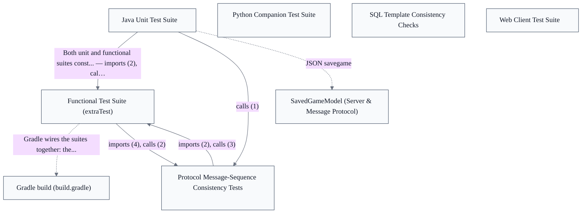

# Quality Infrastructure

## Overview
Java Unit Test Suite — Fast, artifact-independent JUnit 4 verification mirroring the main package layout under src/test/java/soctest. Constructs core classes directly (no JAR assembly) to assert the wire protocol via a toCmd→parse→equals round-trip invariant (TestToCmdToStringParse), game options (TestGameOptions), custom-map loading (TestCustomMapLoader), and savegame round-trips (TestSavegame). Run under the fast test/testPython tasks, with SQL-template consistency checks folded into the same task. Functional Test Suite (extraTest) — A dedicated Gradle source set aggregating heavyweight, long-running end-to-end tests under src/extraTest/java/soctest and src/extraTest/python. The extraTest task depends on test so the fast unit pass gates it. Java functional classes (TestActionsMessages, TestBoardLayoutsRounds, TestClientVersion) bring up an in-JVM stringport server in @BeforeClass and tear it down in @AfterClass, then drive whole game-action flows. Wired with its own classpath and excluded from the shipped JARs. Protocol Message-Sequence Consistency Tests — Two JUnit classes guarding that the SOCMessage sequence per game action stays stable so bots and non-Java readers can recognize an action from its stream. TestRecorder boots a RecordingSOCServer on a stringport, connects DisplaylessTesterClients, drives actions, and compares recorded GameEventLog rows against expected String[][] fixtures (recipient-prefix + field-substring) via compareRecordsToExpected; TestGameActionExtractor extends the GameActionExtractor it tests, validating reconstruction against fixtures like all-basic-actions.soclog. Web Client Test Suite — The unit-level quality layer for the TypeScript/React front end, colocated as *.test.tsx beside the screens and components it exercises and run by Vitest in jsdom. Tests render real components and drive them as a user would (data-testid handles, DOM events) rather than asserting on internals; autosave is disabled under a test environment guard, and the shared validator path is exercised by importing deliberately-invalid JSON. Vitest unit tests and Playwright end-to-end tests are split into separate package.json scripts.

- [INV-CL-001: single-writer-next-landarea]
- [INV-CL-002: single-writer-desc-curstrvalue]
- [INV-CL-003: single-writer-parsed-boolvalue]
- [INV-CL-004: single-writer-parsed-intvalue]
- [INV-CL-005: single-writer-prevdicetotal-current]
- [INV-CL-006: single-writer-prevpiececount-current]
- [INV-CL-007: single-writer-prevmyturn-current]
- [INV-CL-008: single-writer-viewport-scrollleft]
- [INV-CL-009: single-writer-viewport-scrolltop]
- [INV-CL-010: single-writer-panref-current]
- …and 1 more (see [invariants/_scope.md](../invariants/_scope.md))

## Components
- **Java Unit Test Suite**: Verify the wire protocol, game options, map loading, and savegame round-trips through direct in-process construction of SOCMessage, SOCGameOptionSet, CustomMapLoader, and SavedGameModel classes.
- **Functional Test Suite (extraTest)**: Drive whole game-action flows (build/move/trade), board-layout rounds, and client-version negotiation against a live in-process server, validating behavior that cannot be exercised by unit-level construction alone.
- **Protocol Message-Sequence Consistency Tests**: Assert that per-action outgoing message sequences match recorded fixtures (e.g. recipient-prefix + field-substring rows compared by compareRecordsToExpected) and that GameActionExtractor reconstructs actions from an event log.
- **Python Companion Test Suite**: Provide companion Python-based checks executed by the testPython / extraTestPython Gradle tasks in lockstep with the Java unit and functional suites.
- **Web Client Test Suite**: Exercise the web front end (map editor, dialogs, screens) at the user-facing surface, including the shared map validator path via deliberately-invalid JSON import, under a jsdom Vitest environment with autosave disabled by a test guard.
- **SQL Template Consistency Checks**: Fail the build when the checked-in generated SQL drifts from its template, enforcing the never-hand-edit-generated-SQL invariant.

## Boundaries
- **Java Unit Test Suite** boundary: Fast, artifact-independent JUnit 4 verification rooted at src/test/java/soctest, with subpackages (soctest.message, soctest.server, soctest.server.savegame, soctest.game) mirroring the main source tree. Owns assertions that construct core server/game-model classes directly without assembling the shipped JARs. Boundary stops at the unit level: it does not boot a live server (that is the extraTest suite's edge).
- **Functional Test Suite (extraTest)** boundary: A separately-wired Gradle source set rooted at src/extraTest/java/soctest, excluded from the shipped server/full JARs and given its own classpath in build.gradle. Owns heavyweight end-to-end checks that bring up an in-JVM stringport server in @BeforeClass and tear it down in @AfterClass. Boundary edge: the extraTest Gradle task depends on the test task, so the fast unit pass gates the lengthy run.
- **Protocol Message-Sequence Consistency Tests** boundary: The recording-side and extraction-side tests that guard the stability of the SOCMessage sequence emitted per game action so bots and non-Java readers can recognize an action from its stream. TestRecorder (src/test/java/soctest/server) boots a RecordingSOCServer, drives actions, and compares recorded GameEventLog rows to expected String[][] fixtures; TestGameActionExtractor exercises the extraction side. Boundary: it owns the sequence-equality assertions, not the recording/extraction machinery itself (RecordingSOCServer, GameEventLog, GameActionExtractor live in soc.extra and are integrated, not owned). _[unverified: no imports/calls edge src/test/java/soctest/server/TestRecorder.java::compareRecordsToExpected; src/main/java/soc/extra/robot/GameActionExtractor.java -> src/main/java/soc/extra/server/GameEventLog.java (calls x29) -> TestGameActionExtractor in code graph]_
- **Python Companion Test Suite** boundary: Python test code under src/test/python (run by Gradle's testPython, folded into the fast test task) and src/extraTest/python (run by extraTestPython, part of the lengthy aggregation). Owns Python-language verification that runs alongside the JUnit suites; boundary excludes the SQL-template render tooling it may invoke.
- **Web Client Test Suite** boundary: TypeScript/React unit and end-to-end tests living under web/, colocated as *.test.tsx beside the screens and components they exercise. Vitest (jsdom) drives the unit layer; Playwright drives end-to-end, split into separate package.json scripts (test vs test:e2e). Boundary: tests render the real components through their user-facing surface (data-testid handles, DOM events) rather than asserting on internals; the components under test are owned by the Web Client epics, not here.
- **SQL Template Consistency Checks** boundary: Build-task-level guards (testSrcDBTemplateTokens, testSrcDBTemplates) folded into the same Gradle test task as the unit suite, enforcing that generated jsettlers-tables-*.sql files stay consistent with their src/main/bin/sql/template source. Boundary: it verifies generated-artifact consistency; it does not own the SQL schema or the render.py generator (those belong to the Optional Database epic).

## Integration Points
- **In-process stringport server harness**: The functional and recording tests boot a live server inside the test JVM over a stringport connection rather than a real socket, connecting DisplaylessTesterClients to drive game actions. This is the integration edge from the test suites into the server runtime under test. — see [Server & Message Protocol](../server-message-protocol/server-message-protocol.arch.md)
- **Game model under test**: Both unit and functional suites construct and assert directly against the authoritative game-model classes (SOCGame, SOCPlayer, SOCBoard, SOCGameOptionSet). These are the primary subjects of verification, owned by the Game Model epic and referenced (not owned) here. — see [Game Model & Rules Engine](../game-model-rules-engine/game-model-rules-engine.arch.md)
- **Savegame model round-trip**: The savegame tests exercise the JSON savegame serialization by constructing and round-tripping SavedGameModel against SOCGame/SOCPlayer state, validating load/save fidelity. — see [Server & Message Protocol](../server-message-protocol/server-message-protocol.arch.md)
- **Game-event recording & extraction**: The sequence-consistency tests integrate with the soc.extra recording/extraction machinery: RecordingSOCServer writes a per-game GameEventLog of EventEntry rows, and GameActionExtractor reconstructs actions from that log. The tests own the assertions; the machinery is owned externally. — see [Server & Message Protocol](../server-message-protocol/server-message-protocol.arch.md)
- **Web components under test**: The Vitest/Playwright suites render and drive the real web client components (MapEditorScreen, Dialog) and exercise the shared map-validator path. The components and validator are owned by the Web Client and Web Protocol & Map Editor epics; this suite integrates with them from outside. — see [Web Client & Board Rendering](../web-client-board-rendering/web-client-board-rendering.arch.md)
- **Gradle test-task orchestration**: Gradle wires the suites together: the test task compiles and runs the JUnit unit cases plus testPython and the SQL-template checks; the extraTest task depends on test and adds the lengthy functional + extraTestPython runs. This is the build-system integration that gates and sequences the whole test surface.

## Diagrams
### Architecture

## Source Linkage
- [Java Unit Test Suite](../../../src/test/java/soctest/message/TestToCmdToStringParse.java)
- [Functional Test Suite (extraTest)](../../../src/extraTest/java/soctest/server/TestActionsMessages.java)
- [Protocol Message-Sequence Consistency Tests](../../../src/test/java/soctest/server/TestRecorder.java::compareRecordsToExpected)
- [Web Client Test Suite](../../../web/src/screens/MapEditorScreen.test.tsx)
- [SQL Template Consistency Checks](../../../src/main/bin/sql/template/render.py::main)
- [Game model under test](../../../src/test/java/soctest/game/TestGameOptions.java)
- [Game-event recording & extraction](../../../src/main/java/soc/extra/robot/GameActionExtractor.java::next)

Parent scope: [_scope.md](_scope.md)

## Source Linkage Grounding

_Per-row confidence; `_unverified_` rows are disclosed, not verified; `0.08 (resolved, uncited)` is the resolved-but-uncited baseline, not measured evidence._

| Element | Doc Evidence | Code Evidence | Confidence |
|---------|--------------|---------------|-----------:|
| Source Linkage: Java Unit Test Suite |  | src/test/java/soctest/message/TestToCmdToStringParse.java | 0.32 |
| Source Linkage: Functional Test Suite (extraTest) |  | src/extraTest/java/soctest/server/TestActionsMessages.java | 0.75 |
| Source Linkage: Protocol Message-Sequence Consistency Tests |  | src/test/java/soctest/server/TestRecorder.java:1877-1963 | 0.75 |
| Source Linkage: Web Client Test Suite | Component test for the map editor screen (Phase 5). | web/src/screens/MapEditorScreen.test.tsx | 0.08 (resolved, uncited) |
| Source Linkage: SQL Template Consistency Checks | render.py - Simple template renderer for SQL DML/DDL to specific DBMS types. | src/main/bin/sql/template/render.py:224-230 | 0.75 |
| Source Linkage: Game model under test |  | src/test/java/soctest/game/TestGameOptions.java | 0.08 (resolved, uncited) |
| Source Linkage: Game-event recording & extraction |  | src/main/java/soc/extra/robot/GameActionExtractor.java:272-314 | 0.83 |

Related scopes: [Desktop Swing Client](../desktop-swing-client/desktop-swing-client.arch.md), [Game Model & Rules Engine](../game-model-rules-engine/game-model-rules-engine.arch.md), [Optional Database](../optional-database/optional-database.arch.md), [Robot / AI Players](../robot-ai-players/robot-ai-players.arch.md), [Server & Message Protocol](../server-message-protocol/server-message-protocol.arch.md), [Web Client & Board Rendering](../web-client-board-rendering/web-client-board-rendering.arch.md), [Web Protocol & Map Editor](../web-protocol-map-editor/web-protocol-map-editor.arch.md)
