# Web Client Test Suite

## Overview
The web client test suite is the unit-level quality layer for the TypeScript/React front end, colocated as *.test.tsx beside the screens and components it exercises and run by Vitest in a jsdom environment (devDependencies: vitest, jsdom, @testing-library/react). Rather than asserting against component internals, each test renders the real component and drives it the way a user would: it locates elements by stable data-testid handles via Testing Library's screen.getByTestId, dispatches DOM events through fireEvent (change, click, contextMenu), and then asserts on rendered attributes (data-hextype, data-board-height) and on the presence/absence of state badges (editor-valid, editor-issue-error). For the map editor this exercises the full wiring between MapEditorScreen, the map-editor data layer (editorActions mutators, validate, serializeMapJson/parseMapJson), and the SVG canvas — including the paste-and-import path through the importJson helper, undo/redo history, board-frame resizing, smart-port fill, and an export round-trip that confirms a loaded sample serializes back to itself plus explicit fitted board size. The 'test' npm script (vitest run) runs this layer; a separate 'test:e2e' script (playwright test) covers the cross-process protocol behavior not reachable from jsdom.


- [INV-CL-008: single-writer-viewport-scrollleft]
- [INV-CL-009: single-writer-viewport-scrolltop]
- [INV-CL-010: single-writer-panref-current]

## Components
- **MapEditorScreen.test.tsx** (referenced; defined externally)
- **importJson**
- **Dialog.test.tsx** (referenced; defined externally)
- **Web test scripts** (referenced; defined externally)

## Connections
- **MapEditorScreen** (outbound) — via import { MapEditorScreen } from './MapEditorScreen' (evidence: web/src/screens/MapEditorScreen.test.tsx imports and renders the component under test)
- **map-editor data layer (parseMapJson / serializeMapJson)** (outbound) — via import { parseMapJson, serializeMapJson } from '../map-editor' (evidence: web/src/screens/MapEditorScreen.test.tsx uses these to build invalid input and assert round-trip equality)
- **map-editor/testFixtures (sampleMapText)** (outbound) — via import { sampleMapText } from '../map-editor/testFixtures' (evidence: web/src/screens/MapEditorScreen.test.tsx seeds import/round-trip cases from the shared fixture)
- **Vitest test runner** (inbound) — via web/package.json scripts: 'test' (vitest run), 'test:watch' (vitest) (evidence: web/package.json devDependencies vitest; scripts.test)
- **Playwright e2e suite** (outbound) — via web/package.json script 'test:e2e' (playwright test) (evidence: web/package.json devDependencies @playwright/test; scripts['test:e2e'])

## Design Decisions
- **Test through the user-facing surface (test-ids + DOM events), not component internals**: Tests render the real MapEditorScreen and interact via screen.getByTestId + fireEvent rather than invoking editorActions or React state directly. This asserts the integrated wiring (screen ↔ mutators ↔ validation ↔ (de)serialization) and survives internal refactors as long as the test-id surface holds, at the cost of coupling tests to those stable handles. The test file's own header documents this intent: it 'drives the UI exactly as a user would'.
- **Colocate unit tests with the code they exercise (*.test.tsx beside *.tsx)**: MapEditorScreen.test.tsx and Dialog.test.tsx sit next to their subjects rather than in a separate test tree, keeping a component and its test discoverable together; Vitest's default include globs pick them up under the single 'test' script.
- **Disable autosave under test via an environment guard**: MapEditorScreen gates localStorage autosave behind AUTOSAVE_ENABLED = import.meta.env.MODE !== 'test', so each rendered test starts from a clean draft instead of inheriting persisted state from a prior case — keeping tests deterministic and order-independent without per-test storage teardown.
- **Exercise the shared validator path by importing deliberately-invalid JSON instead of forcing invalid UI input**: The dice picker only offers legal values, so a dice-range error can't be produced by clicking. The suite instead parses the sample, sets diceNum = 7, and re-imports via importJson — driving the same validation path the Java server's CustomMapValidator enforces, and asserting the editor mirrors that server-authoritative rule (out of range; must be 2..12 except 7).
- **Split unit (Vitest/jsdom) from end-to-end (Playwright) into separate scripts**: 'test' runs Vitest for fast in-process component assertions; 'test:e2e' runs Playwright for browser/cross-process coverage (e.g. the map-editor round-trip against the real Java validator and protocol behavior). Keeping them separate lets the fast suite gate iteration while the heavier e2e layer runs deliberately.

## Constraints
- **[UNVERIFIED]** Unit tests MUST drive the component through its rendered test-id / DOM-event surface (getByTestId + fireEvent), not by calling its internal mutators or state setters directly. — web/src/screens/MapEditorScreen.test.tsx (importJson + all it() blocks use screen.getByTestId / fireEvent) (cross-document reconciliation: not verified against `web/src/screens/MapEditorScreen.test.tsx`; recorded as design intent, not current code fact.)
- **[HARD]** Autosave to localStorage MUST be disabled when running under test so cases start from a clean draft. — web/src/screens/MapEditorScreen.tsx: AUTOSAVE_ENABLED = import.meta.env.MODE !== 'test' guards the autosave useEffect
- **[UNVERIFIED]** Exported map JSON MUST round-trip: a loaded sample re-serializes to itself plus the editor's explicit fitted board size. — web/src/screens/MapEditorScreen.test.tsx ('exports JSON that round-trips back to the sample map' asserts parseMapJson(exported) equals sample + boardHeight/boardWidth) (cross-document reconciliation: not verified against `web/src/screens/MapEditorScreen.test.tsx`; recorded as design intent, not current code fact.)

## Non-Functional Requirements
- **reliability** — Tests must be deterministic and order-independent — achieved by disabling localStorage autosave under MODE==='test' so no rendered case inherits persisted draft state from a prior one. — web/src/screens/MapEditorScreen.tsx: AUTOSAVE_ENABLED guard; web/src/screens/MapEditorScreen.test.tsx beforeEach(render)
- **error-handling** — The suite asserts the validation surface explicitly — both that valid maps show editor-valid and that invalid mutations (blank name, out-of-range dice) surface editor-issue-error with the expected message text. — web/src/screens/MapEditorScreen.test.tsx ('surfaces an error when mutated to an invalid state', 'surfaces a dice-range error when a bad dice number is imported')

## Examples
*Shows the suite's user-driven idiom: locate by test-id, dispatch DOM events, no direct access to component internals.*
*Source: `web/src/screens/MapEditorScreen.test.tsx::importJson`*
```
function importJson(text: string): void {
  const ta = screen.getByTestId('editor-import') as HTMLTextAreaElement;
  fireEvent.change(ta, { target: { value: text } });
  fireEvent.click(screen.getByTestId('editor-import-apply'));
}
```

*Reaches an otherwise-unreachable invalid state via import to assert the editor mirrors the server-authoritative dice-range rule.*
*Source: `web/src/screens/MapEditorScreen.test.tsx`*
```
const bad = parseMapJson(sampleMapText);
bad.landHexes[0].diceNum = 7;
importJson(serializeMapJson(bad));

expect(screen.queryByTestId('editor-valid')).not.toBeInTheDocument();
```

## Diagrams
### Dependency

```mermaid
%%{init: {'theme': 'base', 'themeVariables': {'primaryTextColor': '#111827', 'secondaryTextColor': '#111827', 'tertiaryTextColor': '#111827', 'lineColor': '#6b7280', 'fontFamily': 'Inter, ui-sans-serif, system-ui, sans-serif'}}}%%
graph TD
    classDef default fill:#f8fafc,stroke:#475569,color:#111827

    web_src_screens_MapEditorScreen_test_tsx["MapEditorScreen.test.tsx"]
    web_src_screens_MapEditorScreen_tsx["MapEditorScreen.tsx"]

    web_src_screens_MapEditorScreen_test_tsx -->|"imports"| web_src_screens_MapEditorScreen_tsx

    ext_web_src_screens____components_index_ts["index.ts"]:::default
    web_src_screens_MapEditorScreen_tsx -.->|"imports"| ext_web_src_screens____components_index_ts
    ext_web_src_screens____map_editor_components_EditorCanvas_tsx["EditorCanvas.tsx"]:::default
    web_src_screens_MapEditorScreen_tsx -.->|"imports"| ext_web_src_screens____map_editor_components_EditorCanvas_tsx
    ext_web_src_screens____map_editor_components_EditorPalette_tsx["EditorPalette.tsx"]:::default
    web_src_screens_MapEditorScreen_tsx -.->|"imports"| ext_web_src_screens____map_editor_components_EditorPalette_tsx
    ext_web_src_screens____map_editor_components_ImportExportPanel_tsx["ImportExportPanel.tsx"]:::default
    web_src_screens_MapEditorScreen_tsx -.->|"imports"| ext_web_src_screens____map_editor_components_ImportExportPanel_tsx
    ext_web_src_screens____map_editor_components_MapReadinessPanel_tsx["MapReadinessPanel.tsx"]:::default
    web_src_screens_MapEditorScreen_tsx -.->|"imports"| ext_web_src_screens____map_editor_components_MapReadinessPanel_tsx
    ext_web_src_screens____map_editor_components_ValidationPanel_tsx["ValidationPanel.tsx"]:::default
    web_src_screens_MapEditorScreen_tsx -.->|"imports"| ext_web_src_screens____map_editor_components_ValidationPanel_tsx
    ext_web_src_screens____map_editor_editorActions_ts["editorActions.ts"]:::default
    web_src_screens_MapEditorScreen_tsx -.->|"imports"| ext_web_src_screens____map_editor_editorActions_ts
    ext_web_src_screens____map_editor_index_ts["index.ts"]:::default
    web_src_screens_MapEditorScreen_test_tsx -.->|"imports"| ext_web_src_screens____map_editor_index_ts
    web_src_screens_MapEditorScreen_tsx -.->|"imports"| ext_web_src_screens____map_editor_index_ts
    ext_web_src_screens____map_editor_sampleMapData_ts["sampleMapData.ts"]:::default
    web_src_screens_MapEditorScreen_tsx -.->|"imports"| ext_web_src_screens____map_editor_sampleMapData_ts
    ext_web_src_screens____map_editor_testFixtures_ts["testFixtures.ts"]:::default
    web_src_screens_MapEditorScreen_test_tsx -.->|"imports"| ext_web_src_screens____map_editor_testFixtures_ts
    ext_web_src_screens____store_uiStore_ts["uiStore.ts"]:::default
    web_src_screens_MapEditorScreen_tsx -.->|"imports"| ext_web_src_screens____store_uiStore_ts
    ext_web_src_screens_MapEditorScreen_module_css["MapEditorScreen.module.css"]:::default
    web_src_screens_MapEditorScreen_tsx -.->|"imports"| ext_web_src_screens_MapEditorScreen_module_css
```



## Source Linkage
- [Map editor screen unit test](../../../web/src/screens/MapEditorScreen.test.tsx)
- [importJson test helper (paste + apply import flow)](../../../web/src/screens/MapEditorScreen.test.tsx::importJson)
- [MapEditorScreen component under test](../../../web/src/screens/MapEditorScreen.tsx::MapEditorScreen)
- [Web component unit test (Dialog)](../../../web/src/components/Dialog.test.tsx)
- [Web test scripts](../../../web/package.json)
- [Autosave disabled under test guard](../../../web/src/screens/MapEditorScreen.tsx::MapEditorScreen)

Parent scope: [_scope.md](_scope.md)
Sibling feature: [web-client-test-suite.feature.md](web-client-test-suite.feature.md)
Scope architecture: [quality-infrastructure.arch.md](quality-infrastructure.arch.md)

## Source Linkage Grounding

_Per-row confidence; `_unverified_` rows are disclosed, not verified; `0.08 (resolved, uncited)` is the resolved-but-uncited baseline, not measured evidence._

| Element | Doc Evidence | Code Evidence | Confidence |
|---------|--------------|---------------|-----------:|
| Source Linkage: Map editor screen unit test | Component test for the map editor screen (Phase 5). | web/src/screens/MapEditorScreen.test.tsx | 0.08 (resolved, uncited) |
| Source Linkage: importJson test helper (paste + apply import flow) | /** Paste text into the import textarea and click "Import pasted JSON". */ | web/src/screens/MapEditorScreen.test.tsx:20-24 | 0.08 (resolved, uncited) |
| Source Linkage: MapEditorScreen component under test |  | web/src/screens/MapEditorScreen.tsx:95-533 | 0.75 |
| Source Linkage: Web component unit test (Dialog) |  | web/src/components/Dialog.test.tsx | 0.08 (resolved, uncited) |
| Source Linkage: Web test scripts |  | web/package.json | 0.08 (resolved, uncited) |

## Unverified Areas

Parts of this document have limited verifiable source evidence — treat normative claims as unverified until confirmed. See [documentation conventions](../documentation-conventions.md#unverified-areas).

Related scopes: [Web Client & Board Rendering](../web-client-board-rendering/web-client-board-rendering.arch.md), [Web Protocol & Map Editor](../web-protocol-map-editor/web-protocol-map-editor.arch.md)
