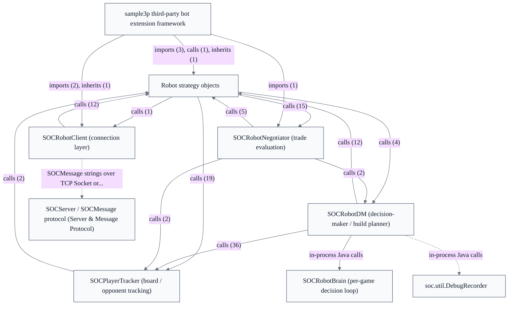

# Robot / AI Players

## Strategic Context
- **Dissertation origin, first-class bots** — Per doc/Readme.developer.md and CLAUDE.md, the robot subsystem descends from Robert S. Thomas' intelligent-agents dissertation and is treated as first-class rather than an afterthought — which is why decision-making is richly decomposed (brain, decision-maker, per-player trackers, negotiator, strategy objects) instead of a single inline heuristic.
- **Bots exist for game liveness** — Per the epic charter, built-in bots run inside the server JVM and fill empty seats so games can start and continue without enough human players; the subsystem's reason to exist is keeping games playable, not standalone AI research output.
- **Protocol parity over a privileged in-process API** — Bots deliberately reuse the identical human-client SOCMessage string protocol (writeUTF/readUTF) instead of a dedicated bot RPC channel (doc/Readme.developer.md), so non-Java and third-party bots interoperate on the same wire contract — this is why connection (SOCRobotClient) is separated from decision-making (SOCRobotBrain).
- **Replaceable strategy objects as the extension seam** — Decision logic is factored into strategy objects behind brain factory methods (setStrategyFields()) and exposed via virtual hooks, so a third party extends behavior by subclassing client/brain (soc.robot.sample3p) rather than editing core constants.

## Overview
Robot decision loop (SOCRobotBrain): a dedicated Thread per seated game whose run() loop blocks on a CappedQueue<SOCMessage> fed by the network client plus a once-per-second SOCRobotPinger TIMINGPING. Each message is folded into a local SOCGame mirror, ourTurn is recomputed, and an expect*/waitingFor* flag state machine drives turn behavior; on its turn the brain executes a buildingPlan (SOCBuildPlanStack) from the decision-maker, paces itself adaptively, and caps denied actions per turn with bounded retry counters. Strategy/negotiator/decision-maker collaborators are installed via setStrategyFields() factory methods. Robot client networking (SOCRobotClient): constructed with a ServerConnectInfo value object and credentials; init() opens a TCP Socket or same-JVM StringConnection, starts the reader thread, and sends SOCVersion + SOCImARobot (nickname, robotCookie, rbclass). Because the bot speaks the same human-client SOCMessage protocol, the server needs no dedicated bot RPC. Connection handling is kept separate from per-game decision-making (the brain); built-in bots are pinned to the server version so most sync messages are skipped, and extension points are virtual hooks rather than edited constants. Third-party bot extension framework (sample3p): documented (unverified in code context) extension surface where a custom bot subclasses the same robot client/brain — Sample3PClient, Sample3PBrain, SampleDiscardStrategy — and may carry data through the reserved _EXT_BOT game-option namespace, rather than implementing a new interface. Robot robustness for unknown inventory items: living entirely inside SOCRobotBrain, when the game reaches inventory-item placement (expectPLACING_INV_ITEM) the brain tries planAndPlaceInvItem (with scenario handlers like planAndPlaceInvItemPlacement_SC_FTRI for known types) and, for an unrecognized item, takes a generic fallbackUnknownInvItemPlacement cancel path tracked by a single rejectedPlayInvItem per turn — preserving liveness via bounded retries and the per-second watchdog and routing the cancel through the normal SOCMessage protocol.

## Components
- **SOCRobotClient (connection layer)**: Constructs from a ServerConnectInfo + credentials and on init() opens either a TCP Socket (hostname/port) or a same-JVM StringConnection (stringSocketName), then sends SOCVersion followed by SOCImARobot carrying nickname, robotCookie, and rbclass. Demultiplexes inbound SOCMessages to one SOCRobotBrain per seated game and writes the brain's outbound actions back to the server. Extends SOCDisplaylessPlayerClient so it shares the headless client machinery.
- **SOCRobotBrain (per-game decision loop)**: run() blocks on a CappedQueue<SOCMessage> fed by the client plus a once-per-second TIMINGPING from SOCRobotPinger. For each message it folds protocol updates into a local SOCGame mirror, recomputes ourTurn from the current player number, and drives a state machine of expect*/waitingFor* flag fields. On its turn it executes a buildingPlan (SOCBuildPlanStack) produced by the decision-maker, applies adaptive pause speed, enforces liveness with bounded per-turn retry counters and the per-second counter watchdog, and provides a generic fallbackUnknownInvItemPlacement cancel path (guarded by rejectedPlayInvItem / expectPLACING_INV_ITEM) for inventory items it has no placement strategy for. Wires in its collaborators via setStrategyFields() factory methods.
- **SOCRobotDM (decision-maker / build planner)**: Generates the building/strategy plan consumed by SOCRobotBrain, drawing heavily on SOCPlayerTracker for board/opponent state and on SOCGame/SOCPlayer for current resources and pieces. Optionally emits decision traces to a DebugRecorder for analysis.
- **SOCPlayerTracker (board / opponent tracking)**: Tracks possible and built pieces per SOCPlayer to feed plan scoring in SOCRobotDM.
- **SOCRobotNegotiator (trade evaluation)**: Assesses trade offers against the bot's current building plan and resource needs and decides accept/reject/counter behavior.
- **Robot strategy objects**: Encapsulate individual decision policies behind brain factory hooks (setStrategyFields()) so behavior can be overridden without editing the brain's main loop.
- **sample3p third-party bot extension framework**: Provides Sample3PClient / Sample3PBrain (and a sample discard strategy) as the starting point for writing a custom bot by subclassing the same client/brain rather than implementing a new interface.

## Boundaries
- **SOCRobotClient (connection layer)** boundary: Owns the bot's network lifecycle and identity: establishing the connection, performing the robot handshake, running the reader thread, and routing per-game messages to the correct brain. Stops at decision-making — it does not plan or choose game actions.
- **SOCRobotBrain (per-game decision loop)** boundary: Owns one game's decision-making as a dedicated Thread — one brain instance per game the bot is seated in. The boundary is the gameEventQ blocking queue on the inbound side and emitted SOCMessage actions on the outbound side; it does not touch sockets directly (that is SOCRobotClient's job).
- **SOCRobotDM (decision-maker / build planner)** boundary: Owns the 'what should we build next' computation. The boundary is plan production: it reads game state and player trackers and returns a building plan to the brain; it never sends protocol messages or manages turn state itself.
- **SOCPlayerTracker (board / opponent tracking)** boundary: Owns the bot's modeled view of each player's development on the board — potential settlements/roads, longest-road and win estimates — kept per player. Consumed by the decision-maker; it is a read-model over the game state, not an actor that mutates the game.
- **SOCRobotNegotiator (trade evaluation)** boundary: Owns evaluation of incoming trade offers and formulation of counter-offers, separate from building strategy. Invoked by the brain when trade-related protocol messages arrive.
- **Robot strategy objects** boundary: A family of replaceable strategy components (discard, opening placement, robber/monopoly and related decisions) installed into the brain via factory methods. The boundary is the strategy interface the brain calls; concrete behavior is swappable per bot.
- **sample3p third-party bot extension framework** boundary: The documented extension surface for third-party bots: trivial subclasses of the robot client and brain that demonstrate the minimal override points, plus the reserved _EXT_BOT game-option namespace for passing bot-specific data.

## Integration Points
- **Robot ⇄ Server SOCMessage channel**: Bots connect to the authoritative SOCServer exactly like human clients, speaking the identical SOCMessage string protocol. SOCRobotClient performs the version + SOCImARobot handshake (nickname, robotCookie, rbclass) and thereafter exchanges all game traffic over this channel; SOCRobotBrain consumes inbound messages from gameEventQ and emits action messages back through the client. — see [Server & Message Protocol](../server-message-protocol/server-message-protocol.arch.md)
- **Local game-state mirror**: SOCRobotBrain folds inbound protocol updates into a local SOCGame/SOCPlayer mirror so it can reason about state — recomputing ourTurn, applying piece placements, player-element and dice-result changes, and accepted trades. — see [Game Model & Rules Engine](../game-model-rules-engine/game-model-rules-engine.arch.md)
- **Planning over the game model**: SOCRobotDM and SOCPlayerTracker read the game model to score and produce building plans — querying player resources, pieces, and board potential. — see [Game Model & Rules Engine](../game-model-rules-engine/game-model-rules-engine.arch.md)
- **Decision trace recording**: The decision-maker optionally emits planning traces to a DebugRecorder utility for offline analysis of bot decisions.

## Diagrams
### Architecture

## Source Linkage
- [SOCRobotBrain (per-game decision loop)](../../../src/main/java/soc/robot/SOCRobotBrain.java)
- [SOCRobotClient (connection layer)](../../../src/main/java/soc/robot/SOCRobotClient.java)
- [SOCRobotDM (decision-maker / build planner)](../../../src/main/java/soc/robot/SOCRobotDM.java)
- [SOCPlayerTracker (board / opponent tracking)](../../../src/main/java/soc/robot/SOCPlayerTracker.java)
- [SOCRobotNegotiator (trade evaluation)](../../../src/main/java/soc/robot/SOCRobotNegotiator.java)
- [sample3p third-party bot extension framework](../../../src/main/java/soc/robot/sample3p)
- [Decision trace recording integration](../../../src/main/java/soc/util/DebugRecorder.java)
- [Robot ⇄ Server SOCMessage channel](../../../src/main/java/soc/robot/SOCRobotClient.java)

Parent scope: [_scope.md](_scope.md)

## Source Linkage Grounding

_Per-row confidence; `_unverified_` rows are disclosed, not verified; `0.08 (resolved, uncited)` is the resolved-but-uncited baseline, not measured evidence._

| Element | Doc Evidence | Code Evidence | Confidence |
|---------|--------------|---------------|-----------:|
| Source Linkage: SOCRobotBrain (per-game decision loop) |  | src/main/java/soc/robot/SOCRobotBrain.java | 0.83 |
| Source Linkage: SOCRobotClient (connection layer) |  | src/main/java/soc/robot/SOCRobotClient.java | 0.75 |
| Source Linkage: SOCRobotDM (decision-maker / build planner) |  | src/main/java/soc/robot/SOCRobotDM.java | 0.75 |
| Source Linkage: SOCPlayerTracker (board / opponent tracking) |  | src/main/java/soc/robot/SOCPlayerTracker.java | 0.75 |
| Source Linkage: SOCRobotNegotiator (trade evaluation) |  | src/main/java/soc/robot/SOCRobotNegotiator.java | 0.75 |
| Source Linkage: sample3p third-party bot extension framework |  | src/main/java/soc/robot/sample3p | 0.08 (resolved, uncited) |
| Source Linkage: Decision trace recording integration |  | src/main/java/soc/util/DebugRecorder.java | 0.75 |

Related scopes: [Desktop Swing Client](../desktop-swing-client/desktop-swing-client.arch.md), [Game Model & Rules Engine](../game-model-rules-engine/game-model-rules-engine.arch.md), [Server & Message Protocol](../server-message-protocol/server-message-protocol.arch.md)
