# Robot client networking (SOCRobotClient)

## Strategic Context
- **Bots as first-class clients** — The robot subsystem originates from Robert S. Thomas' AI-agent dissertation, so the bot connecting over the same protocol as a human is intentional architecture, not a shortcut: it lets the AI be exercised through the real client surface. SOCRobotClient's reuse of SOCDisplaylessPlayerClient encodes that the bot is a real network peer.
- **Third-party bot ecosystem** — The class javadoc explicitly supports third-party bots that extend SOCRobotClient/SOCRobotBrain or are built from scratch in other languages, with version differences tolerated. The explicit rbclass, security cookie, and overridable buildClientFeats() exist so external bots can authenticate and declare capabilities without the server special-casing them.

## Overview
A built-in or third-party bot constructs SOCRobotClient with a ServerConnectInfo and credentials, then calls init(). init() establishes either a TCP Socket (hostname/port) or a same-JVM StringConnection (stringSocketName), spins up the reader thread, and sends a SOCVersion message followed by SOCImARobot carrying the nickname, the robotCookie from ServerConnectInfo, and rbclass. Because the bot speaks the identical SOCMessage string protocol that human clients use (writeUTF/readUTF), the server treats it like any other connection. The inherited run() loop reads each framed string, parses it with SOCMessage.toMsg, and dispatches via treat(); SOCRobotClient.treat() intercepts bot-only types (join requests, robot-parameter updates, dismissals) and delegates everything else to SOCDisplaylessPlayerClient.treat(), which folds message contents into the local SOCGame model. Per-game decision-making is not done here: each joined game gets a SOCRobotBrain fed through a CappedQueue, keeping connection concerns separate from move planning. disconnectReconnect() reuses the same handshake to recover dropped links.

## Components
- **SOCRobotClient**
- **SOCDisplaylessPlayerClient**
- **ServerConnectInfo**
- **SOCRobotParameters**

## Connections
- **SOCDisplaylessPlayerClient** (outbound) — via Java inheritance — SOCRobotClient extends SOCDisplaylessPlayerClient; treat() default case calls super.treat() (evidence: src/main/java/soc/robot/SOCRobotClient.java (public class SOCRobotClient extends SOCDisplaylessPlayerClient))
- **ServerConnectInfo** (outbound) — via Held as final serverConnectInfo field; read for hostname/port/stringSocketName/robotCookie in init() (evidence: src/main/java/soc/baseclient/SOCDisplaylessPlayerClient.java (protected final ServerConnectInfo serverConnectInfo))
- **SOCRobotParameters** (inbound) — via Received via SOCUpdateRobotParams network message, cached as currentRobotParameters (evidence: src/main/java/soc/robot/SOCRobotClient.java (protected SOCRobotParameters currentRobotParameters))
- **SOCRobotBrain** (outbound) — via Per-game brains in robotBrains Hashtable, fed messages through per-brain CappedQueue (brainQs); created via createBrain() (evidence: src/main/java/soc/robot/SOCRobotClient.java (Hashtable<String, SOCRobotBrain> robotBrains))
- **SOCServer** (bidirectional) — via TCP Socket or same-JVM StringServerSocket carrying SOCMessage strings (writeUTF/readUTF) (evidence: src/main/java/soc/robot/SOCRobotClient.java::init (sock = new Socket(...); sLocal = StringServerSocket.connectTo(...)))
- **SOCGameOptionSet** (inbound) — via knownOpts seeded from getAllKnownOptions(); per-game options cached in gameOptions Hashtable from SOCBotJoinGameRequest (evidence: src/main/java/soc/robot/SOCRobotClient.java (Hashtable<String, SOCGameOptionSet> gameOptions))

## Design Decisions
- **Bots reuse the human-client SOCMessage protocol instead of a dedicated bot RPC channel**: SOCRobotClient extends SOCDisplaylessPlayerClient and sends the same SOCVersion/SOCImARobot/JOINGAME exchange a human client would, so the server need not special-case bot traffic. The wire format is plain writeUTF/readUTF unicode strings, which also keeps the door open for non-Java third-party bots to interoperate.
- **Connection identity is a ServerConnectInfo value object rather than overloaded constructors**: Its javadoc states the class exists to avoid pairs of TCP/string-socket constructors and to let future bot clients receive more server info or a new protocol's port without changing their constructor signatures. It carries the robotCookie but deliberately omits nickname/password, which are passed separately, so the same struct serves both bot and human callers.
- **Separate connection layer from per-game decision-making**: SOCRobotClient owns sockets, the handshake, and message routing, but holds a Hashtable of SOCRobotBrain plus per-brain CappedQueues and hands each game's messages to its brain rather than deciding moves inline. This isolates the volatile AI logic from the stable networking core and lets a third-party bot override createBrain()/buildClientFeats() without touching transport.
- **Built-in bots are pinned to the server version; sync messages are largely skipped**: Because built-in bots run in the server JVM and are the same version, allOptsReceived defaults true and knownOpts is seeded from getAllKnownOptions(), so SOCGameOptionInfo/SOCScenarioInfo synchronization is unnecessary (handled only if sent). Third-party bots may differ in version, which is why client features and rbclass are explicitly negotiated at connect.
- **Extension points are virtual hooks, not subclass-edited constants**: Third-party bots set rbclass, override createBrain() to supply their SOCRobotBrain subclass, and override buildClientFeats() when their optional client features differ, with Sample3PClient as the trivial reference. This keeps the base handshake intact while letting subclasses declare their own capabilities.

## Constraints
- **[HARD]** A robot client MUST authenticate its connection with the server-issued security cookie carried in ServerConnectInfo.robotCookie when sending SOCImARobot. — src/main/java/soc/robot/SOCRobotClient.java::init (put(SOCImARobot.toCmd(nickname, serverConnectInfo.robotCookie, rbclass)))
- **[HARD]** ServerConnectInfo MUST NOT be null when constructing a displayless/robot client; the base constructor throws IllegalArgumentException otherwise. — src/main/java/soc/baseclient/SOCDisplaylessPlayerClient.java::SOCDisplaylessPlayerClient (if (sci == null) throw new IllegalArgumentException)
- **[HARD]** buildClientFeats() MUST NOT return null; init() throws IllegalStateException if a subclass override returns null. — src/main/java/soc/robot/SOCRobotClient.java::init (if (cliFeats == null) throw new IllegalStateException)
- **[SOFT]** Third-party subclasses SHOULD update rbclass, override createBrain(), and override buildClientFeats() before calling init() when their behavior or features differ from the built-in bot. — src/main/java/soc/robot/SOCRobotClient.java::SOCRobotClient (class javadoc Third-Party Bots list)
- **[HARD]** disconnectReconnect() retries the connect handshake a maximum of 3 times before giving up and killing active brains. — src/main/java/soc/robot/SOCRobotClient.java::disconnectReconnect (for attempt = 3 loop)

## Non-Functional Requirements
- **reliability** — Dropped connections are recovered by disconnectReconnect(), which re-runs the full connect handshake up to 3 times and, on total failure, sets connected=false and kills all active brains so games fail cleanly. — src/main/java/soc/robot/SOCRobotClient.java::disconnectReconnect
- **reliability** — The TCP socket sets a 300000 ms read timeout, intentionally longer than the bot client-ping sleep interval, so a healthy bot is kept alive by pings while a truly dead link eventually times out. — src/main/java/soc/robot/SOCRobotClient.java::init (sock.setSoTimeout(300000))
- **security** — Robot connections are gated by a weak shared-secret cookie required by server v1.1.19+, configured via jsettlers.bots.cookie; ServerConnectInfo stores it as a final field and it is unused (null) for human clients. — src/main/java/soc/baseclient/ServerConnectInfo.java::ServerConnectInfo (robotCookie javadoc)
- **observability** — When jsettlers.debug.traffic is set, all inbound/outbound SOCMessage contents are debug-printed, with repetitive idle SOCServerPing traffic suppressed via nextServerPingExpectedAt to keep logs readable. — src/main/java/soc/baseclient/SOCDisplaylessPlayerClient.java::treat (PROP_JSETTLERS_DEBUG_TRAFFIC, nextServerPingExpectedAt)
- **error-handling** — init() catches all connect exceptions, stores them in ex, and prints to System.err rather than throwing, so a failed bot connect degrades to an inert client instead of crashing the host JVM. — src/main/java/soc/robot/SOCRobotClient.java::init (catch (Exception e) { ex = e; ... })

## Examples
*The two-message connect handshake: announce version+features, then authenticate as a robot with the cookie and class.*
*Source: `src/main/java/soc/robot/SOCRobotClient.java:init`*
```
put(SOCVersion.toCmd
    (Version.versionNumber(), Version.version(), Version.buildnum(), cliFeats.getEncodedList(), null));
put(SOCImARobot.toCmd(nickname, serverConnectInfo.robotCookie, rbclass));
```

*Shared read loop: every framed string is parsed to a SOCMessage and dispatched, identical to a human client's path.*
*Source: `src/main/java/soc/baseclient/SOCDisplaylessPlayerClient.java:run`*
```
SOCMessage msg = SOCMessage.toMsg(s);
if (msg != null)
    treat(msg);
else if (debugTraffic)
    soc.debug.D.ebugERROR(nickname + ": Could not parse net message: " + s);
```

## Diagrams
### Class

```mermaid
%%{init: {'theme': 'base', 'themeVariables': {'primaryTextColor': '#111827', 'secondaryTextColor': '#111827', 'tertiaryTextColor': '#111827', 'lineColor': '#6b7280', 'fontFamily': 'Inter, ui-sans-serif, system-ui, sans-serif'}}}%%
classDiagram
    class SOCRobotParameters {
        +public SOCRobotParameters(SOCRobotParameters params)
        +copyIfOptionChanged()
        +public int getMaxGameLength()
        +public int getMaxETA()
        +public float getETABonusFactor()
        +public float getAdversarialFactor()
        +public float getLeaderAdversarialFactor()
        +public float getDevCardMultiplier()
        +public float getThreatMultiplier()
        +public int getStrategyType()
        +public int getTradeFlag()
        +public boolean equals(Object o)
        +@Override
    public String toString()
    }
    class SOCDisplaylessPlayerClient {
        +SOCDisplaylessPlayerClient()
        +public String getNickname()
        +public SOCGame getGame(final String gaName)
        +public void run()
        +public void resend()
        +put()
        -treat()
        -protected void handleSTATUSMESSAGE(SOCStatusMessage mes)
        -protected void handleSERVERPING(SOCServerPing mes)
        -handleJOINCHANNELAUTH()
        -handleVERSION()
        -protected void handleJOINCHANNEL(SOCJoinChannel mes)
        -protected void handleCHANNELMEMBERS(SOCChannelMembers mes)
        -protected void handleNEWCHANNEL(SOCNewChannel mes)
        -protected void handleCHANNELS(SOCChannels mes)
        -protected void handleBCASTTEXTMSG(SOCBCastTextMsg mes)
        -protected void handleCHANNELTEXTMSG(SOCChannelTextMsg mes)
        -protected void handleLEAVECHANNEL(SOCLeaveChannel mes)
        -protected void handleDELETECHANNEL(SOCDeleteChannel mes)
        -protected void handleGAMES(SOCGames mes)
        -handleGAMESWITHOPTIONS()
        -handleJOINGAMEAUTH()
        -protected void handleJOINGAME(SOCJoinGame mes)
        -protected void handleLEAVEGAME(SOCLeaveGame mes)
        -protected void handleNEWGAME(SOCNewGame mes)
        -handleNEWGAMEWITHOPTIONS()
        -protected void handleDELETEGAME(SOCDeleteGame mes)
        -protected void handleGAMEMEMBERS(SOCGameMembers mes)
        +handleGAMESTATS()
        -protected void handleGAMETEXTMSG(SOCGameTextMsg mes)
        -protected void handleGAMESERVERTEXT(SOCGameServerText mes)
        +handleDICERESULTRESOURCES()
        -protected SOCGame handleSITDOWN(final SOCSitDown mes)
        +handleBOARDLAYOUT()
        +handleBOARDLAYOUT2()
        -handleSTARTGAME()
        +handleSTARTGAME_checkIsBotsOnly()
        +handleGAMESTATE()
        +handleDECLINEPLAYERREQUEST()
        -protected void handleSETTURN(SOCSetTurn mes)
        -protected void handleFIRSTPLAYER(SOCFirstPlayer mes)
        -protected void handleTURN(SOCTurn mes)
        -handlePLAYERELEMENTS()
        +handlePLAYERELEMENT()
        +handlePLAYERELEMENT_simple()
        +handlePLAYERELEMENT_numPieces()
        +handlePLAYERELEMENT_numKnights()
        +handlePLAYERELEMENT_numRsrc()
        -handleGAMEELEMENTS()
        +handleGAMEELEMENT()
        -protected void handleRESOURCECOUNT(SOCResourceCount mes)
        +handleLASTSETTLEMENT()
        -protected void handleDICERESULT(SOCDiceResult mes)
        +handlePUTPIECE()
        -handleCANCELBUILDREQUEST()
        +handleDISCARD()
        -protected void handleMOVEROBBER(SOCMoveRobber mes)
        -protected void handleDISCARDREQUEST(SOCDiscardRequest mes)
        -handleCHOOSEPLAYERREQUEST()
        +handleROBBERYRESULT()
        -protected void handleMAKEOFFER(SOCMakeOffer mes)
        -protected void handleCLEAROFFER(SOCClearOffer mes)
        -protected void handleREJECTOFFER(SOCRejectOffer mes)
        +handleACCEPTOFFER()
        -protected void handleCLEARTRADEMSG(SOCClearTradeMsg mes)
        +handleBANKTRADE()
        -protected void handleDEVCARDCOUNT(SOCDevCardCount mes)
        -handleDEVCARDACTION()
        -handleSETPLAYEDDEVCARD()
        +handlePICKRESOURCES()
        +handleINVENTORYITEMACTION()
        +handlePOTENTIALSETTLEMENTS()
        -protected void handleCHANGEFACE(SOCChangeFace mes)
        -handleREJECTCONNECTION()
        -protected void handleLONGESTROAD(SOCLongestRoad mes)
        -protected void handleLARGESTARMY(SOCLargestArmy mes)
        -protected void handleSETSEATLOCK(SOCSetSeatLock mes)
        -protected void handleRESETBOARDAUTH(SOCResetBoardAuth mes)
        -handleGAMEOPTIONINFO()
        +handleCHANGEGAMEOPTIONS()
        +handleSETLASTACTION()
        +handleUNDONOTALLOWEDREASONTEXT()
        +handlePLAYERSTATS()
        +handleSIMPLEREQUEST()
        +handleSIMPLEACTION()
        -protected void handleMOVEPIECE(SOCMovePiece mes)
        -protected void handleREMOVEPIECE(SOCRemovePiece mes)
        +handleUNDOPUTPIECE()
        -handleREVEALFOGHEX()
        -protected void handlePIECEVALUE(final SOCPieceValue mes)
        +handleSETSHIPROUTECLOSED()
        +handleSETSPECIALITEM()
        +public void chSend(String ch, String mes)
        +public void leaveChannel(String ch)
        -protected void disconnect()
        +public void joinGame(final String gaName)
        +public void buyDevCard(SOCGame ga)
        +buildRequest()
        +public void cancelBuildRequest(SOCGame ga, int piece)
        +putPiece()
        +movePieceRequest()
        +undoPutOrMovePieceRequest()
        +public void moveRobber(SOCGame ga, SOCPlayer pl, int coord)
        +simpleRequest()
        +pickSpecialItem()
        +playInventoryItem()
        +public void sendText(SOCGame ga, String me)
        +public void leaveGame(final String gaName)
        +public void sitDown(SOCGame ga, int pn)
        +public void startGame(SOCGame ga)
        +public void rollDice(SOCGame ga)
        +public void endTurn(SOCGame ga)
        +public void discard(SOCGame ga, SOCResourceSet rs)
        +public void choosePlayer(SOCGame ga, final int ch)
        +public void rejectOffer(SOCGame ga)
        +public void acceptOffer(SOCGame ga, int from)
        +public void clearOffer(SOCGame ga)
        +bankTrade()
        +public void offerTrade(SOCGame ga, SOCTradeOffer offer)
        +public void playDevCard(SOCGame ga, int dc)
        +public void pickResources(SOCGame ga, SOCResourceSet rscs)
        +public void pickResourceType(SOCGame ga, int res)
        +public void changeFace(SOCGame ga, int id)
        +setSeatLock()
        +public void destroy()
        +public static void main(String[] args)
    }
    class ServerConnectInfo {
        +ServerConnectInfo()
    }
    class SOCRobotClient {
        +SOCRobotClient()
        +public void init()
        +public void disconnectReconnect()
        -protected SOCFeatureSet buildClientFeats()
        +createBrain()
        +@Override
    public void treat(SOCMessage mes)
        -protected void handleADMINPING(SOCAdminPing mes)
        -protected void handleADMINRESET(SOCAdminReset mes)
        -handleUPDATEROBOTPARAMS()
        -handleBOTJOINGAMEREQUEST()
        -handleSTATUSMESSAGE()
        -handleJOINGAMEAUTH()
        -handleGAMEMEMBERS()
        -protected void handlePutBrainQ(SOCMessageForGame mes)
        -handleGAMETEXTMSG()
        -protected void handleGAMETEXTMSG_debug(SOCGameTextMsg mes)
        -handleSITDOWN()
        -handleDELETEGAME()
        -handleGAMESTATE()
        -protected void handleROBOTDISMISS(SOCRobotDismiss mes)
        -handleRESETBOARDAUTH()
        -sendRecordsText()
        +debugPrintBrainStatus()
        +leaveGame()
        +public void addCleanKill()
        +@Override
    public void destroy()
        +public static void main(String[] args)
    }

    SOCRobotClient --|> SOCDisplaylessPlayerClient : extends
```



### Dependency

```mermaid
%%{init: {'theme': 'base', 'themeVariables': {'primaryTextColor': '#111827', 'secondaryTextColor': '#111827', 'tertiaryTextColor': '#111827', 'lineColor': '#6b7280', 'fontFamily': 'Inter, ui-sans-serif, system-ui, sans-serif'}}}%%
graph TD
    classDef default fill:#f8fafc,stroke:#475569,color:#111827

    src_main_java_soc_baseclient_SOCDisplaylessPlayerClient_java["SOCDisplaylessPlayerClient.java"]
    src_main_java_soc_baseclient_ServerConnectInfo_java["ServerConnectInfo.java"]
    src_main_java_soc_robot_SOCRobotClient_java["SOCRobotClient.java"]
    src_main_java_soc_util_SOCRobotParameters_java["SOCRobotParameters.java"]

    src_main_java_soc_robot_SOCRobotClient_java -->|"imports"| src_main_java_soc_baseclient_SOCDisplaylessPlayerClient_java
    src_main_java_soc_robot_SOCRobotClient_java -->|"imports"| src_main_java_soc_baseclient_ServerConnectInfo_java
    src_main_java_soc_robot_SOCRobotClient_java -->|"imports"| src_main_java_soc_util_SOCRobotParameters_java

    ext_src_main_java_soc_game_GameAction_java["GameAction.java"]:::default
    src_main_java_soc_baseclient_SOCDisplaylessPlayerClient_java -.->|"imports"| ext_src_main_java_soc_game_GameAction_java
    ext_src_main_java_soc_game_SOCBoard_java["SOCBoard.java"]:::default
    src_main_java_soc_baseclient_SOCDisplaylessPlayerClient_java -.->|"imports"| ext_src_main_java_soc_game_SOCBoard_java
    ext_src_main_java_soc_game_SOCBoardLarge_java["SOCBoardLarge.java"]:::default
    src_main_java_soc_baseclient_SOCDisplaylessPlayerClient_java -.->|"imports"| ext_src_main_java_soc_game_SOCBoardLarge_java
    ext_src_main_java_soc_game_SOCCity_java["SOCCity.java"]:::default
    src_main_java_soc_baseclient_SOCDisplaylessPlayerClient_java -.->|"imports"| ext_src_main_java_soc_game_SOCCity_java
    ext_src_main_java_soc_game_SOCDevCardConstants_java["SOCDevCardConstants.java"]:::default
    src_main_java_soc_baseclient_SOCDisplaylessPlayerClient_java -.->|"imports"| ext_src_main_java_soc_game_SOCDevCardConstants_java
    ext_src_main_java_soc_game_SOCFortress_java["SOCFortress.java"]:::default
    src_main_java_soc_baseclient_SOCDisplaylessPlayerClient_java -.->|"imports"| ext_src_main_java_soc_game_SOCFortress_java
    ext_src_main_java_soc_game_SOCGame_java["SOCGame.java"]:::default
    src_main_java_soc_baseclient_SOCDisplaylessPlayerClient_java -.->|"imports"| ext_src_main_java_soc_game_SOCGame_java
    src_main_java_soc_robot_SOCRobotClient_java -.->|"imports"| ext_src_main_java_soc_game_SOCGame_java
    ext_src_main_java_soc_game_SOCGameOption_java["SOCGameOption.java"]:::default
    src_main_java_soc_baseclient_SOCDisplaylessPlayerClient_java -.->|"imports"| ext_src_main_java_soc_game_SOCGameOption_java
    src_main_java_soc_robot_SOCRobotClient_java -.->|"imports"| ext_src_main_java_soc_game_SOCGameOption_java
    src_main_java_soc_util_SOCRobotParameters_java -.->|"imports"| ext_src_main_java_soc_game_SOCGameOption_java
    ext_src_main_java_soc_game_SOCGameOptionSet_java["SOCGameOptionSet.java"]:::default
    src_main_java_soc_baseclient_SOCDisplaylessPlayerClient_java -.->|"imports"| ext_src_main_java_soc_game_SOCGameOptionSet_java
    src_main_java_soc_robot_SOCRobotClient_java -.->|"imports"| ext_src_main_java_soc_game_SOCGameOptionSet_java
    src_main_java_soc_util_SOCRobotParameters_java -.->|"imports"| ext_src_main_java_soc_game_SOCGameOptionSet_java
    ext_src_main_java_soc_game_SOCInventory_java["SOCInventory.java"]:::default
    src_main_java_soc_baseclient_SOCDisplaylessPlayerClient_java -.->|"imports"| ext_src_main_java_soc_game_SOCInventory_java
    ext_src_main_java_soc_game_SOCInventoryItem_java["SOCInventoryItem.java"]:::default
    src_main_java_soc_baseclient_SOCDisplaylessPlayerClient_java -.->|"imports"| ext_src_main_java_soc_game_SOCInventoryItem_java
    ext_src_main_java_soc_game_SOCPlayer_java["SOCPlayer.java"]:::default
    src_main_java_soc_baseclient_SOCDisplaylessPlayerClient_java -.->|"imports"| ext_src_main_java_soc_game_SOCPlayer_java
    src_main_java_soc_robot_SOCRobotClient_java -.->|"imports"| ext_src_main_java_soc_game_SOCPlayer_java
    ext_src_main_java_soc_game_SOCPlayingPiece_java["SOCPlayingPiece.java"]:::default
    src_main_java_soc_baseclient_SOCDisplaylessPlayerClient_java -.->|"imports"| ext_src_main_java_soc_game_SOCPlayingPiece_java
    ext_src_main_java_soc_game_SOCResourceConstants_java["SOCResourceConstants.java"]:::default
    src_main_java_soc_baseclient_SOCDisplaylessPlayerClient_java -.->|"imports"| ext_src_main_java_soc_game_SOCResourceConstants_java
    ext_src_main_java_soc_game_SOCResourceSet_java["SOCResourceSet.java"]:::default
    src_main_java_soc_baseclient_SOCDisplaylessPlayerClient_java -.->|"imports"| ext_src_main_java_soc_game_SOCResourceSet_java
    ext_src_main_java_soc_game_SOCRoad_java["SOCRoad.java"]:::default
    src_main_java_soc_baseclient_SOCDisplaylessPlayerClient_java -.->|"imports"| ext_src_main_java_soc_game_SOCRoad_java
    ext_src_main_java_soc_game_SOCRoutePiece_java["SOCRoutePiece.java"]:::default
    src_main_java_soc_baseclient_SOCDisplaylessPlayerClient_java -.->|"imports"| ext_src_main_java_soc_game_SOCRoutePiece_java
    ext_src_main_java_soc_game_SOCSettlement_java["SOCSettlement.java"]:::default
    src_main_java_soc_baseclient_SOCDisplaylessPlayerClient_java -.->|"imports"| ext_src_main_java_soc_game_SOCSettlement_java
    ext_src_main_java_soc_game_SOCShip_java["SOCShip.java"]:::default
    src_main_java_soc_baseclient_SOCDisplaylessPlayerClient_java -.->|"imports"| ext_src_main_java_soc_game_SOCShip_java
    ext_src_main_java_soc_game_SOCSpecialItem_java["SOCSpecialItem.java"]:::default
    src_main_java_soc_baseclient_SOCDisplaylessPlayerClient_java -.->|"imports"| ext_src_main_java_soc_game_SOCSpecialItem_java
    ext_src_main_java_soc_game_SOCTradeOffer_java["SOCTradeOffer.java"]:::default
    src_main_java_soc_baseclient_SOCDisplaylessPlayerClient_java -.->|"imports"| ext_src_main_java_soc_game_SOCTradeOffer_java
    ext_src_main_java_soc_game_SOCVillage_java["SOCVillage.java"]:::default
    src_main_java_soc_baseclient_SOCDisplaylessPlayerClient_java -.->|"imports"| ext_src_main_java_soc_game_SOCVillage_java
    ext_src_main_java_soc_server_genericServer_StringConnection_java["StringConnection.java"]:::default
    src_main_java_soc_baseclient_SOCDisplaylessPlayerClient_java -.->|"imports"| ext_src_main_java_soc_server_genericServer_StringConnection_java
    ext_src_main_java_soc_server_genericServer_StringServerSocket_java["StringServerSocket.java"]:::default
    src_main_java_soc_robot_SOCRobotClient_java -.->|"imports"| ext_src_main_java_soc_server_genericServer_StringServerSocket_java
    ext_src_main_java_soc_util_CappedQueue_java["CappedQueue.java"]:::default
    src_main_java_soc_robot_SOCRobotClient_java -.->|"imports"| ext_src_main_java_soc_util_CappedQueue_java
    ext_src_main_java_soc_util_CutoffExceededException_java["CutoffExceededException.java"]:::default
    src_main_java_soc_robot_SOCRobotClient_java -.->|"imports"| ext_src_main_java_soc_util_CutoffExceededException_java
    ext_src_main_java_soc_util_DebugRecorder_java["DebugRecorder.java"]:::default
    src_main_java_soc_robot_SOCRobotClient_java -.->|"imports"| ext_src_main_java_soc_util_DebugRecorder_java
    ext_src_main_java_soc_util_SOCFeatureSet_java["SOCFeatureSet.java"]:::default
    src_main_java_soc_baseclient_SOCDisplaylessPlayerClient_java -.->|"imports"| ext_src_main_java_soc_util_SOCFeatureSet_java
    src_main_java_soc_robot_SOCRobotClient_java -.->|"imports"| ext_src_main_java_soc_util_SOCFeatureSet_java
    ext_src_main_java_soc_util_Version_java["Version.java"]:::default
    src_main_java_soc_baseclient_SOCDisplaylessPlayerClient_java -.->|"imports"| ext_src_main_java_soc_util_Version_java
    src_main_java_soc_robot_SOCRobotClient_java -.->|"imports"| ext_src_main_java_soc_util_Version_java
```



## Source Linkage
- [SOCRobotClient connection layer and handshake](../../../src/main/java/soc/robot/SOCRobotClient.java::SOCRobotClient)
- [init() opens socket, starts reader, sends version + IMAROBOT](../../../src/main/java/soc/robot/SOCRobotClient.java::init)
- [disconnectReconnect() 3-attempt recovery](../../../src/main/java/soc/robot/SOCRobotClient.java::disconnectReconnect)
- [buildClientFeats() overridable feature declaration](../../../src/main/java/soc/robot/SOCRobotClient.java::buildClientFeats)
- [Headless Runnable base client run()/treat()/put()](../../../src/main/java/soc/baseclient/SOCDisplaylessPlayerClient.java::SOCDisplaylessPlayerClient)
- [Base constructor null-check on ServerConnectInfo](../../../src/main/java/soc/baseclient/SOCDisplaylessPlayerClient.java::SOCDisplaylessPlayerClient)
- [ServerConnectInfo carries hostname/stringSocketName/robotCookie](../../../src/main/java/soc/baseclient/ServerConnectInfo.java::ServerConnectInfo)
- [SOCRobotParameters per-bot strategy/tuning value object](../../../src/main/java/soc/util/SOCRobotParameters.java::SOCRobotParameters)

Parent scope: [_scope.md](_scope.md)
Sibling feature: [robot-client-networking-socrobotclient.feature.md](robot-client-networking-socrobotclient.feature.md)
Scope architecture: [robot-ai-players.arch.md](robot-ai-players.arch.md)

## Source Linkage Grounding

_Per-row confidence; `_unverified_` rows are disclosed, not verified; `0.08 (resolved, uncited)` is the resolved-but-uncited baseline, not measured evidence._

| Element | Doc Evidence | Code Evidence | Confidence |
|---------|--------------|---------------|-----------:|
| Source Linkage: SOCRobotClient connection layer and handshake |  | src/main/java/soc/robot/SOCRobotClient.java:339-342 | 0.75 |
| Source Linkage: init() opens socket, starts reader, sends version + IMAROBOT |  | src/main/java/soc/robot/SOCRobotClient.java:349-387 | 0.75 |
| Source Linkage: disconnectReconnect() 3-attempt recovery |  | src/main/java/soc/robot/SOCRobotClient.java:395-446 | 0.75 |
| Source Linkage: buildClientFeats() overridable feature declaration |  | src/main/java/soc/robot/SOCRobotClient.java:470-494 | 0.75 |
| Source Linkage: Headless Runnable base client run()/treat()/put() |  | src/main/java/soc/baseclient/SOCDisplaylessPlayerClient.java:263-274 | 0.89 |
| Source Linkage: ServerConnectInfo carries hostname/stringSocketName/robotCookie |  | src/main/java/soc/baseclient/ServerConnectInfo.java:86-92 | 0.48 |
| Source Linkage: SOCRobotParameters per-bot strategy/tuning value object |  | src/main/java/soc/util/SOCRobotParameters.java:88-99 | 0.75 |

Related scopes: [Desktop Swing Client](../desktop-swing-client/desktop-swing-client.arch.md), [Game Model & Rules Engine](../game-model-rules-engine/game-model-rules-engine.arch.md), [Server & Message Protocol](../server-message-protocol/server-message-protocol.arch.md)

## Contract Gaps Detected

| File | Declared Field | Accepting Function | Gap |
|------|----------------|--------------------|-----|
| `web/src/protocol/messages/SOCMakeOffer.ts` | `TradeOffer.to` | `constructor(offer: TradeOffer)` | No same-file read of `offer.to` was detected; document it as declared intent, not enforced behavior. |
| `web/src/protocol/messages/SOCMakeOffer.ts` | `TradeOffer.get` | `constructor(offer: TradeOffer)` | No same-file read of `offer.get` was detected; document it as declared intent, not enforced behavior. |
