# Robot decision loop (SOCRobotBrain)

## Strategic Context
- **Robot subsystem is first-class, not an afterthought** — Per the class javadoc and project docs, this AI originated in Robert S Thomas' intelligent-agent dissertation, so the per-game decision loop lives in SOCRobotBrain.run() and is designed for extension (factory methods, sample3p subclasses) rather than buried in the client.
- **Protocol-level parity enables third-party bots** — Because the brain only speaks SOCMessage through its client/queue, game option SOCGameOptionSet.K__EXT_BOT can pass server-side config to third-party bots, and non-Java bot implementations can join using the same simple writeUTF/readUTF message protocol.

## Overview
SOCRobotBrain is a dedicated Thread created by SOCRobotClient, one per game the bot is seated in. Its run() loop blocks on gameEventQ (a CappedQueue<SOCMessage>) fed by the network client plus a once-per-second TIMINGPING from SOCRobotPinger. For each message it first folds protocol updates into a local SOCGame mirror (handlePUTPIECE_updateGameData, handlePLAYERELEMENT, handleDICERESULT, ACCEPTOFFER, etc.), recomputes ourTurn from the game's current player number, and on TURN clears most per-turn state. It then consults the expect*/waitingFor* flag machine to recognize the awaited GAMESTATE and, when it is the bot's turn, delegates planning to SOCRobotDM and trade/strategy collaborators, issuing ordinary SOCMessage requests back to the server exactly as a human client would. Authoritative state lives at the server; the brain holds only the partial view it maintains from these messages.

## Components
- **SOCRobotBrain**: A Thread that owns one bot's per-game decision loop. run() drains the game-event queue, mutates a local SOCGame mirror, tracks expected next states via expect*/waitingFor* flags, and emits the same SOCMessage requests a human client would.
- **setStrategyFields()** (referenced; defined externally): Factory seam selecting the pluggable decision components (decisionMaker, negotiator, bseFactory, discardStrategy, monopolyStrategy, openingBuildStrategy, robberStrategy) so third-party bots can override behavior.
- **buildingPlan (SOCBuildPlanStack)** (referenced; defined externally): The current plan of what to build next; shared instance with SOCRobotDM.buildingPlan, cleared each turn via resetBuildingPlan().
- **expect*/waitingFor* flag fields** (referenced; defined externally): An explicit hand-rolled state machine mirroring server game-state transitions (e.g. expectPLACING_ROBBER, waitingForGameState) so the brain knows which incoming GAMESTATE/PUTPIECE message it is awaiting after a sent action.
- **counter / SOCTimingPing timekeeping** (referenced; defined externally): Incremented once per second by SOCRobotPinger's TIMINGPING; gives the brain a clock to bound waits for other players and to detect a wedged turn.
- **SOCRobotDM / SOCRobotNegotiator / *Strategy classes** (referenced; defined externally): Decision-making is delegated out of the loop: planStuff/planBuilding choose the build plan; negotiator/considerOffer handle trades; RobberStrategy, MonopolyStrategy, DiscardStrategy, OpeningBuildStrategy handle specific sub-decisions.
- **game-model types (integration, not owned)** (referenced; defined externally): SOCGame, SOCPlayer, SOCBoard/SOCBoardLarge, SOCInventory, SOCPlayingPiece, SOCResourceSet, SOCTradeOffer are read to derive state and choose moves; they are defined in soc.game and only integrated here.

## Connections
- **SOCRobotClient** (inbound) — via Constructs the brain via createBrain(...), supplies SOCRobotParameters and the CappedQueue<SOCMessage> gameEventQ, and routes debug chat commands; brain calls back through client (getClient()/resend()). (evidence: src/main/java/soc/robot/SOCRobotBrain.java constructor (client = rc; gameEventQ = mq) and class javadoc on SOCRobotClient.createBrain.)
- **SOCRobotPinger** (inbound) — via Enqueues a TIMINGPING into gameEventQ once per second to drive the brain's counter. (evidence: src/main/java/soc/robot/SOCRobotBrain.java: pinger = new SOCRobotPinger(gameEventQ, ...); run() increments counter on TIMINGPING.)
- **server (via SOCMessage protocol)** (outbound) — via Issues player-action messages (SOCPutPiece, SOCMakeOffer, SOCBankTrade, SOCMoveRobber, SOCDiscard, SOCAcceptOffer, etc.) through its client exactly like a human client. (evidence: src/main/java/soc/robot/SOCRobotBrain.java imports of soc.message.* action types and their handlers in run().)
- **soc.game model (SOCGame, SOCPlayer, SOCBoardLarge, SOCInventory)** (bidirectional) — via Reads state to plan moves and applies server updates into the local SOCGame mirror (game.updateAtTurn(), game.moveShip(), getPlayer(pn).setCurrentOffer()). (evidence: src/main/java/soc/robot/SOCRobotBrain.java run() updates to the game object and imports of soc.game types.)
- **SOCPlayerTracker** (bidirectional) — via One tracker per player created in setOurPlayerData()/addPlayerTracker(); brain feeds piece placements to trackers and reads predictions for planning. (evidence: src/main/java/soc/robot/SOCRobotBrain.java::playerTrackers, setOurPlayerData(), addPlayerTracker(int).)

## Design Decisions
- **Bots are ordinary protocol clients, not a privileged in-process API**: The brain reads state and acts solely by consuming and emitting SOCMessage through its client and queue (no direct server-state mutation). This keeps the bot interface identical to a human/non-Java client, so third-party bots can interoperate over the same wire protocol.
- **One Thread per game, driven by a blocking message queue**: run() sleeps on gameEventQ.get() and reacts event-by-event; a separate SOCRobotPinger injects TIMINGPING so the same loop also has a 1-second clock without a second timer thread.
- **Decision logic is factored into replaceable strategy objects behind factory methods**: setStrategyFields()/createDM()/createNegotiator() let subclasses (e.g. soc.robot.sample3p.Sample3PBrain) swap individual behaviors without rewriting the loop, supporting the bot subsystem's first-class, extensible design intent.
- **Bounded retry counters cap denied actions per turn**: failedBuildingAttempts/failedBankTrades/declinedOurPlayerTrades plus the high-counter bail-out prevent a buggy bot from looping forever on moves the server keeps rejecting, keeping the game moving.
- **Adaptive pause speed instead of a fixed think-time**: pauseFaster (6-player or ALWAYS_PAUSE_FASTER) and BOTS_ONLY_FAST_PAUSE_FACTOR shorten delays when no humans are watching, while BOTS_PAUSE_FOR_HUMAN_TRADE / TRADE_RESPONSE_TIMEOUT_SEC_HUMANS deliberately slow bots when humans can compete on trades.

## Constraints
- **[HARD]** setOurPlayerData() MUST be called before the brain is used or its thread is started. — src/main/java/soc/robot/SOCRobotBrain.java::SOCRobotBrain (constructor javadoc: "Please call setOurPlayerData() before using this brain or starting its thread"); strategy/player fields are null until then.
- **[HARD]** After this many server-denied build/decline requests in a turn, the bot MUST stop retrying that build. — src/main/java/soc/robot/SOCRobotBrain.java::MAX_DENIED_BUILDING_PER_TURN (=3), checked against failedBuildingAttempts.
- **[HARD]** After this many server-rejected bank/port trades in a turn, the bot MUST stop attempting bank trades. — src/main/java/soc/robot/SOCRobotBrain.java::MAX_DENIED_BANK_TRADES_PER_TURN (=9), checked against failedBankTrades.
- **[HARD]** After this many server-rejected player trade offers/counter-offers in a turn, the bot MUST stop offering. — src/main/java/soc/robot/SOCRobotBrain.java::MAX_DENIED_PLAYER_TRADES_PER_TURN (=9), checked against declinedOurPlayerTrades.
- **[SOFT]** Trades offered to humans MUST wait no longer than the human timeout before the brain stops waiting for responses. — src/main/java/soc/robot/SOCRobotBrain.java::TRADE_RESPONSE_TIMEOUT_SEC_HUMANS (=30) vs TRADE_RESPONSE_TIMEOUT_SEC_BOTS_ONLY (=5).
- **[SOFT]** If waitingForGameState persists too long (counter > 10000) the brain SHOULD resend rather than hang. — src/main/java/soc/robot/SOCRobotBrain.java run(): if (waitingForGameState && (counter > 10000)) client.resend().

## Non-Functional Requirements
- **reliability** — The brain self-terminates (alive=false) or resends when its counter grows too high, and the server can force an inactive bot to end its turn so a wedged bot cannot stall a game. — src/main/java/soc/robot/SOCRobotBrain.java counter field javadoc and run() resend; class javadoc references soc.server.SOCForceEndTurnThread.
- **performance** — Bot pacing is reduced when no humans observe (bots-only and 6-player games) to speed gameplay. — src/main/java/soc/robot/SOCRobotBrain.java::BOTS_ONLY_FAST_PAUSE_FACTOR, pauseFaster, ALWAYS_PAUSE_FASTER.
- **observability** — Full brain state (all expect/waitingFor flags, game state, prior/current-turn message history) is dumpable for debugging, and build plans can be recorded. — src/main/java/soc/robot/SOCRobotBrain.java::debugPrintBrainStatus and DebugRecorder[] dRecorder / getDRecorder().
- **error-handling** — Per-turn exceptions are counted and per-turn message history is retained to diagnose faults without crashing the loop. — src/main/java/soc/robot/SOCRobotBrain.java::turnExceptionCount, turnEventsCurrent/turnEventsPrev.

## Examples
*Shows the loop gating action on robot parameters: trading-disabled bots still fold the message into game data but take no action.*
*Source: `src/main/java/soc/robot/SOCRobotBrain.java`*
```
case SOCMessage.MAKEOFFER:
    if (robotParameters.getTradeFlag() == 1)
        handleMAKEOFFER((SOCMakeOffer) mes);
    else
        isDataUpdateOnly = true;
    break;
```

*Illustrates ping-counter timekeeping bounding how long the brain waits on another player before giving up.*
*Source: `src/main/java/soc/robot/SOCRobotBrain.java`*
```
if (waitingForTradeResponse && (counter > tradeResponseTimeoutSec))
{
    // Remember other players' responses, call client.clearOffer,
    // clear waitingForTradeResponse and counter.
    tradeStopWaitingClearOffer();
}
```

## Diagrams
### Class

```mermaid
%%{init: {'theme': 'base', 'themeVariables': {'primaryTextColor': '#111827', 'secondaryTextColor': '#111827', 'tertiaryTextColor': '#111827', 'lineColor': '#6b7280', 'fontFamily': 'Inter, ui-sans-serif, system-ui, sans-serif'}}}%%
classDiagram
    class SOCRobotBrain {
        +SOCRobotBrain()
        +public SOCRobotParameters getRobotParameters()
        +public SOCRobotClient getClient()
        +public SOCPlayerTracker[] getPlayerTrackers()
        +public SOCPlayerTracker getOurPlayerTracker()
        +public void addPlayerTracker(int pn)
        +public SOCGame getGame()
        +public SOCPlayer getOurPlayerData()
        +public final int getOurPlayerNumber()
        +public SOCBuildPlanStack getBuildingPlan()
        +public void resetBuildingPlan()
        +public SOCRobotDM getDecisionMaker()
        +public OpeningBuildStrategy getOpeningBuildStrategy()
        +public void turnOnDRecorder()
        +public void turnOffDRecorder()
        +public DebugRecorder getDRecorder()
        +public DebugRecorder getOldDRecorder()
        +public SOCPossiblePiece getLastMove()
        +public SOCPossiblePiece getLastTarget()
        +public void setOurPlayerData()
        -protected void setStrategyFields()
        +debugPrintBrainStatus()
        -debugPrintTurnMessages()
        +@Override
    public void run()
        -protected void handleGAMESTATE(final int newState)
        -handleBOTGAMEDATACHECK()
        -handleDECLINEPLAYERREQUEST()
        -protected void resetFieldsAndBuildingPlan()
        -protected void resetFieldsAtEndTurn()
        -protected boolean considerScenarioTurnFinalActions()
        -protected void planAndDoActionForPLAY1()
        -protected void handleDICERESULT(SOCDiceResult mes)
        -protected void robberMoved(final int newHex)
        -protected void handleROBBERYRESULT(SOCRobberyResult mes)
        -protected void tradeStopWaitingClearOffer()
        -private void playKnightCardIfShould()
        -protected void placeIfExpectPlacing()
        -private void playKnightCard()
        -protected void rollOrPlayKnightOrExpectDice()
        -buildOrGetResourceByTradeOrCard()
        -planAndPlaceInvItem()
        -fallbackUnknownInvItemPlacement()
        -planAndPlaceInvItemPlacement_SC_FTRI()
        -handlePUTPIECE_updateGameData()
        -handleCANCELBUILDREQUEST()
        -private void handleUNDOPUTPIECE(final SOCUndoPutPiece mes)
        -handleTradeResponse()
        -protected void handleMAKEOFFER(SOCMakeOffer mes)
        -protected void handleREJECTOFFER(SOCRejectOffer mes)
        -protected void handleDEVCARDACTION(SOCDevCardAction mes)
        +handlePUTPIECE_updateTrackers()
        -protected void buildRequestPlannedPiece()
        -protected void planBuilding()
        -protected void handlePLAYERELEMENTS(SOCPlayerElements mes)
        -@SuppressWarnings(
        -handlePLAYERELEMENT_numRsrc()
        -trackNewSettlement()
        -trackNewCity()
        -trackNewRoadOrShip()
        -cancelWrongPiecePlacement()
        -cancelWrongPiecePlacementLocal()
        +public void kill()
        +public void pause(int msec)
        -placeFirstSettlement()
        -placeInitSettlement()
        -protected void planAndPlaceInitRoad()
        -protected void moveRobber()
        -protected void discard(final int numDiscards)
        -protected boolean tradeWithBank(SOCBuildPlan buildPlan)
        -protected int considerOffer(SOCTradeOffer offer)
        -protected boolean makeOffer(SOCBuildPlan buildPlan)
        -protected boolean makeCounterOffer(SOCTradeOffer offer)
        +clearTradingFlags()
        +public void setDoneTrading(final boolean isDone)
        -handleResources()
        -protected SOCRobotDM createDM()
        +public void recreateDM()
        -protected SOCRobotNegotiator createNegotiator()
        -createEstimatorFactory()
        -protected void startTurnMainActions()
        -protected boolean endTurnActions()
        -protected void handleGAMESTATS(SOCGameStats message)
        +public SOCBuildingSpeedEstimate getEstimator()
        +getEstimatorFactory()
        -protected void debugInfo()
        -protected void printResources()
    }

```



### Dependency

```mermaid
%%{init: {'theme': 'base', 'themeVariables': {'primaryTextColor': '#111827', 'secondaryTextColor': '#111827', 'tertiaryTextColor': '#111827', 'lineColor': '#6b7280', 'fontFamily': 'Inter, ui-sans-serif, system-ui, sans-serif'}}}%%
graph TD
    classDef default fill:#f8fafc,stroke:#475569,color:#111827

    src_main_java_soc_robot_SOCRobotBrain_java["SOCRobotBrain.java"]


    ext_src_main_java_soc_baseclient_SOCDisplaylessPlayerClient_java["SOCDisplaylessPlayerClient.java"]:::default
    src_main_java_soc_robot_SOCRobotBrain_java -.->|"imports"| ext_src_main_java_soc_baseclient_SOCDisplaylessPlayerClient_java
    ext_src_main_java_soc_game_SOCBoard_java["SOCBoard.java"]:::default
    src_main_java_soc_robot_SOCRobotBrain_java -.->|"imports"| ext_src_main_java_soc_game_SOCBoard_java
    ext_src_main_java_soc_game_SOCBoardLarge_java["SOCBoardLarge.java"]:::default
    src_main_java_soc_robot_SOCRobotBrain_java -.->|"imports"| ext_src_main_java_soc_game_SOCBoardLarge_java
    ext_src_main_java_soc_game_SOCCity_java["SOCCity.java"]:::default
    src_main_java_soc_robot_SOCRobotBrain_java -.->|"imports"| ext_src_main_java_soc_game_SOCCity_java
    ext_src_main_java_soc_game_SOCDevCardConstants_java["SOCDevCardConstants.java"]:::default
    src_main_java_soc_robot_SOCRobotBrain_java -.->|"imports"| ext_src_main_java_soc_game_SOCDevCardConstants_java
    ext_src_main_java_soc_game_SOCGame_java["SOCGame.java"]:::default
    src_main_java_soc_robot_SOCRobotBrain_java -.->|"imports"| ext_src_main_java_soc_game_SOCGame_java
    ext_src_main_java_soc_game_SOCGameOptionSet_java["SOCGameOptionSet.java"]:::default
    src_main_java_soc_robot_SOCRobotBrain_java -.->|"imports"| ext_src_main_java_soc_game_SOCGameOptionSet_java
    ext_src_main_java_soc_game_SOCInventory_java["SOCInventory.java"]:::default
    src_main_java_soc_robot_SOCRobotBrain_java -.->|"imports"| ext_src_main_java_soc_game_SOCInventory_java
    ext_src_main_java_soc_game_SOCInventoryItem_java["SOCInventoryItem.java"]:::default
    src_main_java_soc_robot_SOCRobotBrain_java -.->|"imports"| ext_src_main_java_soc_game_SOCInventoryItem_java
    ext_src_main_java_soc_game_SOCPlayer_java["SOCPlayer.java"]:::default
    src_main_java_soc_robot_SOCRobotBrain_java -.->|"imports"| ext_src_main_java_soc_game_SOCPlayer_java
    ext_src_main_java_soc_game_SOCPlayerNumbers_java["SOCPlayerNumbers.java"]:::default
    src_main_java_soc_robot_SOCRobotBrain_java -.->|"imports"| ext_src_main_java_soc_game_SOCPlayerNumbers_java
    ext_src_main_java_soc_game_SOCPlayingPiece_java["SOCPlayingPiece.java"]:::default
    src_main_java_soc_robot_SOCRobotBrain_java -.->|"imports"| ext_src_main_java_soc_game_SOCPlayingPiece_java
    ext_src_main_java_soc_game_SOCResourceConstants_java["SOCResourceConstants.java"]:::default
    src_main_java_soc_robot_SOCRobotBrain_java -.->|"imports"| ext_src_main_java_soc_game_SOCResourceConstants_java
    ext_src_main_java_soc_game_SOCResourceSet_java["SOCResourceSet.java"]:::default
    src_main_java_soc_robot_SOCRobotBrain_java -.->|"imports"| ext_src_main_java_soc_game_SOCResourceSet_java
    ext_src_main_java_soc_game_SOCRoad_java["SOCRoad.java"]:::default
    src_main_java_soc_robot_SOCRobotBrain_java -.->|"imports"| ext_src_main_java_soc_game_SOCRoad_java
    ext_src_main_java_soc_game_SOCRoutePiece_java["SOCRoutePiece.java"]:::default
    src_main_java_soc_robot_SOCRobotBrain_java -.->|"imports"| ext_src_main_java_soc_game_SOCRoutePiece_java
    ext_src_main_java_soc_game_SOCSettlement_java["SOCSettlement.java"]:::default
    src_main_java_soc_robot_SOCRobotBrain_java -.->|"imports"| ext_src_main_java_soc_game_SOCSettlement_java
    ext_src_main_java_soc_game_SOCShip_java["SOCShip.java"]:::default
    src_main_java_soc_robot_SOCRobotBrain_java -.->|"imports"| ext_src_main_java_soc_game_SOCShip_java
    ext_src_main_java_soc_game_SOCSpecialItem_java["SOCSpecialItem.java"]:::default
    src_main_java_soc_robot_SOCRobotBrain_java -.->|"imports"| ext_src_main_java_soc_game_SOCSpecialItem_java
    ext_src_main_java_soc_game_SOCTradeOffer_java["SOCTradeOffer.java"]:::default
    src_main_java_soc_robot_SOCRobotBrain_java -.->|"imports"| ext_src_main_java_soc_game_SOCTradeOffer_java
    ext_src_main_java_soc_message_SOCBotGameDataCheck_java["SOCBotGameDataCheck.java"]:::default
    src_main_java_soc_robot_SOCRobotBrain_java -.->|"imports"| ext_src_main_java_soc_message_SOCBotGameDataCheck_java
    ext_src_main_java_soc_message_SOCUndoPutPiece_java["SOCUndoPutPiece.java"]:::default
    src_main_java_soc_robot_SOCRobotBrain_java -.->|"imports"| ext_src_main_java_soc_message_SOCUndoPutPiece_java
    ext_src_main_java_soc_util_CappedQueue_java["CappedQueue.java"]:::default
    src_main_java_soc_robot_SOCRobotBrain_java -.->|"imports"| ext_src_main_java_soc_util_CappedQueue_java
    ext_src_main_java_soc_util_DebugRecorder_java["DebugRecorder.java"]:::default
    src_main_java_soc_robot_SOCRobotBrain_java -.->|"imports"| ext_src_main_java_soc_util_DebugRecorder_java
    ext_src_main_java_soc_util_SOCRobotParameters_java["SOCRobotParameters.java"]:::default
    src_main_java_soc_robot_SOCRobotBrain_java -.->|"imports"| ext_src_main_java_soc_util_SOCRobotParameters_java
```



## Source Linkage
- [SOCRobotBrain decision-loop class](../../../src/main/java/soc/robot/SOCRobotBrain.java::SOCRobotBrain)
- [run() per-message decision loop](../../../src/main/java/soc/robot/SOCRobotBrain.java::run)
- [Strategy factory seam](../../../src/main/java/soc/robot/SOCRobotBrain.java::setStrategyFields)
- [Player-data/tracker initialization](../../../src/main/java/soc/robot/SOCRobotBrain.java::setOurPlayerData)
- [Brain-state observability dump](../../../src/main/java/soc/robot/SOCRobotBrain.java::debugPrintBrainStatus)
- [Denied-build retry cap constant](../../../src/main/java/soc/robot/SOCRobotBrain.java::MAX_DENIED_BUILDING_PER_TURN)
- [Game-model state read by loop](../../../src/main/java/soc/game/SOCGame.java::SOCGame)

Parent scope: [_scope.md](_scope.md)
Sibling feature: [robot-decision-loop-socrobotbrain.feature.md](robot-decision-loop-socrobotbrain.feature.md)
Scope architecture: [robot-ai-players.arch.md](robot-ai-players.arch.md)

## Source Linkage Grounding

_Per-row confidence; `_unverified_` rows are disclosed, not verified; `0.08 (resolved, uncited)` is the resolved-but-uncited baseline, not measured evidence._

| Element | Doc Evidence | Code Evidence | Confidence |
|---------|--------------|---------------|-----------:|
| Source Linkage: SOCRobotBrain decision-loop class |  | src/main/java/soc/robot/SOCRobotBrain.java:838-901 | 0.83 |
| Source Linkage: run() per-message decision loop |  | src/main/java/soc/robot/SOCRobotBrain.java:1318-2189 | 0.83 |
| Source Linkage: Strategy factory seam |  | src/main/java/soc/robot/SOCRobotBrain.java:1173-1182 | 0.83 |
| Source Linkage: Player-data/tracker initialization |  | src/main/java/soc/robot/SOCRobotBrain.java:1111-1148 | 0.83 |
| Source Linkage: Brain-state observability dump |  | src/main/java/soc/robot/SOCRobotBrain.java:1196-1277 | 0.83 |
| Source Linkage: Denied-build retry cap constant |  | src/main/java/soc/robot/SOCRobotBrain.java | 0.83 |
| Source Linkage: Game-model state read by loop |  | src/main/java/soc/game/SOCGame.java:1637-1732 | 0.95 |

Related scopes: [Desktop Swing Client](../desktop-swing-client/desktop-swing-client.arch.md), [Game Model & Rules Engine](../game-model-rules-engine/game-model-rules-engine.arch.md), [Server & Message Protocol](../server-message-protocol/server-message-protocol.arch.md)

## Contract Gaps Detected

| File | Declared Field | Accepting Function | Gap |
|------|----------------|--------------------|-----|
| `web/src/protocol/messages/SOCMakeOffer.ts` | `TradeOffer.get` | `constructor(offer: TradeOffer)` | No same-file read of `offer.get` was detected; document it as declared intent, not enforced behavior. |
