# Robot robustness for unknown inventory items

## Strategic Context
- **Forward-compat for Cities & Knights / custom-scenario item types** — doc/Improvements-2026-06.md (commits 48c4989, 989675a) records that C&K and custom-scenario groundwork can surface inventory items a built-in bot was never coded to place, and that the bot previously hung on them. The graceful-cancel path exists so new scenario item types can be added without first teaching every bot a placement strategy — the distinctive driver for this component, beyond the platform's general bot-extensibility goal.

## Overview
The feature lives entirely inside SOCRobotBrain, the per-game bot decision thread whose run() loop consumes server messages from gameEventQ and reacts through its expect/waitingFor flag fields. When the game reaches the inventory-item placement state — tracked by expectPLACING_INV_ITEM — the brain tries to place the pending SOCInventoryItem via planAndPlaceInvItem, where scenario-specific handlers such as planAndPlaceInvItemPlacement_SC_FTRI cover item types the bot knows. For an item type the bot has no strategy for, the hypothesized fallbackUnknownInvItemPlacement issues a cancellation so the placement is declined rather than left pending, and rejectedPlayInvItem records the item so the same itype is not retried this turn. Bounded retry counters (failedBuildingAttempts vs MAX_DENIED_BUILDING_PER_TURN) and the per-second counter watchdog ensure the bot yields its turn rather than blocking the game.

## Components
- **SOCRobotBrain.run() message loop** (referenced; defined externally): Per-game bot decision thread; consumes server messages from gameEventQ and reacts via the expect/waitingFor flag fields. Hosts the dispatch that drives all bot placement, including the PLACING_INV_ITEM path.
- **planAndPlaceInvItem / planAndPlaceInvItemPlacement_SC_FTRI** (referenced; defined externally): Plans and emits placement for a pending inventory item; scenario-specific handlers (e.g. SC_FTRI) cover the item types the built-in bot recognizes.
- **fallbackUnknownInvItemPlacement**: Default path (hypothesized) for an inventory-item type with no matching placement strategy: cancels the placement so play continues instead of the brain hanging waiting to act.
- **rejectedPlayInvItem field** (referenced; defined externally): Per-turn memory of a SOCInventoryItem whose play the server rejected, so the bot does not loop re-attempting the same itype that turn.
- **expectPLACING_INV_ITEM flag** (referenced; defined externally): State-expectation flag marking that an inventory-item placement is pending, mirrored into debugPrintBrainStatus for inspection.
- **SOCInventoryItem**: The item being placed; carries the itype the brain branches on. Imported, not owned here.
- **SOCGame**: Authoritative game/turn/placement state the brain reads and mutates. Imported, not owned here.

## Connections
- **SOCGame** (outbound) — via import soc.game.SOCGame; protected SOCGame game field drives turn/placement state (evidence: src/main/java/soc/robot/SOCRobotBrain.java imports SOCGame and holds `protected SOCGame game`)
- **SOCInventoryItem** (inbound) — via import soc.game.SOCInventoryItem; rejectedPlayInvItem field holds the item type branched on (evidence: src/main/java/soc/robot/SOCRobotBrain.java::rejectedPlayInvItem)
- **SOCRobotClient** (inbound) — via constructor SOCRobotBrain(SOCRobotClient rc, ...); client field; server messages delivered through gameEventQ (evidence: src/main/java/soc/robot/SOCRobotBrain.java constructor and `protected SOCRobotClient client`)
- **soc.server.SOCForceEndTurnThread** (inbound) — via server-side forced turn-end backstops an inactive bot (evidence: SOCRobotBrain class javadoc ("the server may force an inactive bot to end its turn"))

## Design Decisions
- **Provide a generic fallback-cancel path for unrecognized inventory items rather than requiring a placement strategy per item type.**: A built-in bot cannot enumerate every future inventory-item type that Cities & Knights or custom scenarios may introduce. A default decline keeps the bot forward-compatible: new item types can ship before any bot learns to play them, without stalling games that seat built-in bots.
- **Track a single rejectedPlayInvItem per turn instead of counting inventory-item rejections.**: The field's own TODO comment reasons that a rejection counter is unnecessary because the bot will run out of other things to build/play and thus cannot loop forever; remembering the offending itype is enough to avoid immediate re-attempts.
- **Enforce liveness with bounded retries and the per-second counter watchdog rather than blocking until a valid action exists.**: Robustness here means the game keeps moving: declining to act must never hang the thread. Capped denied-build attempts plus a counter that abandons the game when it grows too high make giving up the safe default.
- **Route the cancel through the normal SOCMessage protocol used by all clients.**: Bots connect and speak exactly like human clients, so a declined placement needs no special server path; the cancel reuses existing cancel/decline message handling.

## Constraints
- **[HARD]** The brain MUST stop attempting builds/placements after MAX_DENIED_BUILDING_PER_TURN (3) server-denied requests in a turn, preventing an infinite retry loop on a placement it cannot complete. — src/main/java/soc/robot/SOCRobotBrain.java::MAX_DENIED_BUILDING_PER_TURN (=3), counted via failedBuildingAttempts
- **[SOFT]** After the server rejects play of an inventory item, the brain SHOULD NOT re-attempt the same itype during the same turn. — src/main/java/soc/robot/SOCRobotBrain.java::rejectedPlayInvItem (javadoc: "Should not attempt to play an item of the same itype again this turn")
- **[HARD]** The bot MUST NOT block the game indefinitely while unable to act; the brain abandons the game (alive=false) once its activity counter grows too high. — src/main/java/soc/robot/SOCRobotBrain.java::counter ("If counter gets too high, we assume a bug and leave the game")

## Non-Functional Requirements
- **reliability** — The bot thread self-terminates if its counter (incremented once per second by SOCTimingPing) grows too high, assuming a bug, so a stuck inventory-item placement cannot permanently stall the game. — src/main/java/soc/robot/SOCRobotBrain.java::counter
- **reliability** — The server can force an inactive bot to end its turn, providing a second line of defense so a non-responding bot cannot block the game. — SOCRobotBrain class javadoc references soc.server.SOCForceEndTurnThread
- **observability** — The brain exposes its full expect/waitingFor state — including expectPLACING_INV_ITEM and rejectedPlayInvItem — through debugPrintBrainStatus for diagnosing stuck or cancelled placements. — src/main/java/soc/robot/SOCRobotBrain.java::debugPrintBrainStatus

## Examples
*Per-turn memory of a server-rejected inventory item so the bot won't loop on the same unplaceable itype.*
*Source: `src/main/java/soc/robot/SOCRobotBrain.java`*
```
protected SOCInventoryItem rejectedPlayInvItem;
```

*State-expectation flag the run() loop uses to recognize that an inventory-item placement is pending.*
*Source: `src/main/java/soc/robot/SOCRobotBrain.java`*
```
protected boolean expectPLACING_INV_ITEM;
```

## Diagrams
### Class

```mermaid
%%{init: {'theme': 'base', 'themeVariables': {'primaryTextColor': '#111827', 'secondaryTextColor': '#111827', 'tertiaryTextColor': '#111827', 'lineColor': '#6b7280', 'fontFamily': 'Inter, ui-sans-serif, system-ui, sans-serif'}}}%%
classDiagram
    class SOCRobotBrain {
        +SOCRobotBrain()
        +public SOCRobotParameters getRobotParameters()
        +public SOCRobotClient getClient()
        +public SOCPlayerTracker[] getPlayerTrackers()
        +public SOCPlayerTracker getOurPlayerTracker()
        +public void addPlayerTracker(int pn)
        +public SOCGame getGame()
        +public SOCPlayer getOurPlayerData()
        +public final int getOurPlayerNumber()
        +public SOCBuildPlanStack getBuildingPlan()
        +public void resetBuildingPlan()
        +public SOCRobotDM getDecisionMaker()
        +public OpeningBuildStrategy getOpeningBuildStrategy()
        +public void turnOnDRecorder()
        +public void turnOffDRecorder()
        +public DebugRecorder getDRecorder()
        +public DebugRecorder getOldDRecorder()
        +public SOCPossiblePiece getLastMove()
        +public SOCPossiblePiece getLastTarget()
        +public void setOurPlayerData()
        -protected void setStrategyFields()
        +debugPrintBrainStatus()
        -debugPrintTurnMessages()
        +@Override
    public void run()
        -protected void handleGAMESTATE(final int newState)
        -handleBOTGAMEDATACHECK()
        -handleDECLINEPLAYERREQUEST()
        -protected void resetFieldsAndBuildingPlan()
        -protected void resetFieldsAtEndTurn()
        -protected boolean considerScenarioTurnFinalActions()
        -protected void planAndDoActionForPLAY1()
        -protected void handleDICERESULT(SOCDiceResult mes)
        -protected void robberMoved(final int newHex)
        -protected void handleROBBERYRESULT(SOCRobberyResult mes)
        -protected void tradeStopWaitingClearOffer()
        -private void playKnightCardIfShould()
        -protected void placeIfExpectPlacing()
        -private void playKnightCard()
        -protected void rollOrPlayKnightOrExpectDice()
        -buildOrGetResourceByTradeOrCard()
        -planAndPlaceInvItem()
        -fallbackUnknownInvItemPlacement()
        -planAndPlaceInvItemPlacement_SC_FTRI()
        -handlePUTPIECE_updateGameData()
        -handleCANCELBUILDREQUEST()
        -private void handleUNDOPUTPIECE(final SOCUndoPutPiece mes)
        -handleTradeResponse()
        -protected void handleMAKEOFFER(SOCMakeOffer mes)
        -protected void handleREJECTOFFER(SOCRejectOffer mes)
        -protected void handleDEVCARDACTION(SOCDevCardAction mes)
        +handlePUTPIECE_updateTrackers()
        -protected void buildRequestPlannedPiece()
        -protected void planBuilding()
        -protected void handlePLAYERELEMENTS(SOCPlayerElements mes)
        -@SuppressWarnings(
        -handlePLAYERELEMENT_numRsrc()
        -trackNewSettlement()
        -trackNewCity()
        -trackNewRoadOrShip()
        -cancelWrongPiecePlacement()
        -cancelWrongPiecePlacementLocal()
        +public void kill()
        +public void pause(int msec)
        -placeFirstSettlement()
        -placeInitSettlement()
        -protected void planAndPlaceInitRoad()
        -protected void moveRobber()
        -protected void discard(final int numDiscards)
        -protected boolean tradeWithBank(SOCBuildPlan buildPlan)
        -protected int considerOffer(SOCTradeOffer offer)
        -protected boolean makeOffer(SOCBuildPlan buildPlan)
        -protected boolean makeCounterOffer(SOCTradeOffer offer)
        +clearTradingFlags()
        +public void setDoneTrading(final boolean isDone)
        -handleResources()
        -protected SOCRobotDM createDM()
        +public void recreateDM()
        -protected SOCRobotNegotiator createNegotiator()
        -createEstimatorFactory()
        -protected void startTurnMainActions()
        -protected boolean endTurnActions()
        -protected void handleGAMESTATS(SOCGameStats message)
        +public SOCBuildingSpeedEstimate getEstimator()
        +getEstimatorFactory()
        -protected void debugInfo()
        -protected void printResources()
    }

```



### Dependency

```mermaid
%%{init: {'theme': 'base', 'themeVariables': {'primaryTextColor': '#111827', 'secondaryTextColor': '#111827', 'tertiaryTextColor': '#111827', 'lineColor': '#6b7280', 'fontFamily': 'Inter, ui-sans-serif, system-ui, sans-serif'}}}%%
graph TD
    classDef default fill:#f8fafc,stroke:#475569,color:#111827

    src_main_java_soc_robot_SOCRobotBrain_java["SOCRobotBrain.java"]


    ext_src_main_java_soc_baseclient_SOCDisplaylessPlayerClient_java["SOCDisplaylessPlayerClient.java"]:::default
    src_main_java_soc_robot_SOCRobotBrain_java -.->|"imports"| ext_src_main_java_soc_baseclient_SOCDisplaylessPlayerClient_java
    ext_src_main_java_soc_game_SOCBoard_java["SOCBoard.java"]:::default
    src_main_java_soc_robot_SOCRobotBrain_java -.->|"imports"| ext_src_main_java_soc_game_SOCBoard_java
    ext_src_main_java_soc_game_SOCBoardLarge_java["SOCBoardLarge.java"]:::default
    src_main_java_soc_robot_SOCRobotBrain_java -.->|"imports"| ext_src_main_java_soc_game_SOCBoardLarge_java
    ext_src_main_java_soc_game_SOCCity_java["SOCCity.java"]:::default
    src_main_java_soc_robot_SOCRobotBrain_java -.->|"imports"| ext_src_main_java_soc_game_SOCCity_java
    ext_src_main_java_soc_game_SOCDevCardConstants_java["SOCDevCardConstants.java"]:::default
    src_main_java_soc_robot_SOCRobotBrain_java -.->|"imports"| ext_src_main_java_soc_game_SOCDevCardConstants_java
    ext_src_main_java_soc_game_SOCGame_java["SOCGame.java"]:::default
    src_main_java_soc_robot_SOCRobotBrain_java -.->|"imports"| ext_src_main_java_soc_game_SOCGame_java
    ext_src_main_java_soc_game_SOCGameOptionSet_java["SOCGameOptionSet.java"]:::default
    src_main_java_soc_robot_SOCRobotBrain_java -.->|"imports"| ext_src_main_java_soc_game_SOCGameOptionSet_java
    ext_src_main_java_soc_game_SOCInventory_java["SOCInventory.java"]:::default
    src_main_java_soc_robot_SOCRobotBrain_java -.->|"imports"| ext_src_main_java_soc_game_SOCInventory_java
    ext_src_main_java_soc_game_SOCInventoryItem_java["SOCInventoryItem.java"]:::default
    src_main_java_soc_robot_SOCRobotBrain_java -.->|"imports"| ext_src_main_java_soc_game_SOCInventoryItem_java
    ext_src_main_java_soc_game_SOCPlayer_java["SOCPlayer.java"]:::default
    src_main_java_soc_robot_SOCRobotBrain_java -.->|"imports"| ext_src_main_java_soc_game_SOCPlayer_java
    ext_src_main_java_soc_game_SOCPlayerNumbers_java["SOCPlayerNumbers.java"]:::default
    src_main_java_soc_robot_SOCRobotBrain_java -.->|"imports"| ext_src_main_java_soc_game_SOCPlayerNumbers_java
    ext_src_main_java_soc_game_SOCPlayingPiece_java["SOCPlayingPiece.java"]:::default
    src_main_java_soc_robot_SOCRobotBrain_java -.->|"imports"| ext_src_main_java_soc_game_SOCPlayingPiece_java
    ext_src_main_java_soc_game_SOCResourceConstants_java["SOCResourceConstants.java"]:::default
    src_main_java_soc_robot_SOCRobotBrain_java -.->|"imports"| ext_src_main_java_soc_game_SOCResourceConstants_java
    ext_src_main_java_soc_game_SOCResourceSet_java["SOCResourceSet.java"]:::default
    src_main_java_soc_robot_SOCRobotBrain_java -.->|"imports"| ext_src_main_java_soc_game_SOCResourceSet_java
    ext_src_main_java_soc_game_SOCRoad_java["SOCRoad.java"]:::default
    src_main_java_soc_robot_SOCRobotBrain_java -.->|"imports"| ext_src_main_java_soc_game_SOCRoad_java
    ext_src_main_java_soc_game_SOCRoutePiece_java["SOCRoutePiece.java"]:::default
    src_main_java_soc_robot_SOCRobotBrain_java -.->|"imports"| ext_src_main_java_soc_game_SOCRoutePiece_java
    ext_src_main_java_soc_game_SOCSettlement_java["SOCSettlement.java"]:::default
    src_main_java_soc_robot_SOCRobotBrain_java -.->|"imports"| ext_src_main_java_soc_game_SOCSettlement_java
    ext_src_main_java_soc_game_SOCShip_java["SOCShip.java"]:::default
    src_main_java_soc_robot_SOCRobotBrain_java -.->|"imports"| ext_src_main_java_soc_game_SOCShip_java
    ext_src_main_java_soc_game_SOCSpecialItem_java["SOCSpecialItem.java"]:::default
    src_main_java_soc_robot_SOCRobotBrain_java -.->|"imports"| ext_src_main_java_soc_game_SOCSpecialItem_java
    ext_src_main_java_soc_game_SOCTradeOffer_java["SOCTradeOffer.java"]:::default
    src_main_java_soc_robot_SOCRobotBrain_java -.->|"imports"| ext_src_main_java_soc_game_SOCTradeOffer_java
    ext_src_main_java_soc_message_SOCBotGameDataCheck_java["SOCBotGameDataCheck.java"]:::default
    src_main_java_soc_robot_SOCRobotBrain_java -.->|"imports"| ext_src_main_java_soc_message_SOCBotGameDataCheck_java
    ext_src_main_java_soc_message_SOCUndoPutPiece_java["SOCUndoPutPiece.java"]:::default
    src_main_java_soc_robot_SOCRobotBrain_java -.->|"imports"| ext_src_main_java_soc_message_SOCUndoPutPiece_java
    ext_src_main_java_soc_util_CappedQueue_java["CappedQueue.java"]:::default
    src_main_java_soc_robot_SOCRobotBrain_java -.->|"imports"| ext_src_main_java_soc_util_CappedQueue_java
    ext_src_main_java_soc_util_DebugRecorder_java["DebugRecorder.java"]:::default
    src_main_java_soc_robot_SOCRobotBrain_java -.->|"imports"| ext_src_main_java_soc_util_DebugRecorder_java
    ext_src_main_java_soc_util_SOCRobotParameters_java["SOCRobotParameters.java"]:::default
    src_main_java_soc_robot_SOCRobotBrain_java -.->|"imports"| ext_src_main_java_soc_util_SOCRobotParameters_java
```



## Source Linkage
- [Bot decision loop dispatching placement requests](../../../src/main/java/soc/robot/SOCRobotBrain.java::SOCRobotBrain)
- [Graceful cancel of unknown inventory-item placement in bot brain](../../../src/main/java/soc/robot/SOCRobotBrain.java::SOCRobotBrain)
- [Per-turn rejected inventory-item guard](../../../src/main/java/soc/robot/SOCRobotBrain.java::SOCRobotBrain)
- [PLACING_INV_ITEM state expectation flag](../../../src/main/java/soc/robot/SOCRobotBrain.java::SOCRobotBrain)
- [Denied-build/placement retry cap](../../../src/main/java/soc/robot/SOCRobotBrain.java::SOCRobotBrain)
- [Inventory item presented to the bot for placement](../../../src/main/java/soc/game/SOCInventoryItem.java::SOCInventoryItem)
- [Game state driving placement/turn flow](../../../src/main/java/soc/game/SOCGame.java::SOCGame)

Parent scope: [_scope.md](_scope.md)
Sibling feature: [robot-robustness-for-unknown-inventory-items.feature.md](robot-robustness-for-unknown-inventory-items.feature.md)
Scope architecture: [robot-ai-players.arch.md](robot-ai-players.arch.md)

## Source Linkage Grounding

_Per-row confidence; `_unverified_` rows are disclosed, not verified; `0.08 (resolved, uncited)` is the resolved-but-uncited baseline, not measured evidence._

| Element | Doc Evidence | Code Evidence | Confidence |
|---------|--------------|---------------|-----------:|
| Source Linkage: Bot decision loop dispatching placement requests |  | src/main/java/soc/robot/SOCRobotBrain.java:838-901 | 0.83 |
| Source Linkage: Inventory item presented to the bot for placement |  | src/main/java/soc/game/SOCInventoryItem.java:223-234 | 0.86 |
| Source Linkage: Game state driving placement/turn flow |  | src/main/java/soc/game/SOCGame.java:1637-1732 | 0.95 |

Related scopes: [Desktop Swing Client](../desktop-swing-client/desktop-swing-client.arch.md), [Game Model & Rules Engine](../game-model-rules-engine/game-model-rules-engine.arch.md), [Server & Message Protocol](../server-message-protocol/server-message-protocol.arch.md)
