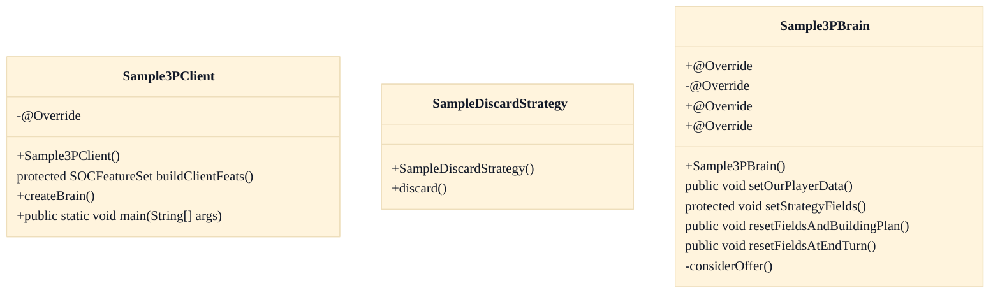

# Third-party bot extension framework (sample3p)

## Strategic Context
- **Bot subsystem is first-class, not an afterthought** — CLAUDE.md records that the codebase originated as Robert S Thomas' AI-agent dissertation, so the robot/bot subsystem is foundational; the sample3p templates exist to make that extensibility accessible to third-party authors rather than locking AI experimentation to internal classes. This is the distinctive product rationale for shipping documented sample subclasses.

## Overview
This feature is a HYPOTHESIS that could not be verified against the supplied code context: no soc.robot.sample3p source files (Sample3PClient, Sample3PBrain, SampleDiscardStrategy) were present in the assembled  context, so their existence and behavior are asserted only from CLAUDE.md prose and the provided class diagram. As designed per that documentation, a third-party bot connects to the server exactly like a human client by speaking the SOCMessage protocol over the wire; the per-game decision loop lives in the brain's run() method rather than the client. The sample subclasses are intended as the minimal starting template: the client subclass declares its feature set and instantiates a custom brain, while the brain subclass overrides lifecycle hooks (setOurPlayerData, resetFieldsAndBuildingPlan, resetFieldsAtEndTurn) and trade logic (considerOffer) to alter behavior without modifying core server code. Inbound messages on the server reach game handlers through InboundMessageQueue.push, which is the same path a bot's messages traverse — the only confirmable wire-protocol detail in the supplied context.

## Components
- **Sample3PClient**: Per the class diagram, a minimal SOCRobotClient subclass exposing the bot bootstrap surface — buildClientFeats(), createBrain(), and a main(String[]) entry point — so a third-party bot can declare its feature set and instantiate its own brain.
- **Sample3PBrain**: Per the class diagram, a SOCRobotBrain subclass overriding the decision-loop lifecycle hooks — setOurPlayerData(), setStrategyFields(), resetFieldsAndBuildingPlan(), resetFieldsAtEndTurn(), and considerOffer() — the documented seam for customizing bot behavior without touching core.
- **SampleDiscardStrategy**: Per the class diagram, a pluggable discard-decision strategy with a discard() method, illustrating that strategy objects (not just the brain) are an extension point a third-party bot can override.

## Connections
- **SOCServer inbound message dispatch** (outbound) — via SOCMessage wire protocol delivered to InboundMessageQueue.push(SOCMessage, Connection) (evidence: src/main/java/soc/server/genericServer/InboundMessageQueue.java::push)

## Design Decisions
- **Third-party bots subclass the same robot client/brain rather than implementing a new interface**: CLAUDE.md states bots connect to the server exactly like human clients via SOCMessage and that the decision loop is in SOCRobotBrain.run(); providing trivial subclasses (Sample3PClient/Sample3PBrain) as templates keeps the extension surface identical to the built-in bot path, avoiding a parallel API. This rationale is documentation-sourced, not confirmed by supplied code.
- **Reserved _EXT_BOT game-option namespace for third-party bot data**: CLAUDE.md describes _EXT_BOT/_EXT_CLI/_EXT_GAM as reserved option keys unused by core, letting third-party bots pass data without core involvement. UNVERIFIED: no _EXT_BOT symbol appears in the supplied context — the only SOCGameOptionSet member present is get(String optKey), a plain key lookup — so this design intent could not be substantiated against code.

## Diagrams
### Class

## Source Linkage
- [Sample3PClient / Sample3PBrain templates](../../../src/main/java/soc/robot/sample3p)
- [Inbound bot message delivery path](../../../src/main/java/soc/server/genericServer/InboundMessageQueue.java::push)
- [SOCGameOptionSet key lookup (only confirmed option-set symbol in context)](../../../src/main/java/soc/game/SOCGameOptionSet.java::get)

Parent scope: [_scope.md](_scope.md)
Sibling feature: [third-party-bot-extension-framework-sample3p.feature.md](third-party-bot-extension-framework-sample3p.feature.md)
Scope architecture: [robot-ai-players.arch.md](robot-ai-players.arch.md)

## Source Linkage Grounding

_Per-row confidence; `_unverified_` rows are disclosed, not verified; `0.08 (resolved, uncited)` is the resolved-but-uncited baseline, not measured evidence._

| Element | Doc Evidence | Code Evidence | Confidence |
|---------|--------------|---------------|-----------:|
| Source Linkage: Sample3PClient / Sample3PBrain templates |  | src/main/java/soc/robot/sample3p | 0.08 (resolved, uncited) |
| Source Linkage: Inbound bot message delivery path |  | src/main/java/soc/server/genericServer/InboundMessageQueue.java:126-134 | 0.75 |
| Source Linkage: SOCGameOptionSet key lookup (only confirmed option-set symbol in context) |  | src/main/java/soc/game/SOCGameOptionSet.java:999-1002 | 0.83 |

Related scopes: [Desktop Swing Client](../desktop-swing-client/desktop-swing-client.arch.md), [Game Model & Rules Engine](../game-model-rules-engine/game-model-rules-engine.arch.md), [Optional Database](../optional-database/optional-database.arch.md), [Server & Message Protocol](../server-message-protocol/server-message-protocol.arch.md)
