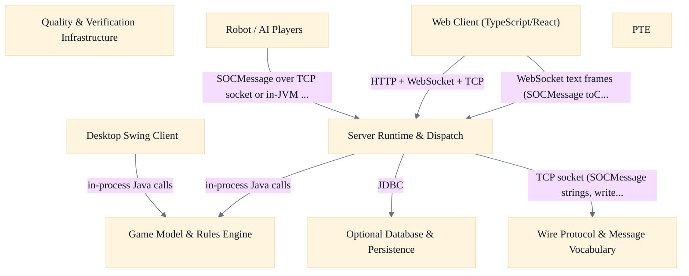
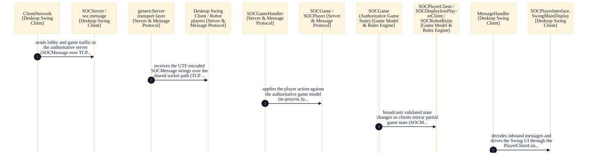
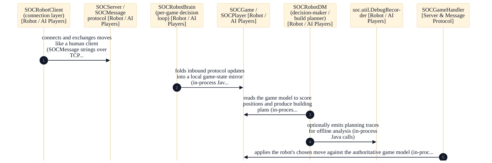
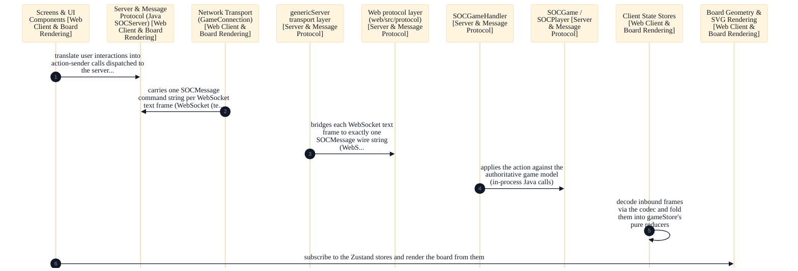
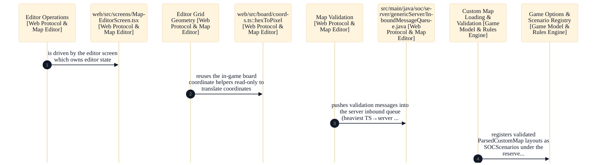
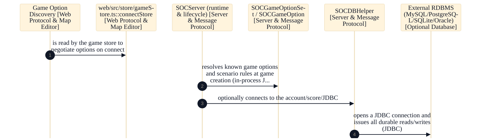
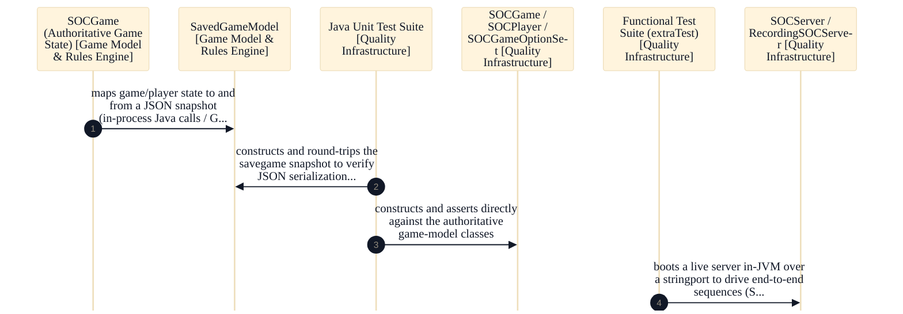

# Sammys-Settlers — Client-Server Settlers of Catan Platform

## Strategic Context
- **Dissertation origin makes the bot subsystem first-class** — Per Readme.md and Readme.developer.md, Sammys-Settlers was initially created by Robert S Thomas as a dissertation project about intelligent agents and real-time decision making. This is why bots are ordinary protocol clients speaking SOCMessage rather than a privileged in-process API, and why the robot/bot subsystem (SOCRobotBrain decision loop) is a core component rather than an afterthought.
- **Wire format chosen for cross-language interop, not Java convenience** — Per the SOCMessage architecture notes (CLAUDE.md / Readme.developer.md), messages are deliberately flat unicode strings via writeUTF/readUTF rather than Java object serialization specifically so non-Java clients and bots can interoperate. This single decision is what made the TypeScript/React web client possible as a pure front-end replacement that speaks the identical protocol over WebSocket without server changes.
- **Web client replaces only the front end; Java server stays authoritative** — Per Readme.md and doc/Web-Docker.md, the webapp connects to the same Java SOCServer over an additive WebSocket listener where each text frame carries one existing SOCMessage string, so the server, rules engine, robot subsystem, scenarios, and custom-map validation continue unchanged. The web client is explicitly an in-development client, not yet a full replacement for the Java Swing client.
- **Rules and scenarios as a data registry, not branching code** — Per the design corpus (CLAUDE.md game-options section), all game rules, house rules, and scenarios are driven by SOCGameOption registered in SOCGameOptionSet.getAllKnownOptions with semantics encoded in keyname conventions. This is the central extensibility mechanism: it lets Cities & Knights ship as inactive-hidden groundwork and custom maps register as SC_X scenarios without forking the codebase or adding new board types.
- **Cities & Knights shipped as phased inactive-hidden groundwork** — Per doc/Cities-and-Knights-Design.md, a playable C&K was judged not achievable in one initiative because the codebase assumes exactly five resources; the design deliberately ships reserved _CK_* options behind FLAG_INACTIVE_HIDDEN, a disabled scenario stub, and flag-hidden prototypes so incomplete work never reaches an unprepared player. doc/Cities-and-Knights-Implemented.md records that Phases 1–3 later shipped with commodities as separate per-player counters rather than the full SOCResourceSet refactor.
- **Database is optional by design** — Per doc/Database.md and the persistence design, the user/score/bot-params database is entirely optional — the server runs fully without it and only persistent accounts/stats are lost. Code is held vendor-neutral across MySQL, PostgreSQL, SQLite, and Oracle, and all JDBC access is concentrated in one SOCDBHelper class with runtime schema upgrades, so the common no-DB deployment stays zero-setup.

## Overview
Game Model & Rules Engine: SOCGame is the single authoritative holder of complete game state at the server; logic advances there and the server pushes deltas to clients. The board (SOCBoard / sea-board SOCBoardLarge) holds no back-reference to game or players, uses an explicit monitor for thread-safety, and is constructed from game options. Game state is modeled as documented integer constants. Rules, house rules, and scenarios are a convention-driven data registry (SOCGameOption/SOCGameOptionSet.getAllKnownOptions, SOCScenario.initAllScenarios) keyed by short-name strings with semantics encoded in the keyname (_SC_ scenario, leading-underscore internal, _3 third-party, _EXT_ reserved) and a graduated optFlags bitfield. Cities & Knights ships as inactive-hidden _CK_* option groundwork plus the SC_CK scenario: city-improvement and knight tracks modeled as SOCSpecialItem instances (typeKey = optionName + "/" + shortKey), three commodities kept outside SOCResourceSet as per-player counters, and all authoritative C&K state held in SOCGame. Custom maps are registered as SC_X scenarios via CustomMapLoader (I/O + registration) split from CustomMapValidator (structure/safety, not playability), shaping ParsedCustomMap to the makeNewBoard_placeHexes contract and never aborting startup on a bad file. Wire Protocol & Message Vocabulary: soc.message is the single source of truth for the client-server vocabulary — one SOCMessage subclass per action owning its typed fields, with a numeric type-ID registry and a central toMsg() switch. Encoding is a flat strings-and-integers format (not Java serialization) so non-Java clients/bots interop. SOCBoardLayout2 carries an extensible named Layout-Parts map instead of a fixed field list; element messages (SOCGameElements/SOCPlayerElements via SOCMessageTemplateMi) use parallel arrays to replace single-purpose messages. Backward/forward compatibility comes from value remapping and tolerant parsing rather than versioned message formats, and since v2.5.00 a separate human-readable toString() must itself round-trip. Server Runtime & Request Dispatch: SOCServer is the long-running process owning server lifecycle, extending the generic Server, listening on TCP 8880 plus an optional WebSocket port started by serverUp(). Inbound dispatch is split three ways — SOCServerMessageHandler (lobby/connection), SOCGameMessageHandler (in-game actions, returning false for unrecognized/non-game types), and SOCGameHandler (per-game glue). Two transports (plain TCP socket and WebSocketServerBridge) share one dispatch pipeline. Robot clients connect over the same SOCMessage path as humans, and the server stays authoritative for full game state while clients hold partial state. Desktop Swing Client: SOCPlayerClient is the network and lobby surface, resolving locale/i18n and wiring ClientNetwork (socket), MessageHandler, GameMessageSender, and MainDisplay; it supports three coexisting server connections (remote TCP, locally-hosted TCP, stringport practice) behind one shared game list, gating i18n/scenario requests on negotiated server version and keeping only partial state. SOCPlayerInterface hosts one active game, routing all inbound game/network events through the ClientBridge (PlayerClientListener) inner class instead of touching Swing directly, with a role-parameterized TradePanel and modal dialogs. SOCBoardPanel renders in two layers (cached empty board + composited pieces) in a single unscaled un-rotated internal coordinate system with transforms at the boundary, color-blind palette applied once at class load and per-graphics-set theme.properties re-skinning. UserPreferences/PreferencesDialog/PreferenceDescriptor add a descriptor mini-registry (LinkedHashMap insertion-ordered) over the static getPref/putPref API with apply-on-OK semantics. Robot / AI Players: SOCRobotClient (extends SOCDisplaylessPlayerClient, constructed with a ServerConnectInfo value object) establishes a TCP Socket or same-JVM StringConnection and separates the connection layer from per-game decision-making; built-in bots are pinned to the server version and skip most sync messages. SOCRobotBrain is one Thread per seated game; its run() loop blocks on a CappedQueue<SOCMessage> fed by the network client plus a once-per-second TIMINGPING, tracking expect*/waitingFor* flags and a buildingPlan stack, with decision logic factored into replaceable strategy objects (SOCRobotDM, SOCRobotNegotiator, *Strategy) behind factory methods. Liveness uses bounded retry counters and a per-second watchdog; unrecognized inventory items hit a generic fallback-cancel path (fallbackUnknownInvItemPlacement, single rejectedPlayInvItem per turn) routed through the normal SOCMessage protocol. Third-party bots subclass the same client/brain (sample3p) and use the reserved _EXT_BOT option namespace. Web Client (TypeScript/React): the protocol layer re-implements the Java SOCMessage string wire format verbatim in TypeScript so the browser speaks the exact SEP-delimited format over WebSocket, one toCmd() string per text frame; dispatch is a self-registering parser registry keyed by type id (parsers register through side-effecting imports), decode() returns null rather than throwing, integer parsing is stricter than Number.parseInt, and constants are `as const` objects with derived union types. The board layer (coords.ts/types.ts) parses a SOCBoardLayout2 message into a render-friendly BoardModel using an integer-packed 0xRRCC scheme shared by hexes/nodes/edges with pure no-React functions and CSS-custom-property presentation. Client state is split across three Zustand stores (gameStore reducers fold decoded messages into connection/lobby/room state, settingsStore, uiStore) with pure immutable reducers and early-returning action senders. The custom-map editor keeps coordinates as on-disk 0xRRCC strings, mirrors the Java loader's GSON-permissive deserialization in fromRaw, houses zero business validation in mapSchema.ts, and canonicalizes land areas on export; canvas/palette are pure presentational components with all state lifted to the parent screen, reusing the in-game board geometry read-only. Optional Database & Persistence: all durable state — player accounts and completed-game stats/scores — flows exclusively through SOCDBHelper, initialized only when a database is configured (initialize reads JDBC URL/driver/credentials, connect, detectSchemaVersion, prepareStatements). The database is entirely optional with graceful degradation, vendor-neutral across MySQL/PostgreSQL/SQLite/Oracle. Schema upgrades run online via UpgradeBGTasksThread (fast DDL split from slow data migration), passwords are stored as bcrypt hashes (bundled BCrypt) with legacy-plaintext migration, password verification is asynchronous via AuthPasswordRunnable, and the server fails closed on persisted-setting drift (DBSettingMismatchException). The DDL itself is generated from a single vendor-neutral template (jsettlers-tables-tmpl.sql) by render.py into shipped per-vendor jsettlers-tables-*.sql files, with template/output consistency enforced as a hard build gate (testSrcDBTemplateTokens / testSrcDBTemplates). PTE: a translator opens a less-specific source locale file and a more-specific destination file, modeled as one key-aligned ParsedPropsFilePair rather than two independent editors. PropsFileParser reads each into ordered FileEntry rows (comment vs key/value subtypes), decoding \uXXXX escapes and recording duplicate keys; PropsFileWriter centralizes symmetric ISO-8859-1 escaping and writes the required encoding automatically. PTEMain is the launcher (separate from the PropertiesTranslatorEditor window), deriving the source filename from a single chosen destination and persisting last-edited dir as a per-user preference; the tool ships as a standalone Swing app built by its own gradle task, separate from the game JARs. Quality & Verification Infrastructure: unit tests mirror the main package layout under a dedicated soctest tree and run under the fast test/testPython tasks, with the wire protocol verified by a toCmd→parse→equals round-trip invariant (TestToCmdToStringParse) rather than fixed encoded strings; SQL-template consistency checks fold into the same test task. Heavyweight end-to-end tests live in a separate extraTest source set with its own classpath, excluded from shipped JARs and depending on the test task, driven against an in-process stringport server. Protocol message-sequence consistency is split into a recording-side test (TestRecorder, expected sequences as String[][] of recipient-prefix + field substring compared by compareRecordsToExpected) and an extraction-side test (TestGameActionExtractor extends the GameActionExtractor it tests). The web suite tests through the user-facing surface (test-ids + DOM events) with unit (Vitest/jsdom) split from end-to-end (Playwright).

## Components
- **Game Model & Rules Engine**: Hold complete game state at the server (clients hold only partial state) and express all rules, house rules, and scenarios as a convention-keyed data registry rather than branching code; construct boards from options.
- **Wire Protocol & Message Vocabulary**: Define and parse every typed message that crosses the client-server boundary; keep encoding strings-and-integers-only so non-Java clients/bots can interop, and preserve backward/forward compatibility via tolerant parsing and value remapping rather than versioned formats.
- **Server Runtime & Dispatch**: Own server lifecycle and route every inbound message to the correct handler; remain authoritative for full game state while pushing deltas to clients; treat robot clients identically to human clients on the same SOCMessage path.
- **Desktop Swing Client**: Present the authoritative server state to a human player and send their actions back; keep network handling separated from AWT/Swing display via injected helpers and listener interfaces; hold only partial client-side state.
- **Robot / AI Players**: Play games as ordinary protocol clients (no privileged in-process API), one decision thread per seated game, with bounded retry counters and adaptive pacing; provide extension hooks for third-party bots.
- **Web Client (TypeScript/React)**: Replace only the front end: speak the exact existing wire protocol over WebSocket so the Java server, rules engine, robots, and desktop client are unaffected; decode() returns null rather than throwing on malformed input.
- **Optional Database & Persistence**: Provide entirely optional, vendor-neutral persistence for player accounts and game stats with graceful degradation when absent; apply schema upgrades at runtime and generate per-vendor DDL from one template.
- **PTE**: Edit paired source/destination .properties bundles side-by-side, round-tripping \uXXXX escapes in code rather than trusting file encoding; ship as an independent Swing tool excluded from the shipped game JARs.
- **Quality & Verification Infrastructure**: Verify the wire protocol by toCmd→parse→equals round-trip rather than fixed strings; separate fast unit checks from long-running end-to-end tests; guard that per-action message sequences stay stable on the wire for bots and non-Java readers.

## Boundaries
- **Game Model & Rules Engine** boundary: Owns the authoritative game state and the rules that advance it: SOCGame, SOCPlayer, SOCBoard, and the sea-board subclass SOCBoardLarge, plus the data-driven rule/scenario registry (SOCGameOption, SOCGameOptionSet, SOCScenario) and Cities & Knights state (SOCSpecialItem improvement/knight tracks, commodity counters, barbarian counter held in SOCGame). Also owns server-side custom-map ingestion (CustomMapLoader, CustomMapValidator) which registers user JSON layouts as SC_X scenarios.
- **Wire Protocol & Message Vocabulary** boundary: Owns soc.message: the single source of truth for the client-server wire vocabulary — one SOCMessage subclass per game action/state-change, a numeric type-ID registry, a central toMsg() switch, the extensible named Layout-Parts map (SOCBoardLayout2), and parallel-array element messages (SOCGameElements, SOCPlayerElements). Encoding is flat unicode strings via writeUTF/readUTF with a round-tripping toString().
- **Server Runtime & Dispatch** boundary: Owns the long-running server process (SOCServer extends the generic Server), listening on TCP port 8880 plus an optional WebSocket port, and the three-way inbound dispatch: SOCServerMessageHandler (lobby/connection), SOCGameMessageHandler (in-game actions), SOCGameHandler (per-game glue). Two transports (plain TCP socket and the WebSocket bridge) share one dispatch pipeline.
- **Desktop Swing Client** boundary: Owns soc.client: SOCPlayerClient (network + game-list/lobby surface, three coexisting connections behind one game list), SOCPlayerInterface (in-game UI for one game, routing inbound events through the ClientBridge/PlayerClientListener inner class), SOCBoardPanel (two-layer board rendering with theme/color-blind palettes), and the preferences subsystem (PreferencesDialog, UserPreferences, PreferenceDescriptor).
- **Robot / AI Players** boundary: Owns soc.robot: SOCRobotClient (connection layer, extends SOCDisplaylessPlayerClient, constructed with a ServerConnectInfo) and SOCRobotBrain — a per-game Thread whose run() loop consumes a CappedQueue of SOCMessages and drives decisions through replaceable strategy objects (SOCRobotDM, SOCRobotNegotiator, *Strategy). Includes the unknown-inventory-item fallback-cancel path and the sample3p third-party extension subclasses.
- **Web Client (TypeScript/React)** boundary: Owns web/src: a browser client that re-implements the SOCMessage string wire format in TypeScript (protocol/SOCMessage.ts, constants.ts, a self-registering parser registry), renders the board as SVG from a 0xRRCC integer-coordinate scheme (board/coords.ts, types.ts), holds client state in three Zustand stores (gameStore, settingsStore, uiStore), and provides the custom-map editor (map-editor/mapSchema.ts and canvas/palette components). Connects to SOCServer over WebSocket, one toCmd() string per text frame. _[unverified: no imports/calls edge web/src/protocol/SOCMessage.ts, web/src/board/coords.ts, web/src/store/gameStore.ts, web/src/map-editor/mapSchema.ts -> protocol/SOCMessage.ts, web/src/protocol/SOCMessage.ts, web/src/board/coords.ts, web/src/store/gameStore.ts, web/src/map-editor/mapSchema.ts -> constants.ts, web/src/protocol/SOCMessage.ts, web/src/board/coords.ts, web/src/store/gameStore.ts, web/src/map-editor/mapSchema.ts -> board/coords.ts in code graph]_
- **Optional Database & Persistence** boundary: Owns soc.server.database: SOCDBHelper concentrates all JDBC access and schema definition (with UpgradeBGTasksThread for online migrations, a bundled BCrypt, DBSettingMismatchException, AuthPasswordRunnable), plus the SQL templating pipeline (jsettlers-tables-tmpl.sql + render.py generating per-vendor jsettlers-tables-*.sql, gated by build tasks testSrcDBTemplateTokens / testSrcDBTemplates). _[unverified: no imports/calls edge soc.server.database.SOCDBHelper, src/main/bin/sql/template/jsettlers-tables-tmpl.sql, src/main/bin/sql/template/render.py -> AuthPasswordRunnable in code graph]_
- **PTE** boundary: Owns net.nand.util.i18n: the standalone PropertiesTranslatorEditor — PTEMain launcher, ParsedPropsFilePair key-aligned model, PropsFileParser/PropsFileWriter with centralized ISO-8859-1 escaping, the FileEntry row hierarchy, and PropsFilePseudoLocalizer. Built by its own gradle i18neditorJar task, separate from the game JARs.
- **Quality & Verification Infrastructure** boundary: Owns the test tree mirroring main packages: fast unit tests under src/test/java/soctest (TestToCmdToStringParse round-trip protocol invariant, TestCustomMapLoader, TestSavegame, message-protocol tests) plus Python companions; heavyweight functional tests in the separate extraTest source set (TestActionsMessages, TestBoardLayoutsRounds, TestClientVersion); protocol-sequence consistency tests (TestRecorder, TestGameActionExtractor) over an in-process stringport server; and the web Vitest/Playwright suites. _[unverified: no imports/calls edge src/test/java/soctest/message/TestToCmdToStringParse.java, src/test/java/soctest/server/TestCustomMapLoader.java, src/extraTest/java/soctest, web/src/screens/MapEditorScreen.test.tsx -> TestToCmdToStringParse, src/test/java/soctest/message/TestToCmdToStringParse.java, src/test/java/soctest/server/TestCustomMapLoader.java, src/extraTest/java/soctest, web/src/screens/MapEditorScreen.test.tsx -> TestCustomMapLoader, src/test/java/soctest/message/TestToCmdToStringParse.java, src/test/java/soctest/server/TestCustomMapLoader.java, src/extraTest/java/soctest, web/src/screens/MapEditorScreen.test.tsx -> TestSavegame in code graph]_

## Integration Points
- **TCP**: The desktop client, robots, and server exchange every game action and state change as SOCMessage strings over a plain TCP socket (default port 8880), encoded via writeUTF/readUTF. Server is authoritative; clients receive deltas.
- **Browser WebSocket transport**: The web client connects to SOCServer over an optional WebSocket listener, sending one msg.toCmd() command string per text frame and decoding inbound frames through its self-registering parser registry — the same wire vocabulary the Java server already speaks, with no transport framing added.
- **Server-side board construction from game model**: The server runtime constructs and advances boards/games from the Game Model & Rules Engine, driven by the negotiated SOCGameOption set; custom maps loaded at startup are registered as SC_X scenarios shaped to the makeNewBoard_placeHexes contract.
- **Robot clients over SOCMessage**: Built-in and third-party bots connect to the server exactly like human clients — over the same SOCMessage path (in-JVM StringConnection for built-ins, TCP for external) — rather than through a privileged bot RPC channel.
- **Optional JDBC persistence**: At startup SOCServer optionally initializes SOCDBHelper for player accounts and game stats; if no database is configured the server runs fully with only persistent accounts/stats lost.
- **Desktop client board rendering from local model**: SOCBoardPanel and SOCPlayerInterface read the partial client-side SOCGame/SOCBoard/SOCBoardLarge model objects to paint the board and hand panels; the client mirrors authoritative state received as SOCMessage deltas.
- **Containerized web+server deployment**: A single Docker image serves the React/Vite build on HTTP 8080, runs the Java SOCServer on TCP 8880, and enables the browser WebSocket listener on 8888, so browser and (optionally) desktop clients connect to one process.

## Diagrams
### Architecture

## System Flows
### Flow: Desktop player game action

A human desktop player issues an in-game action through the Swing client. ClientNetwork transmits the SOCMessage over TCP to the authoritative Java server. The genericServer transport layer receives the UTF-encoded SOCMessage string and the dispatch handlers (SOCGameMessageHandler/SOCGameHandler) translate the player-action message into authoritative calls on the SOCGame and SOCPlayer game model. The validated state change is then mirrored back outbound as SOCMessage updates, which the client's MessageHandler decodes and drives into the Swing layer (SOCPlayerInterface, SwingMainDisplay) through the PlayerClientListener / GameDisplay seam to repaint the board and panels.

Involves: [Desktop Swing Client](desktop-swing-client/desktop-swing-client.arch.md), [Server & Message Protocol](server-message-protocol/server-message-protocol.arch.md), [Game Model & Rules Engine](game-model-rules-engine/game-model-rules-engine.arch.md)

### Flow: Robot AI turn

A built-in or external robot connects to the authoritative server exactly like a human client, speaking the identical SOCMessage string protocol over a TCP socket or same-JVM StringConnection. As inbound protocol updates arrive, SOCRobotBrain folds them into a local SOCGame/SOCPlayer mirror so it can reason about state. The decision-maker SOCRobotDM (with SOCPlayerTracker) reads that game model to score positions and produce building plans, optionally emitting planning traces to the DebugRecorder utility for offline analysis. The resulting move is sent back to the server over the same SOCMessage channel, where the dispatch handlers apply it against the authoritative game model.

Involves: [Robot / AI Players](robot-ai-players/robot-ai-players.arch.md), [Server & Message Protocol](server-message-protocol/server-message-protocol.arch.md)

### Flow: Browser player game action

A browser player interacts with in-game React screens (including the Cities & Knights panel), which translate interactions into action-sender calls on gameStore. The web Network Transport (GameConnection) carries one SOCMessage command string per WebSocket text frame to the authoritative Java SOCServer, bridged by the additive WebSocketServerBridge in the genericServer transport layer. The server applies the action via its dispatch handlers against SOCGame. Returning frames are decoded by the Protocol Codec & Parser Registry and dispatched into gameStore's pure reducers, which fold them into client state; React screens and the Board Geometry & SVG renderer subscribe to those Zustand stores and re-render the board from them.

Involves: [Web Client & Board Rendering](web-client-board-rendering/web-client-board-rendering.arch.md), [Server & Message Protocol](server-message-protocol/server-message-protocol.arch.md)

### Flow: Custom map editing and validation

The MapEditorScreen owns editor state and drives the editor data layer, calling Editor Operations which consume the in-game board coordinate codec (coords.ts hexToPixel) read-only to translate packed coordinates for the Editor Canvas. Editor edits and the Map Validation layer push SOCMessage text frames into the authoritative server's InboundMessageQueue over WebSocket — the validation edge is the heaviest TS→server path. On the server, CustomMapLoader parses and validates the layout, then registers the validated ParsedCustomMap as a SOCScenario under the reserved SC_X prefix in the Game Options & Scenario Registry, making the custom map available for game creation.

Involves: [Web Protocol & Map Editor](web-protocol-map-editor/web-protocol-map-editor.arch.md), [Game Model & Rules Engine](game-model-rules-engine/game-model-rules-engine.arch.md)

### Flow: Game creation with options and persistence

At game creation the server runtime resolves requested game options and scenario rules from the game-model registry, with SOCServer consulting SOCGameOptionSet to validate and negotiate client/server options. The web game store separately reads Game Option Discovery to negotiate options on connect. Once a game exists, SOCServer optionally connects to the vendor-neutral account/score/bot-params database through the SOCDBHelper persistence facade over JDBC, which in turn owns and issues all reads/writes against the configured external RDBMS. The database is entirely optional — the server runs fully without it, losing only persistent accounts and stats.

Involves: [Web Protocol & Map Editor](web-protocol-map-editor/web-protocol-map-editor.arch.md), [Server & Message Protocol](server-message-protocol/server-message-protocol.arch.md), [Optional Database](optional-database/optional-database.arch.md)

### Flow: Save/load game persistence and test round-trip

The *SAVEGAME*/*LOADGAME* debug feature maps authoritative game state to and from a JSON snapshot: SavedGameModel reads and writes SOCGame/SOCPlayer state via GSON JSON serialization. The Java unit test suite exercises this path directly, constructing and round-tripping SavedGameModel against the game model to verify the JSON savegame serialization. The same suites also construct and assert against the authoritative game-model classes (SOCGame, SOCPlayer, SOCGameOptionSet) under test, while functional tests boot a live RecordingSOCServer over an in-JVM stringport to drive end-to-end sequences.

Involves: [Game Model & Rules Engine](game-model-rules-engine/game-model-rules-engine.arch.md), [Quality Infrastructure](quality-infrastructure/quality-infrastructure.arch.md)

## Source Linkage
- [Game Model & Rules Engine](../../src/main/java/soc/game/SOCGame.java)
- [Game options data registry](../../src/main/java/soc/game/SOCGameOptionSet.java)
- [Custom map loading](../../src/main/java/soc/server/CustomMapLoader.java)
- [Wire Protocol & Message Vocabulary](../../src/main/java/soc/message/SOCMessage.java)
- [SOCBoardLayout2 layout parts](../../src/main/java/soc/message/SOCBoardLayout2.java)
- [Server Runtime & Dispatch](../../src/main/java/soc/server/SOCServer.java)
- [Desktop Swing Client](../../src/main/java/soc/client/SOCPlayerClient.java)
- [Board rendering panel](../../src/main/java/soc/client/SOCBoardPanel.java)
- [Robot / AI Players](../../src/main/java/soc/robot/SOCRobotBrain.java)
- [Robot client networking](../../src/main/java/soc/robot/SOCRobotClient.java)
- [Web Client protocol layer](../../web/src/protocol/SOCMessage.ts)
- [Web board geometry](../../web/src/board/coords.ts)
- [Web client state stores](../../web/src/store/gameStore.ts)
- [Custom map editor schema](../../web/src/map-editor/mapSchema.ts)
- [Optional Database & Persistence](../../src/main/java/soc/server/database/SOCDBHelper.java)
- [SQL schema templating](../../src/main/bin/sql/template/render.py)
- [PTE](../../src/main/java/net/nand/util/i18n/gui/PTEMain.java)
- [Quality & Verification Infrastructure](../../src/test/java/soctest/message/TestToCmdToStringParse.java)
- [Containerized deployment](../../Dockerfile)

Parent scope: [_scope.md](_scope.md)

## Source Linkage Grounding

_Per-row confidence; `_unverified_` rows are disclosed, not verified; `0.08 (resolved, uncited)` is the resolved-but-uncited baseline, not measured evidence._

| Element | Doc Evidence | Code Evidence | Confidence |
|---------|--------------|---------------|-----------:|
| Source Linkage: Game Model & Rules Engine |  | src/main/java/soc/game/SOCGame.java | 0.95 |
| Source Linkage: Game options data registry |  | src/main/java/soc/game/SOCGameOptionSet.java | 0.83 |
| Source Linkage: Custom map loading |  | src/main/java/soc/server/CustomMapLoader.java | 0.83 |
| Source Linkage: Wire Protocol & Message Vocabulary |  | src/main/java/soc/message/SOCMessage.java | 0.83 |
| Source Linkage: SOCBoardLayout2 layout parts |  | src/main/java/soc/message/SOCBoardLayout2.java | 0.40 |
| Source Linkage: Server Runtime & Dispatch |  | src/main/java/soc/server/SOCServer.java | 0.83 |
| Source Linkage: Desktop Swing Client |  | src/main/java/soc/client/SOCPlayerClient.java | 0.86 |
| Source Linkage: Board rendering panel |  | src/main/java/soc/client/SOCBoardPanel.java | 0.83 |
| Source Linkage: Robot / AI Players |  | src/main/java/soc/robot/SOCRobotBrain.java | 0.83 |
| Source Linkage: Robot client networking |  | src/main/java/soc/robot/SOCRobotClient.java | 0.75 |
| Source Linkage: Web Client protocol layer | Base SOCMessage type, parser registry, and encode/decode helpers. | web/src/protocol/SOCMessage.ts | 0.75 |
| Source Linkage: Web board geometry |  | web/src/board/coords.ts | 0.75 |
| Source Linkage: Web client state stores | gameStore — Zustand store for connection + lobby state. | web/src/store/gameStore.ts | 0.75 |
| Source Linkage: Custom map editor schema |  | web/src/map-editor/mapSchema.ts | 0.75 |
| Source Linkage: Optional Database & Persistence |  | src/main/java/soc/server/database/SOCDBHelper.java | 0.75 |
| Source Linkage: SQL schema templating | render.py - Simple template renderer for SQL DML/DDL to specific DBMS types. | src/main/bin/sql/template/render.py | 0.75 |
| Source Linkage: PTE |  | src/main/java/net/nand/util/i18n/gui/PTEMain.java | 0.75 |
| Source Linkage: Quality & Verification Infrastructure |  | src/test/java/soctest/message/TestToCmdToStringParse.java | 0.32 |
| Source Linkage: Containerized deployment | syntax=docker/dockerfile:1 | Dockerfile | 0.08 (resolved, uncited) |
