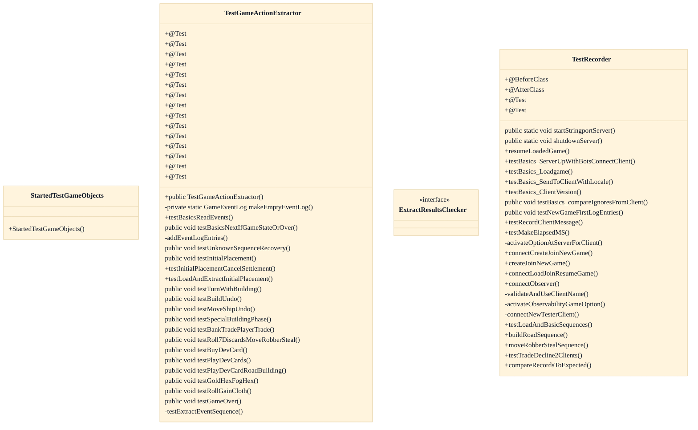

# Game-Action Message Sequences

## Strategic Context
- **Wire format kept deliberately simple for cross-client interop** — Per CLAUDE.md, SOCMessage subclasses serialize as plain writeUTF/readUTF unicode strings 'deliberately simple so non-Java clients/bots can interop'; this feature's string-level conformance tests exist to protect exactly that externally-observable wire contract, which is why they assert on rendered strings rather than internal objects.
- **Higher-level actions readable off the raw stream** — The hypothesis records that the sequence catalogue is intended to let non-Java bots and tools reconstruct higher-level GameAction semantics from the raw SOCMessage stream; GameActionExtractor's recognition of documented sequences is the in-repo proof of that capability, though no supplied test exercises the cross-client interop claim end-to-end.

## Overview
This feature is the executable conformance layer that pins the multi-message game-action protocol documented in doc/Message-Sequences-for-Game-Actions.md. On the server side, TestRecorder starts a RecordingSOCServer on a stringport, loads a SavedGameModel fixture, drives real actions (build, buy dev card, trade) through a displayless client, and reads back the per-game GameEventLog of EventEntry records; compareRecordsToExpected then asserts the captured wire messages — each tagged by audience prefix (all:, p3:, f3:) — equal the documented sequence. On the extractor side, TestGameActionExtractor pushes EventEntry sequences through GameActionExtractor and asserts they collapse into the correct higher-level GameActionLog.Action types. Together the two tests guard the documented contract against protocol drift in both the emitted and the re-parsed direction.

## Components
- **TestRecorder**
- **compareRecordsToExpected**
- **TestGameActionExtractor**
- **makeEmptyEventLog**
- **ExtractResultsChecker**

## Connections
- **RecordingSOCServer (soc.extra.server)** (outbound) — via import soc.extra.server.RecordingSOCServer; test instantiates and drives it to capture game-event logs (evidence: src/test/java/soctest/server/TestRecorder.java (srv = new RecordingSOCServer(); srv.records))
- **GameEventLog / EventEntry (soc.extra.server)** (inbound) — via import soc.extra.server.GameEventLog(.EventEntry); read back as the assertion substrate (evidence: src/test/java/soctest/server/TestRecorder.java; src/test/java/soctest/robot/TestGameActionExtractor.java)
- **GameActionExtractor / GameActionLog (soc.extra.robot)** (outbound) — via import soc.extra.robot.GameActionExtractor/GameActionLog; test subclasses extractor and asserts reconstructed actions (evidence: src/test/java/soctest/robot/TestGameActionExtractor.java (extends GameActionExtractor; actLog))
- **SOCServer recording API (soc.server)** (outbound) — via import soc.server.SOCServer; calls recordClientMessage / messageToPlayerKeyed* and reads isRecordGameEventsActive() (evidence: src/test/java/soctest/server/TestRecorder.java (srv.messageToPlayerKeyed*, isRecordGameEventsFromClientsActive))
- **SavedGameModel / TestLoadgame (soc.server.savegame / soctest.server.savegame)** (outbound) — via import for loading *.game.json fixtures via createAndJoinReloadedGame before driving recorded sequences (evidence: src/test/java/soctest/server/TestRecorder.java (TestLoadgame.load('classic-botturn.game.json'); createAndJoinReloadedGame))
- **doc/Message-Sequences-for-Game-Actions.md** (bidirectional) — via documentation contract these tests verify; the doc references TestRecorder.testLoadAndBasicSequences (evidence: feature hypothesis source_linkage; src/test/java/soctest/server/TestRecorder.java (testLoadAndBasicSequences))

## Design Decisions
- **Assert on rendered message strings with recipient prefixes rather than on message-object equality**: The real protocol contract is the writeUTF wire string consumed by non-Java clients, and the audience-targeting prefix (all:/pN:/fN:) is itself part of that contract; comparing rendered strings catches both field-format drift and mis-targeted recipients that object equality would hide.
- **Record client→server messages only when explicitly enabled (isRecordingFromClients off by default)**: The canonical game log captures what the server broadcast; round-trip verification of inbound client messages is an opt-in so default logs stay focused on the server-authoritative sequence.
- **Normalize recorded logs to the en_US fallback while still sending each client its own locale**: Decouples the protocol-conformance contract from localization so sequence assertions are deterministic regardless of a joining client's locale (tested with an es client).
- **Make TestGameActionExtractor extend GameActionExtractor**: Gives the test white-box access to protected read primitives (next, backtrackTo, nextIfType, resetCurrentSequence) and ExtractorState so individual recognition steps can be asserted in isolation.
- **Exercise unknown-sequence recovery and interleaved non-protocol entries (comments, gameservertext, PN_NON_EVENT)**: The extractor must tolerate noise and unrecognized middles in a real message stream and still resynchronize on the next known action; tests assert it emits an UNKNOWN action and continues rather than failing.

## Constraints
- **[UNVERIFIED]** A newly created game's recorded log MUST begin with SOCVersion followed by SOCNewGame (no options) or SOCNewGameWithOptions. — src/test/java/soctest/server/TestRecorder.java::testNewGameFirstLogEntries (asserts log.entries[0]=all:SOCVersion, [1]=all:SOCNewGame/NewGameWithOptions) (cross-document reconciliation: not verified against `src/test/java/soctest/server/TestRecorder.java`; recorded as design intent, not current code fact.)
- **[HARD]** The GameActionExtractor MUST be seeded with a version, newgame, and startgame preamble before action extraction; this preamble extracts to a LOG_START_TO_STARTGAME action. — src/test/java/soctest/robot/TestGameActionExtractor.java::makeEmptyEventLog (comment 'Extractor expects to see version, newgame, and startgame'; asserted LOG_START_TO_STARTGAME)
- **[UNVERIFIED]** compareRecordsToExpected MUST ignore EventEntry records flagged isFromClient unless withFromClient is true. — src/test/java/soctest/server/TestRecorder.java::testBasics_compareIgnoresFromClient (cross-document reconciliation: not verified against `src/test/java/soctest/server/TestRecorder.java`; recorded as design intent, not current code fact.)
- **[UNVERIFIED]** Recording of client-originated game messages SHOULD default to off, enabled only via isRecordingFromClients. — src/test/java/soctest/server/TestRecorder.java::testRecordClientMessage (assertFalse isRecordGameEventsFromClientsActive()) (cross-document reconciliation: not verified against `src/test/java/soctest/server/TestRecorder.java`; recorded as design intent, not current code fact.)
- **[UNVERIFIED]** Test client nicknames SHOULD be unique across test methods to avoid intermittent auth collisions when tests run in parallel. — src/test/java/soctest/server/TestRecorder.java (clientNamesUsed Set; per-method CLIENT_NAME constants) (cross-document reconciliation: not verified against `src/test/java/soctest/server/TestRecorder.java`; recorded as design intent, not current code fact.)

## Non-Functional Requirements
- **observability** — All game events are recorded into a per-game GameEventLog of EventEntry records, which is the substrate these conformance tests read back; recording must be active on the test server. — src/test/java/soctest/server/TestRecorder.java (srv.isRecordGameEventsActive(); srv.records.get(gaName)) integrating RecordingSOCServer/GameEventLog
- **reliability** — Each test method uses a unique client nickname so parallel tests do not log out a still-active client and cause intermittent auth failures. — src/test/java/soctest/server/TestRecorder.java (clientNamesUsed; per-method CLIENT_NAME)
- **error-handling** — Client version values below 1000 (and negatives) must be rejected; default reported version equals the build version. — src/test/java/soctest/server/TestRecorder.java::testBasics_ClientVersion (setVersion rejects 3, 999, -1)
- **security** — Recorded conformance logs are normalized to the en_US fallback even when the actual message is delivered in the client's locale, keeping the protocol contract independent of localization. — src/test/java/soctest/server/TestRecorder.java::testBasics_SendToClientWithLocale (scd.localeStr 'es' vs en_US fallback comparison)

## Examples
*Shows the documented first-log-entries contract asserted as recipient-prefixed wire strings.*
*Source: `src/test/java/soctest/server/TestRecorder.java (testNewGameFirstLogEntries)`*
```
compareRecordsToExpected
    (log.entries, new String[][]
        {
            {"all:SOCVersion:" + Version.versionNumber(), "str=" + Version.version()},
            {"all:SOCNewGame:", "game=" + gaName}
        }, false);
```

*Documents the mandatory extractor preamble that collapses into a LOG_START_TO_STARTGAME action.*
*Source: `src/test/java/soctest/robot/TestGameActionExtractor.java (makeEmptyEventLog)`*
```
log.add(new EventEntry(new SOCVersion(Version.versionNumber(), Version.version(), "-", null, null), -1, false, -1));
log.add(new EventEntry(new SOCNewGame("test"), -1, false, -1));
log.add(new EventEntry("Extractor expects to see version, newgame, and startgame"));
log.add(new EventEntry(new SOCStartGame("test", EMPTYEVENTLOG_STARTGAME_GAME_STATE), -1, false, -1));
```

*Shows the extractor emitting an UNKNOWN action for an unrecognized middle section and resynchronizing afterward.*
*Source: `src/test/java/soctest/robot/TestGameActionExtractor.java (testUnknownSequenceRecovery)`*
```
act = actionLog.get(4);
assertEquals(desc, ActionType.UNKNOWN, act.actType);
assertEquals(desc, (toClientPN == -1) ? 3 : 2, act.eventSequence.size());
```

## Diagrams
### Class



### Dependency


## Source Linkage
- [Game-action sequence catalogue](../../../doc/Message-Sequences-for-Game-Actions.md)
- [Sequence consistency / recording conformance test](../../../src/test/java/soctest/server/TestRecorder.java)
- [Recipient-prefixed comparison helper](../../../src/test/java/soctest/server/TestRecorder.java::compareRecordsToExpected)
- [New-game first-log-entries ordering test](../../../src/test/java/soctest/server/TestRecorder.java::testNewGameFirstLogEntries)
- [Higher-level action extraction conformance test](../../../src/test/java/soctest/robot/TestGameActionExtractor.java)
- [Minimal extractor preamble fixture](../../../src/test/java/soctest/robot/TestGameActionExtractor.java::makeEmptyEventLog)
- [Game event log of recorded entries](../../../src/test/java/soctest/robot/TestGameActionExtractor.java::GameEventLog)

Parent scope: [_scope.md](_scope.md)
Sibling feature: [game-action-message-sequences.feature.md](game-action-message-sequences.feature.md)
Scope architecture: [server-message-protocol.arch.md](server-message-protocol.arch.md)

## Source Linkage Grounding

_Per-row confidence; `_unverified_` rows are disclosed, not verified; `0.08 (resolved, uncited)` is the resolved-but-uncited baseline, not measured evidence._

| Element | Doc Evidence | Code Evidence | Confidence |
|---------|--------------|---------------|-----------:|
| Source Linkage: Game-action sequence catalogue | Overview | doc: doc/Message-Sequences-for-Game-Actions.md | 0.03 |
| Source Linkage: Sequence consistency / recording conformance test |  | src/test/java/soctest/server/TestRecorder.java | 0.75 |
| Source Linkage: Recipient-prefixed comparison helper |  | src/test/java/soctest/server/TestRecorder.java:1877-1963 | 0.75 |
| Source Linkage: New-game first-log-entries ordering test |  | src/test/java/soctest/server/TestRecorder.java:548-595 | 0.75 |
| Source Linkage: Higher-level action extraction conformance test |  | src/test/java/soctest/robot/TestGameActionExtractor.java | 0.75 |
| Source Linkage: Minimal extractor preamble fixture |  | src/test/java/soctest/robot/TestGameActionExtractor.java:84-94 | 0.75 |
| Source Linkage: Game event log of recorded entries |  | src/main/java/soc/extra/server/GameEventLog.java:231-280 | 0.75 |

Related scopes: [Quality Infrastructure](../quality-infrastructure/quality-infrastructure.arch.md)
