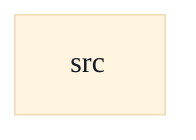

# Server Runtime & Request Dispatch

## Strategic Context
- **Handler split exists for future game types (doc/Readme.developer.md)** — Per the developer readme, the per-game glue is factored into SOCGameHandler specifically so that future game *types* could each extend GameHandler — the dispatch wiring is exercised today, but the extensibility is recorded design intent, not a test-verified requirement.
- **Bots as first-class clients (doc/Readme.developer.md)** — The codebase originated as Robert S. Thomas' AI-agent dissertation, so the robot subsystem is first-class: bots speak SOCMessage exactly like humans, which is why dispatch makes no special case for them and built-in bots run in-process.

## Overview
SOCServer is the long-running process that owns server lifecycle: it extends the generic Server, listens on TCP port 8880 (SOC_PORT_DEFAULT) plus an optional WebSocket port (PROP_JSETTLERS_WEBSOCKET_PORT, started by serverUp() via WebSocketServerBridge), and accepts both human and robot clients. Inbound SOCMessages are marshalled through an InboundMessageQueue and routed by SOCMessageDispatcher: connection- and lobby-level messages (version, auth, channels, join/sit/start) go to SOCServerMessageHandler; messages implementing SOCMessageForGame go to SOCGameMessageHandler, which calls SOCGameHandler for per-game business logic and then back into SOCServer to broadcast results to players and observers. The server remains authoritative for the full SOCGame model, rules, scenarios, and bot players, while clients hold only partial state.

## Components
- **SOCServer**: Long-running server process: owns lifecycle, binds listening transports, accepts human and robot connections, holds the authoritative game list, and exposes messageToGame/messageToPlayer send paths. Subclass of the generic Server.
- **SOCServerMessageHandler**: Dispatches inbound messages NOT tied to in-game play in a specific current game: version negotiation, auth, channels, join/leave/sit-down, game-option and scenario info, board-reset voting.
- **SOCGameMessageHandler**: Dispatches inbound messages implementing SOCMessageForGame (in-game player actions: roll, build, trade, discard, move robber, dev cards, undo) and delegates business logic to SOCGameHandler, then result-sending to SOCServer.
- **SOCGameHandler**: Per-game logic glue (the GameMessageHandler factory, board layout, sendGameState, turn forcing, debug commands) abstracted from inbound-message parsing; the seam where a future game type would supply its own GameHandler.

## Connections
- **SOCMessageDispatcher** (inbound) — via SOCMessageDispatcher#dispatch(SOCMessage, Connection) calls SOCServerMessageHandler.dispatch and SOCGameMessageHandler.dispatch (evidence: src/main/java/soc/server/SOCGameMessageHandler.java::dispatch javadoc ("called from SOCMessageDispatcher#dispatch"))
- **InboundMessageQueue (soc.server.genericServer)** (inbound) — via import soc.server.genericServer.InboundMessageQueue; inbound messages marshalled through the queue before dispatch (evidence: src/main/java/soc/server/SOCServer.java (import soc.server.genericServer.InboundMessageQueue))
- **WebSocketServerBridge (soc.server.genericServer)** (inbound) — via PROP_JSETTLERS_WEBSOCKET_PORT; serverUp() starts the bridge on that port when set (evidence: src/main/java/soc/server/SOCServer.java::PROP_JSETTLERS_WEBSOCKET_PORT)
- **Server (soc.server.genericServer)** (inbound) — via SOCServer extends Server (threading/connection accept loop) (evidence: src/main/java/soc/server/SOCServer.java::SOCServer (class extends Server))
- **SOCRobotClient / SOCDisplaylessPlayerClient (soc.robot / soc.baseclient)** (bidirectional) — via bots connect over the same SOCMessage path; import soc.robot.SOCRobotClient (evidence: src/main/java/soc/server/SOCServer.java (import soc.robot.SOCRobotClient))
- **SOCDBHelper (soc.server.database)** (outbound) — via user lookup/auth (db.getUser) during AUTHREQUEST/account flows (evidence: src/main/java/soc/server/SOCServerMessageHandler.java::handleAUTHREQUEST_postAuth (srv.db.getUser))
- **SOCGame model (soc.game)** (outbound) — via handlers operate on the authoritative SOCGame (e.g. ga.rollDice, ga.canRollDice) (evidence: src/main/java/soc/server/SOCGameMessageHandler.java::handleROLLDICE)

## Design Decisions
- **Split inbound dispatch three ways — SOCServerMessageHandler (lobby/connection), SOCGameMessageHandler (in-game actions), SOCGameHandler (per-game glue).**: Keeps message-parsing separate from game business logic and isolates lifecycle/lobby concerns from per-turn play. The SOCGameHandler seam is deliberately designed so a future game *type* could each supply its own GameHandler without touching the dispatcher.
- **dispatch() in SOCGameMessageHandler returns false (default case) for unrecognized or non-game message types instead of erroring.**: Game-vs-server message types that are handled uniformly for all game types (sit-down, board-reset voting) are intentionally left to SOCServerMessageHandler; the false return lets the dispatcher fall through cleanly rather than duplicating those handlers.
- **Robot clients (SOCRobotClient extends SOCDisplaylessPlayerClient) connect over the same SOCMessage path as human clients.**: A single protocol surface means bots need no privileged in-process API, which keeps the AI/bot subsystem (the project's dissertation origin) interoperable and testable as ordinary clients; built-in bots still run inside the server JVM.
- **Two transports (plain TCP socket and WebSocketServerBridge) share one dispatch pipeline.**: Web clients reach the same authoritative server without a parallel handler stack; the WebSocket port is opt-in (disabled when PROP_JSETTLERS_WEBSOCKET_PORT is unset or 0) so the classic deployment is unchanged.
- **Server is authoritative for full game state; clients hold only partial state.**: Centralizing SOCGame rule enforcement at the server prevents clients from fabricating moves and is reinforced by handlers preferring connection-derived identity over message-supplied fields.

## Constraints
- **[HARD]** A client MUST send its SOCVersion before an AUTHREQUEST; an AUTHREQUEST with no known client version is rejected. — src/main/java/soc/server/SOCServerMessageHandler.java::handleAUTHREQUEST (cliVersion <= 0 -> SV_NOT_OK_GENERIC "AUTHREQUEST: Send version first")
- **[HARD]** AUTHREQUEST authScheme MUST be SCHEME_CLIENT_PLAINTEXT, else the request is rejected. — src/main/java/soc/server/SOCServerMessageHandler.java::handleAUTHREQUEST (rejects unknown authScheme)
- **[HARD]** Account creation MUST be authorized: a non-admin requester for ROLE_USER_ADMIN is denied and audited. — src/main/java/soc/server/SOCServerMessageHandler.java::handleAUTHREQUEST_postAuth (isUserDBUserAdmin check + printAuditMessage)
- **[HARD]** The bots.cookie value MUST be single-line-and-safe and MUST NOT contain '|' or ',' characters. — src/main/java/soc/server/SOCServer.java::PROP_JSETTLERS_BOTS_COOKIE javadoc (SOCMessage#isSingleLineAndSafe)
- **[HARD]** maxConnections MUST be at least 20 more than the default robot count, reserving capacity beyond bots. — src/main/java/soc/server/SOCServer.java::SOC_MAXCONN_DEFAULT (Math.max(40, 20 + SOC_STARTROBOTS_DEFAULT))
- **[HARD]** A dice-roll request MUST pass canRollDice for the requesting player before any game mutation occurs. — src/main/java/soc/server/SOCGameMessageHandler.java::handleROLLDICE (canRollDice guard -> "You can't roll right now.")
- **[SOFT]** Handlers SHOULD use local connection information (nickname from the connection) over message-supplied fields to resist spoofed actions. — src/main/java/soc/server/SOCServerMessageHandler.java::dispatch javadoc Note ("always use local information over information from the message")

## Non-Functional Requirements
- **security** — Resist spoofed player actions by deriving identity from the connection, not from message fields. — src/main/java/soc/server/SOCServerMessageHandler.java::dispatch javadoc Note (use local info over message info)
- **security** — Old-version clients may be asked to disconnect during version negotiation; a second differing VERSION disconnects the client. — src/main/java/soc/server/SOCServerMessageHandler.java::handleVERSION
- **reliability** — Reserve SOC_MAXCONN_HUMANS_RESERVE (6) connection slots for human clients regardless of how many bots were started. — src/main/java/soc/server/SOCServer.java::SOC_MAXCONN_HUMANS_RESERVE
- **observability** — Sensitive auth events (e.g. unauthorized account-creation attempts) are recorded via an audit log. — src/main/java/soc/server/SOCServerMessageHandler.java::handleAUTHREQUEST_postAuth (printAuditMessage)
- **error-handling** — Dispatch methods may throw; the dispatcher caller is responsible for catching exceptions so a bad message does not crash the server thread. — src/main/java/soc/server/SOCGameMessageHandler.java::dispatch javadoc ("Caller of this method will catch any thrown Exceptions.")

## Examples
*Enforces the protocol ordering invariant that version negotiation precedes authentication.*
*Source: `src/main/java/soc/server/SOCServerMessageHandler.java::handleAUTHREQUEST`*
```
if (cliVersion <= 0)
{
    c.put(new SOCStatusMessage
            (SOCStatusMessage.SV_NOT_OK_GENERIC, "AUTHREQUEST: Send version first"));  // I18N OK: rare error
    return;
}
```

*Server validates turn/state authoritatively before mutating SOCGame, using connection-derived player identity.*
*Source: `src/main/java/soc/server/SOCGameMessageHandler.java::handleROLLDICE`*
```
if ((pl == null) || ! ga.canRollDice(pl.getPlayerNumber()))
{
    srv.messageToPlayerKeyed
        (c, gn,
         (pl != null) ? pl.getPlayerNumber() : SOCServer.PN_OBSERVER,
         "reply.rolldice.cannot.now");  // "You can't roll right now."

    return;  // <--- Early return ---
}
```

*Unrecognized/non-game messages fall through to be handled by SOCServerMessageHandler rather than erroring.*
*Source: `src/main/java/soc/server/SOCGameMessageHandler.java::dispatch`*
```
default:
    return false;

}  // switch (mes.getType)

return true;  // Message was handled in a non-default case above
```

## Diagrams
### Class

```mermaid
%%{init: {'theme': 'base', 'themeVariables': {'primaryTextColor': '#111827', 'secondaryTextColor': '#111827', 'tertiaryTextColor': '#111827', 'lineColor': '#6b7280', 'fontFamily': 'Inter, ui-sans-serif, system-ui, sans-serif'}}}%%
classDiagram
    class SOCServer {
        +SOCServer()
        -protected SOCGameHandler buildGameHandler()
        -buildServerMessageHandler()
        -initSocServer()
        -initSocServer_DB()
        -initSocServer_dbParamFields()
        -initSocServer_bots_start3p()
        -private void initSocServer_savegame()
        -private void initSocServer_customMaps()
        +serverUp()
        +public final int getRobotCount()
        +getRobotConnection()
        +getRobotClient()
        +getRobotParameters()
        -private final String generateRobotCookie()
        +public void connectToChannel(Connection c, String ch)
        +leaveChannel()
        -protected final void destroyChannel(final String ch)
        +connectToGame()
        -createGameAndBroadcast()
        -broadcastNewGame()
        -broadcastNewGame_toConns()
        +leaveGame()
        -leaveGameMemberAndCleanup()
        -int[] robotShuffleForJoin()
        +setupLocalRobots()
        +public void destroyGame(String gm)
        +destroyGameAndBroadcast()
        +public SOCGameListAtServer getGameList()
        +public Collection<String> getGameNames()
        +public SOCGame getGame(final String gaName)
        +public int getGameState(String gm)
        +public SOCGameOptionSet getGameOptions(String gm)
        +activateKnownOption()
        +public final boolean isDebugUserEnabled()
        +public final boolean hasUtilityModeProperty()
        +public final String getUtilityModeMessage()
        +public String getFeaturesList()
        +localizeKnownOptions()
        +public void leaveAllChannels(Connection c)
        +public void leaveAllGames(Connection c)
        +public void messageToChannel(String ch, SOCMessage mes)
        +messageToChannelWithMon()
        +messageToPlayer()
        +messageToPlayerKeyed()
        +messageToPlayerKeyedSpecial()
        +messageToPlayerPendingKeyed()
        +messageToGame()
        +messageToGameKeyedType()
        +messageToGameKeyed()
        +messageToGameKeyedSpecial()
        +messageToGameKeyedSpecialExcept()
        -impl_messageToGameKeyedSpecial()
        +messageToGameWithMon()
        +messageToGameExcept()
        +messageToGameForVersions()
        +messageToGameForVersionsExcept()
        +messageToGameForVersionsKeyed()
        +messageToGameForVersionsKeyedExcept()
        +messageToGameForVersionsKeyedStatus()
        +messageToGameUrgent()
        +@Override
    public void leaveConnection(Connection c)
        +@Override
    public boolean newConnection1(Connection c)
        -@Override
    protected void newConnection2(Connection c)
        +nameConnection()
        -getConnectedClientNames()
        +public SOCClientData getClientData(final String nickname)
        -getConnectedRobotNames()
        -checkNickname()
        -checkNickname_getRetryText()
        -checkNickname_getVersionText()
        +processFirstCommand()
        +processDebugCommand()
        -processDebugCommand_connStats()
        +public synchronized void stopServer(String stopMsg)
        -authOrRejectClientUser()
        -authOrRejectClientUser_postDBAuth()
        -boolean isUserDBUserAdmin(String uname)
        -isUserGameAdmin()
        -checkLimitClientFeaturesForServerDisallows()
        -getClientWelcomeMessage()
        -setClientVersSendGamesOrReject()
        -authOrRejectClientRobot()
        +removeConnection()
        -createOrJoinGameIfUserOK()
        +createOrJoinGame()
        +createAndJoinReloadedGame()
        +resumeReloadedGame()
        -startRobotOnlyGames()
        -readyGameAskRobotsJoin()
        -readyGameAskRobotsMix3p()
        -debug_printPieceDiceNumbers()
        -debug_printPieceDiceNumbers_pl()
        -resetBoardVoteNotifyOne()
        +localizeGameScenarios()
        -sendGameScenarioInfo()
        -createAccount()
        -joinGame()
        -sitDown()
        -resetBoardAndNotify()
        -resetBoardAndNotify_finish()
        -void gameOverIncrGamesFinishedCount(final SOCGame ga)
        -protected void storeGameScores(SOCGame ga)
        +public boolean isRecordGameEventsActive()
        +public boolean isRecordGameEventsFromClientsActive()
        +startLog()
        -startEmptyLog()
        +recordGameEvent()
        +recordGameEventTo()
        +recordGameEventNotTo()
        +recordClientMessage()
        +endLog()
        +checkForExpiredGames()
        +checkForExpiredTurns()
        +parseCmdline_GameOption()
        +parseCmdline_DashedArgs()
        -init_propsSetGameopts()
        +checkScenarioOpts()
        -init_checkScenarioOpts()
        -private void init_resetUserPassword(final String uname)
        -printAuditMessage()
        +public static void printUsage(final boolean longFormat)
        +public static void printGameOptions()
        -private static void clearBuffer(StringBuilder sb)
        -private static StringBuilder readPassword(String prompt)
        +static public void main(String[] args)
    }
    class SOCGameHandler {
        +public SOCGameHandler(final SOCServer server)
        +public GameMessageHandler getMessageHandler()
        +processDebugCommand()
        +public final String[] getDebugCommandsHelp()
        -processDebugCommand_freePlace()
        -processDebugCommand_scenario()
        +calcGameClientFeaturesRequired()
        -final boolean checkTurn(Connection c, SOCGame ga)
        -endGameTurn()
        -forceEndGameTurn()
        +joinGame()
        +gatherBoardPotentials()
        -joinGame_sendBoardSpecialEdgeChanges()
        -sendGameStatsTiming()
        +sitDown_sendPrivateInfo()
        -sitDown_gatherInventoryContents()
        +leaveGame()
        +findRobotAskJoinGame()
        -sendGameState()
        -sendGameState_sendDiscardRequests()
        -sendGameState_sendGoldPickAnnounceText()
        -sendGameStateOVER()
        +sendDecline()
        -reportRobbery()
        +sendTradeOffer()
        -void reportTrade(SOCGame ga, int offering, int accepting)
        -reportBankTrade()
        -reportRsrcGainLoss()
        -void reportCKKnightCounts(final SOCGame ga, final int pn)
        -reportCKCommodityCounts()
        -reportRsrcGainLossForVersions()
        -reportRsrcGainGold()
        -reportLongestRoadIfChanged()
        +public void startGame(SOCGame ga)
        +public void sendGameStateResumingReloaded(final SOCGame ga)
        -sendTurnStateAtInitialPlacement()
        -void sendTurn(final SOCGame ga, boolean sendRollPrompt)
        +getBoardLayoutMessage()
        -debugGiveResources()
        -debugGiveCKCommodities()
        -debugGiveDevCard()
        -debugSetNextDevCard()
        -debug_getPlayer()
        +endTurnIfInactive()
        +endGameTurnOrForce()
        -forceGamePlayerDiscardOrGain()
        +gameEvent()
        +playerEvent()
        -playerEvent_newSettlementIsByShip()
        -updatePlayerSVPPendingMessage()
        -sendGamePendingMessages()
        -private static String formatTimeHHMMSS(Date time)
    }
    class SOCServerMessageHandler {
        +SOCServerMessageHandler()
        -dispatch()
        -void handleVERSION(Connection c, SOCVersion mes)
        -handleAUTHREQUEST()
        -handleAUTHREQUEST_postAuth()
        -handleIMAROBOT()
        -handleSERVERPING()
        -handleLOCALIZEDSTRINGS()
        -handleGAMEOPTIONGETDEFAULTS()
        -handleGAMEOPTIONGETINFOS()
        -handleSCENARIOINFO()
        -handleCHANGEFACE()
        -handleSETSEATLOCK()
        -handleCHANNELTEXTMSG()
        -handleGAMETEXTMSG()
        +processAdminCommand()
        -processDebugCommand_dbSettings()
        -processDebugCommand_connStats()
        -processDebugCommand_gameStats()
        -processGameMemberMuteCommand()
        -listAddStat()
        -getSettingsFormatted()
        -getSettingsFormatted_freeMemory()
        -processDebugCommand_serverStats()
        -processDebugCommand_loadGame()
        -processDebugCommand_resumeGame()
        -processDebugCommand_saveGame()
        -processDebugCommand_loadSaveGame_checkDir()
        -processDebugCommand_who()
        -handleJOINCHANNEL()
        -handleJOINCHANNEL_postAuth()
        -handleLEAVECHANNEL()
        -handleNEWGAMEWITHOPTIONSREQUEST()
        -private void handleJOINGAME(Connection c, SOCJoinGame mes)
        -handleLEAVEGAME()
        -handleLEAVEGAME_maybeGameReset_oldRobot()
        -private void handleSITDOWN(Connection c, SOCSitDown mes)
        -handleSTARTGAME()
        -handleRESETBOARDREQUEST()
        -handleRESETBOARDVOTE()
    }
    class SOCGameMessageHandler {
        +SOCGameMessageHandler()
        +dispatch()
        -handleROLLDICE()
        -handlePICKRESOURCETYPE_ckMonopoly()
        -handleROLLDICE_sendCKResults()
        -handleDISCARD()
        -handleMOVEROBBER()
        -handleCHOOSEPLAYER()
        -sendUndoSideEffects()
        -handleENDTURN()
        -handleSIMPLEREQUEST()
        -handleMAKEOFFER()
        -handleCLEAROFFER()
        -handleREJECTOFFER()
        -handleACCEPTOFFER()
        -executeTrade()
        -handleBANKTRADE()
        -handleBUILDREQUEST()
        -handleCANCELBUILDREQUEST()
        -handlePUTPIECE()
        -handleMOVEPIECE()
        -handleDEBUGFREEPLACE()
        -handleUNDOPUTPIECE()
        -handleBUYDEVCARDREQUEST()
        -handlePLAYDEVCARDREQUEST()
        -handlePICKRESOURCES()
        -handlePICKRESOURCETYPE()
        -handleINVENTORYITEMACTION()
        -handleINVENTORYITEMACTION_ckEffects()
        -handleSETSPECIALITEM()
        -handleGAMESTATS()
    }
    class AuthSuccessRunnable {
        <<interface>>
    }

```



### Dependency



## Source Linkage
- [SOCServer runtime extends Server, accepts connections](../../../src/main/java/soc/server/SOCServer.java::SOCServer)
- [Connection/lobby-level message dispatch](../../../src/main/java/soc/server/SOCServerMessageHandler.java::dispatch)
- [In-game player action dispatch](../../../src/main/java/soc/server/SOCGameMessageHandler.java::dispatch)
- [Per-game logic glue handler (future GameHandler seam)](../../../src/main/java/soc/server/SOCGameHandler.java::SOCGameHandler)
- [Version-before-auth ordering guard](../../../src/main/java/soc/server/SOCServerMessageHandler.java::handleAUTHREQUEST)
- [Version negotiation / old-version disconnect](../../../src/main/java/soc/server/SOCServerMessageHandler.java::handleVERSION)
- [Authoritative roll validation (canRollDice)](../../../src/main/java/soc/server/SOCGameMessageHandler.java::handleROLLDICE)
- [Optional WebSocket transport port](../../../src/main/java/soc/server/SOCServer.java::PROP_JSETTLERS_WEBSOCKET_PORT)
- [Human-connection reserve / max-connection floor](../../../src/main/java/soc/server/SOCServer.java::SOC_MAXCONN_HUMANS_RESERVE)
- [Server TCP/WebSocket ports exposed for deployment (8880)](../../../Dockerfile)
- [Robot clients connect via same message path](../../../src/main/java/soc/server/SOCServer.java::SOCRobotClient)

Parent scope: [_scope.md](_scope.md)
Sibling feature: [server-runtime-request-dispatch.feature.md](server-runtime-request-dispatch.feature.md)
Scope architecture: [server-message-protocol.arch.md](server-message-protocol.arch.md)

## Source Linkage Grounding

_Per-row confidence; `_unverified_` rows are disclosed, not verified; `0.08 (resolved, uncited)` is the resolved-but-uncited baseline, not measured evidence._

| Element | Doc Evidence | Code Evidence | Confidence |
|---------|--------------|---------------|-----------:|
| Source Linkage: SOCServer runtime extends Server, accepts connections |  | src/main/java/soc/server/SOCServer.java:1676-1687 | 0.83 |
| Source Linkage: Connection/lobby-level message dispatch |  | src/main/java/soc/server/SOCServerMessageHandler.java:136-324 | 0.83 |
| Source Linkage: In-game player action dispatch |  | src/main/java/soc/server/SOCGameMessageHandler.java:125-389 | 0.83 |
| Source Linkage: Per-game logic glue handler (future GameHandler seam) |  | src/main/java/soc/server/SOCGameHandler.java:311-315 | 0.83 |
| Source Linkage: Version-before-auth ordering guard |  | src/main/java/soc/server/SOCServerMessageHandler.java:364-406 | 0.83 |
| Source Linkage: Version negotiation / old-version disconnect |  | src/main/java/soc/server/SOCServerMessageHandler.java:344-350 | 0.83 |
| Source Linkage: Authoritative roll validation (canRollDice) |  | src/main/java/soc/server/SOCGameMessageHandler.java:402-864 | 0.83 |
| Source Linkage: Optional WebSocket transport port |  | src/main/java/soc/server/SOCServer.java | 0.83 |
| Source Linkage: Human-connection reserve / max-connection floor |  | src/main/java/soc/server/SOCServer.java | 0.83 |
| Source Linkage: Server TCP/WebSocket ports exposed for deployment (8880) | syntax=docker/dockerfile:1 | Dockerfile | 0.08 (resolved, uncited) |
| Source Linkage: Robot clients connect via same message path |  | src/main/java/soc/robot/SOCRobotClient.java:339-342 | 0.83 |

Related scopes: [Desktop Swing Client](../desktop-swing-client/desktop-swing-client.arch.md), [Game Model & Rules Engine](../game-model-rules-engine/game-model-rules-engine.arch.md), [Optional Database](../optional-database/optional-database.arch.md), [Robot / AI Players](../robot-ai-players/robot-ai-players.arch.md)
