# SOCMessage Wire Vocabulary

## Overview
The soc.message package is the single source of truth for the client-server wire vocabulary: each game action or state change is represented by exactly one SOCMessage subclass that owns the typed fields for that action. On the sending side a subclass serializes its fields into a flat command string via toCmd(), prefixed with its numeric type ID; this string is written to the socket with DataOutputStream.writeUTF (server-launched bots use StringConnection and skip UTF coding). On the receiving end SOCMessage.toMsg(String) reads the leading type ID, switches to the matching subclass, and calls its static parseDataStr to rebuild a typed instance, which the server's SOCMessageDispatcher or the client's MessageHandler then dispatches. Unknown type IDs return null and are silently ignored, preserving cross-version interoperability. A parallel toString() form exists purely for human-readable debug logs and, since v2.5.00, must itself round-trip back through parseMsgStr.

## Components
- **SOCMessage**
- **SOCBoardLayout2**
- **SOCGameElements**
- **SOCPlayerElements**
- **SOCServerPing**
- **TestToCmdToStringParse**

## Connections
- **soc.server.SOCMessageDispatcher** (outbound) — via Reconstructed messages are dispatched via SOCMessageDispatcher.dispatch(SOCMessage, Connection) referenced by SOCMessage.toMsg (evidence: src/main/java/soc/message/SOCMessage.java class javadoc (server receives messages in SOCMessageDispatcher.dispatch))
- **soc.client.MessageHandler** (outbound) — via Client decodes incoming messages in MessageHandler.handle(SOCMessage, boolean) (evidence: src/main/java/soc/message/SOCMessage.java class javadoc (client receives messages in soc.client.MessageHandler.handle))
- **soc.game (SOCBoard, SOCBoardLarge, SOCScenario)** (outbound) — via import soc.game.SOCBoard / references for hex-constant remapping and layout-part semantics (evidence: src/main/java/soc/message/SOCBoardLayout2.java imports soc.game.SOCBoard, SOCBoardLarge, SOCScenario)
- **soc.game.SOCGame** (outbound) — via GEType element values sourced from SOCGame getters (getRoundCount, getNumDevCards, getCurrentPlayerNumber, …) (evidence: src/main/java/soc/message/SOCGameElements.java imports soc.game.SOCGame (for javadocs); GEType enum field references)
- **soctest.message.TestToCmdToStringParse** (inbound) — via Test constructs each message and asserts toCmd/toString round-trip via TOCMD_TOSTRING_COMPARES (evidence: src/test/java/soctest/message/TestToCmdToStringParse.java::TestToCmdToStringParse)
- **soc.util.DataUtils** (outbound) — via import soc.util.DataUtils for int-array toString formatting helpers (evidence: src/main/java/soc/message/SOCBoardLayout2.java imports soc.util.DataUtils)

## Design Decisions
- **Strings-and-integers-only flat string encoding rather than Java object serialization**: The SOCMessage javadoc states no Objects, only strings and integers, are sent over the network, and the payload is a plain unicode string via writeUTF/readUTF. This deliberate simplicity is the enabling trade-off for non-Java clients and bots to interoperate with the server, at the cost of hand-written per-class toCmd/parseDataStr boilerplate.
- **One class per message type with a numeric type-ID registry and a central toMsg() switch**: Each of the ~120 message types is a distinct subclass registered with a stable integer constant (e.g. PUTPIECE=1009); the toMsg(String) switch is the single reconstruction point. Type IDs are partitioned by intent — 1xxx for generic game messages, >10000 for Sammys-Settlers-specific UI messages, 2xxx reserved for forks/third parties — so future game types can coexist without colliding.
- **Extensible named Layout Parts map in SOCBoardLayout2 instead of a fixed field list**: Layout is a Map<String,Object> of named parts so scenarios (e.g. SC_PIRI's PP pirate path) can add keys without continually changing SOCBoardLayout2 or SOCBoardLarge. getAddedParts() generically returns unknown keys for setAddedLayoutParts(), while KNOWN_KEYS route to part-specific setters — a generic extension mechanism that avoids per-scenario message churn.
- **Parallel-array element messages (SOCMessageTemplateMi) replacing single-purpose messages**: SOCGameElements/SOCPlayerElements unify what were many narrow pre-2.0.00 messages (SOCLongestRoad, SOCDevCardCount, SOCFirstPlayer, SOCSetTurn) into one batched type-plus-value message. GEType was converted from int constants to an enum in v2.3.00 for cleaner design and human-readable savegame serialization, while still transmitting ints to preserve unknown values across versions.
- **Backward/forward compatibility via value remapping and tolerant parsing rather than versioned message formats**: SOCBoardLayout2 remaps WATER_HEX/DESERT_HEX to pre-v2.0 values in the HL part on send and back on receive, keeping older clients able to parse the field. The javadoc advises avoiding sending different message formats to different versions; instead parseDataStr methods ignore extra fields and unknown type IDs return null — favoring one tolerant format over branching.
- **Maintain a separate human-readable toString() that must itself round-trip (since v2.5.00)**: toString() includes every field sent over the wire for debug logs and replay; from v2.5.00 it must parse back via parseMsgStr so third-party tools can interpret recorded logs. Fields that can't auto-parse (hex, constant names) require a stripAttribNames helper, and renames must preserve old parseability through MESSAGE_RENAME_MAP rather than changing a type's numeric value.

## Constraints
- **[HARD]** A new message type MUST be added to the toMsg(String) switch and registered with a unique, never-reused type-ID constant; unknown type IDs MUST be tolerated (returned as null) rather than erroring. — src/main/java/soc/message/SOCMessage.java::toMsg (backwards-compatibility section of class javadoc)
- **[HARD]** Strings placed in a message MUST NOT contain the separator characters (sep_char / sep2_char); use isSingleLineAndSafe(String) to guarantee this. — src/main/java/soc/message/SOCMessage.java::isSingleLineAndSafe
- **[HARD]** SOCGameElements MUST be constructed with element-type and value arrays of equal, non-zero length; the constructor throws IllegalArgumentException otherwise, and parseDataStr requires an odd parameter count of length 3 or more. — src/main/java/soc/message/SOCGameElements.java::SOCGameElements (private constructor length checks) and parseDataStr
- **[UNVERIFIED]** A message's toString() form MUST be parsable back into the same object via parseMsgStr (round-trip), and every new message type MUST be added to TestToCmdToStringParse's TOCMD_TOSTRING_COMPARES array. — src/test/java/soctest/message/TestToCmdToStringParse.java::TestToCmdToStringParse; SOCMessage.java class javadoc 'To create and add a new message type' (cross-document reconciliation: not verified against `src/test/java/soctest/message/TestToCmdToStringParse.java`; recorded as design intent, not current code fact.)
- **[HARD]** An incompatible change to a message's toString() form MUST NOT reuse the old class name or change the getType() numeric value; rename the class and keep the old name parseable via MESSAGE_RENAME_MAP. — src/main/java/soc/message/SOCMessage.java (MESSAGE_RENAME_MAP / 'Renaming a message' javadoc section)
- **[SOFT]** New message classes SHOULD set serialVersionUID to the version they were added in, and override getMinimumVersion() to report the earliest compatible protocol version. — src/main/java/soc/message/SOCGameElements.java::getMinimumVersion (MIN_VERSION=2000)

## Non-Functional Requirements
- **reliability** — Every message type's toCmd()/toString() output must reconstruct a field-equal object; round-trip and malformed-input behavior is regression-tested. — src/test/java/soctest/message/TestToCmdToStringParse.java::testRoundTripParsing, testMalformedParserInputs
- **error-handling** — parseDataStr methods fail closed by returning null on any malformed input (caught Exception) rather than propagating parse errors into dispatch. — src/main/java/soc/message/SOCBoardLayout2.java::parseDataStr (catch (Exception e) return null); src/main/java/soc/message/SOCGameElements.java::parseDataStr
- **observability** — toString() must render all wire fields in human-readable form for debug traffic logs and replay, including a Version marker recommendation near the log start. — src/main/java/soc/message/SOCMessage.java (Human-readable format javadoc); SOCGameElements.java::toString
- **security** — Messages that may legitimately arrive from a not-yet-authenticated client must be explicitly marked; others are implicitly auth-gated by the dispatch layer. — src/main/java/soc/message/SOCServerPing.java (implements SOCMessageFromUnauthClient)

## Examples
*Parallel-array element messages validate type/value length parity at construction — the enforced guard behind the hard constraint.*
*Source: `src/main/java/soc/message/SOCGameElements.java`*
```
if (values.length != L)
    throw new IllegalArgumentException("lengths");
if (L == 0)
    throw new IllegalArgumentException("empty");
```

*Illustrates the on-the-wire value remapping that keeps the HL layout part parseable by pre-v2.0 clients.*
*Source: `src/main/java/soc/message/SOCBoardLayout2.java`*
```
case SOCBoard.WATER_HEX:
    h = SENTLAND_WATER;   break;
case SOCBoard.DESERT_HEX:
    h = SENTLAND_DESERT;  break;
```

*getAddedParts() generically surfaces scenario-added layout keys without changing the message class — the extensibility mechanism in action.*
*Source: `src/main/java/soc/message/SOCBoardLayout2.java`*
```
if (! known)
{
    if (added == null)
        added = new HashMap<String, int[]>();
    added.put(key, getIntArrayPart(key));
}
```

## Diagrams
### Class

```mermaid
%%{init: {'theme': 'base', 'themeVariables': {'primaryTextColor': '#111827', 'secondaryTextColor': '#111827', 'tertiaryTextColor': '#111827', 'lineColor': '#6b7280', 'fontFamily': 'Inter, ui-sans-serif, system-ui, sans-serif'}}}%%
classDiagram
    class SOCServerPing {
        +public SOCServerPing(int st)
        +public int getSleepTime()
        +public String toCmd()
        +public static SOCServerPing parseDataStr(String s)
        +public String toString()
    }
    class SOCGameElements {
        +SOCGameElements()
        +@Override
    public final int getMinimumVersion()
        +public int[] getElementTypes()
        +public int[] getValues()
        +parseDataStr()
        +stripAttribsToList()
        +public String toString()
    }
    class SOCPlayerElements {
        +SOCPlayerElements()
        +@Override
    public int getMinimumVersion()
        +public int getPlayerNumber()
        +public int getAction()
        +public int[] getElementTypes()
        +public int[] getAmounts()
        +parseDataStr()
        +stripAttribsToList()
        +public String toString()
    }
    class SOCBoardLayout2 {
        +SOCBoardLayout2()
        +public String getGame()
        +public int getBoardEncodingFormat()
        +getIntArrayPart()
        +public int getIntPart(String pkey)
        +public String getStringPart(String pkey)
        +public HashMap<String, int[]> getAddedParts()
        +@Override
    public String toCmd()
        +public static SOCBoardLayout2 parseDataStr(String s)
        +stripAttribNames()
        +@Override
    public String toString()
    }
    class SOCMessage {
        +public int getType()
        +public int getMinimumVersion()
        +public int getMaximumVersion()
        +public abstract String toCmd();
        +@Override
    public abstract String toString();
        +isSingleLineAndSafe()
        +public static SOCMessage toMsg(String s)
        +parseMsgStr()
        +stripAttribNames()
        +stripAttribsToList()
    }
    class TestToCmdToStringParse {
        +@Test
    public void testRoundTripParsing()
        -compareMsgObjFields()
        -private static final String str(final Object val)
        -sortedMapOf()
        +@Test
    public void testCoverageMessageRenameMap()
        +testMiscMessageForms()
        +@Test
    public void testStripAttribNames()
        +@Test
    public void testStripAttribsToList()
        +@Test
    public void testMalformedParserInputs()
    }

```



### Dependency

```mermaid
%%{init: {'theme': 'base', 'themeVariables': {'primaryTextColor': '#111827', 'secondaryTextColor': '#111827', 'tertiaryTextColor': '#111827', 'lineColor': '#6b7280', 'fontFamily': 'Inter, ui-sans-serif, system-ui, sans-serif'}}}%%
graph TD
    classDef default fill:#f8fafc,stroke:#475569,color:#111827

    src_main_java_soc_message_SOCBoardLayout2_java["SOCBoardLayout2.java"]
    src_main_java_soc_message_SOCGameElements_java["SOCGameElements.java"]
    src_main_java_soc_message_SOCMessage_java["SOCMessage.java"]
    src_main_java_soc_message_SOCPlayerElements_java["SOCPlayerElements.java"]
    src_main_java_soc_message_SOCServerPing_java["SOCServerPing.java"]
    src_test_java_soctest_message_TestToCmdToStringParse_java["TestToCmdToStringParse.java"]


    ext_src_main_java_soc_game_GameAction_java["GameAction.java"]:::default
    src_test_java_soctest_message_TestToCmdToStringParse_java -.->|"imports"| ext_src_main_java_soc_game_GameAction_java
    ext_src_main_java_soc_game_SOCBoard_java["SOCBoard.java"]:::default
    src_main_java_soc_message_SOCBoardLayout2_java -.->|"imports"| ext_src_main_java_soc_game_SOCBoard_java
    src_test_java_soctest_message_TestToCmdToStringParse_java -.->|"imports"| ext_src_main_java_soc_game_SOCBoard_java
    ext_src_main_java_soc_game_SOCDevCardConstants_java["SOCDevCardConstants.java"]:::default
    src_test_java_soctest_message_TestToCmdToStringParse_java -.->|"imports"| ext_src_main_java_soc_game_SOCDevCardConstants_java
    ext_src_main_java_soc_game_SOCGame_java["SOCGame.java"]:::default
    src_test_java_soctest_message_TestToCmdToStringParse_java -.->|"imports"| ext_src_main_java_soc_game_SOCGame_java
    ext_src_main_java_soc_game_SOCGameOption_java["SOCGameOption.java"]:::default
    src_test_java_soctest_message_TestToCmdToStringParse_java -.->|"imports"| ext_src_main_java_soc_game_SOCGameOption_java
    ext_src_main_java_soc_game_SOCGameOptionSet_java["SOCGameOptionSet.java"]:::default
    src_test_java_soctest_message_TestToCmdToStringParse_java -.->|"imports"| ext_src_main_java_soc_game_SOCGameOptionSet_java
    ext_src_main_java_soc_game_SOCPlayer_java["SOCPlayer.java"]:::default
    src_test_java_soctest_message_TestToCmdToStringParse_java -.->|"imports"| ext_src_main_java_soc_game_SOCPlayer_java
    ext_src_main_java_soc_game_SOCPlayingPiece_java["SOCPlayingPiece.java"]:::default
    src_test_java_soctest_message_TestToCmdToStringParse_java -.->|"imports"| ext_src_main_java_soc_game_SOCPlayingPiece_java
    ext_src_main_java_soc_game_SOCResourceConstants_java["SOCResourceConstants.java"]:::default
    src_main_java_soc_message_SOCPlayerElements_java -.->|"imports"| ext_src_main_java_soc_game_SOCResourceConstants_java
    src_test_java_soctest_message_TestToCmdToStringParse_java -.->|"imports"| ext_src_main_java_soc_game_SOCResourceConstants_java
    ext_src_main_java_soc_game_SOCResourceSet_java["SOCResourceSet.java"]:::default
    src_main_java_soc_message_SOCPlayerElements_java -.->|"imports"| ext_src_main_java_soc_game_SOCResourceSet_java
    src_test_java_soctest_message_TestToCmdToStringParse_java -.->|"imports"| ext_src_main_java_soc_game_SOCResourceSet_java
    ext_src_main_java_soc_game_SOCScenario_java["SOCScenario.java"]:::default
    src_test_java_soctest_message_TestToCmdToStringParse_java -.->|"imports"| ext_src_main_java_soc_game_SOCScenario_java
    ext_src_main_java_soc_game_SOCTradeOffer_java["SOCTradeOffer.java"]:::default
    src_test_java_soctest_message_TestToCmdToStringParse_java -.->|"imports"| ext_src_main_java_soc_game_SOCTradeOffer_java
    ext_src_main_java_soc_util_DataUtils_java["DataUtils.java"]:::default
    src_main_java_soc_message_SOCBoardLayout2_java -.->|"imports"| ext_src_main_java_soc_util_DataUtils_java
```



## Source Linkage
- [SOCMessage abstract base, type-ID registry and toMsg dispatch switch](../../../src/main/java/soc/message/SOCMessage.java::SOCMessage)
- [isSingleLineAndSafe separator-safety guard](../../../src/main/java/soc/message/SOCMessage.java::isSingleLineAndSafe)
- [SOCBoardLayout2 extensible Layout Parts map and hex-value remapping](../../../src/main/java/soc/message/SOCBoardLayout2.java::SOCBoardLayout2)
- [SOCBoardLayout2.getAddedParts generic scenario extension](../../../src/main/java/soc/message/SOCBoardLayout2.java::getAddedParts)
- [SOCGameElements GEType enum and length-parity constructor guard](../../../src/main/java/soc/message/SOCGameElements.java::SOCGameElements)
- [SOCPlayerElements per-player multi-integer message](../../../src/main/java/soc/message/SOCPlayerElements.java::SOCPlayerElements)
- [SOCServerPing unauthenticated-client trivial message](../../../src/main/java/soc/message/SOCServerPing.java::SOCServerPing)
- [toCmd/parse round-trip consistency test](../../../src/test/java/soctest/message/TestToCmdToStringParse.java::TestToCmdToStringParse)

Parent scope: [_scope.md](_scope.md)
Sibling feature: [socmessage-wire-vocabulary.feature.md](socmessage-wire-vocabulary.feature.md)
Scope architecture: [server-message-protocol.arch.md](server-message-protocol.arch.md)

## Source Linkage Grounding

_Per-row confidence; `_unverified_` rows are disclosed, not verified; `0.08 (resolved, uncited)` is the resolved-but-uncited baseline, not measured evidence._

| Element | Doc Evidence | Code Evidence | Confidence |
|---------|--------------|---------------|-----------:|
| Source Linkage: SOCMessage abstract base, type-ID registry and toMsg dispatch switch |  | src/main/java/soc/message/SOCMessage.java:165-1399 | 0.83 |
| Source Linkage: isSingleLineAndSafe separator-safety guard |  | src/main/java/soc/message/SOCMessage.java:682-705 | 0.83 |
| Source Linkage: SOCBoardLayout2 extensible Layout Parts map and hex-value remapping |  | src/main/java/soc/message/SOCBoardLayout2.java:222-246 | 0.40 |
| Source Linkage: SOCBoardLayout2.getAddedParts generic scenario extension |  | src/main/java/soc/message/SOCBoardLayout2.java:368-393 | 0.40 |
| Source Linkage: SOCGameElements GEType enum and length-parity constructor guard |  | src/main/java/soc/message/SOCGameElements.java:314-318 | 0.16 |
| Source Linkage: SOCPlayerElements per-player multi-integer message |  | src/main/java/soc/message/SOCPlayerElements.java:153-187 | 0.16 |
| Source Linkage: SOCServerPing unauthenticated-client trivial message |  | src/main/java/soc/message/SOCServerPing.java:65-69 | 0.24 |
| Source Linkage: toCmd/parse round-trip consistency test |  | src/test/java/soctest/message/TestToCmdToStringParse.java:69-1406 | 0.32 |

## Unverified Areas

Parts of this document have limited verifiable source evidence — treat normative claims as unverified until confirmed. See [documentation conventions](../documentation-conventions.md#unverified-areas).

Related scopes: [Desktop Swing Client](../desktop-swing-client/desktop-swing-client.arch.md), [Game Model & Rules Engine](../game-model-rules-engine/game-model-rules-engine.arch.md), [Quality Infrastructure](../quality-infrastructure/quality-infrastructure.arch.md), [Robot / AI Players](../robot-ai-players/robot-ai-players.arch.md)
