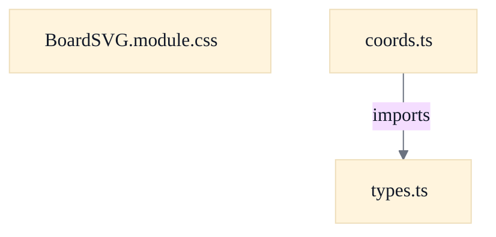

# Board Geometry & SVG Rendering

## Overview
This feature is the geometry-and-shape substrate beneath the web client's in-game board. A SOCBoardLayout2 message arriving from the Java server is parsed into a render-friendly BoardModel (types.ts) holding hexes, ports, robber/pirate positions and viewport dimensions; each board element carries a single packed 0xRRCC integer coordinate (row << 8 | col). The SVG renderer consumes that model and, for every hex/node/edge, calls into coords.ts to translate the packed coordinate into pixel-space points, derive adjacent nodes/edges, and emit SVG polygon/point strings. hexKind() maps the numeric hex type onto a semantic key that selects a CSS class in BoardSVG.module.css, where all color and motion come from theme custom properties. The module deliberately reproduces the server's SOCBoardLarge rectilinear grid and SOCBoardPanel pixel mapping client-side so pieces stay pixel-aligned to their hexes from the layout alone.

## Components
- **coords.ts** (referenced; defined externally)
- **types.ts** (referenced; defined externally)
- **BoardSVG.module.css** (referenced; defined externally)

## Connections
- **types.ts (board data model)** (outbound) — via import { FACING_NE, FACING_E, FACING_SE, FACING_SW, FACING_W, FACING_NW } from './types' (evidence: web/src/board/coords.ts import statement; re-exported for callers)
- **SOCBoardLayout2 (server message)** (inbound) — via BoardModel is produced from a parsed SOCBoardLayout2 message (per types.ts module javadoc) (evidence: web/src/board/types.ts module javadoc: 'Whole-board model produced from a SOCBoardLayout2 message')
- **soc.game.SOCBoardLarge / soc.client.SOCBoardPanel (Java server/Swing client)** (inbound) — via topology and pixel-mapping constants/functions ported from these Java sources (evidence: web/src/board/coords.ts module javadoc and per-function @see/ported-from notes)

## Design Decisions
- **Integer-packed 0xRRCC coordinate scheme shared by hexes, nodes, and edges**: coordOf packs (row << 8 | col) and rowOf/colOf unpack it, mirroring soc.game.SOCBoardLarge's encoding. Reproducing the server's single-grid scheme verbatim (rather than inventing a client-native coordinate system) lets the client derive geometry directly from the received layout without a translation layer, and keeps topology code a line-by-line port of the authoritative Java source — reducing the chance of divergence bugs.
- **Pure functions with no React/store/network coupling**: coords.ts is documented as 'no React, no store, no network — so they're trivially unit-testable.' Isolating the geometry math from rendering and state means the same primitives drive hexes, nodes, and edges, and can be exercised in isolation; the SVG component and CSS module own presentation separately.
- **Linear grid mapping plus a Y-parity slope drop, not trigonometric hexagon math**: gridToPixel applies one linear mapping (x = col*HALFDELTA_X, y = row*HALFDELTA_Y + TOP_MARGIN) shared by hex centers, node corners and edge endpoints; nodeToPixel then drops 'Y'-parity nodes by HEXY_OFF_SLOPE. This is ported directly from SOCBoardPanel rather than computed from hexagon trigonometry, so the pointy-top tile shape and — critically — piece-to-hex alignment fall out of the same shared mapping the server's Swing client uses.
- **Deriving hexPolygonPoints corners from the same node deltas pieces use**: The hexagon outline corners are the getAdjacentNodesToHex order mapped through nodeToPixel, so a piece drawn at any node lands exactly on a hex corner. Computing the tile outline and the piece anchor points from one source guarantees visual alignment instead of maintaining two parallel geometries that could drift.
- **Hex type → HexKind semantic key indirection**: hexKind() maps raw server hex-type numbers onto stable string keys ('clay', 'ore', …) used for theming/assets, decoupling the numeric wire encoding from CSS class selection. TOP_MARGIN is intentionally a clean HALFDELTA_Y rather than the server's exact halfdeltaY+9, since a uniform shift leaves relative geometry — and piece alignment — unaffected.
- **Presentation entirely via CSS custom properties and motion-suppression media queries**: BoardSVG.module.css sources every color from theme tokens so light/dark/color-blind themes apply without touching component code, and hard-stops animations under prefers-reduced-motion and [data-render-quality='low'] so weak GPUs and motion-sensitive users get a static board — an accessibility/performance separation kept out of the geometry layer.

## Constraints
- **[UNVERIFIED]** getAdjacentNodeToEdge MUST reject facing values outside 1..6 and facings perpendicular to the edge rather than returning a wrong node. — web/src/board/coords.ts::getAdjacentNodeToEdge throws 'facing out of range' and 'facing N perpendicular from edge' Errors (cross-document reconciliation: not verified against `web/src/board/coords.ts`; recorded as design intent, not current code fact.)
- **[UNVERIFIED]** getAdjacentEdgeToNode MUST reject a nodeDir outside 0..2. — web/src/board/coords.ts::getAdjacentEdgeToNode default branch throws 'nodeDir out of range' (cross-document reconciliation: not verified against `web/src/board/coords.ts`; recorded as design intent, not current code fact.)
- **[UNVERIFIED]** Packed coordinates SHOULD be masked to 16 bits (0xffff) when reconstructed so row/col stay within the 0xRRCC layout. — web/src/board/coords.ts::coordOf returns ((row << 8) | col) & 0xffff (cross-document reconciliation: not verified against `web/src/board/coords.ts`; recorded as design intent, not current code fact.)
- **[SOFT]** Hex-type numbers MUST match the server soc.game.SOCBoard / SOCBoardLarge v3 'LH' encoding (DESERT=0..FOG=8) which does not remap water/desert. — web/src/board/types.ts HEX_* constants and module javadoc

## Non-Functional Requirements
- **performance** — Geometry helpers are pure, allocation-light functions over integer coordinates with no framework or I/O dependencies, keeping per-hex/node/edge render-path computation cheap. — web/src/board/coords.ts module javadoc ('Pure functions — no React, no store, no network')
- **accessibility** — Board animations (placement pop, robber/pirate glide, target pulse) MUST be fully suppressed under prefers-reduced-motion: reduce and [data-render-quality='low']. — web/src/board/BoardSVG.module.css @media (prefers-reduced-motion: reduce) and [data-render-quality='low'] rules
- **reliability** — Hit-test stability — legal-target pulse animates fill-opacity only (not transform/size) so the click target's bounding box stays stable for hit testing and automated drivers. — web/src/board/BoardSVG.module.css .targetPulse / @keyframes target-pulse comment

## Examples
*Shows the Y-parity slope drop that turns the shared linear grid mapping into a pointy-top hexagon while keeping nodes and hex corners co-located.*
*Source: `web/src/board/coords.ts:nodeToPixel`*
```
export function nodeToPixel(coord: number): Point {
  const r = coord >> 8;
  const c = coord & 0xff;
  const p = gridToPixel(r, c);
  if (Math.floor(r / 2) % 2 !== c % 2) {
    p.y += HEXY_OFF_SLOPE;
  }
  return p;
}
```

*The single packing primitive mirroring SOCBoardLarge's 0xRRCC encoding, masked to 16 bits.*
*Source: `web/src/board/coords.ts:coordOf`*
```
export function coordOf(row: number, col: number): number {
  return ((row << 8) | col) & 0xffff;
}
```

## Diagrams
### Dependency



## Source Linkage
- [Coordinate packing/unpacking (row<<8 | col)](../../../web/src/board/coords.ts::coordOf)
- [Hex coordinate to pixel mapping](../../../web/src/board/coords.ts::hexToPixel)
- [Node coordinate to pixel mapping (Y-parity slope drop)](../../../web/src/board/coords.ts::nodeToPixel)
- [Edge coordinate to pixel mapping](../../../web/src/board/coords.ts::edgeToPixel)
- [Node-to-edge / hex adjacency derivation](../../../web/src/board/coords.ts::getAdjacentNodesToEdge)
- [Port facing edge-to-node resolution with validation](../../../web/src/board/coords.ts::getAdjacentNodeToEdge)
- [SVG hexagon points helper](../../../web/src/board/coords.ts::hexPolygonPoints)
- [Hex type to HexKind classification](../../../web/src/board/types.ts::hexKind)
- [Board data model shapes](../../../web/src/board/types.ts::BoardModel)
- [SVG board styling](../../../web/src/board/BoardSVG.module.css)

Parent scope: [_scope.md](_scope.md)
Sibling feature: [board-geometry-svg-rendering.feature.md](board-geometry-svg-rendering.feature.md)
Scope architecture: [web-client-board-rendering.arch.md](web-client-board-rendering.arch.md)

## Source Linkage Grounding

_Per-row confidence; `_unverified_` rows are disclosed, not verified; `0.08 (resolved, uncited)` is the resolved-but-uncited baseline, not measured evidence._

| Element | Doc Evidence | Code Evidence | Confidence |
|---------|--------------|---------------|-----------:|
| Source Linkage: Coordinate packing/unpacking (row<<8 \| col) |  | web/src/board/coords.ts:76-78 | 0.75 |
| Source Linkage: Hex coordinate to pixel mapping |  | web/src/board/coords.ts:283-285 | 0.75 |
| Source Linkage: Node coordinate to pixel mapping (Y-parity slope drop) |  | web/src/board/coords.ts:296-304 | 0.75 |
| Source Linkage: Edge coordinate to pixel mapping |  | web/src/board/coords.ts:329-343 | 0.75 |
| Source Linkage: Node-to-edge / hex adjacency derivation |  | web/src/board/coords.ts:123-131 | 0.75 |
| Source Linkage: Port facing edge-to-node resolution with validation |  | web/src/board/coords.ts:191-259 | 0.75 |
| Source Linkage: SVG hexagon points helper |  | web/src/board/coords.ts:380-394 | 0.75 |
| Source Linkage: Hex type to HexKind classification |  | web/src/board/types.ts:28-30 | 0.75 |
| Source Linkage: Board data model shapes |  | web/src/board/types.ts:74-86 | 0.75 |
| Source Linkage: SVG board styling |  | web/src/board/BoardSVG.module.css | 0.48 |

Related scopes: [Quality Infrastructure](../quality-infrastructure/quality-infrastructure.arch.md), [Web Protocol & Map Editor](../web-protocol-map-editor/web-protocol-map-editor.arch.md)
