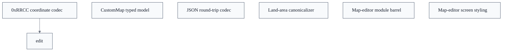

# Custom Map Editor

## Overview
The Custom Map Editor's data layer turns a `.map.json` document into an editable in-memory model and back. On import, `parseMapJson` JSON-parses the text and `fromRaw` coerces it into a `CustomMap`, keeping every hex/port `coord` as its original `"0xRRCC"` string so import → edit → export is byte-faithful. While editing, the board renderer needs integer coordinates, so `parseCoord`, `rowOf`, `colOf` and `coordOf` translate the packed `(row<<8)|col` form on demand and `encodeCoord` re-canonicalizes. On export, `mapWithCanonicalLandAreas` normalizes land-area intent and `serializeMapJson` writes sample-ordered pretty JSON. The schema module deliberately mirrors the Java `soc.server.CustomMapLoader` contract while delegating all range/parity/business checks to a sibling `validation.ts`; `index.ts` is the single barrel the React `MapEditorScreen` imports from.

## Components
- **CustomMap typed model** (referenced; defined externally): Defines the CustomMap / MapLandHex / MapPort / MapLandArea TypeScript interfaces and the recognized name vocabularies (HEX_TYPE_NAMES, PORT_TYPE_NAMES, FACING_NAMES, SUPPORTED_PLAYER_COUNTS) plus board-size bounds (MIN/MAX/DEFAULT/EDITOR_DEFAULT board height & width). Coordinates are held as on-disk "0xRRCC" strings so the editor model stays a faithful, lossless copy of the file.
Repository evidence: `web/src/map-editor/mapSchema.ts`. No business validation here.
- **0xRRCC coordinate codec** (referenced; defined externally): parseCoord decodes a "0xRRCC" string to the integer (row<<8)|col form mirroring Java CustomMapValidator.parseCoord; encodeCoord re-encodes; rowOf/colOf/coordOf decompose and compose the byte-packed integer used by the board renderer and validator.
- **Land-area canonicalizer** (referenced; defined externally): mapWithCanonicalLandAreas, mapWithInferredLandAreas and inferAreaByHexIndex reconcile per-hex landArea hints with the authoritative landAreas ranges the server consumes by file order, grouping hexes by area in ascending order and rebuilding the range list, defaulting each hex to area 1 when no positive-integer tag is present.
- **Map-editor module barrel** (referenced; defined externally): Public surface of the custom-map editor data layer: re-exports the schema types/codecs, plus validation, editorActions, editorGrid, editorEnhancements and sample data so the screen imports one stable entry point.
- **Map-editor screen styling** (referenced; defined externally): CSS-module layout for the editor screen: two-column palette/canvas grid with responsive breakpoints, hex swatch palette, dice/port/robber/pirate SVG markers, readiness/validation panels, all driven by theme tokens so light/dark/color-blind themes apply automatically.

## Connections
- **soc.server.CustomMapLoader (Java)** (bidirectional) — via .map.json document contract — mapSchema mirrors CustomMapJson/HexJson/PortJson/LandAreaJson and CustomMapValidator.parseCoord (evidence: web/src/map-editor/mapSchema.ts module header javadoc references)
- **validation.ts** (outbound) — via sibling module re-exported through index.ts; owns all range/parity/business validation the schema deliberately omits (evidence: web/src/map-editor/index.ts (export { validate, isValid, ... } from './validation'))
- **MapEditorScreen (React screen)** (inbound) — via imports the editor data layer via web/src/map-editor/index.ts and applies MapEditorScreen.module.css (evidence: web/src/screens/MapEditorScreen.module.css + web/src/map-editor/index.ts barrel)
- **editorActions / editorGrid / editorEnhancements / sampleMapData** (outbound) — via re-exported sibling modules forming the full editor surface (evidence: web/src/map-editor/index.ts re-exports)

## Design Decisions
- **Keep coordinates as on-disk "0xRRCC" strings in the model rather than parsing them to integers at import**: Mirrors the Java loader's two-layer shape (GSON POJO, then CustomMapValidator.parseCoord) and makes import → edit → export lossless — whatever the author wrote round-trips verbatim. Integer form is derived only when the renderer/validator needs it.
- **House zero business validation in mapSchema.ts; only JSON<->model coercion and the coordinate codec live here**: validation.ts mirrors Java CustomMapValidator and owns all range/parity/area-count checks. Splitting structural shape from semantic rules keeps each module a single mirror of its Java counterpart and lets the codec stay non-throwing so callers can probe a coord without a try/catch.
Repository evidence: `web/src/map-editor/mapSchema.ts`.
- **Canonicalize land areas on export: treat positive-integer per-hex landArea tags as intent, group hexes by area ascending, and rebuild landAreas ranges**: The server consumes landAreas strictly by file order, so decorative per-hex hints are not authoritative. Canonicalization makes multi-island maps server-authoritative while leaving a single-area map as an implicit area 1 to keep tiny maps concise.
- **Normalize the import-only "3:1" port alias to canonical "misc" for new edits while still accepting it on import**: "3:1" and "misc" both map to MISC_PORT in Java; keeping "3:1" as a distinct token preserves round-trip fidelity for imported files, but canonicalPortTypeName ensures editor-authored changes write the single canonical value.

## Constraints
- **[UNVERIFIED]** parseCoord MUST reject any string that is not pure hexadecimal (optionally 0x-prefixed) and MUST reject negative values, returning null rather than throwing — web/src/map-editor/mapSchema.ts::parseCoord (regex /^[+-]?[0-9a-fA-F]+$/ and v < 0 guard) (cross-document reconciliation: not verified against `web/src/map-editor/mapSchema.ts`; recorded as design intent, not current code fact.)
- **[UNVERIFIED]** parseMapJson MUST throw when the input is not valid JSON or is not a JSON object (null / array / primitive rejected) — web/src/map-editor/mapSchema.ts::parseMapJson (JSON.parse catch + object/Array.isArray guard) (cross-document reconciliation: not verified against `web/src/map-editor/mapSchema.ts`; recorded as design intent, not current code fact.)
- **[UNVERIFIED]** A hex's land area MUST default to 1 unless its landArea is a positive integer (finite, whole, >= 1) — web/src/map-editor/mapSchema.ts::isPositiveInteger used by inferAreaByHexIndex/mapWithCanonicalLandAreas (cross-document reconciliation: not verified against `web/src/map-editor/mapSchema.ts`; recorded as design intent, not current code fact.)
- **[UNVERIFIED]** Custom-map coordinates SHOULD stay strictly inside the supported board-size bounds (MIN_BOARD_HEIGHT 0x08 / MIN_BOARD_WIDTH 0x09 .. MAX = DEFAULT 0x16 / 0x17) — web/src/map-editor/mapSchema.ts (MIN_BOARD_HEIGHT, MIN_BOARD_WIDTH, MAX_BOARD_HEIGHT, MAX_BOARD_WIDTH constants) (cross-document reconciliation: not verified against `web/src/map-editor/mapSchema.ts`; recorded as design intent, not current code fact.)
- **[UNVERIFIED]** serializeMapJson SHOULD omit empty optional fields (description, landAreas, ports, robberHex, pirateHex) and emit fields in sample-map order for readable diffs — web/src/map-editor/mapSchema.ts::serializeMapJson (cross-document reconciliation: not verified against `web/src/map-editor/mapSchema.ts`; recorded as design intent, not current code fact.)

## Non-Functional Requirements
- **reliability** — Import → edit → export must be lossless: coordinates are stored as their original on-disk strings and serializeMapJson reproduces sample-map field order, so a parse/serialize round-trip preserves the author's document. — web/src/map-editor/mapSchema.ts module header + serializeMapJson
- **error-handling** — The coordinate codec is non-throwing (returns null for unparseable input) so callers can probe coordinates without try/catch; only structural JSON failures throw, and only from parseMapJson. — web/src/map-editor/mapSchema.ts::parseCoord / parseMapJson
- **reliability** — Deserialization tolerates unknown and wrong-shaped fields by defaulting them, matching the Java GSON loader so any server-acceptable file also loads in the editor; semantic problems are deferred to validation.ts. — web/src/map-editor/mapSchema.ts::fromRaw / toHexArray / toPortArray / toLandAreaArray

## Examples
*Shows the byte-packed 0xRRCC integer decomposition the renderer relies on.*
*Source: `web/src/map-editor/mapSchema.ts`*
```
export function rowOf(coord: number): number {
  return coord >> 8;
}

export function colOf(coord: number): number {
  return coord & 0xff;
}
```

*Illustrates normalizing the import-only "3:1" alias to canonical "misc" for new edits.*
*Source: `web/src/map-editor/mapSchema.ts`*
```
export function canonicalPortTypeName(type: string): PortTypeName {
  const normalized = (type ?? '').toLowerCase();
  if (normalized === '3:1') {
    return 'misc';
  }
  return (CANONICAL_PORT_TYPE_NAMES as readonly string[]).includes(normalized)
    ? (normalized as PortTypeName)
    : 'misc';
}
```

*The non-throwing coordinate guard that mirrors Java Integer.parseInt(t,16) and rejects negatives.*
*Source: `web/src/map-editor/mapSchema.ts`*
```
if (!/^[+-]?[0-9a-fA-F]+$/.test(t)) {
    return null;
  }
  const v = Number.parseInt(t, 16);
  if (!Number.isFinite(v) || v < 0) {
    return null;
  }
```

## Diagrams
### Design



## Source Linkage
- [CustomMap schema and JSON round-trip](../../../web/src/map-editor/mapSchema.ts::serializeMapJson)
- [Map JSON parse and raw construction](../../../web/src/map-editor/mapSchema.ts::parseMapJson)
- [Coordinate encode/decode (0xRRCC)](../../../web/src/map-editor/mapSchema.ts::encodeCoord)
- [Coordinate decode guard](../../../web/src/map-editor/mapSchema.ts::parseCoord)
- [Land-area canonicalization](../../../web/src/map-editor/mapSchema.ts::mapWithCanonicalLandAreas)
- [Per-hex land-area inference](../../../web/src/map-editor/mapSchema.ts::inferAreaByHexIndex)
- [Port-type alias normalization](../../../web/src/map-editor/mapSchema.ts::canonicalPortTypeName)
- [Map editor module entry](../../../web/src/map-editor/index.ts)
- [Map editor screen styling](../../../web/src/screens/MapEditorScreen.module.css)
- [Web build/runtime config (React 18.3.1, Vite 5.4, TS 5.4)](../../../web/package.json)

Parent scope: [_scope.md](_scope.md)
Sibling feature: [custom-map-editor.feature.md](custom-map-editor.feature.md)
Scope architecture: [web-client-board-rendering.arch.md](web-client-board-rendering.arch.md)

## Source Linkage Grounding

_Per-row confidence; `_unverified_` rows are disclosed, not verified; `0.08 (resolved, uncited)` is the resolved-but-uncited baseline, not measured evidence._

| Element | Doc Evidence | Code Evidence | Confidence |
|---------|--------------|---------------|-----------:|
| Source Linkage: CustomMap schema and JSON round-trip |  | web/src/map-editor/mapSchema.ts:390-426 | 0.75 |
| Source Linkage: Map JSON parse and raw construction |  | web/src/map-editor/mapSchema.ts:327-338 | 0.75 |
| Source Linkage: Coordinate encode/decode (0xRRCC) |  | web/src/map-editor/mapSchema.ts:312-315 | 0.75 |
| Source Linkage: Coordinate decode guard |  | web/src/map-editor/mapSchema.ts:266-287 | 0.75 |
| Source Linkage: Land-area canonicalization |  | web/src/map-editor/mapSchema.ts:213-254 | 0.75 |
| Source Linkage: Per-hex land-area inference |  | web/src/map-editor/mapSchema.ts:496-516 | 0.75 |
| Source Linkage: Port-type alias normalization |  | web/src/map-editor/mapSchema.ts:72-80 | 0.75 |
| Source Linkage: Map editor module entry | Public surface of the custom-map editor data layer (schema, validation, preview). */ | web/src/map-editor/index.ts | 0.16 |
| Source Linkage: Map editor screen styling |  | web/src/screens/MapEditorScreen.module.css | 0.48 |
| Source Linkage: Web build/runtime config (React 18.3.1, Vite 5.4, TS 5.4) |  | web/package.json | 0.08 (resolved, uncited) |

Related scopes: [Quality Infrastructure](../quality-infrastructure/quality-infrastructure.arch.md), [Web Protocol & Map Editor](../web-protocol-map-editor/web-protocol-map-editor.arch.md)
