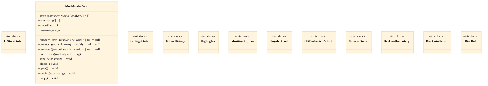
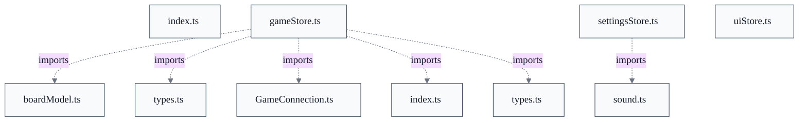

# Screens, UI Components & Client State

## Overview
Inbound protocol messages decoded by the net layer's GameConnection are dispatched into useGameStore, whose pure synchronous reducers fold them into connection status, the lobby list, registries, and the joined CurrentGame room (board, pieces, per-seat PlayerViews, inventory, trade and robber prompts, and Cities & Knights counters). React screens subscribe to these stores and render from them. In the outbound direction, UI interactions invoke action senders (playDevCard, pickMonopoly, playYearOfPlenty, ckKnightRequest) that build SOCMessage requests and write them back to the server through the same connection. Presentation concerns flow separately: useSettingsStore derives theme/color-blind/font-scale attributes and pushes them onto the DOM via applySettingsToDom, while useUiStore tracks only top-level navigation, so in-game state churn does not re-render the shell.


- [INV-CL-005: single-writer-prevdicetotal-current]
- [INV-CL-006: single-writer-prevpiececount-current]
- [INV-CL-007: single-writer-prevmyturn-current]
- [INV-CL-008: single-writer-viewport-scrollleft]
- [INV-CL-009: single-writer-viewport-scrolltop]
- [INV-CL-010: single-writer-panref-current]

## Components
- **useGameStore (gameStore.ts)** (referenced; defined externally): Single source of client-side game state: connection lifecycle status, server version, chat channels, the lobby game list, option/scenario registries, and the joined CurrentGame room (board, pieces, per-seat PlayerViews, dev-card inventory, trade offers, discard/robber prompts, and Cities & Knights state). Exposes pure synchronous reducers plus action senders that emit protocol messages.
- **Action senders (playDevCard / pickMonopoly / playYearOfPlenty / ckKnightRequest)** (referenced; defined externally): Translate UI intent into SOCMessage requests over the GameConnection. Each guards on the live connection and currentGame; ckKnightRequest additionally requires a seated player (cg.mySeat >= 0) before sending its SOCSimpleRequest.
- **View reducers (applyElementAction / applyElementToView / deriveVp / updateView)** (referenced; defined externally): Fold server-authoritative element/view updates into per-seat PlayerView records immutably — updateView replaces only the changed seat object, applyElementAction applies SET/GAIN/LOSE with a floor of 0, and deriveVp recomputes victory points from views and placed pieces.
- **useSettingsStore (settingsStore.ts)** (referenced; defined externally): Holds presentation preferences (theme mode, color-blind mode, render quality, font scale) and derives the concrete DOM presentation via resolveTheme, colorBlindAttr, clampFontScale, and applySettingsToDom.
- **useUiStore (uiStore.ts)** (referenced; defined externally): Minimal UI-navigation store holding the top-level AppView ('lobby' | 'mapEditor') and the Settings panel open/closed flag, kept deliberately separate from game/connection state.
- **Components barrel (index.ts)** (referenced; defined externally): Re-exports the shared design-system primitives (Button, Panel, Dialog/Modal, Spinner, ToastProvider/useToast, AppFrame) and their prop types as a single import surface for screens.

## Connections
- **GameConnection (net layer)** (bidirectional) — via import of GameConnection/ConnectionState from '../net/GameConnection'; connectStore() wires inbound messages to reducers and senders write requests out (evidence: web/src/store/gameStore.ts import { ConnectionState, DEFAULT_HOST, DEFAULT_PORT, GameConnection } from '../net/GameConnection')
- **Protocol message types (web/src/protocol)** (bidirectional) — via import of SOCMessage subclasses and enums used to decode inbound and build outbound requests (evidence: web/src/store/gameStore.ts import { ... SOCPlayDevCardRequest, SOCSimpleRequest, ... } from '../protocol')
- **Board model (web/src/board)** (inbound) — via import of boardFromLayout2 and board types to decode SOCBoardLayout2 into the renderer's BoardModel (evidence: web/src/store/gameStore.ts import { boardFromLayout2 } from '../board/boardModel')
- **Player view types (web/src/store/types)** (outbound) — via import of PlayerView/ResourceCounts/makePlayerView and colorForSeat used by the view reducers (evidence: web/src/store/gameStore.ts import { PlayerView, makePlayerView, colorForSeat } from './types')
- **Sound utility (web/src/util/sound)** (outbound) — via settingsStore import for audio feedback tied to settings (evidence: diagram_dependency: web_src_store_settingsStore_ts imports util/sound.ts)

## Design Decisions
- **Split client state across three independent Zustand stores rather than one**: uiStore.ts is kept separate from the game/connection store 'so that in-game state churn doesn't re-render the shell and vice-versa' (uiStore.ts module doc). Settings (presentation) and UI navigation change on a different cadence than per-message game state, so isolating them bounds React re-render scope.
- **Action senders early-return instead of optimistically mutating local state**: The server is authoritative and clients hold only partial state, so playDevCard/pickMonopoly/etc. return early when there is no live connection or currentGame, and ckKnightRequest also returns when cg.mySeat < 0. Senders emit a request and let the server's reply drive the reducers, avoiding divergent local truth.
- **Reducers are pure and immutable, with one changed object per update**: updateView returns the same array reference on a no-op and a single new view object for the changed seat (updateView doc), and reducers carry no network side effects — connectStore() wires the GameConnection to them. This keeps state transitions referentially transparent so React/zustand can diff cheaply.
- **Settings derive DOM presentation through dedicated pure helpers**: resolveTheme, colorBlindAttr, clampFontScale, and applySettingsToDom separate stored preference values from their DOM projection, so the same store value maps deterministically to document attributes (theme, color-blind data attribute, clamped font scale).

## Constraints
- **[UNVERIFIED]** Action senders MUST NOT emit a protocol request when there is no live connection or current game — web/src/store/gameStore.ts::playDevCard (early return when conn === null || cg === null); same guard in pickMonopoly (cross-document reconciliation: not verified against `web/src/store/gameStore.ts`; recorded as design intent, not current code fact.)
- **[UNVERIFIED]** A C&K knight request MUST be sent only when the local client is seated (mySeat >= 0) — web/src/store/gameStore.ts::ckKnightRequest (early return when cg.mySeat < 0) (cross-document reconciliation: not verified against `web/src/store/gameStore.ts`; recorded as design intent, not current code fact.)
- **[HARD]** Element SET/GAIN/LOSE application MUST clamp the resulting value at 0 — web/src/store/gameStore.ts::applyElementAction (doc: 'clamping at 0')
- **[SOFT]** The rolling game log SHOULD be capped so it does not grow without bound — web/src/store/gameStore.ts const GAME_LOG_MAX = 200
- **[SOFT]** Structured trade activity SHOULD be capped to the recent decisions shown in the sidebar — web/src/store/gameStore.ts const TRADE_ACTIVITY_MAX = 12

## Non-Functional Requirements
- **performance** — Top-level navigation state is isolated from game state so in-game message churn does not trigger shell/settings re-renders — web/src/store/uiStore.ts (UiStoreState module doc)
- **reliability** — Reducers are synchronous and pure with no network side effects; the GameConnection is wired to them in connectStore(), keeping the server authoritative — web/src/store/gameStore.ts (GameStoreState doc; connectStore)
- **reliability** — Unbounded server-driven collections are capped (game log at 200 entries, trade activity at 12) to prevent unbounded memory growth — web/src/store/gameStore.ts GAME_LOG_MAX / TRADE_ACTIVITY_MAX

## Examples
*Shows the connection + seated guard that keeps the partial-state client from sending requests the authoritative server would reject.*
*Source: `web/src/store/gameStore.ts::ckKnightRequest`*
```
function ckKnightRequest(reqType: number): void {
  const conn = connection;
  const cg = useGameStore.getState().currentGame;
  if (conn === null || cg === null || cg.mySeat < 0) {
    return; // <--- Early return: not seated ---
```

*Illustrates derived read-only predicates computed from server-supplied state rather than tracked separately.*
*Source: `web/src/store/gameStore.ts::isGameStarted`*
```
export function isGameStarted(cg: CurrentGame | null): boolean {
  return cg !== null && cg.gameState >= GAME_STATE_MIN_STARTED;
}
```

## Diagrams
### Class



### Dependency



## Source Linkage
- [Client game state store and action senders](../../../web/src/store/gameStore.ts::useGameStore)
- [Play dev card action sender (early-returns when not in a game)](../../../web/src/store/gameStore.ts::playDevCard)
- [C&K knight request (requires seated, mySeat >= 0)](../../../web/src/store/gameStore.ts::ckKnightRequest)
- [Element SET/GAIN/LOSE applier (clamps at 0)](../../../web/src/store/gameStore.ts::applyElementAction)
- [Immutable per-seat view reducer](../../../web/src/store/gameStore.ts::applyElementToView)
- [Immutable single-seat view updater](../../../web/src/store/gameStore.ts::updateView)
- [Client settings store with DOM application](../../../web/src/store/settingsStore.ts::applySettingsToDom)
- [Settings theme resolver](../../../web/src/store/settingsStore.ts::resolveTheme)
- [Top-level UI view state](../../../web/src/store/uiStore.ts::UiStoreState)
- [Design-system component barrel](../../../web/src/components/index.ts)
- [Frontend dependency surface (zustand/react)](../../../web/package.json)

Parent scope: [_scope.md](_scope.md)
Sibling feature: [screens-ui-components-client-state.feature.md](screens-ui-components-client-state.feature.md)
Scope architecture: [web-client-board-rendering.arch.md](web-client-board-rendering.arch.md)

## Source Linkage Grounding

_Per-row confidence; `_unverified_` rows are disclosed, not verified; `0.08 (resolved, uncited)` is the resolved-but-uncited baseline, not measured evidence._

| Element | Doc Evidence | Code Evidence | Confidence |
|---------|--------------|---------------|-----------:|
| Source Linkage: Client game state store and action senders | gameStore — Zustand store for connection + lobby state. | web/src/store/gameStore.ts:1123-2247 | 0.75 |
| Source Linkage: Play dev card action sender (early-returns when not in a game) | /** Internal: send a SOCPlayDevCardRequest for the given card type. */ | web/src/store/gameStore.ts:3557-3564 | 0.75 |
| Source Linkage: C&K knight request (requires seated, mySeat >= 0) | /** Internal: send a C&K knight SOCSimpleRequest with our seat (values 0,0). */ | web/src/store/gameStore.ts:3717-3724 | 0.75 |
| Source Linkage: Element SET/GAIN/LOSE applier (clamps at 0) | /** Apply a SET/GAIN/LOSE action to a current value, clamping at 0. */ | web/src/store/gameStore.ts:818-829 | 0.75 |
| Source Linkage: Immutable per-seat view reducer | gameStore — Zustand store for connection + lobby state. | web/src/store/gameStore.ts:843-909 | 0.75 |
| Source Linkage: Immutable single-seat view updater | gameStore — Zustand store for connection + lobby state. | web/src/store/gameStore.ts:2497-2508 | 0.75 |
| Source Linkage: Client settings store with DOM application |  | web/src/store/settingsStore.ts:119-146 | 0.64 |
| Source Linkage: Settings theme resolver |  | web/src/store/settingsStore.ts:85-95 | 0.64 |
| Source Linkage: Top-level UI view state | Top-level app views that sit alongside the connection/game flow. */ | web/src/store/uiStore.ts:12-20 | 0.40 |
| Source Linkage: Design-system component barrel | Design-system primitives barrel. Import from '../components' for convenience. | web/src/components/index.ts | 0.75 |
| Source Linkage: Frontend dependency surface (zustand/react) |  | web/package.json | 0.08 (resolved, uncited) |

Related scopes: [Quality Infrastructure](../quality-infrastructure/quality-infrastructure.arch.md), [Web Protocol & Map Editor](../web-protocol-map-editor/web-protocol-map-editor.arch.md)

## Contract Gaps Detected

| File | Declared Field | Accepting Function | Gap |
|------|----------------|--------------------|-----|
| `web/src/store/gameStore.ts` | `CurrentGame.gameState` | `applyRobberyResultToViews(cg: CurrentGame)` | No same-file read of `cg.gameState` was detected; document it as declared intent, not enforced behavior. |
| `web/src/store/gameStore.ts` | `CurrentGame.mySeat` | `seatLabel(cg: CurrentGame)` | No same-file read of `cg.mySeat` was detected; document it as declared intent, not enforced behavior. |
| `web/src/store/gameStore.ts` | `CurrentGame.gameState` | `seatLabel(cg: CurrentGame)` | No same-file read of `cg.gameState` was detected; document it as declared intent, not enforced behavior. |
| `web/src/store/gameStore.ts` | `CurrentGame.mySeat` | `guardGame(cg: CurrentGame)` | No same-file read of `cg.mySeat` was detected; document it as declared intent, not enforced behavior. |
| `web/src/store/gameStore.ts` | `CurrentGame.gameState` | `guardGame(cg: CurrentGame)` | No same-file read of `cg.gameState` was detected; document it as declared intent, not enforced behavior. |
| `web/src/store/gameStore.ts` | `CurrentGame.mySeat` | `isGameStarted(cg: CurrentGame)` | No same-file read of `cg.mySeat` was detected; document it as declared intent, not enforced behavior. |
| `web/src/store/gameStore.ts` | `CurrentGame.gameState` | `isMyTurn(cg: CurrentGame)` | No same-file read of `cg.gameState` was detected; document it as declared intent, not enforced behavior. |
