# Custom Map Editor Canvas & Palette

## Overview
The map editor splits authoring into two stateless presentational components driven by a parent screen that owns the single CustomMap. EditorPalette selects the active EditorTool and the paint parameters (hex type, dice number, land area, port type/facing) and emits metadata edits through callbacks. EditorCanvas reads that same CustomMap, memo-indexes placed hexes and ports by integer 0xRRCC coordinate, enumerates the fixed grid via editorGrid, and renders each cell with HexCell. User clicks on cells, port slots, and markers are translated into onHexClick(coord, alt) / onPortClick(edge, alt) callbacks; the canvas itself mutates nothing. Rendering geometry is borrowed read-only from the in-game board's coords/pieces modules so an authored map looks identical to a live game. The barrel index.ts exposes the underlying schema/validation/action layer that the parent uses to apply those callbacks back into the CustomMap.

## Components
- **EditorCanvas**: Renders the sea-board grid as an SVG honeycomb of placeable hex cells plus port-edge slots and robber/pirate markers; holds no map state and reports every edit upward through onHexClick/onPortClick.
- **HexCell**: Draws one placed-or-empty hex: terrain texture/grain, dice token, land-area badge, coordinate label, and selection/highlight/issue/probability/area overlay state.
- **computeViewBox**: Derives an SVG viewBox spanning every enumerated cell plus a one-hex pad, extending the lower bound by HEXY_OFF_SLOPE for the south apex.
- **kindForType**: Lower-cases and maps a loose map-type string onto the closed HexKind motif set, defaulting to 'unknown' for anything unrecognized.
- **edgeMid**: Re-derives an edge coordinate's midpoint pixel from rowOf/colOf using the same linear mapping as hexToPixel, kept local to avoid an extra import.
- **EditorTool**: Enumerates the editor's interaction modes: 'hex' | 'dice' | 'area' | 'port' | 'robber' | 'pirate'.
- **EditorPalette**: Left-rail toolbar: selects the active tool, hex type, dice number, land area, port type/facing, expansion profile, and edits map metadata (name/description/playerCounts/shuffle) — all via lifted callbacks.
- **toolHint**: Returns the short usage sentence shown under the tool row for the currently-selected EditorTool.
- **sameCounts**: Order-sensitive equality on two player-count lists, used to highlight the matching expansion profile.
- **map-editor barrel (index.ts)** (referenced; defined externally): Re-exports the editor data layer (schema types, validation, grid enumeration, editor actions, enhancements, sample data) as the single import boundary for consumers of the editor.

## Connections
- **web board geometry (board/coords.ts)** (outbound) — via import { hexPolygonPoints, HALFDELTA_X, HALFDELTA_Y, HEX_CENTER_DY, HEXY_OFF_SLOPE, TOP_MARGIN } from '../../board/coords' (evidence: web/src/map-editor/components/EditorCanvas.tsx (import block))
- **web board art (board/pieces/BoardDefs, ResourceMotif, TerrainTexture)** (outbound) — via import BoardDefs/ResourceMotif/TerrainTexture from '../../board/pieces/*' (evidence: web/src/map-editor/components/EditorCanvas.tsx; web/src/map-editor/components/EditorPalette.tsx (terrainTextureFor))
- **editor grid layer (map-editor/editorGrid)** (outbound) — via import { enumerateHexCells, candidatePortEdgesWithin, boardSizeForMap, hexToPixel } (evidence: web/src/map-editor/components/EditorCanvas.tsx (import block))
- **map schema layer (map-editor/mapSchema)** (outbound) — via import { CustomMap, parseCoord, encodeCoord, rowOf, colOf, HEX_TYPE_NAMES, CANONICAL_PORT_TYPE_NAMES, ... } (evidence: web/src/map-editor/components/EditorCanvas.tsx; web/src/map-editor/components/EditorPalette.tsx)
- **editor enhancements (map-editor/editorEnhancements)** (outbound) — via import { EditorOverlay, dicePips } (evidence: web/src/map-editor/components/EditorCanvas.tsx (import block))
- **shared UI primitives (components/index.ts)** (outbound) — via import { Button, Panel } from '../../components' (evidence: web/src/map-editor/components/EditorPalette.tsx (import block))
- **MapEditorScreen (parent screen)** (inbound) — via props/callbacks: tool/map state passed down, onHexClick/onPortClick and palette on*Change callbacks passed up (evidence: web/src/map-editor/components/EditorCanvas.tsx::EditorCanvasProps; web/src/map-editor/components/EditorPalette.tsx::EditorPaletteProps)
- **editor stylesheet (screens/MapEditorScreen.module.css)** (outbound) — via import styles from '../../screens/MapEditorScreen.module.css' (evidence: web/src/map-editor/components/EditorCanvas.tsx; web/src/map-editor/components/EditorPalette.tsx)

## Design Decisions
- **Canvas and palette are pure/presentational with all state lifted to the parent screen**: EditorCanvas holds no CustomMap state and routes every edit through onHexClick/onPortClick (and the palette through its on*Change callbacks). This keeps a single source of truth in the parent, makes both components trivially testable in isolation, and lets the same canvas serve interactive editing and read-only preview (previewMode) without branching state ownership.
- **Reuse the in-game board geometry (coords.ts, BoardDefs, ResourceMotif, TerrainTexture) read-only instead of reimplementing it**: The canvas imports hexPolygonPoints, HALFDELTA_X/Y, hexToPixel and the board art pieces directly so an authored map renders pixel-identical to the live board, per the EditorCanvas docstring. Sharing one geometry source prevents the editor and the game view from drifting apart visually.
- **Normalize loose map-type strings through a closed motif set with an 'unknown' fallback**: kindForType lower-cases input and only returns a known HexKind, falling back to 'unknown' for anything else, so arbitrary or future type strings in a hand-edited map never crash rendering and degrade gracefully to a neutral motif.
- **Memo-index placed hexes and ports by integer coordinate and memoize grid/viewBox derivations**: placedByCoord / placedPorts are built as Maps for O(1) per-cell lookup while iterating the enumerated grid, and boardSize, cells, portEdges and viewBox are wrapped in useMemo keyed on their inputs, avoiding per-render recomputation of the whole honeycomb.
- **Expose the editor data layer through a single barrel module (index.ts)**: index.ts re-exports schema types, validation, grid enumeration, editor actions, enhancements and sample data as one import surface, so components and the parent screen depend on a stable boundary rather than reaching into individual files.
- **Re-derive edge midpoints locally in edgeMid rather than importing an edge-geometry helper**: edgeMid reproduces the same linear mapping as hexToPixel for the placed-port marker position, deliberately avoiding an extra import for a one-off reference point.

## Constraints
- **[HARD]** The canvas MUST remain stateless with respect to the map: every hex/port/marker edit is reported upward via onHexClick/onPortClick and the parent owns the CustomMap. — web/src/map-editor/components/EditorCanvas.tsx::EditorCanvas (props onHexClick/onPortClick; docstring 'the parent owns the CustomMap state')
- **[SOFT]** A dice token SHOULD render only for valid roll values 2–12 excluding 7. — web/src/map-editor/components/EditorCanvas.tsx::HexCell (`const showDice = diceNum >= 2 && diceNum <= 12 && diceNum !== 7`)
- **[SOFT]** Unrecognized hex-type strings SHOULD normalize to the 'unknown' motif rather than be passed through raw. — web/src/map-editor/components/EditorCanvas.tsx::kindForType (default case returns 'unknown')
- **[SOFT]** The active land area SHOULD be clamped to at least 1 (and bounded 1–9 in the input). — web/src/map-editor/components/EditorPalette.tsx::EditorPalette (`onChange={(e) => onLandAreaChange(Math.max(1, Number(e.target.value) || 1))}`, min=1 max=9)

## Non-Functional Requirements
- **performance** — Per-cell lookups are O(1) via coordinate-keyed Maps, and grid enumeration, board size, port edges and viewBox are memoized to avoid recomputation on every render. — web/src/map-editor/components/EditorCanvas.tsx::EditorCanvas (useMemo on boardSize/cells/placedByCoord/portEdges/viewBox)
- **accessibility** — Interactive editor surfaces expose ARIA roles and labels: the canvas is role='application' with an aria-label, and tool/profile/hex selectors use role='radiogroup'/'radio' with aria-checked. — web/src/map-editor/components/EditorCanvas.tsx::EditorCanvas (role='application'); web/src/map-editor/components/EditorPalette.tsx::EditorPalette (role='radiogroup'/'radio', aria-checked)
- **error-handling** — Coordinate parsing failures are skipped rather than rendered: only parseCoord results that are non-null are indexed, and robber/pirate markers render only when their coord is non-null and > 0. — web/src/map-editor/components/EditorCanvas.tsx::EditorCanvas (`if (c !== null)` index guard; `robber !== null && robber > 0`)

## Examples
*Guards dice-token rendering to legal roll values, excluding the robber's 7.*
*Source: `web/src/map-editor/components/EditorCanvas.tsx:HexCell`*
```
const showDice = diceNum >= 2 && diceNum <= 12 && diceNum !== 7;
```

*Order-sensitive player-count comparison that drives active-profile highlighting.*
*Source: `web/src/map-editor/components/EditorPalette.tsx:sameCounts`*
```
return a.every((value, i) => value === b[i]);
```

*Defensive fallback keeps rendering total over arbitrary map-type strings.*
*Source: `web/src/map-editor/components/EditorCanvas.tsx:kindForType`*
```
default:
      return 'unknown';
```

## Diagrams
### Dependency

```mermaid
%%{init: {'theme': 'base', 'themeVariables': {'primaryTextColor': '#111827', 'secondaryTextColor': '#111827', 'tertiaryTextColor': '#111827', 'lineColor': '#6b7280', 'fontFamily': 'Inter, ui-sans-serif, system-ui, sans-serif'}}}%%
graph TD
    classDef default fill:#f8fafc,stroke:#475569,color:#111827

    web_src_map_editor_components_EditorCanvas_tsx["EditorCanvas.tsx"]
    web_src_map_editor_components_EditorPalette_tsx["EditorPalette.tsx"]
    web_src_screens____map_editor_index_ts["index.ts"]


    ext_web_src_map_editor_components_______board_coords_ts["coords.ts"]:::default
    web_src_map_editor_components_EditorCanvas_tsx -.->|"imports"| ext_web_src_map_editor_components_______board_coords_ts
    ext_web_src_map_editor_components_______board_pieces_BoardDefs_tsx["BoardDefs.tsx"]:::default
    web_src_map_editor_components_EditorCanvas_tsx -.->|"imports"| ext_web_src_map_editor_components_______board_pieces_BoardDefs_tsx
    ext_web_src_map_editor_components_______board_pieces_ResourceMotif_tsx["ResourceMotif.tsx"]:::default
    web_src_map_editor_components_EditorCanvas_tsx -.->|"imports"| ext_web_src_map_editor_components_______board_pieces_ResourceMotif_tsx
    ext_web_src_map_editor_components_______board_pieces_TerrainTexture_tsx["TerrainTexture.tsx"]:::default
    web_src_map_editor_components_EditorCanvas_tsx -.->|"imports"| ext_web_src_map_editor_components_______board_pieces_TerrainTexture_tsx
    web_src_map_editor_components_EditorPalette_tsx -.->|"imports"| ext_web_src_map_editor_components_______board_pieces_TerrainTexture_tsx
    ext_web_src_map_editor_components_______board_types_ts["types.ts"]:::default
    web_src_map_editor_components_EditorCanvas_tsx -.->|"imports"| ext_web_src_map_editor_components_______board_types_ts
    ext_web_src_map_editor_components_______components_index_ts["index.ts"]:::default
    web_src_map_editor_components_EditorPalette_tsx -.->|"imports"| ext_web_src_map_editor_components_______components_index_ts
    ext_web_src_map_editor_components_______screens_MapEditorScreen_module_css["MapEditorScreen.module.css"]:::default
    web_src_map_editor_components_EditorCanvas_tsx -.->|"imports"| ext_web_src_map_editor_components_______screens_MapEditorScreen_module_css
    web_src_map_editor_components_EditorPalette_tsx -.->|"imports"| ext_web_src_map_editor_components_______screens_MapEditorScreen_module_css
    ext_web_src_map_editor_components____editorEnhancements_ts["editorEnhancements.ts"]:::default
    web_src_map_editor_components_EditorCanvas_tsx -.->|"imports"| ext_web_src_map_editor_components____editorEnhancements_ts
    ext_web_src_map_editor_components____editorGrid_ts["editorGrid.ts"]:::default
    web_src_map_editor_components_EditorCanvas_tsx -.->|"imports"| ext_web_src_map_editor_components____editorGrid_ts
    ext_web_src_map_editor_components____mapSchema_ts["mapSchema.ts"]:::default
    web_src_map_editor_components_EditorCanvas_tsx -.->|"imports"| ext_web_src_map_editor_components____mapSchema_ts
    web_src_map_editor_components_EditorPalette_tsx -.->|"imports"| ext_web_src_map_editor_components____mapSchema_ts
```



## Source Linkage
- [Editor canvas grid rendering/editing](../../../web/src/map-editor/components/EditorCanvas.tsx::EditorCanvas)
- [SVG viewBox computation spanning all cells with one-hex margin](../../../web/src/map-editor/components/EditorCanvas.tsx::computeViewBox)
- [Single hex cell rendering](../../../web/src/map-editor/components/EditorCanvas.tsx::HexCell)
- [Map-type-to-motif normalization](../../../web/src/map-editor/components/EditorCanvas.tsx::kindForType)
- [Edge-midpoint pixel re-derivation](../../../web/src/map-editor/components/EditorCanvas.tsx::edgeMid)
- [Editor placement palette and tool selection](../../../web/src/map-editor/components/EditorPalette.tsx::EditorPalette)
- [Per-tool usage hint](../../../web/src/map-editor/components/EditorPalette.tsx::toolHint)
- [Player-count list equality check](../../../web/src/map-editor/components/EditorPalette.tsx::sameCounts)
- [Editor data-layer public surface (barrel)](../../../web/src/map-editor/index.ts)

Parent scope: [_scope.md](_scope.md)
Sibling feature: [custom-map-editor-canvas-palette.feature.md](custom-map-editor-canvas-palette.feature.md)
Scope architecture: [web-protocol-map-editor.arch.md](web-protocol-map-editor.arch.md)

## Source Linkage Grounding

_Per-row confidence; `_unverified_` rows are disclosed, not verified; `0.08 (resolved, uncited)` is the resolved-but-uncited baseline, not measured evidence._

| Element | Doc Evidence | Code Evidence | Confidence |
|---------|--------------|---------------|-----------:|
| Source Linkage: Editor canvas grid rendering/editing |  | web/src/map-editor/components/EditorCanvas.tsx:223-414 | 0.32 |
| Source Linkage: SVG viewBox computation spanning all cells with one-hex margin | /** Compute an SVG viewBox spanning all enumerated cells, with a one-hex margin. */ | web/src/map-editor/components/EditorCanvas.tsx:425-444 | 0.32 |
| Source Linkage: Single hex cell rendering | /** Render a single placed-or-empty hex cell. */ | web/src/map-editor/components/EditorCanvas.tsx:75-211 | 0.32 |
| Source Linkage: Map-type-to-motif normalization | /** Convert loose map type strings into known board-art motif keys. */ | web/src/map-editor/components/EditorCanvas.tsx:447-462 | 0.32 |
| Source Linkage: Edge-midpoint pixel re-derivation | /** Midpoint pixel of an edge coord (re-derived locally to avoid extra imports). */ | web/src/map-editor/components/EditorCanvas.tsx:417-422 | 0.32 |
| Source Linkage: Editor placement palette and tool selection | Hex-type -> swatch fill CSS variable, matching the canvas/board theme tokens. */ | web/src/map-editor/components/EditorPalette.tsx:93-346 | 0.24 |
| Source Linkage: Per-tool usage hint | /** Short usage hint per tool. */ | web/src/map-editor/components/EditorPalette.tsx:349-366 | 0.24 |
| Source Linkage: Player-count list equality check | /** True when both player-count lists contain the same values in order. */ | web/src/map-editor/components/EditorPalette.tsx:369-374 | 0.24 |
| Source Linkage: Editor data-layer public surface (barrel) | Public surface of the custom-map editor data layer (schema, validation, preview). */ | web/src/map-editor/index.ts | 0.16 |

## Unverified Areas

Parts of this document have limited verifiable source evidence — treat normative claims as unverified until confirmed. See [documentation conventions](../documentation-conventions.md#unverified-areas).

Related scopes: [Quality Infrastructure](../quality-infrastructure/quality-infrastructure.arch.md), [Web Client & Board Rendering](../web-client-board-rendering/web-client-board-rendering.arch.md)
